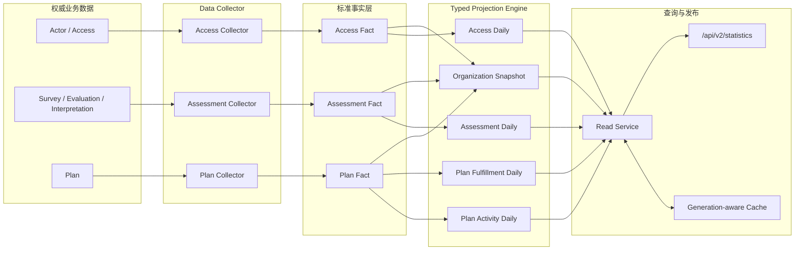

# Statistics 当前架构与完成定义

> 状态：**V2-only 目标已经落实为当前唯一架构**。本文不再描述 V1/V2 双轨迁移，而是规定 Statistics 当前必须长期保持的结构、运行语义和完成标准。对外接口仍使用 `/api/v2/statistics`，这是已发布的接口版本，不代表内部仍有 V1/V2 两套实现。

## 1. 一句话结论

Statistics 是 qs-server 内部的 **T+1 可重建统计生产线**：

```text
权威业务数据
  → 可扩展 Data Collector
  → Access / Assessment / Plan Fact
  → Typed Projection Engine
  → 五类统计结果
  → Read Service / API
```

它不拥有 Actor、Survey、Evaluation、Interpretation 或 Plan 的业务真相；它把这些模块已经确认的业务事实转换成稳定、可解释、可重复计算的统计读模型。

## 2. 为什么这套架构适合当前体量

qs-server 当前不需要实时数仓、指标 DSL 或独立统计服务，但需要解决三个真实问题：

1. 在线查询不能反复扫描 MongoDB 和多个 MySQL 业务表；
2. 指标必须能追溯到稳定事实，而不是散落在不同 SQL 中；
3. 统计结果损坏、迟到或口径调整后，系统必须能够验证、修复和重建。

因此系统只保留两层持久化派生数据：

- **标准事实层**：保存从权威业务数据采集出的统计事实；
- **统计结果层**：保存由强类型 Projection 确定性计算出的日聚合、履约和快照。

Data Collector 和 Projection Engine 是应用能力，不额外形成一层数据库。

## 3. 当前目标结构



## 4. 唯一运行链路

### 4.1 夜间发布

Scheduler 在上海时间 00:30 启动，并按机构串行执行一个 `publish` Run：

1. 计算最近完整自然日和修复窗口；
2. 获取机构级 Redis 分布式锁；
3. 三类 Collector 采集并幂等写入 Fact；
4. 开启结果事务；
5. 五个 Projection 按固定顺序重建结果；
6. 在同一事务将 SyncRun 标记为 `data_committed`；
7. 提交事务；
8. 发布机构 Cache Generation；
9. 预热常用窗口；
10. 将 SyncRun 标记为 `succeeded`。

Redis 锁不可用时 Run 失败关闭，不允许多个实例冒险并发重建同一机构。

### 4.2 人工运行

内部接口保留四种运维能力：

| 能力 | 语义 |
| --- | --- |
| `validate` | 读取、映射、校验和计数，不写 Fact、Result 或缓存 |
| `repair` | 采集 Fact，并按指定窗口重建可修复结果 |
| `publish` | 完成完整重建、快照、Generation 发布和预热 |
| `resume-cache` | 仅从 `data_committed` 恢复缓存发布，不重复采集和计算 |

这些能力用于未来的数据修复、口径变更和灾后重建，不再承担 V1 历史迁移。

## 5. 数据模型完成定义

最终 Schema 只允许存在以下 Statistics 表：

| 类别 | 表 |
| --- | --- |
| Fact | `statistics_access_fact` |
| Fact | `statistics_assessment_fact` |
| Fact | `statistics_plan_fact` |
| Result | `statistics_access_daily` |
| Result | `statistics_assessment_daily` |
| Result | `statistics_plan_activity_daily` |
| Result | `statistics_plan_fulfillment_daily` |
| Result | `statistics_org_snapshot` |
| Run | `statistics_sync_run` |

必须满足：

- Fact 使用全表唯一 `fact_key`；
- 相同 key、相同核心字段为幂等成功；
- 相同 key、不同核心字段必须使 Run 失败，禁止静默覆盖；
- Fact 中未知业务身份保存 `NULL`；
- Daily 聚合中的未知维度使用约定技术桶；
- 比率不落库，只保存分子和分母；
- Statistics 表不向业务表建立强外键；
- 发生时刻使用 `DATETIME(3)`，业务日使用上海时区下的 `DATE`。

以下 V1 表不得出现在最终 Schema：

- `behavior_footprint`
- `assessment_episode`
- `analytics_pending_event`
- `statistics_journey_daily`
- `statistics_content_daily`
- `statistics_plan_daily`
- 旧版 `statistics_org_snapshot`

Migration 历史不压缩；前向退役 migration 负责得到唯一 canonical Schema，down migration 只恢复空的旧结构，不承诺恢复已删除数据。

## 6. Collector 完成定义

Collector 是可扩展的来源适配层。每个事件来源都必须：

- 按 `(occurred_at, id)` 稳定分页；
- 默认每批 500；
- 为一个生命周期事件生成稳定 FactKey；
- 将来源字段映射成强类型 Fact；
- 保持迟到数据可通过修复窗口重新采集；
- 不保存长期扫描 Checkpoint；
- 不在 Collector 内计算统计指标。

Enrollment 的 joined、closed、terminated，Task 的 created、opened、completed、expired、canceled，以及 Assessment 的 created、failed 必须分别扫描，不能重新合并成多时间列 `OR` 查询。

扩展规则是：

- 同一 Fact 家族增加事件来源：增加 Source Reader/Mapper，并注册到对应 Collector；
- 新增 Fact 家族：新增领域类型、Store、Collector 和消费它的 Projection；
- 不允许为了新增指标直接绕过 Fact 扫描业务库。

## 7. Projection 完成定义

系统固定维护五个 Projection：

1. `AccessDailyProjection`
2. `AssessmentDailyProjection`
3. `PlanActivityProjection`
4. `PlanFulfillmentProjection`
5. `OrganizationSnapshotProjection`

每个 Projection 必须拥有唯一的结果表写权限，并满足：

- 相同 Fact、相同窗口得到相同结果；
- Daily 使用“窗口删除后重建”；
- 五类结果在同一个 MySQL 事务中提交；
- Snapshot 只读取当前 MySQL 资源状态和标准 Fact，不在结果事务中扫描 MongoDB；
- 比率由查询层从分子、分母计算；
- Projection 失败时整批结果回滚。

Plan Fulfillment 当前按机构全量重建，这是有意识的简化；当数据量证明它成为瓶颈后，再引入更细粒度增量策略。

## 8. 查询与缓存完成定义

对外只保留：

- `/api/v2/statistics/*`
- `/internal/v2/statistics/runs*`
- `/api/v2/plans/testees/{testee_id}/enrollments`

患者周期明细属于 Plan，不属于 Statistics。

查询时间契约：

- 预设仅有 `latest_complete_day`、`7d`、`30d`、`custom`；
- 不提供实时 `today`；
- 自定义起止日均为上海日期且包含；
- `to` 不得晚于最新完整日；
- 最大查询窗口 366 天；
- 没有成功批次时返回 `statistics_not_ready`，不伪造零值；
- 响应必须携带 `as_of_date`、`snapshot_at` 和 `is_stale`。

缓存使用机构级 Generation：

```text
query:version:statistics:org:{org_id}
query:data:statistics:org:{org_id}:g:{generation}:...
```

QueryCache TTL 从 `statistics.query` capability policy 注入，生产默认 26 小时；L1 stale 最长保留 72 小时。Redis 不可用时优先返回可解释的 L1 stale；没有 stale 时只允许 LoadGuard 保护下的 MySQL 回源，超限返回 503。

## 9. 代码与契约完成定义

必须同时满足：

- 内部包名只有 `application/statistics`、`domain/statistics`、`infra/mysql/statistics` 和 `cache/statistics`；
- 不存在 `statisticsv2`、`V2Coordinator` 等过渡命名；
- Module 只暴露 Coordinator、RunStore、ReadService；
- 全局缓存治理位于 `application/cachegovernance`；
- Scheduler 不存在版本分支；
- gRPC 描述符中不存在 `ProjectBehaviorEvent`；
- Statistics V1 路由返回 404；
- Prometheus 指标和 Redis Key 使用 canonical Statistics 命名；
- qs-operating-system 不存在 Statistics 版本开关、V1 DTO 或 V1 请求；
- OpenAPI、配置示例、脚本和文档与代码一致；
- 静态 ratchet 禁止生产代码重新引入上述退役名称。

## 10. 运行验收

一次性环境必须验证：

1. 空 MySQL 执行全部 migration；
2. MongoDB 使用单节点 Replica Set，Redis 可用；
3. 创建最小 Actor、Entry、AnswerSheet、Assessment、Outcome、Report、Enrollment 和 Task；
4. 执行一次 Statistics publish；
5. 验证来源到 Fact、Fact 到 Result、Result 到 API；
6. 验证 freshness、Generation 和预热；
7. 重跑同一窗口，Fact 与 Result 不增长；
8. 注入 Redis 故障，验证 stale、受限回源与 503；
9. 验证所有 V1 路由缺席；
10. 验证 Statistics 故障不会阻塞答卷受理、测评执行和报告生成。

生产首次启用时，若没有历史窗口，也必须为每个机构执行一次空 `publish`，建立 Snapshot、freshness 和 Cache Generation。

## 11. 明确不做

当前不建设：

- 实时统计；
- Metric DSL；
- 独立 Statistics 服务；
- 持久化扫描 Checkpoint；
- V1/V2 影子对账；
- 历史数据恢复；
- migration 基线压缩；
- 为尚未出现的容量问题提前引入分布式计算框架。

## 12. 最终完成检查表

- [ ] 最终 Schema 只有三张 Fact、五张 Result 和一张 SyncRun；
- [ ] 运行时只有 Collector → Projection → Read Service；
- [ ] Scheduler 只执行唯一 publish Coordinator；
- [ ] validate、repair、publish、resume-cache 均有测试；
- [ ] `/api/v2/statistics`、Plan Enrollment 与 System Governance 可用；
- [ ] Statistics V1 REST/gRPC/配置/缓存键全部缺席；
- [ ] qs-operating-system 只调用 canonical API；
- [ ] migration 前向、空库和 down 演练通过；
- [ ] 冷启动 E2E 与重复运行幂等验证通过；
- [ ] 所有机构首个 publish 成功并具有明确 freshness；
- [ ] 全量 Go 测试、前端测试与构建、OpenAPI 和静态 ratchet 通过。

只有代码、数据、运行时和调用方四个层面同时满足这些条件，Statistics V2-only 重构才算真正完成。
