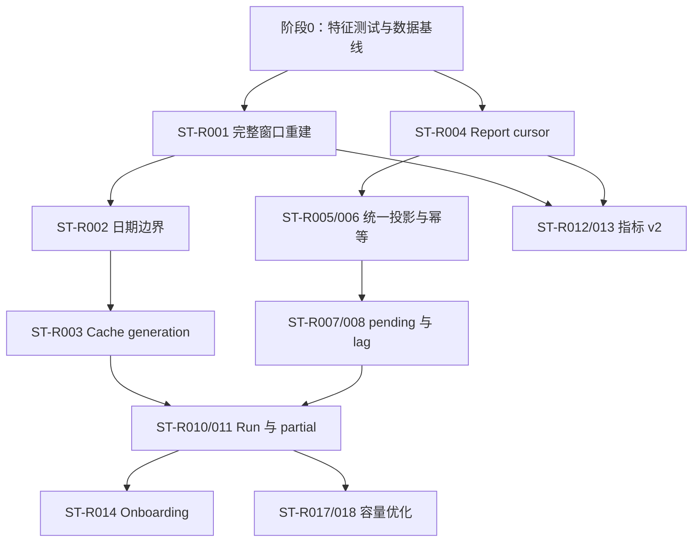

# Statistics 设计问题与重构清单

> 状态：**规划改造**。本文是 Statistics 模块的活动重构台账，汇总业务数据、统计事实、投影扫描、同步重建、缓存查询、指标语义和运行治理中已经由当前源码确认的问题。本文中的目标设计、优先级和路线图不等于代码已经实现。

## 1. 本文的用法

本文不再重复 Statistics 的完整架构，而是回答：

1. 本轮领域模型、三层数据、投影补偿、同步重建、查询链路和指标口径分析后，发现了哪些真实问题；
2. 哪些问题会直接造成统计错误、修复后仍读旧值或事实永久缺失；
3. 哪些问题属于恢复治理、指标语义、扩展性或容量债务；
4. 后续开启单独重构时，应按什么顺序实施、怎样迁移、如何判断已经关闭。

使用约定：

- 后续分析报告、Issue、提交和 PR 优先引用稳定编号，例如 `ST-R003`；
- 实施前必须重新核对当时源码、配置、migration、OpenAPI、调用方和真实数据；
- 一次重构只处理一个能够独立验收的闭环，不因为都属于 Statistics 就重写整个读侧；
- 指标历史语义默认保持兼容；修改口径时优先增加 v2 字段或版本化查询，而不是静默重算旧字段；
- Statistics 只能修复事实投影、统计结果和缓存，不能为了“对平数字”修改 AnswerSheet、Assessment、Report、Actor 或 Task；
- 问题关闭后补充实施证据、数据迁移、验收结果和剩余风险，不直接删除条目；
- 标记为“待业务决策”或“待补证据”的条目，不能因为技术方案看起来更完整就直接实施。

---

## 2. 30 秒结论

Statistics 的总体边界是成立的：

```text
业务权威数据
  -> 原始观察事实
  -> BehaviorFootprint / AssessmentEpisode
  -> JourneyDaily / PlanDaily / OrgSnapshot
  -> ReadService 混合读模型
  -> Redis Overview
```

当前不需要推倒重写三层模型。最需要治理的是五组具体断点：

1. **近期窗口重建会覆盖不完整列**：Scanner 先删除 Journey 窗口，却只重建通用列，可能把 `access_*` 和 `service_*` 清零到夜间同步；
2. **查询与缓存最终一致性没有闭环**：preset 日边界排除今天，MySQL 重建后没有切换 Statistics cache version，Redis 与 LoadGuard 又使用不同查询 identity；
3. **事实补偿并非完整兜底**：常规 Scanner 未覆盖 Assessment failure，Scanner 与事件路径没有共享 pending，迟到 Report catalog 还可能被 Assessment 游标越过；
4. **运行治理不足**：缺少按机构/来源/阶段持久化的 SyncRun、freshness、终止 pending 和人工处置记录；部分机构失败与 warmup partial 只留日志或指标；
5. **指标名称和类型落后于领域模型**：AnswerSheet/Report 指标使用 Assessment 近似，Content 只有 Questionnaire/Scale 二分，Periodic 与 Plan 命名仍带“量表/周次”假设。

治理顺序应当是：

> 先用特征测试锁定现行语义，再修复会产生错误结果的窗口、日期和缓存闭环；然后完善事实补偿与运行账本；之后版本化治理指标语义；最后才根据生产容量数据优化 Plan 全量重建和 Overview 查询性能。

---

## 3. 优先级与状态语义

### 3.1 优先级

| 级别 | 含义 | Statistics 中的判定标准 |
| --- | --- | --- |
| P0 | 当前默认路径的数据正确性或修复闭环风险 | 可能把已有聚合清零、让 `today` 返回错误窗口，或在 MySQL 修复后继续稳定返回旧缓存 |
| P1 | 事实完整性、可靠补偿、运行治理或活跃模型扩展风险 | 不一定每次发生，但会让迟到事实丢失、故障无法闭环、机构漏同步或新模型被错误归类 |
| P2 | API 契约、测试、性能和维护成本 | 当前结果通常可用，但输入错误被静默解释、查询成本放大或缺少等价性保护 |
| P3 | 需要生产规模、保留期、调用方或合规证据才启动 | 历史表清理、事实归档、备用投影入口退役等不能仅凭静态代码决定 |

P0 表示应优先建立修复闭环，不表示把多个 P0 塞进一个大 PR。每项仍应经过“特征测试 → 最小修复 → 数据重建 → 缓存切换 → 生产验收”。

### 3.2 状态

| 状态 | 含义 |
| --- | --- |
| 规划改造 | 当前源码已经确认问题，尚未实施 |
| 待补证据 | 需要生产行数、耗时、延迟、调用方或部署证据确认影响和方案 |
| 待业务决策 | 技术上可实现，但缺少产品指标、兼容或命名决定 |
| 已实现待验收 | 代码已修改，但还缺迁移、对账、故障注入或生产观测 |
| 已关闭 | 代码、数据、测试、运行配置、调用方和文档均完成，无剩余必做项 |

### 3.3 关闭问题的证据

任何 P0、P1 条目至少需要：

1. **行为证据**：测试覆盖正常、重复、迟到、部分失败和重跑；
2. **数据证据**：来源、事实、聚合和 API 抽样对账；
3. **运行证据**：能够观察水位、延迟、缓存 generation、失败阶段和人工处置；
4. **契约证据**：DTO、OpenAPI、前端文案和指标词典使用同一语义；
5. **恢复证据**：修复失败后能够安全重跑，不需要改写业务真值。

---

## 4. 重构总表

| ID | 优先级 | 问题 | 状态 | 主要影响面 |
| --- | --- | --- | --- | --- |
| ST-R001 | P0 | Scanner 窗口重建会删除专用列却只恢复通用 Journey | 规划改造 | `access_*`、`service_*`、Overview 正确性 |
| ST-R002 | P0 | preset 日聚合上界排除今天 | 规划改造 | today/7d/30d、趋势与窗口一致性 |
| ST-R003 | P0 | MySQL 重建后没有切换 Statistics cache version | 规划改造 | 最终一致性、修复工具、Overview 旧值 |
| ST-R004 | P1 | Report Scanner 可能越过迟到的 ReportCatalog | 规划改造 | Report Footprint、Episode、医生/入口 Journey |
| ST-R005 | P1 | Scanner 与事件投影没有共享完整 pending，且未扫描 Assessment failure | 规划改造 | 事实补偿、失败 Journey、乱序收敛 |
| ST-R006 | P1 | `window_recalc=false` 时重复事实可能重复累计 | 规划改造 | 配置安全、Journey 幂等 |
| ST-R007 | P1 | pending 没有终止、dead-letter 和人工治理闭环 | 规划改造 | 永久坏数据、告警、人工补偿 |
| ST-R008 | P1 | Scanner source 不校验白名单，水位缺少 freshness/lag | 规划改造 | 配置错误、静默停滞、运维判断 |
| ST-R009 | P1 | Redis、LoadGuard 与 hotset 对查询 identity 定义不一致 | 规划改造 | singleflight、stale fallback、缓存击穿 |
| ST-R010 | P1 | 同步和修复缺少持久化 Run/Freshness 状态 | 规划改造 | 机构级恢复、阶段审计、自动补偿 |
| ST-R011 | P1 | Scheduler 吞并机构失败，warmup partial 不形成失败结果 | 规划改造 | 调度成功语义、缓存恢复证据 |
| ST-R012 | P1 | AnswerSheet、Assessment、Outcome、Report 指标阶段被压缩为模糊名称 | 待业务决策 | 指标可信度、运营解释、API 兼容 |
| ST-R013 | P1 | Content identity 只有 Questionnaire/Scale 二分 | 待业务决策 | Personality、Behavioral、Cognitive 统计 |
| ST-R014 | P1 | 新机构依赖多处静态 `org_ids` 配置接入 | 规划改造 | 新机构同步、扫描、快照和缓存基线 |
| ST-R015 | P2 | Statistics 输入契约会静默解释非法 status，且查询窗口无上限 | 规划改造 | REST 正确性、单请求数据库成本 |
| ST-R016 | P2 | 缺少增量/扫描/夜间/重建的结果等价性测试 | 规划改造 | 重构安全、历史回填可信度 |
| ST-R017 | P2 | PlanDaily 每晚按机构全历史删除重建 | 待容量证据 | 大机构事务、undo/lock、夜间窗口 |
| ST-R018 | P2 | Overview cache miss 串行组合重查询并重复计算 Content | 待性能证据 | p95、MySQL limiter、缓存击穿 |
| ST-R019 | P2 | Periodic 的 week/scale/active/current 语义过度绑定旧业务且缺少直接测试 | 待业务决策 | Plan 通用性、前端展示、回归保护 |
| ST-R020 | P2 | 一次性重建脚本声明了实际不存在的 Questionnaire/Plan warm scope | 规划改造 | 运维误判、重建验收 |
| ST-R021 | P3 | 原始事实、标准化事实和历史聚合缺少正式保留策略 | 待保留期与容量证据 | 存储增长、可重建历史、合规 |
| ST-R022 | P3 | internal gRPC projector 已注册但常规生产调用责任不清 | 待调用方证据 | 双投影维护成本、接口退役安全 |

---

## 5. 不应误判为缺陷的设计选择

### 5.1 Statistics 是读侧，不是业务事实源

Statistics 不拥有 AnswerSheet、Assessment、Report、Actor 或 Task。统计落后不能回滚主业务，统计修复也不能改写主业务状态。这是正确边界，不应为了“实时一致”把统计写入塞进所有业务事务。

### 5.2 物化与实时查询并存是合理的

Journey 日趋势适合物化；Plan fulfillment 依赖当前时间和到期 cohort，适合实时计算；Content 在当前规模下也可以直接按 Assessment 聚合。问题不在“混合读模型”本身，而在 API 没有表达来源和新鲜度。

### 5.3 Scanner 与事件投影可以并存

事件投影提供低延迟，Scanner 提供业务源补偿。双路径不是天然重复设计；前提是它们共享事件身份、Episode 规则、pending 语义和等价性测试。`ST-R005` 要治理的是语义分叉，不是强制只保留一种入口。

### 5.4 统计允许最终一致，但必须有界、可解释、可恢复

10 分钟 Scanner、夜间重建、7 天修复窗口和 15 分钟 Redis TTL 可以构成当前运行参数，但配置值本身不是 SLO。真正的缺口是系统尚不能证明每个机构当前落后多久、停在哪一步。

### 5.5 Plan Activity 与 Fulfillment 必须保持分离

Activity 按事件时间回答“何时发生”，Fulfillment 按 planned/due cohort 回答“是否履约”。不能为了减少 DTO 字段把两者重新压成一个 `window/trend`。

### 5.6 缓存失败不能回滚 MySQL 重建

Redis 是可重建副本。MySQL 聚合提交后，即使 version bump 或 warmup 失败，也不应回滚已经完成的持久化结果；但整轮修复必须记录为“持久化完成、缓存未闭环”，不能无条件成功。

---

## 6. P0：先关闭结果正确性与缓存闭环

### ST-R001：统一 Scanner 与 Nightly 的完整窗口重建

**当前事实**

生产开启 `window_recalc=true`。Scanner 每轮结束后调用 `RebuildJourneyDailyWindow`：

```text
DELETE statistics_journey_daily in [start,end)
  -> rebuildJourneyDaily
```

它只恢复通用 Journey 列。夜间 `RebuildDailyStatistics` 则执行：

```text
DELETE window
  -> rebuildJourneyDaily
  -> rebuildAccessFunnelDaily
  -> rebuildAssessmentServiceDaily
```

由于三组数据共用 `statistics_journey_daily` 行，Scanner 删除窗口后可能让 `access_*` 和 `service_*` 回到零，直到夜间同步重新补齐。Overview 恰好读取这两组专用列。

**目标设计**

只保留一套完整 `WindowRebuildPlan`：

```text
common journey
access funnel
assessment service
```

Scanner、nightly、手工同步和一次性脚本必须调用同一计划。如果未来确实需要局部重建，则局部 writer 只能更新自己拥有的列，不能先删除整行。

**实施边界**

- 不改变 BehaviorFootprint、Episode 和指标定义；
- 不把 Mongo/MySQL 跨库扫描塞进同一分布式事务；
- 单机构、单窗口的 delete + rebuild 仍在一个 MySQL 事务；
- 先用测试证明当前差异，再替换入口，避免只修一个调用方。

**验收条件**

1. 同一 fixture 下 `RebuildJourneyDailyWindow` 与 `RebuildDailyStatistics` 的全部列完全相同；
2. Scanner 连续运行两次不会降低无新增事实的 `access_*`/`service_*`；
3. 任一阶段注入失败时窗口删除回滚；
4. 修复上线后重建最近修复窗口，并完成来源、Daily、Overview 三层对账；
5. 缓存按 `ST-R003` 切换后才宣布关闭。

**证据**

- `internal/apiserver/application/statistics/behavior_scan.go`
- `internal/apiserver/infra/mysql/statistics/rebuild_writer.go`
- `configs/apiserver.prod.yaml`

### ST-R002：统一 preset 与日聚合的“包含今天”语义

**当前事实**

Application 把 `today/7d/30d` 的 `To` 设为当前时刻；Daily ReadModel 又使用：

```text
stat_date >= beginningOfDay(from)
AND stat_date < beginningOfDay(to)
```

所以 `today` 形成空日窗口，`7d/30d` 排除当天；同一 Overview 内实时 Task/Assessment SQL 却可能包含今天。

**目标设计**

明确产品合同：preset 表示从起始自然日到当前时刻，并包含今天。对日粒度表，使用覆盖 `To` 所在自然日的 exclusive next-day 上界；对精确时间实时 SQL，继续使用 `[from,to)`。

建议提取两个值对象：

```text
QueryInstantRange [from,to)
DailyDateRange    [fromDay,toDayExclusive)
```

避免每个 SQL 自己调用 `beginningOfDay` 猜测语义。

**兼容风险**

修复会让 7d/30d 趋势增加或修正当天点。前端若曾按旧点数写死布局，需要同步验证；Redis key/version 也必须切换，不能让新旧窗口共用 payload。

**验收条件**

- today 能返回当天已重建的日指标；
- 7d/30d 日期点数和首尾日期固定；
- date-only 自定义 `to` 仍包含结束日；
- RFC3339 时间输入的日粒度降格规则写入 OpenAPI；
- Go 与 MySQL session 在目标时区下产生相同自然日。

### ST-R003：建立 rebuild commit → generation switch → warmup 闭环

**当前事实**

StatisticsCache 已装配 VersionTokenStore，但 Statistics Port 没有暴露 Overview invalidation，Sync、RepairComplete 和一次性脚本也没有执行 version bump。`HandleStatisticsSync` 只是再次调用 `GetOverview`，旧 key 未过期时会直接命中旧值。

**目标设计**

当前只有 Overview 被缓存，建议优先采用**机构级 Statistics generation**：

```text
MySQL rebuild committed
  -> bump statistics generation for org
  -> today/7d/30d through new generation miss and rebuild
  -> record warmup result
  -> old generation waits for TTL reclamation
```

机构级 generation 会扩大失效范围，但与当前“按机构重建 Snapshot/Plan/Window”的作用域一致，复杂度低于逐 query-key 管理。若未来 typed content/plan cache 数量显著增长，再评估分族 generation。

**失败语义**

| 阶段 | 失败后状态 | 对外结论 |
| --- | --- | --- |
| MySQL rebuild | 事务回滚或前阶段已提交 | repair 未完成 |
| generation bump | MySQL 新、Redis 旧 | repair 未闭环，必须重试 bump |
| warmup | generation 已新、缓存 miss | 可回源服务，但 warmup partial |
| 旧 key 回收 | 新 generation 已生效 | 不阻塞完成 |

**验收条件**

1. MySQL 提交后旧 generation 立即不再被查询；
2. warmup 必须回源新结果，不会命中旧 payload；
3. bump 失败不回滚 MySQL，但形成可查询未完成状态；
4. Scheduler、手工 RepairComplete 和一次性脚本使用同一切换入口；
5. 测试覆盖 query Redis 与 meta Redis 分离、bump 失败和部分预热失败。

---

## 7. P1：补齐事实完整性与幂等治理

### ST-R004：让 Report Scanner 以报告事实自身推进游标

**当前事实**

`reportScanSource` 先按 Assessment 查询候选：

```text
assessment.id > sinceID OR assessment.evaluated_at > sinceTime
```

然后到 MongoDB `report_query_catalog` 查对应 Report。没有 catalog 的 Assessment 被跳过；Scanner 水位则由成功返回的 Assessment ID 和 Report `sort_at` 推进。

如果 Assessment 较早 evaluated，而 ReportCatalog 更晚才生成，期间水位已被更大的 Assessment ID 推进，则该迟到报告可能同时不满足：

```text
assessment.id > watermark.id
assessment.evaluated_at > watermark.time
```

从而永久错过常规扫描。

**目标设计**

游标必须属于被扫描的真实来源。优先方案是直接按 ReportCatalog 的稳定 `(sort_at, source_id)` 扫描，再批量回读 Assessment 获得 org/testee；或者为跨存储扫描建立显式 pending candidate，不允许“catalog 暂不存在”被当作已处理。

**验收条件**

- Assessment 先 evaluated、多个后续报告推进水位、旧 Assessment 最后生成 Report 的场景仍会投影；
- 相同 `sort_at` 使用稳定 ID 作为 tie-breaker；
- Mongo 报告存在但 MySQL Assessment 暂不可读时进入可重试状态；
- Report 重放不重复增加 Journey；
- 跨存储故障注入不会错误推进水位。

### ST-R005：统一 Scanner 与 Event 的投影内核和 pending 语义

**当前事实**

- Event Router 支持 Assessment failed，并能把缺少 Episode 的后置事件写入 pending；
- Scanner 固定处理 resolve、intake、AnswerSheet、Assessment、Report 五类来源；
- Scanner 没有 Assessment failure source；
- Scanner 遇到 Report 缺少 Episode 时可以无错误返回，并依赖来源顺序/重复窗口，而不是持久 pending；
- nightly service 聚合能从 `assessment.failed_at` 重建失败数量，但 Footprint/Episode 过程事实并不完整。

**目标设计**

两条入口只负责把来源转换成统一 `ProjectionCommand`：

```text
source identity
event kind
org/testee/entry/clinician identity
business occurred_at
entity references
```

后续共享：

- Footprint idempotency；
- Episode 生命周期；
- missing predecessor 分类；
- pending 入队与重试；
- Daily mutation 或窗口重建策略。

同时新增 Assessment failure scan source，或把 Assessment created/failed 作为同一 Assessment source 的两个可辨事实游标。

**验收条件**

- Event 与 Scanner 输入同一业务事实，最终 Footprint/Episode/Daily 完全一致；
- Report/Failure 先于 Assessment 时都进入同一 pending 机制；
- Scanner 水位不会越过未成功归因事实；
- Assessment failure 能从常规业务源补投；
- 未找到生产事件调用方不影响 Scanner 作为兜底路径成立。

### ST-R006：让“只在首次应用时 mutation”成为不变量

**当前事实**

Footprint 使用稳定唯一身份，重复插入可以 no-op；但当 `window_recalc=false` 时，生命周期代码仍可能在重复 Footprint 后继续执行 Daily 增量 mutation。批次失败重放或水位回看可能重复累计。

生产开启 window recalc，降低了实际影响，却不能把配置开关变成数据正确性开关。

**目标设计**

Repository 的 Footprint 写入必须返回：

```text
inserted / already_exists / conflict
```

只有 `inserted` 才允许增量 mutation；`already_exists` 直接幂等成功。窗口重建只是修复和收敛机制，不承担掩盖重复累计的职责。

**验收条件**

- 同一事实重复 100 次只累计一次；
- `window_recalc=true/false` 的最终结果一致；
- checkpoint、watermark 和 Footprint 冲突均有明确指标；
- 生产可以安全关闭窗口重算进行故障隔离，而不改变正确性。

### ST-R007：为 pending 增加终止与人工治理

**当前事实**

pending 有指数退避，但没有最大尝试、dead-letter/manual-required 状态、错误分类、人工确认重试、忽略原因和操作审计。永久缺失前置事实会无限重排。

**目标状态机**

```text
pending -> retry_scheduled -> resolved
                    -> manual_required
manual_required -> force_retry -> resolved/manual_required
                -> ignored_with_reason
```

管理员只能重放或忽略统计投影，不能通过此入口创建/修改 Assessment 或 Report。

**验收条件**

- 自动尝试预算和终止原因可配置且可观察；
- force retry 要求明确确认、操作原因、操作者和前后结果；
- ignored 不删除原记录和历史错误；
- 修复前置事实后可批量安全重试；
- pending age/depth/manual-required 进入告警。

### ST-R008：启动期校验来源并暴露真实水位

**当前事实**

未知 source 进入 `switch default` 后不报错，最终保存 idle watermark，表现为扫描成功但 scanned/projected 都为零。当前指标主要记录批次结果，没有直接暴露每个机构/来源的水位年龄、最近成功和积压估计。

**目标设计**

- 来源配置只能来自注册表白名单；
- 启动期发现未知、重复或未装配来源时 fail fast；
- 每个 `(org,source)` 暴露 last success、last seen business time、watermark ID、lag、status、last error；
- 高基数明细可存 MySQL/治理接口，Prometheus 只暴露汇总和最老 lag。

**验收条件**

- 拼错一个 source 时进程或 scheduler 明确拒绝启动该任务；
- “调度成功但来源 30 分钟无推进”可以被告警；
- 空业务流量与来源故障可以区分；
- batch size / interval 无法追上输入速率时能够观察 backlog 增长。

---

## 8. P1：查询保护、同步治理与机构接入

### ST-R009：统一 StatisticsQueryIdentity 和 stale 记忆

**当前事实**

Redis preset key 按自然日稳定；`overviewGuardKey` 却包含精确到秒的 `timeRange.To`。相同 preset 请求可能共享 Redis key，却使用不同 LoadGuard key，导致 Redis miss 时 singleflight 和 stale 很难复用。Redis hit 路径也没有 `RememberStale`。

**目标设计**

提取单一 `StatisticsQueryIdentity`，统一用于：

- Redis data key；
- version/generation key；
- LoadGuard key；
- hotset target；
- 低基数 metrics label；
- invalidation/warmup scope。

preset identity 使用 `(org,preset,fromDay,toDayExclusive,generation)`；custom range 使用归一化后的精确合同并限制最大范围。

**验收条件**

- 同一 preset 并发 miss 只触发一次回源；
- Redis hit 可以按配置安全记为进程 stale；
- Redis 随后故障且 DB timeout 时，返回同 identity 的旧完整 DTO；
- custom range 不发生错误合并；
- key identity 测试同时覆盖 cache/guard/hotset。

### ST-R010：持久化 SyncRun、RepairRun 和 Freshness

**当前事实**

同步阶段有日志和部分 metrics，但没有按机构持久保存一次运行的阶段状态。系统无法稳定回答 Daily、Snapshot、Plan、generation 和 warmup 是否属于同一轮，以及失败窗口和补偿责任。

**目标最小账本**

```text
StatisticsRun
  run_id / trigger / org_id
  requested_window
  stages:
    facts(optional)
    daily
    snapshot
    plan
    cache_generation
    warmup
  status / started_at / finished_at
  rows_affected / source_watermarks
  error_code / safe_error
  operator / reason (manual only)
```

它是运行治理事实，不是业务聚合。可以单独存表，也可以复用统一 runtime checkpoint/run framework，但必须保留机构和阶段粒度。

**验收条件**

- API/运维工具能查询每个机构最近一次完整成功；
- 能区分“Daily 新、Snapshot 旧、Plan 未跑、Redis 未切”；
- 失败重跑关联原 run 和修复原因；
- freshness 由真实成功记录计算，不由 scheduler 配置推断；
- 历史 run 有合理保留和归档策略。

### ST-R011：让 Scheduler 和 Warmup 如实报告 partial

**当前事实**

Statistics Scheduler 对单机构阶段失败记录日志后 `continue`，整轮仍返回 nil。Cache Coordinator 会生成 `partial/error` 结构化结果，但 `HandleStatisticsSync` 丢弃结果，只返回 `executeTargets` 的 error；单目标失败通常仍是 nil error。

这符合“一个机构失败不阻塞其他机构”和“缓存失败不回滚 MySQL”，却不符合“整轮成功”的可运营语义。

**目标设计**

- Scheduler 返回并持久化 `RunSummary`，包含成功、失败、跳过机构；
- Coordinator 的 StatisticsSync 返回结构化 warmup result；
- 调度进程继续处理其他机构，但 tick 结果必须是 partial；
- 告警以持续失败/最老 freshness 为准，避免一次 partial 造成噪声。

**验收条件**

- 注入一个机构 Daily 失败，其他机构继续，整轮结果为 partial；
- 一个 preset warmup 失败会记录具体 target，不会显示无条件成功；
- 日志、治理 API 和 metrics 使用同一个 run/result identity；
- 重试只处理失败阶段或明确重新执行完整闭环。

### ST-R014：建立统一的机构 Statistics onboarding

**当前事实**

生产的 behavior scan、statistics sync、Plan scheduler、cache warmup 等多处配置各自维护 `org_ids: [1]`。新机构出现业务数据并不会自动建立扫描水位、历史 Daily、Snapshot、PlanDaily 和 Overview 基线。

**目标设计**

近期先建立显式 onboarding 命令/清单：

```text
validate org
  -> register scheduler scopes
  -> initialize source watermarks
  -> backfill retained history
  -> rebuild daily/snapshot/plan
  -> switch cache generation and warm
  -> four-layer reconciliation
  -> activate monitoring
```

远期是否从机构目录自动发现，需同时处理停用机构、测试机构和回填限流，不能简单改成 `SELECT DISTINCT org_id` 全量扫描。

**验收条件**

- 新机构只需一个受控流程，不再人工修改多处配置；
- onboarding 可 dry-run、可重跑、可审计；
- 首次历史范围、预计行数和数据库预算在执行前可见；
- 完成后各来源水位、聚合、API 和缓存均有基线；
- 停用机构有停止调度但保留历史查询的明确语义。

---

## 9. P1：指标身份与 API 演进决策

### ST-R012：拆开 AnswerSheet、Assessment、Outcome 与 Report 阶段

**当前事实**

- Organization submission：Assessment `submitted_at`；
- Assessment Service submission：Assessment `submitted_at`；
- Content submission：Assessment 行数；
- Organization/Service report：Assessment `status=evaluated`；
- Clinician/Entry report：需要 ReportCatalog 的 `AssessmentEpisode.report_generated_at`。

同样的 AnswerSheet/Report 名称实际上表达不同阶段，独立问卷和 Interpretation 失败也会造成差异。

**推荐目标**

不要只把旧字段改名。建立明确阶段：

```text
answersheet_accepted      -- Survey durable AnswerSheet
assessment_created       -- Evaluation Assessment exists
outcome_committed        -- Evaluation completed canonical Outcome
report_generated         -- Interpretation report catalog/artifact exists
```

旧字段保持兼容并标记 deprecated；新 Overview/Content v2 使用真实来源。是否需要每个阶段都暴露给运营，由产品确认，但内部事实层应能完整表达。

**待业务决策**

- 运营最关心“患者提交”“系统测评完成”还是“报告可查看”；
- 独立 Questionnaire 是否进入同一个服务看板；
- 旧历史数据无法完整回填时，从哪个日期启用 v2；
- 旧字段保留多久，前端如何迁移。

**验收条件**

- 每个字段只有一个权威来源；
- 跨阶段差异可以作为 backlog/失败观测，而不是被命名掩盖；
- historical/independent questionnaire 行为写入数据迁移说明；
- OpenAPI、运营文案和指标词典同步更新。

### ST-R013：把 Questionnaire 资产与 AssessmentModel kind 变成正交身份

**当前事实**

Content 只支持 `questionnaire/scale`。除 `evaluation_model_kind=scale` 外，其余 Assessment 都归入 Questionnaire；Personality、Behavioral Rating、Cognitive 无法独立统计。

**推荐目标**

不要简单把 ContentType enum 扩成四五种后继续混合资产与模型。建议拆成：

```text
QuestionnaireUsage
  questionnaire_code/version

AssessmentModelUsage
  model_kind/sub_kind/code/version
  questionnaire_ref
```

这样可以分别回答“哪个问卷被填写”和“哪种模型被执行”，也允许多个模型引用同一 Questionnaire。

**兼容策略**

- 保留旧 `(questionnaire|scale, code)` 查询一段时间；
- 新增 typed v2 identity，而不是改变旧 `else questionnaire` 返回；
- 对历史 Assessment identity 做数据质量审计；
- 前端完成迁移后再决定旧类型何时退役。

**验收条件**

- Scale、Personality、Behavioral Rating、Cognitive 分别统计；
- Questionnaire usage 不因模型类型改变而丢失；
- 相同 code 在不同 kind 下不会冲突；
- 权限矩阵按资产管理与模型管理分别保护；
- 新 kind 接入只需注册稳定扩展点，不修改 `else` 分支。

---

## 10. P2：API、测试与性能治理

### ST-R015：收紧查询输入并限制单请求成本

**当前事实**

Entry `status` 只判断是否等于 `active`；任意其他非空值都会变成 `activeOnly=false`。自定义时间范围没有最大跨度，长窗口会放大实时 Plan cohort 和多组 ReadModel 查询。

**目标设计**

- status 使用明确 enum：`active/inactive/all`，未知值返回 400；
- 定义在线最大窗口，例如由容量测试确定 90/180/365 天；
- 超长历史走异步导出或离线分析；
- date-only 与 RFC3339 的粒度规则进入 OpenAPI；
- 所有限制在 Application 复验，不能只依赖 Handler。

**验收条件**

- 非法 status 不再静默查询 inactive；
- 超长窗口在执行 SQL 前被拒绝；
- 管理员内部修复接口与用户查询接口使用不同范围授权；
- K6 覆盖最大合法窗口和拒绝路径。

### ST-R016：建立结果等价性测试金字塔

**当前事实**

现有测试覆盖时间归一化、SQL 形状、事务要求、调度顺序、锁、cache-aside 和部分 Plan cohort，但缺少跨路径最终结果对比。Periodic Reader 也没有字段级直接测试。

**目标测试层次**

1. 领域/应用：事件身份、pending、比例和时间范围；
2. Repository：真实 MySQL fixture 的全部列、delete+insert 和 rollback；
3. 跨路径等价：Event、Scanner、Window rebuild、Nightly rebuild；
4. 跨存储迟到：AnswerSheet/Assessment/Report 不同顺序；
5. 缓存闭环：generation、warmup、stale；
6. 端到端：业务事实 → API → 来源对账。

**验收条件**

- 同一事实集经四条投影路径得到相同结果；
- 两次重建完全幂等；
- P0 修复都有失败注入；
- Periodic 状态映射/current week/project 汇总被锁定；
- 测试明确区分本地合同通过与生产数据验收。

### ST-R017：用容量证据决定 PlanDaily 是否窗口化

**当前事实**

`RebuildPlanStatistics` 每次删除机构全部 `statistics_plan_daily`，再扫描全部未删除 Task。一次性脚本随后还会删除选定范围外的 PlanDaily，使行为更难直观理解。

**先收集证据**

- 每机构 Task 总行数和月增长；
- 全量重建 wall time、RowsAffected、undo/redo、锁等待；
- 任务状态发生迟到变化的最大时间；
- 夜间窗口和 30 分钟 lease 余量；
- 读写高峰是否重叠。

**可能方案**

| 条件 | 方案 |
| --- | --- |
| 全量重建远低于预算 | 保持简单全量替换 |
| 历史日基本不可变 | 冻结历史 + 最近 late window 重建 |
| 任意历史 Task 可变化 | 按 plan/date 分区重建 + dirty range |
| 数据规模进入分析平台范围 | 将长期历史迁入专门分析存储 |

没有生产证据前，本项不应直接升级为复杂增量系统。

### ST-R018：优化 Overview 前先修 identity 和重复查询

**当前事实**

一次 Overview cache miss 串行执行十组 Reader，部分 Reader 内含多条 SQL；Content count 在 OrganizationOverview 和 DimensionAnalysis 中重复计算。直接并行化会把一个 miss 放大为更多数据库并发。

**优化顺序**

1. 先完成 ST-R009，确保 singleflight 生效；
2. 消除同请求重复 Content 查询；
3. 记录每个子查询耗时、SQL 数和 limiter 等待；
4. 为稳定组合设计批量 ReadModel；
5. 再决定有限并行，且共享并发预算；
6. 用 mixed 300 QPS 场景验证，不用单接口局部数字代替系统验收。

**验收条件**

- cache miss 的 SQL 数、p95 和 limiter wait 有明确预算；
- 并发 miss 只产生一次回源；
- Redis 故障时数据库仍受保护，不发生无界并行；
- 优化不改变字段来源和时间语义。

### ST-R019：重命名 Periodic 前先确认 Plan 产品语义

**当前事实**

- `total_weeks` 实际是 Task 数；
- `current_week` 是第一个非 completed Task seq；expired/canceled 也可能成为 current；
- opened 在 Periodic 中映射为 pending；
- `active_projects` 只看是否存在 pending/opened Task，不读取 Plan status；
- project/scale name 从 Assessment title 或 `scale_code` 推导。

**推荐方向**

内部先使用通用命名：project/task occurrence、current sequence、content title；对外是否保留 week/scale 作为兼容展示，由产品和 collection-system 决定。

**验收条件**

- 明确 canceled/expired 是否可成为 current；
- active project 与 Plan status 的关系有业务定义；
- 非按周 Plan 不再展示误导周次；
- opened/pending 是否需要区分由前端场景确认；
- 迁移前补齐 Periodic Reader 直接测试。

### ST-R020：让一次性脚本参数与真实 warm 能力一致

**当前事实**

`rebuild_statistics_aggregates_and_cache` 支持 `--questionnaire-code`、`--plan-id`、`--max-questionnaires` 和 `--max-plans`，也打印发现数量；但 cache phase 实际只 warm today/7d/30d Overview，Statistics cache 没有 Questionnaire/Plan typed writer。

**目标设计**

当前优先删除或明确标记无效参数，保留真实能力：机构、日期范围、聚合阶段、Overview generation/warmup。只有新增真实 typed cache 后，才恢复相应 scope。

**验收条件**

- `--help` 中每个参数都能改变可观测执行结果；
- dry-run 输出真实将执行的 SQL/缓存范围；
- cache phase 先 switch generation；
- Query/Meta Redis 地址、DB、namespace 和凭据分别校验；
- 一机构分阶段演练通过后才允许 `--all-orgs`。

---

## 11. P3：保留策略与备用入口治理

### ST-R021：用业务可追溯期决定数据保留

**当前事实**

resolve/intake 日志、BehaviorFootprint、AssessmentEpisode、pending、watermark、JourneyDaily、PlanDaily 和 OrgSnapshot 的恢复价值不同。`statistics_content_daily` 已无运行时读取，但历史 migration/物理表可能仍存在。当前没有生产行数、增长速度和正式保留期证据。

**决策前必须收集**

- 各表行数、日增长、索引大小和最老时间；
- 运营允许查询的最长历史；
- 统计错误最晚可能在多久后发现；
- 原始日志删除后是否仍能从业务源重建；
- 医疗/审计要求是否需要更长留存；
- 归档介质和恢复时间目标。

**原则**

- 先定义保留和归档，再做删除；
- 先证明无运行时读写和重建依赖，再退役物理表；
- 结果表可重建不代表原始事实可删除；
- 不手工清理数据库来代替 migration 和受控作业。

### ST-R022：确认 internal gRPC projector 的真实调用方

**当前事实**

仓库保留并注册内部 `ProjectBehaviorEvent`/projector 能力，但常规生产配置以 Scanner 为主，仓库内没有找到明确生产调用方。仅凭仓库内搜索不能证明外部系统从未调用。

**治理步骤**

1. 检查网关、服务发现、调用日志和指标；
2. 标记调用方、事件类型和流量；
3. 若仍使用，纳入 ST-R005 的统一投影合同；
4. 若确认无人使用，先告警式废弃，再移除注册和协议；
5. 删除前保留一个完整发布周期的零调用证据。

---

## 12. 需要共同确认的业务与架构决策

| 决策 | 当前建议 | 为什么仍需确认 |
| --- | --- | --- |
| preset 是否包含今天 | 包含今天 | 会改变现有趋势点和前端展示 |
| 缓存失效粒度 | 先采用机构级 Statistics generation | 简单且匹配当前重建作用域，但会使机构全部 Overview 同时失效 |
| 服务阶段指标 | 分开 accepted/created/outcome/report | 运营是否需要全部阶段、旧字段兼容期要确认 |
| 独立 Questionnaire | 单独进入 Questionnaire usage，不伪装 Assessment | 需要明确运营看板入口和权限 |
| Content identity | Questionnaire 资产与 Model kind 正交 | 需要 operating-system/前端迁移契约 |
| Freshness DTO | 按区域返回 source + fresh_at + lag，而非单一顶层时间 | DTO 体积和前端展示方式需要确认 |
| 最大在线窗口 | 由容量测试设定，超长走异步 | 需要真实查询需求和数据规模 |
| Periodic week/active | 内部通用化，对外兼容迁移 | collection-system 当前展示语义需要确认 |
| 原始事实保留期 | 先保留到可重建期和审计期明确 | 需要存储增长与医疗合规证据 |

这些决策不阻塞 ST-R001、ST-R003 等纯正确性修复；但会影响 ST-R002、ST-R012、ST-R013、ST-R019 的最终 API 形状。

---

## 13. 推荐实施路线图

### 阶段 0：建立保护和数据基线

目标：在改动前证明当前行为和影响范围。

1. 为 ST-R001、ST-R002、ST-R003、ST-R004 增加失败复现或特征测试；
2. 只读采集各机构来源水位、Daily 行数、Task 规模和缓存 key/generation；
3. 抽样对账业务源、事实层、聚合表和 API；
4. 保存修复前 today/7d/30d 响应与趋势点；
5. 确认 operating-system/collection-system 对 Statistics 字段的实际使用。

退出条件：每个 P0 都有稳定失败测试，生产影响范围可描述，回滚所需配置和重建命令已演练。

### 阶段 1：关闭 P0 正确性断点

建议顺序：

```text
ST-R001 完整窗口重建
  -> ST-R002 日期边界
  -> ST-R003 generation switch
  -> 最近窗口重建与四层对账
```

ST-R003 放在日期修复之后，可以一次切换到新日期语义；但其实现和测试可以并行准备。

退出条件：Scanner/nightly 等价、today 正确、MySQL 修复后旧 cache 立即不可见。

### 阶段 2：统一事实补偿

1. ST-R004 改造 Report source cursor；
2. ST-R005 引入共享 ProjectionCommand/pending；
3. ST-R006 让 mutation 只在首次应用；
4. ST-R007 增加 pending 终止和人工治理；
5. ST-R008 校验来源并暴露 lag。

退出条件：五类正常事实、Assessment failure 和迟到 Report 均能通过 Event/Scanner 收敛，重复不多计，永久失败可人工处置。

### 阶段 3：建立运行治理闭环

1. ST-R010 最小 StatisticsRun；
2. ST-R011 结构化 partial；
3. ST-R014 统一机构 onboarding；
4. 增加按阶段 freshness/lag 和缓存 generation 观测。

退出条件：系统能够回答“哪个机构、哪个来源/阶段、哪个窗口、何时失败、是否已补偿”。

### 阶段 4：版本化治理指标语义

1. 与用户和前端确认 ST-R012、ST-R013、ST-R019；
2. 设计 v2 DTO 和双读对账；
3. 历史回填能力不足的字段明确生效日期；
4. 前端迁移后再废弃旧字段。

退出条件：AnswerSheet/Assessment/Outcome/Report 和 Questionnaire/Model kind 不再共用模糊身份。

### 阶段 5：按容量证据优化

1. ST-R015 设置在线窗口预算；
2. ST-R017 决定 Plan 全量或窗口化；
3. ST-R018 优化 Overview；
4. ST-R020 收紧脚本；
5. ST-R021 根据保留策略治理历史数据。

退出条件：300 QPS 混合场景、夜间重建窗口和数据增长目标均有生产或等价环境证据。

---

## 14. 重构依赖关系



关键约束：

- 不应在 ST-R001 之前重构指标 SQL，否则 Scanner/nightly 差异会干扰验证；
- 不应在 ST-R003 之前把“warmup 完成”作为修复证据；
- 不应在 ST-R004/ST-R005 之前宣称 Report 事实可完整补扫；
- 不应在 ST-R012/ST-R013 业务决策前静默改变历史 API；
- 不应在 ST-R009 完成前用 goroutine 并行化 Overview 回源。

---

## 15. 现状工程判定

| 指标 | 判定 | 证据与触发标准 |
| --- | --- | --- |
| 入口路径清晰度 | 绿 | Scanner、Sync、ReadService、Cache 和 Scheduler 的主入口与装配均可追踪 |
| 业务边界清晰度 | 绿 | Statistics 不修改上游业务真值，三层所有权已经明确 |
| 结果正确性 | 红 | 默认 `window_recalc=true` 路径删除完整 Daily 窗口却只恢复部分列；可由等价性测试证伪或确认 |
| 行为边界清晰度 | 黄 | 多数指标可定义，但 AnswerSheet/Report/Content/Periodic 名称仍压缩多个阶段 |
| 测试保护 | 黄 | 主路径和 SQL 合同已有测试，跨路径等价、迟到 Report、generation switch 和 Periodic 仍缺直接保护 |
| 可观察性 | 黄 | 已有日志、扫描、缓存、锁和 warmup 指标，但缺机构/阶段 Run、freshness 和 source lag |
| 变更放大 | 黄 | 指标或时间语义修改会跨 DTO、SQL、重建、缓存、OpenAPI 和前端，但模块边界仍可控 |
| 安全可拆分性 | 黄 | P0 可小步修复；指标 v2、投影内核和保留策略必须先补测试或业务证据 |

红色“结果正确性”不意味着整个 Statistics 不可用。它指向一个可达、可复现、范围明确的默认重建路径问题，应优先关闭，而不是扩张为全模块重写。

---

## 16. 通用验收矩阵

### 16.1 数据正确性

- 同一事实重复投影不重复累计；
- Event、Scanner、Window rebuild、Nightly rebuild 最终等价；
- today/7d/30d 与自定义日期边界准确；
- 独立 Questionnaire、Assessment evaluated 和真实 Report 分别可对账；
- Plan Activity 与 Fulfillment 保持各自时间语义。

### 16.2 故障恢复

- Mongo/MySQL/Redis 任一依赖短暂失败不会错误推进水位或宣布完整成功；
- 事务中途失败不留下半个窗口；
- 迟到事实在 lookback/watermark 之外仍有明确恢复路径；
- pending 自动预算耗尽后进入人工治理；
- 重建和 generation switch 可安全重跑。

### 16.3 查询与缓存

- 相同 query identity 在 Redis、Guard、hotset 和 metrics 中一致；
- 并发 miss 只产生一次受控回源；
- Redis 故障不把无界流量打到数据库；
- MySQL 新结果提交后旧 generation 不再被读；
- API 能表达各区域 freshness 或至少提供治理查询。

### 16.4 多机构与权限

- 新机构能通过单一 onboarding 建立完整基线；
- 一个机构失败不污染其他机构；
- 所有事实、聚合、缓存和治理操作保留 org scope；
- Current Clinician、Testee Periodic 和 Content capability 不因 v2 绕过授权。

### 16.5 性能与容量

- 300 QPS 混合场景覆盖 Statistics，而不是只压 Overview；
- cache miss、MySQL limiter wait、连接池和慢 SQL 可观察；
- Plan rebuild 耗时低于租约和低峰预算；
- 超长窗口在执行重 SQL 前被限制；
- 历史重建按窗口可重跑且不会制造缓存混合版本。

---

## 17. 代码事实索引

### 17.1 投影与扫描

- `internal/apiserver/application/statistics/behavior_scan.go`：来源白名单缺失、窗口重算、逐事实事务和水位推进；
- `journey.go`、`journey_episode_lifecycler.go`、`journey_pending_queue.go`：事件投影、Episode 与 pending；
- `internal/apiserver/infra/statistics/report_scan_source.go`：跨 MySQL Assessment 与 Mongo ReportCatalog 的扫描游标；
- `internal/apiserver/infra/mongo/answersheet/scan_source.go`：AnswerSheet 扫描；
- `internal/apiserver/infra/mysql/statistics/scan_repository.go`：MySQL 来源和 watermark。

### 17.2 结果重建与查询

- `internal/apiserver/infra/mysql/statistics/rebuild_writer.go`：三组 Journey、PlanDaily 和 OrgSnapshot；
- `internal/apiserver/infra/mysql/statistics/readmodel/read_model.go`：日期边界、指标 SQL 和 Overview 重查询；
- `internal/apiserver/application/statistics/read_service_overview_query.go`：Guard identity、十组查询和趋势补零；
- `internal/apiserver/infra/mysql/statistics/periodic_reader.go`：Periodic 语义。

### 17.3 缓存、调度与工具

- `internal/apiserver/cache/statistics`：Overview key、VersionTokenStore 与 typed cache；
- `internal/apiserver/cache/governance/signal_router.go`、`coordinator.go`：Statistics warmup 与 partial result；
- `internal/apiserver/runtime/scheduler/statistics_sync.go`：机构循环和阶段 continue；
- `internal/apiserver/runtime/scheduler/behavior_journey_scan.go`：Scanner 调度；
- `scripts/oneoff/rebuild_statistics_aggregates_and_cache/main.go`：聚合和缓存重建；
- `configs/apiserver.prod.yaml`：org IDs、window recalc、扫描和同步周期。

### 17.4 查询契约

- `internal/apiserver/domain/statistics/v1_types.go`：现行 DTO；
- `internal/apiserver/transport/rest/handler/statistics.go`：status、时间和资源参数；
- `api/rest/apiserver.yaml`：生成 OpenAPI；
- `internal/apiserver/application/statistics/read_service_test.go`：Application 查询合同；
- `internal/apiserver/infra/mysql/statistics/readmodel/read_model_contract_test.go`：SQL 合同。

---

## 18. 小结

Statistics 的问题已经可以从“感觉统计比较复杂”收敛成一组有边界的工程任务：

- P0 先解决窗口重建、today 边界和缓存 generation；
- P1 再解决迟到 Report、统一 pending、幂等 mutation、水位、Run/Freshness 和机构 onboarding；
- 指标语义通过 v2 演进，不静默改变历史字段；
- P2 性能优化必须排在 query identity 和结果正确性之后；
- P3 数据清理与入口退役必须等待生产容量、保留期和调用证据。

最重要的治理原则是：

> Statistics 可以最终一致，但每一层都必须知道自己的权威来源、进度和失败状态；系统不仅要能重新算出一个数字，还必须证明这个数字基于完整事实、正确时间窗口和已经切换的新查询版本。

完成这份清单后，70-statistics 文档已经形成从“为什么存在”到“怎样改进”的闭环。后续不再按大模块整体重构，而应引用稳定编号，逐项补保护、实施、迁移和验收。
