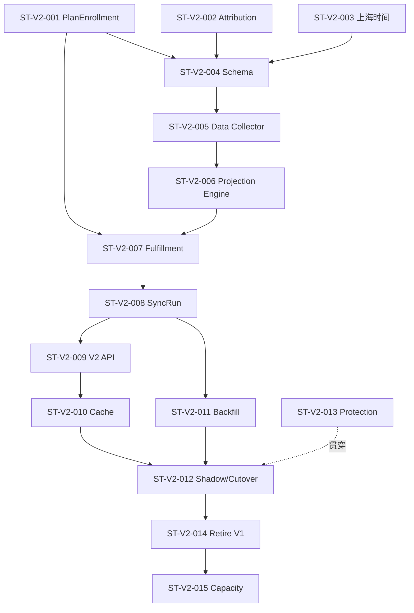

# Statistics V2 设计问题与重构清单

> 状态：**规划改造**。本文是 Statistics V2 的活动实施台账。[重构目标架构与完成定义](./80-重构目标架构与完成定义.md) 已经确定最终状态，但代码、migration、回填、调用方和生产验收尚未完成。旧 V1 问题台账已由本版路线图取代；V1 只做阻塞业务或迁移安全的必要修复，不再扩展其投影体系。

## 1. 本文用法

- 后续 Issue、分析报告、提交和 PR 使用 `ST-V2-xxx` 编号；
- 最终架构、非目标和完整 Definition of Done 以 [80 文档](./80-重构目标架构与完成定义.md) 为准，本文不重复发明目标；
- 一次变更只关闭一个可独立验收的闭环；
- “代码完成”不等于条目关闭，migration、数据、缓存、调用方和文档都要有证据；
- 当前实现与目标设计冲突时，以源码为当前事实，以本目录为已确认目标；
- 禁止为了缩短迁移时间直接删除 V1 表或静默改变现有 API 语义。

## 2. 30 秒结论

Statistics V2 不是单纯重建九张表，它有两个业务前置改造和五个 Statistics 阶段：

```text
前置 A：Plan 持久化 PlanEnrollment
前置 B：Survey 冻结 AttributionSnapshot

阶段 1：建立 V2 Schema 与时间基础
阶段 2：由可扩展 Data Collector 构建三类 Fact
阶段 3：由 Typed Projection Engine 生成四类 Daily 与 OrgSnapshot
阶段 4：切换 V2 API 与缓存
阶段 5：历史回填、影子对账和 V1 退役
```

最重要的顺序约束是：

> 先让业务模块保存未来不可丢失的事实，再建设 Statistics；先影子对账，再切换查询；先保留回滚能力，再退役旧投影。

## 3. 优先级与关闭标准

| 级别 | 含义 |
| --- | --- |
| P0 | V2 正确性或迁移前置，不完成不能进入下一阶段 |
| P1 | 同步、查询、运行治理和切换闭环 |
| P2 | 容量、保留和退役优化，可以在核心链路稳定后处理 |

条目关闭至少需要：

1. 代码与 migration；
2. 正常、重复、失败和重跑测试；
3. 历史/新数据迁移证据；
4. 来源、Fact、Daily、API 对账；
5. 缓存和运行状态证据；
6. 相关模块与 OpenAPI 文档同步。

## 4. 总表

| ID | 优先级 | 事项 | 状态 | 依赖 |
| --- | --- | --- | --- | --- |
| ST-V2-001 | P0 | 持久化 PlanEnrollment | 规划改造 | 无 |
| ST-V2-002 | P0 | 冻结 Assessment AttributionSnapshot | 规划改造 | 无 |
| ST-V2-003 | P0 | 建立上海时间统一组件与迁移审计 | 规划改造 | 无 |
| ST-V2-004 | P0 | 新增 Statistics V2 九张表 | 规划改造 | 001-003 契约 |
| ST-V2-005 | P0 | 实现三类 Data Collector | 规划改造 | 001-004 |
| ST-V2-006 | P0 | 实现 Typed Projection Engine 与五个 Projection | 规划改造 | 004-005 |
| ST-V2-007 | P0 | 固化 Plan Fulfillment cohort 算法 | 规划改造 | 001、005-006 |
| ST-V2-008 | P1 | 实现 SyncRun 与批次状态机 | 规划改造 | 004-007 |
| ST-V2-009 | P1 | 建立 V2 查询契约与新鲜度字段 | 规划改造 | 006-008 |
| ST-V2-010 | P1 | 建立机构级 Cache Generation 闭环 | 规划改造 | 008-009 |
| ST-V2-011 | P1 | 历史 Fact 回填与归属标记 | 规划改造 | 001-008 |
| ST-V2-012 | P1 | V1/V2 影子对账与逐接口切换 | 规划改造 | 009-011 |
| ST-V2-013 | P1 | 建立测试、指标和运维闭环 | 规划改造 | 贯穿全部 |
| ST-V2-014 | P2 | 退役 V1 Projector/Scanner/旧表 | 规划改造 | 012-013 |
| ST-V2-015 | P2 | 数据保留与容量优化 | 待容量证据 | V2 稳定运行 |

## 5. ST-V2-001：持久化 PlanEnrollment

### 当前事实

当前 `PlanEnrollment` 是领域服务，不是实体。患者参与关系由 `(plan_id,testee_id)` 下的 Task 集合推导，不能表达多轮参与、加入时间和终止原因。

### 目标

新增：

```text
PlanEnrollment
  id, org_id, plan_id, testee_id, round
  start_date
  status(active/closed/terminated)
  joined_at, closed_at, terminated_at
  terminated_reason
```

Task 增加 `enrollment_id`，唯一性改为 `(enrollment_id,seq)`。

### 必须保护

- 相同加入请求幂等返回原 Enrollment；
- 同一患者同一 Plan 同时最多一个 active Enrollment；
- 明确再次加入才创建下一轮；
- Enrollment 与初始 Tasks 同事务保存；
- 终止 Enrollment 与取消非终态 Tasks 同事务保存；
- 期望 Task 已生成且全部进入终态时自然进入 `closed`；
- 显式终止进入 `terminated`，不能被自动关闭覆盖；
- `closed` 不表示所有任务成功完成。
- 新一轮参与创建新 Task，不复用上一轮 Task；
- 同一 Enrollment 内如支持重排，必须持久化 Schedule Revision，不允许 Statistics 从 `updated_at` 猜测。

### 验收

- 并发加入不会产生两条 active Enrollment；
- 终止后可创建 round=2；
- 历史 Task 能回填 round=1；
- Plan/Task 现有查询和调度回归通过；
- Plan 文档同步更新。

## 6. ST-V2-002：冻结 Assessment AttributionSnapshot

### 当前事实

当前 AnswerSheet/Assessment 事件没有稳定携带 clinician、entry 等全部归属。Statistics 事后查询当前关系会造成历史漂移。

### 目标

在 AnswerSheet Admission 增加：

```text
origin_type / origin_id
clinician_id / entry_id
plan_id / enrollment_id / task_id
captured_at / version
```

与 AnswerSheet 和 Outbox 一起在 `202 Accepted` 前持久化。

### 必须保护

- 入口要求的必需归属缺失时不能静默变空；
- 不适用字段允许 NULL；
- 后续链路只能复制快照，不能重算；
- Statistics 新数据统一标记 `frozen`；
- 历史数据允许 `derived_legacy/unknown`。

### 验收

- 医生、Entry 或关系变化后历史新数据归属不变；
- Entry、医生直接发起、Plan Task、独立问卷场景都有合同测试；
- 可靠受理性能仍满足提交目标；
- Survey/Evaluation 事件契约与文档同步。

## 7. ST-V2-003：上海时间统一组件

### 当前事实

当前代码同时依赖 `time.Local`、MySQL `DATE()` 和不同来源时间。仅设置部署 `TZ` 不能形成完整契约。

### 目标

- 显式加载 `Asia/Shanghai`；
- 提供 `BusinessDay`、`InstantRange`、`DailyDateRange`；
- MySQL DSN/session 明确上海语义；
- Fact 使用 `DATETIME(3)` + `DATE`；
- 所有窗口使用 `[from,to)`。

### 迁移审计

逐表核对 AnswerSheet、Assessment、Report、Resolve/Intake、Plan/Task 的历史时间，不进行未经验证的统一加减八小时。

### 验收

- 零点边界、月末和跨年测试；
- 应用与 MySQL 计算得到相同自然日；
- 不同机器 TZ 下测试结果不变；
- 形成历史表时间语义清单。

## 8. ST-V2-004：新增九张表

### 目标表

```text
statistics_access_fact
statistics_assessment_fact
statistics_plan_fact

statistics_access_daily
statistics_assessment_daily
statistics_plan_activity_daily
statistics_plan_fulfillment_daily
statistics_org_snapshot

statistics_sync_run
```

### 物理原则

- Fact 使用稳定 `fact_key` 唯一约束；
- Daily 使用完整维度唯一键；
- 结构化常用过滤字段，不以 JSON 替代表结构；
- Statistics 表不对业务表建立强外键，避免归档/迁移写耦合；
- Migration 只新增，不删除 V1 表；
- Down migration 不误删 V1 数据。

### 验收

- Migration contract test 覆盖表、列、唯一键和索引；
- 重复 migration 安全；
- staging 数据规模下验证索引与行宽；
- 表注释明确目标状态和上海时间语义。

## 9. ST-V2-005：三类 Data Collector

### 目标

实现：

```text
AccessFactCollector
AssessmentFactCollector
PlanFactCollector
```

默认读取最近七个完整日，支持手工窗口和 dry-run。

Collector 实现统一运行合同，并由 `CollectorSet` 在组合根显式注册。同一 Fact 家族新增来源时，只扩展对应 Collector 的强类型 Source Reader/Mapper；新增 Fact 家族时，才新建 Collector 与 Fact Store。

### 关键合同

- 来源主键生成稳定 FactKey；
- 同一窗口重跑不增长；
- 同 FactKey 核心字段冲突时失败，不覆盖；
- 来源计数与 FactType 计数写入 SyncRun；
- 独立问卷只产生 AnswerSheet Fact；
- 新 Assessment 必须使用 frozen attribution；
- Plan Task 必须关联 Enrollment。
- Collector 不得直接写 Daily、Snapshot 或缓存；
- 扩展采用编译时强类型装配，不使用反射、包扫描、动态 SQL 或脚本加载。

### 验收

- 正常、重复、迟到、空归属、冲突、批量失败测试；
- Mongo/MySQL 来源任一失败不会发布不完整结果；
- Dry-run 不写数据；
- 可按 source_ref 追溯。
- 新增同家族数据源时 SyncCoordinator 无需修改；
- 新增 Collector 时名称唯一、顺序确定，且自动纳入 SyncRun 计数。

## 10. ST-V2-006：Typed Projection Engine 与五个 Projection

### 目标

实现：

```text
TypedProjectionEngine
  -> AccessDailyProjection
  -> AssessmentDailyProjection
  -> PlanActivityDailyProjection
  -> PlanFulfillmentProjection
  -> OrganizationSnapshotProjection
```

Engine 使用显式构造函数装配五个 Projection，不引入 Metric Catalog、DSL、动态 SQL 或自动发现。

### 关键合同

- 删除与重建在一个结果事务；
- Daily 比率不落库；
- 空日期由查询层补零；
- Snapshot 覆盖当前 Overview 所需资源和累计量；
- Report 使用真实 Report，不用 evaluated Assessment 近似；
- AssessmentDaily 第一版按 code 聚合、Fact 保留 version。
- Engine 只调度，指标口径由具体 Projection 拥有；
- Engine 和 Projection 不自行开启或提交事务；
- OrganizationSnapshotProjection 可读取当前 MySQL 资源状态，累计业务量从 Fact 读取，结果事务中不扫描 MongoDB。

### 验收

- 相同 Fixture 重建结果逐字段相同；
- 任一步失败事务整体回滚；
- OrgSnapshot 与 Daily 同批提交；
- V2 能回答既定查询矩阵。
- Engine 执行顺序固定，任一 Projection 失败时不再执行后续步骤；
- 每个 Projection 有独立确定性 Fixture 与结果表所有权测试。

## 11. ST-V2-007：Plan Fulfillment cohort

### 已确认口径

- Planned 按 `planned_at`；
- Due 按 `due_at`；
- canceled 不进入分母但单独记录；
- on-time：`completed_at <= due_at`；
- overdue：过期或晚于 due 完成；
- cutoff 使用 `as_of_date` 次日零点，不使用查询时 `time.Now()`；
- 第一版按机构全量重建。

### 前置数据

Plan 需要持久化：

- Enrollment 生命周期时间；
- Task `expired_at/canceled_at`；
- 同一 Enrollment 内如允许重排，需持久化 Schedule Revision；V2 第一阶段不统计重排次数；
- `enrollment_id`。

### 验收

- 到期前完成、到期时完成、逾期完成、未完成逾期、取消全部覆盖；
- Activity 和 Fulfillment 日期不同的场景通过；
- 旧 cohort 在后续完成后能够变化；
- 全量执行时间记录为容量基线。

## 12. ST-V2-008：SyncRun 与批次状态机

### 目标

将当前日志式同步升级为持久运行账本：

```text
running -> failed
running -> data_committed -> succeeded
```

### 关键合同

- Run 在结果事务外创建；
- Daily、Snapshot、`data_committed` 在同一事务；
- 缓存成功后才 `succeeded`；
- 缓存失败可以只重试闭环；
- 机构失败互不污染；
- Scheduler 汇总 partial，不无条件成功。
- `batch_key` 识别同一统计意图，`attempt` 识别失败后的新尝试；
- 唯一键使用 `UNIQUE(batch_key, attempt)`，不使用会阻止重试的 `UNIQUE(run_key)`。

### 验收

- 每个阶段故障注入；
- 进程退出后能识别 running/data_committed；
- 相同批次并发由租约保护；
- Run 能展示来源、Fact、结果数量和落后天数。

## 13. ST-V2-009：V2 查询契约

### 目标

V2 API 返回：

```text
as_of_date
snapshot_at
is_stale
```

预设：

```text
latest_complete_day / 7d / 30d / custom
```

### 语义升级

- 移除实时 `today` 承诺；
- 拆开 AnswerSheet、Assessment、Outcome、Report；
- Content 支持四种 model kind；
- participating testee 与 active enrollment 分开；
- Current resource 与 Window metrics 分开。

### 验收

- DTO、OpenAPI、REST/gRPC 和前端文案一致；
- 自定义窗口有上限；
- 结束日包含/排除规则有合同测试；
- V1 不被静默改变，调用方显式迁移。

## 14. ST-V2-010：缓存 Generation

### 目标

- 统一 Redis、L1、LoadGuard、Hotset 的 QueryIdentity；
- 使用机构级 Statistics Generation；
- MySQL commit 后 bump；
- 预热常用查询；
- Redis 故障时限流回源或返回可解释 stale。

### 验收

- 新旧 Generation 不混用；
- Sync 成功后不会继续稳定返回旧结果；
- Cache failure 不回滚 MySQL；
- Redis 全不可用时数据库不会被无限流量拖垮；
- stale 响应保留旧 `as_of_date`。

## 15. ST-V2-011：历史回填

### Plan

每个历史 `(plan_id,testee_id)` 创建 `round=1` Enrollment，并回填 Task。无法恢复的时间标记为迁移估算。

### Assessment

按现有 origin、Task、Entry、Intake、Actor 关系尽力恢复归属：

```text
derived_legacy / unknown
```

### Fact

按组织和自然日分片回填三类 Fact，再构建 Daily/Snapshot。

### 验收

- 回填可以 dry-run、暂停、续跑；
- 每个窗口有 SyncRun；
- 历史偏差被量化，不伪造 100% attribution；
- 回填后重复执行不增长；
- 原 V1 数据仍可用于回滚对照。

## 16. ST-V2-012：影子对账与切换

### 影子期

```text
V1 继续对外服务
V2 每日运行但不对外
来源 -> Fact -> Daily -> V2 API 对账
```

### 差异分类

| 差异 | 处理 |
| --- | --- |
| V2 明确修正旧近似口径 | 记录预期差异并更新契约 |
| 历史 attribution 偏差 | 标记 legacy，接受已确认范围 |
| Fact 漏采/重复 | 修复后重跑 |
| 时间边界不同 | 按上海时间契约复核 |
| 无法解释 | 阻塞切换 |

### 切换顺序

```text
内部对账接口
  -> Content/Entry/Clinician
  -> Overview
  -> Plan Activity/Fulfillment
  -> V1 下线
```

每个接口独立 feature flag 和回滚开关。

## 17. ST-V2-013：测试与运行治理

必须建立：

- Fact 合同测试；
- Collector 集成测试；
- CollectorSet 扩展、重名与顺序测试；
- Projection 确定性结果测试；
- Projection Engine 顺序、中断与事务合同测试；
- 上海时间边界测试；
- 历史迁移测试；
- PlanEnrollment 多轮测试；
- SyncRun 故障注入；
- Cache generation 测试；
- V1/V2 golden 对账；
- 生产 `as_of_date/lag/failure stage` 指标与告警。

不使用生产写环境做未经批准的负载测试。容量验收在隔离数据和明确凭据下执行。

## 18. ST-V2-014：V1 退役

只有满足以下条件才能停止 V1：

- 所有调用方已迁移；
- V2 连续稳定运行完整观察期；
- 回填和影子差异已签收；
- 回滚路径经过演练；
- 没有未知 internal gRPC Projector 调用方；
- Cache/Sync 运维手册可用。

退役顺序：

1. 停止 V1 新投影；
2. 保留 V1 表只读；
3. 删除 V1 Scheduler/Scanner 注册；
4. 观察并验证 V2；
5. 单独变更归档旧表与代码。

禁止在同一个 migration 中“创建 V2 + 删除 V1”。

## 19. ST-V2-015：保留与容量

V2 稳定前不自动清理 Fact。稳定后根据真实数据决定：

- Fact 年增长量；
- Daily 行数和索引大小；
- Plan Fulfillment 全量耗时；
- SyncRun 保留期；
- 历史业务追溯要求；
- 冷数据是否需要归档。

只有 Plan Fulfillment 全量重建成为可测瓶颈时，才引入“受影响 cohort 日期”优化。不要提前增加 Generation、Checkpoint 或复杂分区。

## 20. 依赖关系



## 21. 分阶段实施路线

### 阶段 0：保护当前行为

- 固化 V1 API Fixture 和典型生产数据分布；
- 建立时间、指标和调用方清单；
- 保留当前数据库与缓存回滚路径。

### 阶段 1：业务事实前置

- ST-V2-001 PlanEnrollment；
- ST-V2-002 AttributionSnapshot；
- ST-V2-003 上海时间组件。

### 阶段 2：V2 数据层

- ST-V2-004 Schema；
- ST-V2-005 Collector；
- ST-V2-006 Typed Projection Engine 与五个 Projection；
- ST-V2-007 Fulfillment。

### 阶段 3：运行与查询

- ST-V2-008 SyncRun；
- ST-V2-009 API；
- ST-V2-010 Cache Generation。

### 阶段 4：迁移

- ST-V2-011 历史回填；
- ST-V2-012 影子对账；
- ST-V2-013 故障与运行验收。

### 阶段 5：退役与优化

- ST-V2-014 V1 退役；
- ST-V2-015 按容量证据优化。

## 22. 全局验收矩阵

### 22.1 正确性

- 三类来源均能追溯到 Fact；
- Collector 可扩展但不能绕过统一运行合同；
- 同一窗口重跑结果不变；
- 新 Assessment 归属不漂移；
- Plan 多轮参与分开；
- Activity/Fulfillment 口径符合指标词典；
- 独立 Questionnaire 不产生假失败。
- 五张结果表各有唯一 Projection，Engine 不复制指标口径。

### 22.2 恢复

- 任一阶段失败可以从 SyncRun 定位；
- Daily 事务失败无半成品；
- Cache 失败不丢 MySQL 结果；
- 手工回填需要确认、原因和结果审计；
- 不直接修改业务真值或最终 count。

### 22.3 查询

- V2 返回 as_of/snapshot/stale；
- 授权范围与 V1 等价或更严格；
- 缓存和数据库使用相同 QueryIdentity；
- Redis 故障不会击穿 MySQL；
- 自定义窗口成本受限。

### 22.4 迁移

- V1/V2 差异都有解释；
- 调用方显式迁移；
- V1 保留回滚观察期；
- 退役前确认所有注册和内部调用方；
- 文档状态随实施证据逐项更新。

## 23. 当前代码事实入口

- PlanEnrollment 当前领域服务：[`domain/plan/plan_enrollment.go`](../../../internal/apiserver/domain/plan/plan_enrollment.go)
- Survey 可靠受理：[`application/survey/answersheet`](../../../internal/apiserver/application/survey/answersheet/)
- Statistics 当前投影：[`application/statistics/journey.go`](../../../internal/apiserver/application/statistics/journey.go)
- Statistics 当前扫描：[`application/statistics/behavior_scan.go`](../../../internal/apiserver/application/statistics/behavior_scan.go)
- Statistics 当前同步：[`application/statistics/sync_service.go`](../../../internal/apiserver/application/statistics/sync_service.go)
- Statistics 当前 PO：[`infra/mysql/statistics`](../../../internal/apiserver/infra/mysql/statistics/)
- Statistics 当前 Scheduler：[`runtime/scheduler/statistics_sync.go`](../../../internal/apiserver/runtime/scheduler/statistics_sync.go)
- MySQL migrations：[`internal/pkg/migration/migrations/mysql`](../../../internal/pkg/migration/migrations/mysql/)
