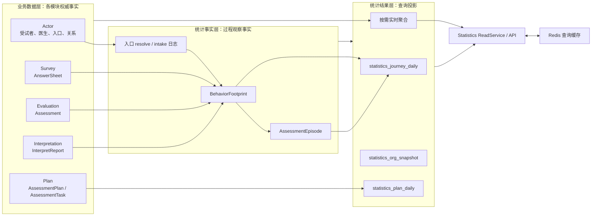

# Statistics 模块

> 状态：**已重建**。当前已完成模块入口、领域模型、三层数据设计、投影补偿、同步重建、关键查询链路、指标词典以及设计问题台账。后续代码治理按 `90-设计问题与重构清单.md` 的稳定编号逐项推进。

## 1. 30 秒结论

Statistics 解决的不是“把几张表做 `COUNT(*)`”，而是：

> 在不改变各业务模块权威事实的前提下，把分散在 Actor、Survey、Evaluation、Interpretation 和 Plan 中的数据，转换为可按机构、医生、测评入口、受试者、测评内容和时间窗口查询的运营观察结果。

它是 qs-server 的**统计读侧与过程观察模块**，不是业务写侧，也不是通用 BI 平台。

当前模块最重要的设计，是把数据分成三个层次：

1. **业务数据层**保存“业务实际上发生了什么”，权威状态仍由原业务模块拥有；
2. **统计事实层**保存“为了统计和追溯，需要观察到哪些过程事实”；
3. **统计结果层**保存或即时计算“按某种指标口径、维度和时间窗口得到什么结果”。



这三层的核心原则是：

> 业务数据层保存各业务模块的权威状态；统计事实层保存面向分析和重放的过程事实；统计结果层保存或计算由事实按维度、时间窗口和指标口径形成的查询结果。

## 2. 为什么需要 Statistics

### 2.1 业务模块只应保护自己的真值

qs-server 的业务事实分散在多个边界中：

- Actor 知道受试者、医生、看护关系以及测评入口；
- Survey 知道用户最终提交了哪一份 AnswerSheet；
- Evaluation 知道 Assessment 是否创建、执行和失败；
- Interpretation 知道报告是否真正生成；
- Plan 知道某个患者在某个周期内应该完成哪些 Task，以及是否履约。

这些模块不应为了一个运营统计页面互相加载聚合、复制状态或增加反向依赖。例如，Evaluation 不应该保存“某医生最近 30 天完成了多少次测评”，Plan 也不应该维护“机构今天生成了多少份报告”。这些都是从既有事实派生出的查询问题。

Statistics 把这类跨模块、跨时间窗口的查询集中到读侧，使写模型继续专注业务不变式。

### 2.2 当前业务需要观察的不只是结果数量

一个测评平台不仅要回答“产生了多少份报告”，还需要回答：

- 某机构有多少受试者、医生、有效入口和测评内容；
- 用户打开入口后，有多少人完成接纳、建档、建立关系和提交答卷；
- AnswerSheet 提交后，有多少成功创建 Assessment、生成报告或进入失败；
- 某医生服务了多少受试者，入口的使用和转化情况怎样；
- 某个问卷或测评模型有多少提交、多少完成；
- Plan 在窗口内创建、开放、完成和过期了多少 Task；
- 窗口内应当履约的任务中，有多少按时完成、逾期或尚未完成。

这些问题同时涉及“过程”“结果”“时间归属”和“访问范围”。因此 Statistics 不能只是若干零散 SQL，它需要稳定的数据分层、指标口径和恢复机制。

### 2.3 统计允许延迟，但不能无法解释

Statistics 不参与 AnswerSheet 受理、Assessment 执行或报告生成的业务提交，因此统计暂时落后不应阻塞主链路。但系统仍必须回答：

- 当前结果来自实时业务表、事实表还是日聚合表；
- 最后一次扫描或同步处理到了哪里；
- 重复投影是否会重复计数；
- 乱序事实是否会被延迟处理；
- 缓存失效后能否回到正确的读模型；
- 投影损坏后能否从保留的事实重建；
- 重建过程中和重建完成后如何验证口径一致。

所以这里采用的是**可恢复、可观察的最终一致性**，而不是“统计不重要，所以偶尔不准也没关系”。

## 3. 模块负责什么

| 职责 | Statistics 保护的语义 |
| --- | --- |
| 数据分层 | 区分业务权威数据、统计过程事实和统计结果，禁止反向污染写模型 |
| 过程投影 | 将入口、答卷、测评和报告事实标准化为行为足迹和测评服务过程 |
| 扫描补偿 | 从入口日志、MongoDB AnswerSheet、MySQL Assessment 和 Report 数据补投遗漏事实 |
| 幂等与乱序处理 | 用稳定事件标识、checkpoint 和 pending 机制避免重复累计，并等待前置事实 |
| 聚合与快照 | 构建机构、医生、入口、Journey 和 Plan 等查询投影 |
| 同步与重建 | 按窗口重算日聚合、组织快照和 Plan 聚合，使读侧可以恢复 |
| 查询编排 | 将物化投影与必要的实时聚合组合为 Statistics API 输出 |
| 访问控制 | 在机构、角色和资源范围内返回统计结果，不能因聚合绕过业务授权 |
| 查询保护 | 对 Overview 等高频查询使用缓存、限流、背压和热集治理 |

## 4. 模块不负责什么

| 问题 | 权威模块 | Statistics 的边界 |
| --- | --- | --- |
| 受试者、家长、医生是谁以及关系是否有效 | Actor / IAM | 只读取必要标识、关系和访问范围 |
| Questionnaire 和 AnswerSheet 的业务合法性 | Survey | 不修改答卷，不重新判定答案是否合法 |
| 模型如何计分、校准和判定 Outcome | ModelCatalog / Calculation / Evaluation | 不参与算法执行，也不重新解释结果 |
| Assessment 是否可以重试或是否执行成功 | Evaluation | 只观察已产生的状态与过程事实 |
| 报告内容、模板、Audience 和发布版本 | Interpretation | 只观察报告事实，不保存报告正文 |
| Plan 周期、Task 状态迁移与履约写入 | Plan | 读取或聚合 Task 事实，不推进 Task 状态 |
| 医学诊断和治疗决策 | 医生及外部医疗业务 | Statistics 只能提供辅助观察数据 |
| 任意报表、自由取数和离线数仓 | 专门 BI / 数据平台 | 当前模块只承接 qs-server 内稳定的运营查询模型 |

边界可以概括为：

> Statistics 可以重新计算“我们怎样观察业务”，但不能重新决定“业务事实上是什么”。

## 5. 三层数据模型

### 5.1 业务数据层：权威事实源

业务数据层不属于 Statistics 所有。它包括但不限于：

| 来源模块 | 代表性事实 | Statistics 关心的原因 |
| --- | --- | --- |
| Actor | Testee、Clinician、AssessmentEntry、看护/服务关系 | 机构资源、医生维度、入口漏斗和访问范围 |
| Survey | AnswerSheet | 答卷提交事实和内容提交量 |
| Evaluation | Assessment | 测评创建、完成/失败及内容归属 |
| Interpretation | InterpretReport | 报告真实生成事实 |
| Plan | AssessmentPlan、AssessmentTask | 周期任务活动和履约统计 |

Statistics 可以扫描或查询这些数据，却不取得其所有权。如果统计结果与业务聚合冲突，应先以业务聚合为准，再排查事实采集、投影或指标口径。

### 5.2 统计事实层：保留过程，而不是只保留结果

事实层当前包含两类内容：

1. **原始观察事实**：`assessment_entry_resolve_log`、`assessment_entry_intake_log` 等在动作发生时记录的日志；
2. **标准化统计事实**：`BehaviorFootprint` 与 `AssessmentEpisode`，用于统一表达跨模块过程。

需要特别注意：并非所有事实都能从当前业务状态完整恢复。入口被打开过多少次、何时完成接纳，本质上是瞬时行为；如果原始日志被删除，仅凭当前 AssessmentEntry 或 Actor 状态无法还原。因此“事实层可重放”意味着标准化投影可以从仍保留的原始事实重新生成，不等于所有原始事实都可以随时删除。

### 5.3 统计结果层：物化结果与实时聚合并存

当前结果层不是单一的一套统计表，而是混合读模型：

- `statistics_journey_daily` 保存机构、医生和入口维度的 Journey 日聚合；
- `statistics_plan_daily` 保存 Plan Task 的日活动聚合；
- `statistics_org_snapshot` 保存机构资源概览快照；
- 部分 Overview、医生、入口、内容和 Plan 履约指标直接从业务表按需聚合；
- `ReadService` 将这些结果组合成 API 查询模型。

“实时查询”并不意味着它重新成为业务写模型；它仍然只是读取业务事实后形成的派生结果。后续文档会逐项说明每个指标的真实来源。

### 5.4 Redis 不属于三层真值

Redis 中的 Overview 缓存和热集记录只负责查询加速与流量保护：

- 缓存不是业务数据层；
- 缓存不是统计事实层；
- 缓存也不是统计结果的最终持久化真值；
- 缓存可以失效、删除和重新预热；
- 缓存命中不能绕过机构、角色和资源授权。

## 6. 当前核心查询能力

| 查询族 | 主要问题 | 当前读侧特点 |
| --- | --- | --- |
| Organization Overview | 机构资源、接入漏斗、测评交付和 Plan 概览 | 组合快照、日聚合和实时查询，并对 Overview 使用缓存 |
| Clinician Statistics | 医生可访问受试者、入口和服务过程 | 按机构与医生范围查询，区分列表、详情和当前医生视图 |
| Assessment Entry Statistics | 二维码/入口的打开、接纳、分配和测评转化 | 组合入口元信息、日志与 Journey 聚合 |
| Content Batch Statistics | Questionnaire / Scale 的提交和完成 | 使用带类型的 `(content_type, content_code)` 身份，并执行能力授权 |
| Testee Periodic Statistics | 某受试者的周期项目和 Task 完成情况 | 面向 Plan 履约的专用查询视图 |

Statistics 的 API DTO 是查询契约，不是领域聚合。它们可以为了读场景组合多个来源，但不能被写侧模块反向依赖。

## 7. 一致性总原则

三个数据层具有不同的一致性语义：

| 层次 | 一致性要求 | 失败后的处理 |
| --- | --- | --- |
| 业务数据层 | 由所属模块定义，通常保护业务事务和状态机 | 由所属模块重试、补偿或人工治理 |
| 统计事实层 | 允许异步到达，但要求幂等、可追踪、可补投 | 扫描补偿、pending 重试、checkpoint 与事实重放 |
| 统计结果层 | 允许有界延迟，但指标口径必须稳定且可重算 | 窗口重建、快照刷新、同步任务与一致性核对 |
| Redis 缓存 | 允许比结果层更晚，不能成为唯一副本 | 失效、版本切换、删除和预热 |

由此得到四条不变量：

1. 统计失败不能回滚已经成功的 AnswerSheet、Assessment、Report 或 Task；
2. 同一个事实被重复投影，不能导致指标无限重复累计；
3. 统计结果可以落后，但必须能判断落后在哪个来源、哪个机构和哪个时间窗口；
4. 任何修复都应优先从事实重放或结果重建入手，不能直接改写业务真值来“对平数字”。

## 8. 当前实现状态

| 能力 | 状态 | 说明 |
| --- | --- | --- |
| 机构、医生、入口、内容和受试者周期查询 | 已实现 | 由拆分后的窄 Reader 与 MySQL ReadModel 提供 |
| 入口 resolve / intake 原始观察日志 | 已实现 | Actor 入口链路写入，Statistics 保存与扫描 |
| BehaviorFootprint 与 AssessmentEpisode | 已实现 | 统一表达行为节点和一次测评服务过程 |
| Journey 增量投影 | 已实现 | 事件标识、checkpoint、事务与日聚合共同保护 |
| 多来源扫描补偿 | 已实现 | 覆盖入口日志、AnswerSheet、Assessment 和 Report |
| 乱序 pending 重试 | 已实现 | 前置 Episode 尚未出现时延迟处理 |
| 日聚合、机构快照和 Plan 聚合重建 | 已实现 | 后台同步与一次性重建脚本均有入口 |
| Overview Redis 缓存和治理 | 已实现 | 缓存版本、热集、预热与保护机制已装配 |
| 统一指标词典 | 已完成 | 字段级口径、公式、来源和已知偏差已集中写入 `40-统计指标与口径.md`；组织负责人仍需在治理流程中明确 |
| 统一 freshness / lag 目标与对账面板 | 待完善 | 当前已有部分运行指标，但尚未形成完整数据新鲜度契约 |

## 9. 文档地图

本模块采用紧凑结构，不按每类 API 或每张表拆文档：

| 顺序 | 文档 | 状态 | 核心问题 |
| --- | --- | --- | --- |
| 00 | 本文 | 已重写 | Statistics 为什么存在、边界和阅读路线是什么 |
| 10 | [领域模型](./10-领域模型.md) | 已重写 | 三层模型、核心对象和不变量是什么 |
| 20 | [核心设计：业务数据、事实与统计分层](./20-核心设计-业务数据、事实与统计分层.md) | 已重写 | 三层数据怎样映射到具体存储和所有权 |
| 21 | [核心设计：投影、扫描、幂等与补偿](./21-核心设计-投影、扫描、幂等与补偿.md) | 已重写 | 实时投影与扫描补偿怎样协作并防止重复 |
| 22 | [核心设计：同步、重建与最终一致性](./22-核心设计-同步、重建与最终一致性.md) | 已重写 | 聚合怎样同步、重算、预热和验证 |
| 30 | [关键链路：从业务数据到统计查询](./30-关键链路-从业务数据到统计查询.md) | 已重写 | 一条查询如何从业务事实进入投影、ReadService 和 API |
| 40 | [统计指标与口径](./40-统计指标与口径.md) | 已重写 | 每个指标怎样定义、按哪个时间归属、从哪里计算 |
| 90 | [设计问题与重构清单](./90-设计问题与重构清单.md) | 规划改造 | 当前缺口、风险、优先级、实施顺序和验收边界 |

建议阅读顺序：

```text
README
  -> 10 领域模型
  -> 20 三层数据分层
  -> 21 投影与补偿
  -> 22 同步与重建
  -> 30 完整关键链路
  -> 40 指标口径
  -> 90 重构清单
```

## 10. 与其他模块的阅读衔接

- AnswerSheet 与可靠受理：[Survey](../10-survey/README.md)；
- 模型身份和执行输入：[ModelCatalog](../20-model-catalog/README.md)；
- Assessment 与 Outcome：[Evaluation](../30-evaluation/README.md)；
- 报告生成和查询：[Interpretation](../40-interpretation/README.md)；
- 受试者、医生、关系和入口：[Actor](../50-actor/README.md)；
- 周期任务与履约事实：[Plan](../60-plan/README.md)。

## 11. 事实源与验证

| 主题 | 当前事实源 |
| --- | --- |
| Statistics 领域对象和查询 DTO | [`domain/statistics`](../../../internal/apiserver/domain/statistics/) |
| 投影、扫描、查询和同步编排 | [`application/statistics`](../../../internal/apiserver/application/statistics/) |
| MySQL 事实、聚合和 ReadModel | [`infra/mysql/statistics`](../../../internal/apiserver/infra/mysql/statistics/) |
| MongoDB / Report 扫描适配 | [`infra/statistics`](../../../internal/apiserver/infra/statistics/) |
| 模块装配 | [`container/modules/statistics`](../../../internal/apiserver/container/modules/statistics/) |
| 后台扫描、pending 与同步任务 | [`runtime/scheduler`](../../../internal/apiserver/runtime/scheduler/) |
| REST 路由 | [`routes_statistics.go`](../../../internal/apiserver/transport/rest/routes_statistics.go) |
| 聚合与运行时表 | [`migrations/mysql`](../../../internal/pkg/migration/migrations/mysql/) |
| 一次性聚合和缓存重建 | [`rebuild_statistics_aggregates_and_cache`](../../../scripts/oneoff/rebuild_statistics_aggregates_and_cache/) |

快速验证：

```bash
go test ./internal/apiserver/domain/statistics
go test ./internal/apiserver/application/statistics
go test ./internal/apiserver/infra/mysql/statistics/...
go test ./internal/apiserver/container/modules/statistics
go test ./internal/apiserver/runtime/scheduler
make docs-hygiene
make docs-facts
```

这些验证可以证明领域对象、SQL 契约、投影事务和文档链接未明显漂移；真实数据规模下的统计延迟、缓存命中和重建耗时仍需要运行环境证据。
