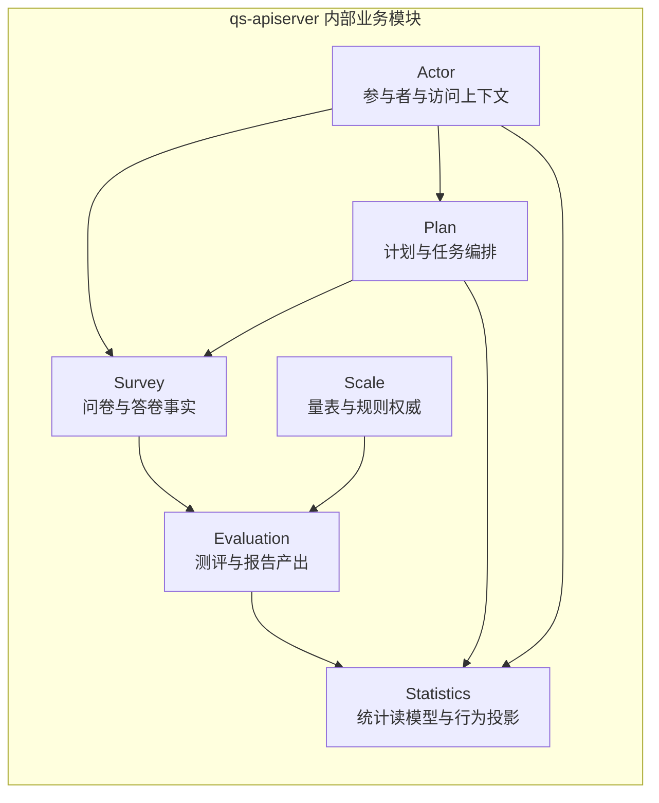

# 业务模块（02）

**本文回答**：`02-业务模块` 这一组文档负责把 `qs-apiserver` 内的业务限界上下文讲清楚：每个模块解决什么问题、负责哪些对象和状态、不负责哪些横切机制，以及读者应该如何从“采集事实 → 规则权威 → 测评产出 → 参与者 / 计划 / 统计”这一主轴进入深讲文档。

本文只做目录级导航和边界定义，不替代各模块深讲，也不重复三进程运行时、事件 outbox、接口契约和部署配置。

---

## 30 秒结论

| 维度 | 结论 |
| ---- | ---- |
| 本组定位 | 按 **业务限界上下文** 解释 `qs-apiserver` 内部业务模块的静态模型、边界和核心设计 |
| 核心主轴 | `survey` 采集事实，`scale` 管理规则，`evaluation` 生成测评结果和报告 |
| 补充模块 | `actor` 提供参与者与访问上下文，`plan` 提供计划和任务编排，`statistics` 提供读侧统计与行为投影 |
| 运行时边界 | 六个模块不是六个微服务，当前都装配在 `qs-apiserver` 的业务容器内 |
| 阅读顺序 | 第一次读按 `survey → scale → evaluation → actor → plan → statistics`；排障或改造时按问题进入对应模块 |
| 真值来源 | 以 `internal/apiserver/domain`、`application`、`container/assembler`、REST/OpenAPI、gRPC proto、`configs/events.yaml` 为准 |
| 不在这里展开 | 三进程调用、MQ 消费、outbox relay、IAM 拦截器、Redis runtime、部署端口、完整接口清单 |

一句话概括：**这一组文档讲“业务能力如何建模”，不是讲“进程如何运行”。**

---

## 1. 为什么业务模块要单独成组

`qs-server` 的主业务不是简单的“问卷 CRUD”。它要把一次前台作答，稳定转化成可解释、可追踪、可查询的量表测评结果。这个过程至少涉及三类不同性质的业务事实：

1. **采集事实**：用户填了哪份问卷、哪个版本、每道题的答案是什么。
2. **规则事实**：这份问卷是否关联量表、量表有哪些因子、计分规则和解读规则是什么。
3. **产出事实**：这次作答是否形成测评、测评状态如何、总分和风险等级是什么、报告和统计如何产生。

如果把这些都写成一个“问卷模块”，模型会变得混乱：问卷结构、量表规则、测评状态、报告生成、统计投影、计划任务都会互相挤压。`02-业务模块` 的作用就是先把这些业务边界拆开，再让读者进入各模块深讲。

---

## 2. 模块地图



这张图只表达业务依赖方向，不表达运行时进程。运行时上，这些模块主要由 `qs-apiserver` 的 `Container` 装配；`collection-server` 通过 gRPC 调用 apiserver，`qs-worker` 消费事件后通过 internal gRPC 回调 apiserver，不各自维护一套完整业务模型。

---

## 3. 六个模块的边界速查

| 模块 | 一句话职责 | 负责 | 不负责 | 深讲入口 |
| ---- | ---------- | ---- | ------ | -------- |
| `survey` | 管理问卷结构和答卷事实 | `Questionnaire`、`Question`、`AnswerSheet`、答案校验、答卷提交事件 | 医学量表解释、风险等级、报告产出 | [survey/README.md](./survey/README.md) |
| `scale` | 管理医学量表和规则权威源 | `MedicalScale`、`Factor`、计分规则、解读规则、分类与适用范围 | 保存答卷、生成报告、处理异步事件 | [scale/README.md](./scale/README.md) |
| `evaluation` | 将答卷事实和量表规则转化为测评结果 | `Assessment`、评估状态机、engine pipeline、分数、风险、报告 | 定义题目结构、维护量表基础信息 | [evaluation/README.md](./evaluation/README.md) |
| `actor` | 管理测评参与者和访问上下文 | `Testee`、Clinician、Operator、关系、标签、访问范围 | 替代 IAM 认证系统、承载问卷或测评主流程 | [actor/README.md](./actor/README.md) |
| `plan` | 管理计划和任务生命周期 | `AssessmentPlan`、`AssessmentTask`、任务开放/完成/过期/取消、计划调度 | 直接评估测评结果、直接生成报告 | [plan/README.md](./plan/README.md) |
| `statistics` | 管理读侧统计和行为投影 | 机构概览、接入漏斗、测评服务过程、计划统计、行为 pending reconcile | 替代业务写模型、直接改变主业务状态 | [statistics/README.md](./statistics/README.md) |

---

## 4. 推荐阅读顺序

### 4.1 第一次读业务模型

第一次阅读建议按主业务轴线进入：

```text
survey → scale → evaluation → actor → plan → statistics
```

原因是：

1. 不理解 `survey`，就分不清“问卷结构”和“答卷事实”。
2. 不理解 `scale`，就分不清“题目展示”和“医学规则”。
3. 不理解 `evaluation`，就分不清“作答完成”和“测评完成”。
4. 不理解 `actor`，就容易把 IAM 用户、受试者、监护关系、从业者混成一个概念。
5. 不理解 `plan`，就看不懂周期任务如何衔接答卷提交。
6. 不理解 `statistics`，就容易误以为所有统计都来自实时扫明细表。

### 4.2 按任务进入

| 你要做什么 | 先读哪一组 | 再读什么 |
| ---------- | ---------- | -------- |
| 新增题型或校验规则 | `survey` | `03-题型校验与计分扩展.md`、`05-新增题型SOP.md` |
| 修改问卷版本或发布规则 | `survey` | `01-Questionnaire生命周期与版本.md` |
| 新增医学量表 | `scale` | `00-整体模型.md`、`01-规则与因子计分.md` |
| 修改风险等级或解读文案 | `scale` + `evaluation` | `scale/02-解读规则与风险文案.md`、`evaluation/02-EnginePipeline.md` |
| 修改评估失败、重试或报告生成 | `evaluation` | `01-Assessment状态机.md`、`04-Outbox与可靠出站.md` |
| 修改受试者、从业者或访问关系 | `actor` | `00-整体模型.md`、关系与访问控制相关文档 |
| 修改周期任务或任务通知 | `plan` | `01-Plan与Task状态机.md`、`03-任务调度与通知.md` |
| 修改统计指标或行为投影 | `statistics` | `00-整体模型.md`、`02-BehaviorProjection.md` |

---

## 5. 业务模块与运行时的分工

业务模块文档不重复运行时拓扑。三进程协作、gRPC、MQ、shutdown、调度器在哪里启动，应进入 [../01-运行时/](../01-运行时/)。

| 问题 | 应进入哪里 |
| ---- | ---------- |
| 哪个进程负责保存答卷？ | [../00-总览/03-核心业务链路.md](../00-总览/03-核心业务链路.md)、`survey` |
| collection-server 是否有自己的 domain？ | [../01-运行时/02-collection-server运行时.md](../01-运行时/02-collection-server运行时.md) |
| worker 消费哪些 topic？ | [../01-运行时/03-qs-worker运行时.md](../01-运行时/03-qs-worker运行时.md)、[../03-基础设施/event/](../03-基础设施/event/) |
| apiserver 如何装配六个模块？ | [../01-运行时/01-qs-apiserver启动与组合根.md](../01-运行时/01-qs-apiserver启动与组合根.md) |
| gRPC 服务怎么注册？ | [../01-运行时/04-进程间调用与gRPC.md](../01-运行时/04-进程间调用与gRPC.md) |
| IAM 身份如何进入业务上下文？ | [../01-运行时/05-IAM认证与身份链路.md](../01-运行时/05-IAM认证与身份链路.md)、[../03-基础设施/security/](../03-基础设施/security/) |

业务模块只在必要处摘要运行时事实，并回链运行时文档。

---

## 6. 业务模块与基础设施的分工

业务模块文档解释“为什么需要这个业务对象”和“这个业务对象如何变化”。基础设施文档解释“事件、存储、缓存、安全、限流如何实现”。

| 横切机制 | 业务模块只写什么 | 机制细节去哪里 |
| -------- | ---------------- | -------------- |
| 事件 | 哪个业务动作产生哪个领域事件 | [../03-基础设施/event/](../03-基础设施/event/) |
| Outbox | 哪个模块需要可靠出站 | [../03-基础设施/event/02-Publish与Outbox.md](../03-基础设施/event/02-Publish与Outbox.md)、[../03-基础设施/data-access/](../03-基础设施/data-access/) |
| MySQL / Mongo | 聚合或读模型为什么落在这里 | [../03-基础设施/data-access/](../03-基础设施/data-access/) |
| Redis / Cache | 模块使用哪些缓存或锁 | [../03-基础设施/redis/](../03-基础设施/redis/)、[../03-基础设施/resilience/](../03-基础设施/resilience/) |
| RateLimit / Backpressure | 哪条业务链路需要保护 | [../03-基础设施/resilience/](../03-基础设施/resilience/) |
| IAM / AuthzSnapshot | 模块依赖什么身份或能力判断 | [../03-基础设施/security/](../03-基础设施/security/) |
| WeChat / OSS / Notification | 业务用例需要什么外部能力 | [../03-基础设施/integrations/](../03-基础设施/integrations/) |

---

## 7. 模块深讲的统一结构

后续各模块深讲尽量采用统一结构，便于精读和维护。

```text
模块目录/
├── README.md                  # 模块阅读地图
├── 00-整体模型.md             # 模块定位、边界、对象图
├── 01-生命周期与状态机.md     # 聚合状态、迁移、事件
├── 02-核心链路.md             # 模块内部关键流程
├── 03-存储事件缓存边界.md     # 持久化、事件、缓存、幂等
├── 04-测试与验证.md           # 测试锚点、Verify 命令
└── 05-新增能力SOP.md          # 新增题型/规则/事件/读模型时的流程
```

不同模块可以按自身复杂度调整文件名，但每篇核心深讲至少要回答：

1. 这个模块解决什么业务问题？
2. 这个模块负责什么，不负责什么？
3. 核心聚合、实体、值对象是什么？
4. 应用服务如何编排领域对象？
5. 用到了哪些真实存在的设计模式？
6. 事件、存储、缓存、接口如何与模块衔接？
7. 如何验证这些结论？

---

## 8. 主业务轴线：采集、规则、产出

### 8.1 Survey：采集事实

`survey` 的核心不是“展示问卷页面”，而是维护问卷结构和答卷事实。它回答：

- 当前有哪些问卷？
- 问卷有哪些题、题型、选项和校验规则？
- 用户提交了一份怎样的答卷？
- 这份答卷是否已持久化并触发后续测评链路？

### 8.2 Scale：规则权威

`scale` 的核心不是“问卷分类”，而是医学量表规则。它回答：

- 哪个量表关联哪个问卷版本？
- 量表有哪些因子？
- 因子如何计分？
- 分数如何映射到风险、结论和建议？

### 8.3 Evaluation：测评产出

`evaluation` 的核心不是“再存一份答卷”，而是把答卷事实和量表规则组合成测评结果。它回答：

- 一次测评如何创建？
- 什么情况下从 submitted 进入 interpreted 或 failed？
- pipeline 如何执行校验、因子分、风险和解读？
- 报告何时生成，何时出站？

这三者的边界不能混：**答卷不是测评，问卷不是量表，规则不是报告。**

---

## 9. 支撑模块：参与者、计划、统计

### 9.1 Actor：参与者和访问上下文

`actor` 管理受试者、从业者、操作者以及访问关系。它是业务系统理解“谁在参与测评”的本地视图，但它不替代 IAM。

典型问题：

- 当前受试者是谁？
- 是否绑定 IAM Child / Profile？
- 谁可以访问这个受试者？
- 是否需要为受试者打标签或标记重点关注？

### 9.2 Plan：计划和任务编排

`plan` 管理周期性或计划性测评。它不是评估引擎，而是回答：

- 哪些受试者被纳入计划？
- 哪些任务应该在什么时间开放？
- 任务如何完成、过期或取消？
- 计划如何通过调度器和事件衔接主链路？

### 9.3 Statistics：读侧统计和行为投影

`statistics` 管理机构概览、接入漏斗、测评服务过程、计划统计等读侧能力。它不应反向成为业务写模型的事实来源。

典型问题：

- 今天新增多少受试者？
- 入口打开、intake、关系建立、答卷提交、报告生成之间的漏斗如何统计？
- 哪些统计由事件投影产生？
- 哪些统计需要定时同步或缓存预热？

---

## 10. 兼容入口与后续收口

如果仓库中仍保留旧的单篇模块文，例如：

```text
01-survey.md
02-scale.md
03-evaluation.md
04-plan.md
05-actor.md
06-statistics.md
```

它们可以暂时作为兼容入口，但不应该继续维护第二套完整事实。长期目标是：

```text
旧单篇模块文：保留摘要 + 指向子目录深讲
子目录深讲：承载当前 truth layer
```

这样可以避免同一事实在旧文、README、深讲页和专题文中重复维护。

---

## 11. 维护原则

### 11.1 先改源码，再改文档

业务模块文档不能替代代码。领域行为变更后，再更新文档；如果文档描述和源码冲突，以源码、机器契约和配置为准。

### 11.2 一个事实只在一个地方讲透

例如：

- 端到端答卷到报告链路：在 [../00-总览/03-核心业务链路.md](../00-总览/03-核心业务链路.md) 讲透。
- worker 消费和 Ack/Nack：在 [../01-运行时/03-qs-worker运行时.md](../01-运行时/03-qs-worker运行时.md) 和 event 基础设施讲透。
- 模块内对象和状态机：在模块深讲内讲透。

其它地方只摘要和回链。

### 11.3 状态标签必须明确

涉及能力成熟度时，使用统一标签：

| 标签 | 含义 |
| ---- | ---- |
| `已实现` | 源码、配置或契约能证明 |
| `待补证据` | 有方向或 seam，但证据不足 |
| `规划改造` | 当前不是事实，只是后续方案 |
| `历史资料` | 仅存在于旧文或 archive |

不要把“规划改造”写成“当前能力”。

---

## 12. 代码与契约锚点

| 类型 | 锚点 |
| ---- | ---- |
| apiserver 容器 | [`internal/apiserver/container/`](../../internal/apiserver/container/) |
| 模块 assembler | [`internal/apiserver/container/assembler/`](../../internal/apiserver/container/assembler/) |
| 领域层 | [`internal/apiserver/domain/`](../../internal/apiserver/domain/) |
| 应用层 | [`internal/apiserver/application/`](../../internal/apiserver/application/) |
| 基础设施层 | [`internal/apiserver/infra/`](../../internal/apiserver/infra/) |
| REST 契约 | [`api/rest/apiserver.yaml`](../../api/rest/apiserver.yaml)、[`api/rest/collection.yaml`](../../api/rest/collection.yaml) |
| gRPC proto | [`internal/apiserver/interface/grpc/proto/`](../../internal/apiserver/interface/grpc/proto/) |
| 事件契约 | [`configs/events.yaml`](../../configs/events.yaml) |
| 运行时组合根 | [`internal/apiserver/process/`](../../internal/apiserver/process/) |

---

## 13. Verify

业务模块文档变更后，至少执行：

```bash
make docs-hygiene
git diff --check
```

如果变更涉及业务代码，按模块补充测试，例如：

```bash
go test ./internal/apiserver/domain/...
go test ./internal/apiserver/application/...
go test ./internal/apiserver/container/...
```

如果变更涉及 REST、gRPC 或事件契约，再核对：

```bash
make docs-verify
```

---

## 14. 下一跳

| 阅读目标 | 下一篇 |
| -------- | ------ |
| 看问卷和答卷模型 | [survey/README.md](./survey/README.md) |
| 看医学量表规则 | [scale/README.md](./scale/README.md) |
| 看测评状态机和报告 | [evaluation/README.md](./evaluation/README.md) |
| 看受试者与关系 | [actor/README.md](./actor/README.md) |
| 看计划与任务 | [plan/README.md](./plan/README.md) |
| 看统计读模型 | [statistics/README.md](./statistics/README.md) |
| 看端到端主链路 | [../00-总览/03-核心业务链路.md](../00-总览/03-核心业务链路.md) |
| 看三进程运行时 | [../01-运行时/README.md](../01-运行时/README.md) |
| 看事件和 outbox | [../03-基础设施/event/README.md](../03-基础设施/event/README.md) |
