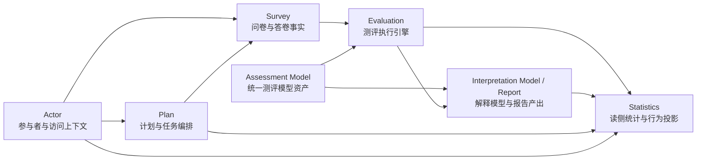

# 业务模块（02）

**本文回答**：`02-业务模块` 如何按当前代码事实阅读 `qs-apiserver` 的业务限界上下文：哪些是核心模块，哪些是支撑模块，业务名称和代码包名如何对应，旧 `scale/personalitymodel` 入口应该如何理解。

本文只做目录级导航和边界定义，不替代各模块深讲，也不重复三进程运行时、事件 outbox、接口契约和部署配置。

---

## 30 秒结论

| 维度 | 结论 |
| ---- | ---- |
| 当前业务模块 | 4 个核心模块：`survey / assessment-model / evaluation / interpretation-model`；3 个支撑模块：`actor / plan / statistics` |
| 代码注册事实 | 以 [`internal/apiserver/container/modules/registry.go`](../../internal/apiserver/container/modules/registry.go) 的 `BusinessPackages` 为准 |
| 代码包名 | 当前注册包是 `survey / assessmentmodel / evaluation / report / actor / plan / statistics` |
| 兼容注册名 | `assessmentmodel` 兼容注册 `scale`、`personalitymodel`；二者不再作为独立核心模块表达 |
| 命名策略 | 文档使用业务语言 `assessment-model`、`interpretation-model`；代码引用处保留 `assessmentmodel`、`report`、`statistics` |
| 核心链路 | `Survey -> Assessment Model -> Evaluation -> Interpretation Model / Report` |
| 支撑链路 | `Actor` 提供参与者与访问上下文，`Plan` 提供计划和任务编排，`Statistics` 提供读侧统计与行为投影 |
| 不在这里展开 | 三进程调用、MQ 消费、outbox relay、IAM 拦截器、Redis runtime、部署端口、完整接口清单 |

一句话概括：**qs-server 的测评业务不是问卷 CRUD，也不是 scale 中心；它由作答事实、模型资产、测评执行、解释报告四层核心链路组成。**

---

## 1. 事实来源与命名映射

当前业务模块注册源是：

```text
internal/apiserver/container/modules/registry.go
```

`BusinessPackages` 明确列出七个业务包：

```text
survey
assessmentmodel
evaluation
report
actor
plan
statistics
```

文档采用下面的业务名称映射：

| 文档业务名称 | 当前代码包名 / 注册名 | 说明 |
| ------------ | --------------------- | ---- |
| `survey` | `survey` | 问卷定义、答卷事实、提交入口 |
| `assessment-model` | `assessmentmodel`，兼容注册 `scale/personalitymodel` | 统一测评模型资产层，旧 Scale 和 Personality Model 归入这一层 |
| `evaluation` | `evaluation` | 一次测评执行、状态机、结果生成 |
| `interpretation-model` | `report` | 解释模型、报告模型、解读适配器、最终 `InterpretReport` 输出；当前代码包仍叫 `report` |
| `actor` | `actor` | 参与者、受试者、访问上下文 |
| `plan` | `plan` | 计划、任务、周期测评编排 |
| `statistics` | `statistics` | 读侧统计、行为投影、指标聚合 |

后续如果代码包重命名，应先更新 `registry.go`、容器装配、测试和接口兼容策略，再同步本文。文档不能先行假装代码已经改名。

---

## 2. 为什么业务模块要单独成组

`qs-server` 的主业务不是简单的“问卷 CRUD”。它要把一次前台作答，稳定转化成可追踪、可解释、可查询的测评结果与报告。这个过程至少涉及四类不同性质的业务事实：

1. **作答事实**：用户填了哪份问卷、哪个版本、每道题的答案是什么。
2. **模型资产事实**：这份问卷绑定了哪个测评模型、模型发布快照和 payload 是什么。
3. **执行事实**：这次作答是否创建测评、测评状态如何、执行结果是什么、失败是否可重试。
4. **解释报告事实**：执行结果如何被聚合成最终解释报告，报告 adapter 和 builder 如何选择。

如果继续把第二类事实叫成独立 `scale` 核心模块，会把医学量表这种具体模型资产误读成平台的唯一模型中心。新的阅读主轴应该是：

```text
Survey
  -> Assessment Model
  -> Evaluation
  -> Interpretation Model / Report
```

---

## 3. 模块地图



这张图只表达业务依赖方向，不表达运行时进程。运行时上，这些模块主要由 `qs-apiserver` 的 `Container` 装配；`collection-server` 通过 gRPC 调用 apiserver，`qs-worker` 消费事件后通过 internal gRPC 回调 apiserver，不各自维护一套完整业务模型。

---

## 4. 七个模块的边界速查

| 模块 | 一句话职责 | 负责 | 不负责 | 深讲入口 |
| ---- | ---------- | ---- | ------ | -------- |
| `survey` | 作答事实层 | `Questionnaire`、`Question`、`QuestionVersion` / 发布状态、`AnswerSheet`、答案校验、答卷提交事件 | 测评模型资产、计分规则权威、解释模型、最终报告、统计聚合、周期任务 | [survey/README.md](./survey/README.md) |
| `assessment-model` | 测评模型资产层 | `AssessmentKind`、`AssessmentModelSnapshot`、Model Binding、Model Payload、Scale / MBTI / BigFive 等模型资产抽象、模型发布与查询 | 用户答卷事实、一次测评执行状态、报告持久化、任务调度 | [assessment-model/README.md](./assessment-model/README.md) |
| `evaluation` | 测评执行层 | `Assessment`、`EvaluationRun`、Evaluation Result、执行状态机、规则加载、模型执行、失败重试、执行事件 | 问卷定义、模型资产维护、最终解释报告模板维护 | [evaluation/README.md](./evaluation/README.md) |
| `interpretation-model` | 解释模型与报告产出层 | `InterpretReport`、Report Builder Registry、score-based adapter、personality adapter、解释文案、报告聚合、报告持久化 | 作答提交、测评执行状态机、模型资产发布、读侧统计 | [interpretation-model/README.md](./interpretation-model/README.md) |
| `actor` | 业务参与者上下文 | `Testee`、Clinician / Operator、访问上下文、业务身份映射 | 替代 IAM 登录认证、承载问卷或测评主流程 | [actor/README.md](./actor/README.md) |
| `plan` | 测评计划与任务编排 | `AssessmentPlan`、`AssessmentTask`、周期测评、任务开放 / 完成 / 过期 / 取消 | 直接评估测评结果、直接生成报告 | [plan/README.md](./plan/README.md) |
| `statistics` | 读侧统计与行为投影 | 机构概览、测评漏斗、行为统计、计划统计、读模型聚合 | 替代业务写模型、直接改变主业务状态 | [statistics/README.md](./statistics/README.md) |

---

## 5. 推荐阅读顺序

### 5.1 第一次读业务模型

第一次阅读建议按核心链路进入：

```text
survey
  -> assessment-model
  -> evaluation
  -> interpretation-model
  -> actor
  -> plan
  -> statistics
```

原因是：

1. 不理解 `survey`，就分不清“问卷结构”和“答卷事实”。
2. 不理解 `assessment-model`，就分不清“题目展示”和“测评模型资产”。
3. 不理解 `evaluation`，就分不清“作答完成”和“测评完成”。
4. 不理解 `interpretation-model`，就分不清“执行结果”和“最终解释报告”。
5. 不理解 `actor`，就容易把 IAM 用户、受试者、监护关系、从业者混成一个概念。
6. 不理解 `plan`，就看不懂周期任务如何衔接答卷提交。
7. 不理解 `statistics`，就容易误以为所有统计都来自实时扫明细表。

### 5.2 按任务进入

| 你要做什么 | 先读哪一组 | 再读什么 |
| ---------- | ---------- | -------- |
| 新增题型或答案校验 | `survey` | [survey/03-测评服务查询与提交链路.md](./survey/03-测评服务查询与提交链路.md)、[survey/05-Survey模块分层架构与事实源索引.md](./survey/05-Survey模块分层架构与事实源索引.md) |
| 修改问卷版本或发布规则 | `survey` | [survey/01-Questionnaire模型-Questionnaire-Question-SubmissionSpec.md](./survey/01-Questionnaire模型-Questionnaire-Question-SubmissionSpec.md) |
| 新增医学量表、人格模型或模型 payload | `assessment-model` | [assessment-model/01-统一测评模型后台配置.md](./assessment-model/01-统一测评模型后台配置.md)、[assessment-model/03-发布快照与执行链路.md](./assessment-model/03-发布快照与执行链路.md) |
| 理解旧 Scale 能力如何归并 | `assessment-model` + `scale` | [assessment-model/README.md](./assessment-model/README.md)、[scale/README.md](./scale/README.md) |
| 修改测评失败、重试或执行事件 | `evaluation` | [evaluation/04-Evaluation失败重试链路--幂等-错误状态-补偿处理.md](./evaluation/04-Evaluation失败重试链路--幂等-错误状态-补偿处理.md)、[evaluation/05-Evaluation事件链路--答卷提交-测评完成-报告生成.md](./evaluation/05-Evaluation事件链路--答卷提交-测评完成-报告生成.md) |
| 修改报告 builder、adapter 或最终 InterpretReport | `interpretation-model` | [interpretation-model/README.md](./interpretation-model/README.md) |
| 修改受试者、从业者或访问关系 | `actor` | [actor/README.md](./actor/README.md) |
| 修改周期任务或任务通知 | `plan` | [plan/README.md](./plan/README.md) |
| 修改统计指标或行为投影 | `statistics` | [statistics/README.md](./statistics/README.md) |

---

## 6. 核心链路分层

### 6.1 Survey：作答事实层

`survey` 的核心不是“展示问卷页面”，而是维护问卷结构和答卷事实。它回答：

- 当前有哪些问卷。
- 问卷有哪些题、题型、选项和校验规则。
- 用户提交了一份怎样的答卷。
- 这份答卷是否已持久化并触发后续测评链路。

Survey 到 `AnswerSheet` 与 `answersheet.submitted` 为止，不维护模型资产，不生成最终报告。

### 6.2 Assessment Model：测评模型资产层

`assessment-model` 负责统一管理医学量表、人格模型等模型资产。它回答：

- 当前支持哪些 `AssessmentKind`。
- 发布态模型快照如何表达。
- 模型如何绑定问卷版本。
- 执行所需 payload 如何冻结和查询。
- Scale / MBTI / BigFive 等具体模型资产如何同级治理。

重点：`scale` 不再是独立核心模块，而是 `assessment-model` 下的一类模型资产或兼容能力。代码上 `scale/personalitymodel` 也只是 `assessmentmodel` 的 legacy register name。

### 6.3 Evaluation：测评执行层

`evaluation` 负责一次测评执行，把 `AnswerSheet` 与 `Assessment Model` 结合，完成一次 `Assessment` 执行并生成结果。它回答：

- 一次测评如何创建。
- 什么情况下从 submitted 进入 completed 或 failed。
- 执行引擎如何加载模型快照和规则上下文。
- 失败如何落库、重试和补偿。
- 执行完成事件如何发布。

Evaluation 不维护问卷定义，不维护模型资产，也不应该吞掉最终报告模型的展示聚合。

### 6.4 Interpretation Model / Report：解释模型与报告产出层

文档中的 `interpretation-model`，对应当前代码中的 `report` module。

它负责把测评执行结果聚合为最终 `InterpretReport`，并维护报告 builder registry、score-based adapter、personality adapter、解释文案和报告持久化。它回答：

- 不同测评模型的结果如何适配为统一报告。
- `InterpretReport` 聚合如何表达。
- 报告 builder 如何注册与选择。
- 报告持久化和读模型如何衔接。

它不负责作答提交，不负责测评执行状态机，不负责模型资产发布，也不替代 statistics 读侧聚合。

---

## 7. 支撑模块分层

### 7.1 Actor：参与者和访问上下文

`actor` 管理受试者、从业者、操作者以及访问关系。它是业务系统理解“谁在参与测评”的本地视图，但它不替代 IAM。

### 7.2 Plan：计划和任务编排

`plan` 管理周期性或计划性测评。它不是评估引擎，而是回答哪些受试者被纳入计划、哪些任务应该在什么时间开放、任务如何完成、过期或取消。

### 7.3 Statistics：读侧统计和行为投影

`statistics` 管理机构概览、接入漏斗、测评服务过程、计划统计等读侧能力。文档层保留 `statistics`，与当前代码包名一致，不改成 `statistic`，避免 README、路径、架构图和搜索割裂。

---

## 8. 目录迁移策略

当前目录已经具备新主轴的基本入口：

```text
docs/02-业务模块/
├── survey/
├── assessment-model/
├── evaluation/
├── interpretation-model/
├── actor/
├── plan/
├── statistics/
└── scale/
```

其中 `scale/` 目录暂时保留为旧能力深讲与兼容入口。它不再是一级核心模块，后续可逐步把仍然有效的内容收口到 `assessment-model` 下的“Scale 与 PersonalityModel 兼容归并”文档，或在目录 README 中保留摘要并回链 `assessment-model`。

本阶段不建议为了文档命名直接重命名代码包：

```text
assessmentmodel -> assessment-model
report -> interpretationmodel
statistics -> statistic
```

这些会牵扯 container registry、route、wire、tests、API 命名和历史兼容。更合理的顺序是：

1. 文档统一业务语言。
2. README 中明确“业务名称 vs 代码包名”映射。
3. 等模块边界稳定后，再决定是否重命名代码包。

---

## 9. 业务模块与运行时的分工

业务模块文档不重复运行时拓扑。三进程协作、gRPC、MQ、shutdown、调度器在哪里启动，应进入 [../01-运行时/](../01-运行时/)。

| 问题 | 应进入哪里 |
| ---- | ---------- |
| 哪个进程负责保存答卷？ | [../00-总览/03-核心业务链路.md](../00-总览/03-核心业务链路.md)、`survey` |
| collection-server 是否有自己的 domain？ | [../01-运行时/02-collection-server运行时.md](../01-运行时/02-collection-server运行时.md) |
| worker 消费哪些 topic？ | [../01-运行时/03-qs-worker运行时.md](../01-运行时/03-qs-worker运行时.md)、[../03-基础设施/event/](../03-基础设施/event/) |
| apiserver 如何装配业务模块？ | [../01-运行时/01-qs-apiserver启动与组合根.md](../01-运行时/01-qs-apiserver启动与组合根.md) |
| gRPC 服务怎么注册？ | [../01-运行时/04-进程间调用与gRPC.md](../01-运行时/04-进程间调用与gRPC.md) |
| IAM 身份如何进入业务上下文？ | [../01-运行时/05-IAM认证与身份链路.md](../01-运行时/05-IAM认证与身份链路.md)、[../03-基础设施/security/](../03-基础设施/security/) |

业务模块只在必要处摘要运行时事实，并回链运行时文档。

---

## 10. 业务模块与基础设施的分工

业务模块文档解释“为什么需要这个业务对象”和“这个业务对象如何变化”。基础设施文档解释“事件、存储、缓存、安全、限流如何实现”。

| 横切机制 | 业务模块只写什么 | 机制细节去哪里 |
| -------- | ---------------- | -------------- |
| 事件 | 哪个业务动作产生哪个领域事件 | [../03-基础设施/event/](../03-基础设施/event/) |
| Outbox | 哪个模块需要可靠出站 | [../03-基础设施/event/02-Publish与Outbox.md](../03-基础设施/event/02-Publish与Outbox.md)、[../03-基础设施/data-access/](../03-基础设施/data-access/) |
| MySQL / Mongo | 聚合或读模型为什么落在这里 | [../03-基础设施/data-access/](../03-基础设施/data-access/) |
| Cache / Lock | 模块使用哪些缓存或锁 | [../03-基础设施/cache/](../03-基础设施/cache/README.md)、[../03-基础设施/concurrency/](../03-基础设施/concurrency/README.md) |
| RateLimit / Backpressure | 哪条业务链路需要保护 | [../03-基础设施/concurrency/](../03-基础设施/concurrency/README.md) |
| IAM / AuthzSnapshot | 模块依赖什么身份或能力判断 | [../03-基础设施/security/](../03-基础设施/security/) |
| WeChat / OSS / Notification | 业务用例需要什么外部能力 | [../03-基础设施/integrations/](../03-基础设施/integrations/) |

---

## 11. 维护原则

### 11.1 先核对代码，再改文档

业务模块文档不能替代代码。领域行为变更后，再更新文档；如果文档描述和源码冲突，以源码、机器契约和配置为准。

### 11.2 一个事实只在一个地方讲透

例如：

- 端到端答卷到报告链路：在 [../00-总览/03-核心业务链路.md](../00-总览/03-核心业务链路.md) 讲透。
- worker 消费和 Ack/Nack：在 [../01-运行时/03-qs-worker运行时.md](../01-运行时/03-qs-worker运行时.md) 和 event 基础设施讲透。
- 模块内对象和状态机：在模块深讲内讲透。

其它地方只摘要和回链。

### 11.3 状态标签必须明确

涉及能力成熟度时，使用统一标签：

| 标签 | 含义 |
| ---- | ---- |
| `已实现` | 源码、配置或契约能证明 |
| `待补证据` | 有方向或边界，但证据不足 |
| `规划改造` | 当前不是事实，只是后续方案 |
| `历史资料` | 仅存在于旧文或 archive |

不要把“规划改造”写成“当前能力”。

---

## 12. 代码与契约锚点

| 类型 | 锚点 |
| ---- | ---- |
| 业务模块注册 | [`internal/apiserver/container/modules/registry.go`](../../internal/apiserver/container/modules/registry.go) |
| 模块装配 | [`internal/apiserver/container/modules/`](../../internal/apiserver/container/modules/) |
| apiserver 容器 | [`internal/apiserver/container/`](../../internal/apiserver/container/) |
| 领域层 | [`internal/apiserver/domain/`](../../internal/apiserver/domain/) |
| 应用层 | [`internal/apiserver/application/`](../../internal/apiserver/application/) |
| 基础设施层 | [`internal/apiserver/infra/`](../../internal/apiserver/infra/) |
| REST 契约 | [`api/rest/apiserver.yaml`](../../api/rest/apiserver.yaml)、[`api/rest/collection.yaml`](../../api/rest/collection.yaml) |
| gRPC proto | [`api/grpc/gen/`](../../api/grpc/gen/) |
| 事件契约 | [`configs/events.yaml`](../../configs/events.yaml) |
| 运行时组合根 | [`internal/apiserver/process/`](../../internal/apiserver/process/) |

---

## 13. Verify

业务模块文档变更后，至少执行：

```bash
make docs-hygiene
git diff --check
```

如果变更涉及业务代码，按模块补充测试，例如：

```bash
go test ./internal/apiserver/domain/...
go test ./internal/apiserver/application/...
go test ./internal/apiserver/container/...
```

如果变更涉及 REST、gRPC 或事件契约，再核对：

```bash
make docs-verify
```

---

## 14. 下一跳

| 阅读目标 | 下一篇 |
| -------- | ------ |
| 看问卷和答卷模型 | [survey/README.md](./survey/README.md) |
| 看测评模型资产 | [assessment-model/README.md](./assessment-model/README.md) |
| 看旧 Scale 兼容入口 | [scale/README.md](./scale/README.md) |
| 看测评状态机和执行引擎 | [evaluation/README.md](./evaluation/README.md) |
| 看解释模型与报告产出 | [interpretation-model/README.md](./interpretation-model/README.md) |
| 看受试者与关系 | [actor/README.md](./actor/README.md) |
| 看计划与任务 | [plan/README.md](./plan/README.md) |
| 看统计读模型 | [statistics/README.md](./statistics/README.md) |
| 看端到端主链路 | [../00-总览/03-核心业务链路.md](../00-总览/03-核心业务链路.md) |
| 看三进程运行时 | [../01-运行时/README.md](../01-运行时/README.md) |
| 看事件和 outbox | [../03-基础设施/event/README.md](../03-基础设施/event/README.md) |
