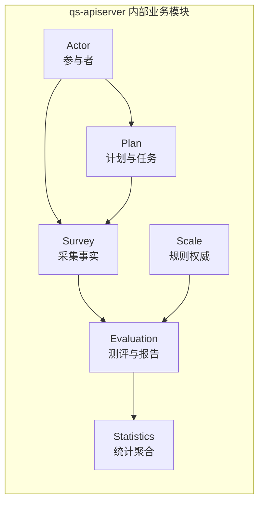

# 业务模块（02）

**本文回答**：`02-业务模块` 这一组文档负责把 `qs-apiserver` 内六个限界上下文的静态设计讲清楚：每个模块负责什么、不负责什么、核心对象与服务怎么组织、以及关键设计该去哪里继续下钻。

## 30 秒结论

如果只看一屏，先记住下面这张表：

| 维度 | 结论 |
| ---- | ---- |
| 本组作用 | 先按 **限界上下文** 看清模块静态设计，不在这里重复运行时拓扑和跨进程时序 |
| 模块分工 | `survey / scale / evaluation` 是主业务三界；`actor / plan / statistics` 是参与者、任务编排和读侧聚合补充 |
| 最顺读法 | 先读 `survey -> scale -> evaluation` 建立“采集 -> 规则 -> 产出”主轴，再按需要读 `actor / plan / statistics` |
| 真值边界 | 模块深讲目录优先回答“对象、服务、边界、状态机、模块内关键设计”；跨进程链路去 [01-运行时](../01-运行时/)、跨模块判断去 [05-专题分析](../05-专题分析/) |
| 证据来源 | 以 `internal/apiserver/domain`、`application`、`assembler`、`api/rest`、`proto`、`configs/events.yaml` 为准 |

## 重点速查

1. **这组先讲静态设计**：模块边界、对象关系、应用服务分层、模块内关键机制放在这里讲清。  
2. **不要把专题当模块文**：跨模块主链路、异步评估、保护层与读侧，优先去 [05-专题分析](../05-专题分析/)。  
3. **模块都跑在 `qs-apiserver` 内**：这里讲的是同一进程内的限界上下文，不是六个独立微服务。  
4. **模块文要配图，但图要放在第一次解释那个问题的地方**：边界先给边界表，模型第一次出现时给 ER/关系图，核心设计第一次展开时给时序或流程图。  

## 为什么这一组要单独存在

`qs-server` 的很多“为什么这么设计”，都建立在静态边界先被读清楚的前提上。读者如果先跳进异步链路和事件系统，很容易把以下几件事混在一起：

- `survey` 的“采集事实”与 `evaluation` 的“测评产出”
- `scale` 的“规则权威源”与 `survey` 的“问卷展示结构”
- `plan / actor / statistics` 这些补充域与主业务三界的依赖方向

所以这一组文档的职责很明确：**先把模块是什么讲清楚，再让读者去看它们怎么协作。**

## 模块地图与推荐阅读顺序

先看下面这张模块关系图，再决定往哪一篇下钻。

| 顺序 | 文档 | 模块 | 先回答什么问题 |
| ---- | ---- | ---- | -------------- |
| 1 | [survey/README.md](./survey/README.md) | Survey | 问卷和答卷事实怎么建模、提交后发布什么事件 |
| 2 | [scale/README.md](./scale/README.md) | Scale | 量表、因子、计分与解读规则为什么独立成界 |
| 3 | [evaluation/README.md](./evaluation/README.md) | Evaluation | 测评、引擎、报告、`assessment.*` / `report.*` 在哪里推进 |
| 4 | [actor/README.md](./actor/README.md) | Actor | 参与者相关能力如何作为业务主链的外部条件存在 |
| 5 | [plan/README.md](./plan/README.md) | Plan | 计划、任务和定时编排怎样衔接主链 |
| 6 | [statistics/README.md](./statistics/README.md) | Statistics | 统计为何单独成读侧模块、如何和异步链配合 |

## 深讲目录与兼容入口

现行 truth layer 以子目录深讲为主，原来的单篇模块文保留为兼容入口和历史连续阅读材料。

| 模块 | 深讲入口 | 兼容入口 | 维护重点 |
| ---- | -------- | -------- | -------- |
| Survey | [survey/README.md](./survey/README.md) | [01-survey.md](./01-survey.md) | Questionnaire 版本、AnswerSheet 提交、题型校验、durable submit |
| Scale | [scale/README.md](./scale/README.md) | [02-scale.md](./02-scale.md) | MedicalScale、Factor、计分策略、解读规则 |
| Evaluation | [evaluation/README.md](./evaluation/README.md) | [03-evaluation.md](./03-evaluation.md) | Assessment 状态机、engine pipeline、report、outbox |
| Plan | [plan/README.md](./plan/README.md) | [04-plan.md](./04-plan.md) | Plan/Task 状态机、scheduler、通知事件 |
| Actor | [actor/README.md](./actor/README.md) | [05-actor.md](./05-actor.md) | Testee、Clinician、Operator、IAM 边界 |
| Statistics | [statistics/README.md](./statistics/README.md) | [06-statistics.md](./06-statistics.md) | 查询读模型、同步调度、query cache、behavior projection |

## 与其他层如何分工

| 方向 | 本组看什么 | 该去哪里继续下钻 |
| ---- | ---------- | ---------------- |
| 总览与主链路 | 模块在全局骨架里的位置 | [00-总览/03-核心业务链路.md](../00-总览/03-核心业务链路.md)、[00-总览/01-系统地图.md](../00-总览/01-系统地图.md) |
| 运行时 | 模块在哪个进程、谁调谁 | [01-运行时](../01-运行时/) |
| 事件与契约 | 模块使用哪些事件、REST、gRPC | [configs/events.yaml](../../configs/events.yaml)、[03-基础设施/01-事件系统.md](../03-基础设施/01-事件系统.md)、[04-接口与运维](../04-接口与运维/) |
| 跨模块判断 | 为什么拆界、为什么异步、为什么要保护层 | [05-专题分析](../05-专题分析/) |
| 装配入口 | 模块如何被装配进 `qs-apiserver` | [internal/apiserver/container/](../../internal/apiserver/container/)、各 [assembler/](../../internal/apiserver/container/assembler/) |

## 读这一组时先抓什么

- **先抓边界，再抓对象**：先看“负责 / 不负责”，再看聚合、实体和值对象。  
- **先抓模型，再抓链路**：模块文里的链路只解释模块内关键设计；端到端链路去专题。  
- **先抓一张主图，再抓代码索引**：每篇都应能让读者先建立心智模型，再回到锚点和实现文件。  

维护模块文档时，仍以**源码与上述契约为准**；变更领域行为后应同步核对本篇与 `events.yaml` / OpenAPI / proto。写法细则见 [CONTRIBUTING-DOCS.md](../CONTRIBUTING-DOCS.md)。
