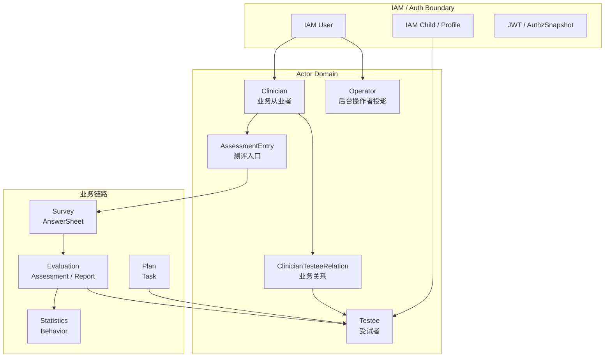
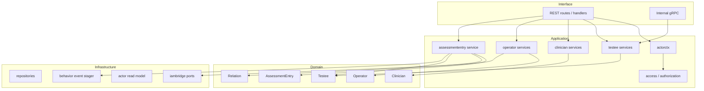

# Actor 整体模型

**本文回答**：Actor 模块为什么不是 IAM 用户模块，也不是 Evaluation 的附属表；`Testee / Clinician / Operator / Relation / AssessmentEntry` 分别是什么业务对象；Actor 如何承接“业务里的人是谁、谁能服务谁、谁能进入测评链路、报告后如何回写标签”等问题。

---

## 30 秒结论

| 维度 | 结论 |
| ---- | ---- |
| 模块定位 | Actor 是 qs-server 的**业务参与者域**，维护受试者、从业者、后台操作者投影、业务关系、测评入口和标签 |
| 不是 IAM | IAM 负责账号、认证、组织、token、授权快照；Actor 负责业务身份和业务关系 |
| 核心对象 | `Testee`、`Clinician`、`Operator`、`ClinicianTesteeRelation`、`AssessmentEntry` |
| 关键边界 | Actor 可以引用 IAM user/child/profile，但不保存密码、token、登录态或完整 IAM 主数据 |
| 下游协作 | Evaluation 报告可通过 internal gRPC 回写 Testee 标签；Plan / Evaluation 引用 Testee、Clinician 与入口 |
| 写入原则 | worker 不直接写 Actor repository，跨进程回写应回到 apiserver 应用服务 |
| 权限原则 | 权限和身份归一化在应用层/边界层完成，领域聚合不读取 JWT |

一句话概括：

> **IAM 解决“谁登录了、有什么授权”，Actor 解决“这个人在测评业务里是谁、和谁有关、如何进入测评链路”。**

---

## 1. Actor 要解决什么问题

在问卷量表系统里，“人”不是一个单一概念：

| 概念 | 关注点 | 不应混淆为 |
| ---- | ------ | ---------- |
| IAM User | 登录账号、认证凭证、组织身份、授权快照 | 受试者业务档案 |
| Testee | 被测评的人，长期业务对象 | 登录账号 |
| Clinician | 医生、咨询师、训练师等从业者业务身份 | 后台 RBAC 角色 |
| Operator | 后台操作者投影，承接本 BC 的角色、状态和审计语义 | IAM User 全量副本 |
| Relation | 医生/从业者与受试者的业务关系 | 简单外键 |
| AssessmentEntry | 测评入口，连接从业者、受试者、问卷/量表和接入行为 | Assessment 结果本身 |

如果把这些都叫“用户”，模型会迅速失控：孩子可能没有登录账号，家长可能代填，医生能服务多个受试者，运营人员有后台权限但不一定是医生，报告后可能要给受试者打高风险标签。Actor 模块就是为了把这些业务身份拆开。

---

## 2. 总体模型图



---

## 3. Actor 模块内部分层



应用层承担防腐和编排：它可以调用 IAM bridge、事务、读模型、行为事件和 repository。领域层只表达业务身份、关系和入口不变量。

---

## 4. 核心对象速查

| 对象 | 类型 | 负责 |
| ---- | ---- | ---- |
| `Testee` | 聚合根 | 受试者业务身份、基础档案、Profile 绑定、标签、重点关注、统计快照 |
| `Clinician` | 聚合根/业务实体 | 医生/咨询师/训练师等机构内从业者，支持绑定 Operator |
| `Operator` | 聚合根/投影 | IAM.User 在本 BC 的业务视图投影，保存 roles、active、name/email/phone 缓存 |
| `ClinicianTesteeRelation` | 关系模型 | 从业者和受试者的业务关系，例如 creator、attending |
| `AssessmentEntry` | 聚合根 | 测评入口，包含 clinician、token、target type/code/version、active、expiresAt |
| `actorctx` | 应用上下文 | 把 IAM 当前操作者 user_id 转成业务操作上下文，例如 GrantAssignment 的 granted_by |

---

## 5. 与 IAM 的边界

Actor 不替代 IAM。源码里 `Operator` 的注释很明确：Operator 是 IAM.User 在本 BC 的业务视图投影，不是完整用户实体；不保存 IAM 的认证信息，只通过 `iamUserID/userID` 关联。

| IAM | Actor |
| --- | ----- |
| 登录账号 | Operator / Clinician / Testee 业务身份 |
| JWT / token | actorctx / middleware 归一化 |
| AuthzSnapshot | 应用层 access/authz 使用 |
| IAM.User | Operator 投影引用 |
| IAM.Child/Profile | Testee profileID 绑定 |
| Grant/Revoke role | OperatorAuthorizationService 通过 iambridge 调用 |
| 密码、token、登录状态 | 不进入 Actor 聚合 |

### 5.1 Operator 与 IAM

`Operator` 持有：

```text
orgID
userID
roles
name/email/phone cache
isActive
```

其中 roles 在 IAM 启用时可以作为授权快照的本地投影；IAM 未启用时也可由本 BC 维护。它不是完整 IAM.User 副本。

### 5.2 actorctx

`actorctx` 当前用于把请求上下文中的操作者 IAM user_id 转成业务上下文，例如：

```text
WithGrantingUserID(ctx, iamUserID)
IAMGrantedBySubject(ctx) -> user:<id>
```

这类信息用于应用服务调用 IAM GrantAssignment，不应该进入领域聚合。

---

## 6. 与其它模块的协作

| 模块 | 协作方式 | Actor 边界 |
| ---- | -------- | ---------- |
| Survey | AssessmentEntry 引导用户进入问卷/量表作答 | Actor 不保存 AnswerSheet |
| Scale | Entry target 可以指向 scale | Actor 不定义量表规则 |
| Evaluation | Report 生成后可回写 Testee 标签/重点关注 | Actor 不保存 Assessment 状态 |
| Plan | Plan/Task 引用 Testee、Clinician | Actor 不维护计划周期规则 |
| Statistics | Actor entry/intake 行为进入行为投影 | Actor 不维护统计看板 |
| IAM | 提供身份、组织、授权 | Actor 只做业务投影和防腐 |

---

## 7. 三条主链路

### 7.1 受试者建档与标签链路

```text
Profile / manual input
  -> Testee factory / service
  -> Testee aggregate
  -> tags / key focus
  -> Evaluation report callback may update tags
```

### 7.2 从业者与关系链路

```text
IAM User / Operator
  -> Clinician
  -> ClinicianTesteeRelation
  -> 可见/服务某个 Testee
```

### 7.3 测评入口链路

```text
Clinician creates AssessmentEntry
  -> token
  -> Resolve(token)
  -> Intake(profile/testee)
  -> ensure relation
  -> stage behavior events
  -> enter Survey/Evaluation chain
```

---

## 8. 设计模式

| 模式 | 当前落点 | 意图 |
| ---- | -------- | ---- |
| Anti-corruption Layer | `actorctx`、`iambridge` | 隔离 IAM 模型和 Actor 领域模型 |
| Projection | `Operator` | 保存 IAM.User 在本 BC 的业务投影 |
| Aggregate Root | `Testee`、`AssessmentEntry` | 收口受试者和入口状态 |
| Relationship Model | `ClinicianTesteeRelation` | 把服务关系建模成业务事实 |
| Application Service | testee/clinician/operator/assessmententry services | 编排事务、权限、IAM、事件 |
| Guard / Access | access service | 统一判断业务访问范围 |
| Event Staging | behavior events in entry intake | 行为足迹进入 Statistics 投影 |

---

## 9. 设计取舍

| 设计 | 收益 | 代价 |
| ---- | ---- | ---- |
| Actor 独立于 IAM | 业务身份稳定，不被认证系统污染 | 需要 actorctx/iambridge 转换 |
| Operator 做投影 | 本 BC 查询和授权更快 | 需要与 IAM snapshot 同步 |
| Testee 不等于 IAM user | 支持儿童、代填、临时受试者 | 身份关联更复杂 |
| Relation 独立建模 | 医生-受试者可见范围清楚 | 需要维护关系生命周期 |
| worker 不直写 Actor | 写模型权威回到 apiserver | 多一次 internal gRPC |
| AssessmentEntry 独立建模 | 接入行为可追踪、可治理 | 入口不是 Assessment，需要跨模块协作 |

---

## 10. 常见误区

### 10.1 “Actor 就是 User”

错误。User 是 IAM 的认证主体，Actor 是业务参与者集合。

### 10.2 “Testee 一定有登录账号”

错误。受试者可能是儿童、代填对象或临时档案。

### 10.3 “Clinician 就是 Operator”

不一定。Clinician 是业务从业者，Operator 是后台操作者投影。Clinician 可以绑定 Operator，但不等同。

### 10.4 “AssessmentEntry 是 Assessment”

错误。AssessmentEntry 是进入测评的入口，Assessment 是一次测评行为状态聚合。

### 10.5 “报告回写标签可以由 worker 直接改库”

不建议。应通过 apiserver internal gRPC / application service，保证领域规则、权限和写模型统一。

---

## 11. 代码锚点

- Testee domain：[../../../internal/apiserver/domain/actor/testee/](../../../internal/apiserver/domain/actor/testee/)
- Clinician domain：[../../../internal/apiserver/domain/actor/clinician/](../../../internal/apiserver/domain/actor/clinician/)
- Operator domain：[../../../internal/apiserver/domain/actor/operator/](../../../internal/apiserver/domain/actor/operator/)
- Relation domain：[../../../internal/apiserver/domain/actor/relation/](../../../internal/apiserver/domain/actor/relation/)
- AssessmentEntry domain：[../../../internal/apiserver/domain/actor/assessmententry/](../../../internal/apiserver/domain/actor/assessmententry/)
- Actor application：[../../../internal/apiserver/application/actor/](../../../internal/apiserver/application/actor/)
- actorctx：[../../../internal/apiserver/application/actor/actorctx/context.go](../../../internal/apiserver/application/actor/actorctx/context.go)

---

## 12. Verify

```bash
go test ./internal/apiserver/domain/actor/...
go test ./internal/apiserver/application/actor/...
```

如果修改 IAM / Authz 边界：

```bash
go test ./internal/apiserver/transport/rest/middleware
go test ./internal/apiserver/transport/grpc
```

---

## 13. 下一跳

- Testee 与标签：[01-Testee与标签.md](./01-Testee与标签.md)
- Clinician 与 Operator：[02-Clinician与Operator.md](./02-Clinician与Operator.md)
- AssessmentEntry 与 IAM 边界：[03-AssessmentEntry与IAM边界.md](./03-AssessmentEntry与IAM边界.md)
- 新增 Actor 能力 SOP：[04-新增Actor能力SOP.md](./04-新增Actor能力SOP.md)
