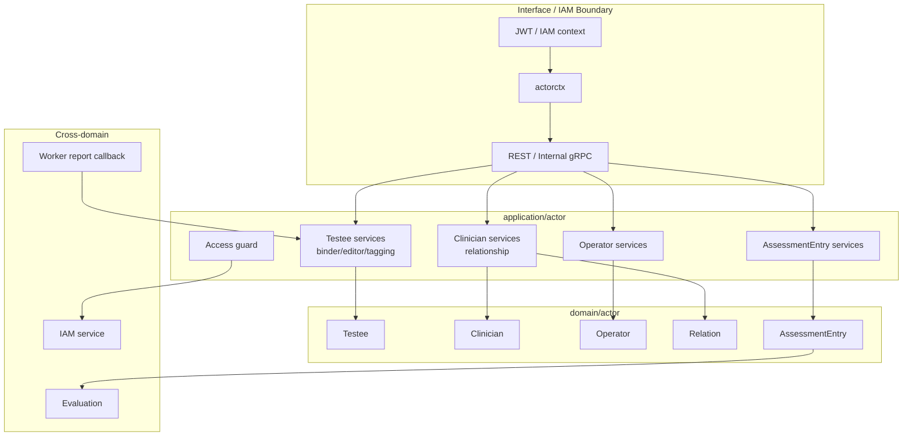
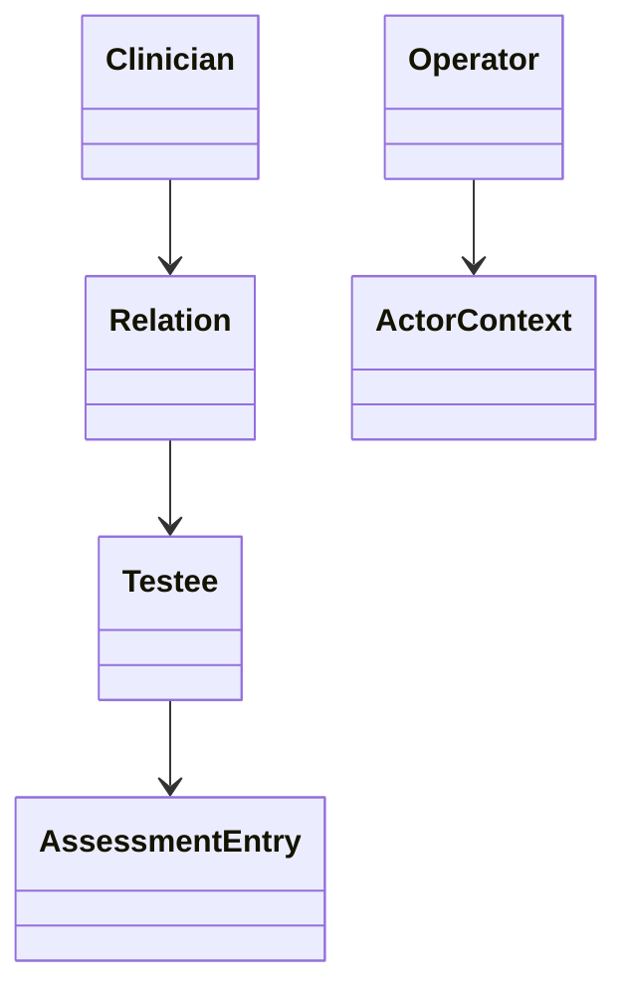

# Actor 整体模型

**本文回答**：Actor 模块为什么不是一个“用户模块”，它在业务域中真正维护哪些对象。

## 30 秒结论

| 概念 | 说明 |
| ---- | ---- |
| `Testee` | 受试者业务对象 |
| `Clinician` | 医生/执行者业务对象 |
| `Operator` | 后台操作者投影与权限相关上下文 |
| `AssessmentEntry` | 测评入口，连接 actor 与 evaluation |

Actor 要解决的是“业务里的人是谁、他们之间是什么关系、他们如何进入测评链路”的问题。IAM 解决登录、组织、账号和 token；Actor 解决业务身份、医生受试者关系、测评入口和标签。

## 模块要解决什么问题

在医疗/心理测评系统里，“用户”不是一个单一概念：

| 概念 | 关注点 | 不应混淆为 |
| ---- | ------ | ---------- |
| IAM user | 登录账号、组织、认证上下文 | 受试者业务档案 |
| Testee | 被测评的人、标签、重点关注 | 登录账号 |
| Clinician | 医生或执行者业务身份 | 后台权限角色 |
| Operator | 后台操作者投影和管理上下文 | 医生-受试者业务关系 |
| AssessmentEntry | 进入某次测评的业务入口 | Assessment 结果本身 |

Actor 模块的核心价值是把这些身份分清楚。它不是 IAM 的替代品，也不是 Evaluation 的附属表。

## 架构设计



应用层承担 IAM 防腐、权限守卫、跨模块调用和事务编排；领域层只表达业务身份、关系和入口。

## 领域模型设计



| 模型 | 类型 | 职责 |
| ---- | ---- | ---- |
| `Testee` | 聚合 / 业务实体 | 受试者档案、业务标签、重点关注 |
| `Clinician` | 业务实体 | 医生/执行者业务身份 |
| `Operator` | 投影 / 管理实体 | 后台操作者在业务系统内的上下文 |
| `Relation` | 关系模型 | 医生与受试者之间的业务关系 |
| `AssessmentEntry` | 入口模型 | 连接 Actor、Survey/Evaluation 的测评入口 |
| `actorctx` | 应用层上下文 | 将 IAM 身份压缩为业务可用上下文 |

## 设计模式应用

| 模式 | 位置 | 作用 |
| ---- | ---- | ---- |
| 防腐层 | `actorctx`、IAM access service | 不让 IAM 模型污染业务聚合 |
| 角色守卫 | `application/actor/access` | 在应用层判断操作者能否访问某个业务对象 |
| 关系模型 | `domain/actor/relation` | 把医生-受试者关系建模为业务对象，而不是散落查询条件 |
| 应用服务 | testee/clinician/operator/assessmententry services | 编排 repository、权限、跨模块调用 |
| 领域服务 | binder/editor/tagger/validator 等 | 把复杂业务规则从 controller 中移出 |

## 为什么这样设计

如果把 Actor 简化成“用户表”，系统会把 IAM 账号、受试者档案、医生关系和后台权限揉在一起。这样短期开发快，但一旦出现“家属代填”“医生管理多个受试者”“worker 根据报告回写标签”等场景，模型会迅速失控。

当前设计把 IAM 作为外部身份源，把 Actor 作为业务身份域。这样做的代价是接口层需要 `actorctx` 和 access guard 转换，但收益是业务模型不被认证系统牵着走。

## 取舍与边界

| 边界 | 当前选择 |
| ---- | -------- |
| 不替代 IAM | Actor 不保存认证密码、token 或登录状态 |
| 不拥有 Evaluation | `AssessmentEntry` 是入口，不是评估结果 |
| 标签可被回写 | worker 可通过 internal gRPC 回写高风险标签 |
| 权限在应用层 | 领域实体不直接调用 IAM 或读取 JWT |

## 代码锚点

- Actor domain：[domain/actor](../../../internal/apiserver/domain/actor/)
- Actor application：[application/actor](../../../internal/apiserver/application/actor/)
- Actor routes：[routes_actor.go](../../../internal/apiserver/transport/rest/routes_actor.go)

## Verify

```bash
go test ./internal/apiserver/domain/actor/... ./internal/apiserver/application/actor/...
```
