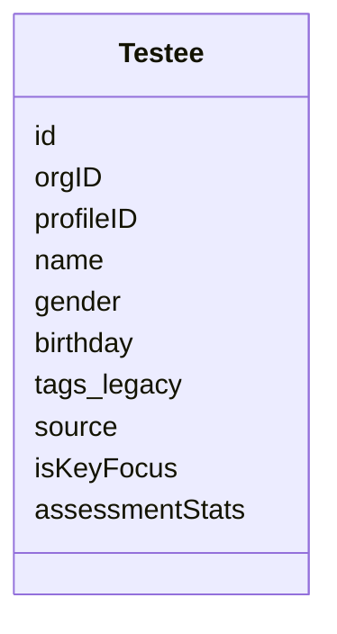
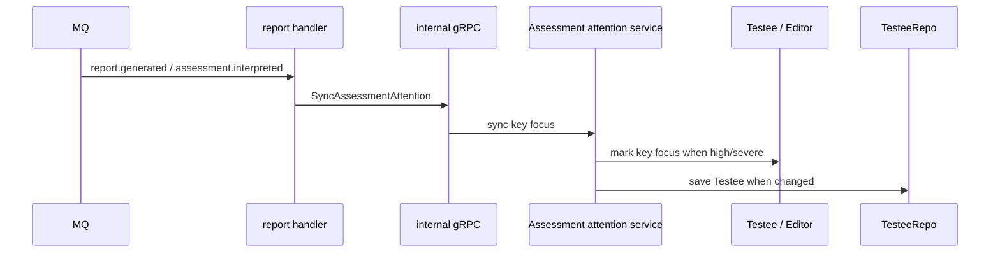

# Testee 与重点关注

**本文回答**：`Testee` 在 Actor 模块中代表什么，为什么它不是 IAM User；重点关注、Profile 绑定和测评统计快照如何协作；Evaluation 报告下游如何安全同步受试者关注状态。

---

## 30 秒结论

| 维度 | 结论 |
| ---- | ---- |
| 模块定位 | `Testee` 是“被测评的人”在 qs-server 中的业务聚合根 |
| 不等于 IAM User | Testee 可以没有登录账号，也可以绑定 IAM Child/Profile |
| 核心字段 | orgID、profileID、name、gender、birthday、source、isKeyFocus、assessmentStats |
| tags 定位 | `testee.tags` 仅作为数据库历史兼容字段保留，当前产品不展示、不筛选、不作为队列事实 |
| 重点关注 | `isKeyFocus` 是长期关注属性，可由人工或报告回写触发 |
| 统计快照 | `assessmentStats` 是读模型优化快照，不应直接作为主事实修改 |
| 回写原则 | worker/report 下游不直接写库，应回到 apiserver application service |

一句话概括：

> **Testee 保存“这个被测评对象是谁、是否需要长期关注”，而不是保存“这一次测评结果是什么”。**

---

## 1. Testee 的业务定位

`Testee` 的源码注释明确说明：它表示“被测评的人”在问卷&量表 BC 内的领域视图，是统计和趋势分析的核心主体。

它不同于：

| 概念 | 差异 |
| ---- | ---- |
| IAM User | IAM User 是登录账号；Testee 是受试者业务档案 |
| IAM Child/Profile | Profile 是身份/档案来源；Testee 是 QS 业务视图 |
| AnswerSheet | AnswerSheet 是一次作答事实；Testee 是长期主体 |
| Assessment | Assessment 是一次测评行为；Testee 可关联多次测评 |
| Report | Report 是一次测评报告；Testee 可被报告结果影响重点关注状态 |

---

## 2. Testee 聚合字段



| 字段 | 说明 |
| ---- | ---- |
| `id` | 受试者 ID |
| `orgID` | 所属机构 |
| `profileID` | 可选，当前对应 IAM.Child.ID，未来可抽象为 Profile |
| `name` | 姓名，可脱敏显示 |
| `gender` | 性别 |
| `birthday` | 出生日期 |
| `tags` | 历史兼容字段，当前不作为产品展示、筛选或队列事实 |
| `source` | 数据来源 |
| `isKeyFocus` | 是否重点关注 |
| `assessmentStats` | 测评统计快照，只读优化 |

### 2.1 profileID 的边界

`profileID` 是可选字段。这意味着 Testee 可以有三种情况：

| 情况 | 说明 |
| ---- | ---- |
| 绑定 IAM Child/Profile | 来自家长或 IAM 档案 |
| 未绑定 profile | 临时受试者或线下录入 |
| 未来通用 Profile | 可能从 IAM.Child 演进为更通用 profile-system |

领域模型不应该假设每个 Testee 都能登录。

---

## 3. 历史 tags 字段

`Testee` 数据表仍保留 `tags` JSON 字段，领域对象只保留持久化恢复与回写能力，目的是兼容历史数据和旧部署。当前产品入口不再使用该字段：

| 产品面 | 当前行为 |
| ------ | -------- |
| 受试者详情 / 列表 | 不返回 `tags` / `tags_label` |
| 受试者列表筛选 | 不支持 tag 筛选 |
| 工作台队列 | 不读取 tag |
| 测评后置同步 | 只同步重点关注状态 |

### 3.1 tags 不等于风险结果

| 内容 | 所属 |
| ---- | ---- |
| `RiskLevel` | EvaluationResult / Report，是高风险队列事实来源 |
| 高风险因子 | Evaluation factor score |
| 重点关注 | Testee 长期关注属性，是重点关注队列事实来源 |

报告结果不回写 Testee tags；tags 不是报告、风险或工作台队列事实。

---

## 4. 重点关注

`isKeyFocus` 表示受试者是否为重点关注对象。

可能来源：

| 来源 | 示例 |
| ---- | ---- |
| 人工标记 | 医生/运营标记重点关注 |
| 高风险报告回写 | severe/high 风险后自动标记 |
| 计划规则 | 某类长期计划纳入重点关注 |
| 运营策略 | VIP、复诊、随访对象 |

注意：是否重点关注是 Actor 长期属性，不是单次 Assessment 的状态。

---

## 5. 测评统计快照

`assessmentStats` 是 Testee 内的只读统计快照。源码注释说明：这些快照数据通过领域事件异步更新，不应直接修改。

它适合用于：

- 是否有测评历史。
- 最近测评概览。
- 趋势分析入口。
- 受试者列表展示优化。

但不适合作为：

- Assessment 主事实。
- Report 主事实。
- 统计报表的唯一来源。

---

## 6. 报告后置关注同步链路



关键边界：

| 边界 | 说明 |
| ---- | ---- |
| worker 不直接写 Testee repository | 保证写模型回到 apiserver |
| internal gRPC 是跨进程防腐边界 | worker 不依赖 domain/testee |
| 关注同步由应用服务执行 | 保留校验、事务和日志 |
| Report 不成为 Testee 字段 | 只允许按规则标记重点关注 |

---

## 7. Testee 创建来源

常见来源：

| 来源 | 说明 |
| ---- | ---- |
| 手动录入 | 后台或业务人员创建 |
| IAM profile 绑定 | 基于 IAM Child/Profile 创建或关联 |
| AssessmentEntry intake | 通过测评入口提交信息时临时或绑定创建 |
| 计划任务 | Plan 需要关联受试者 |
| 外部导入 | 批量导入受试者档案 |

在 AssessmentEntry intake 中，如果没有 ProfileID，可以创建 temporary Testee；如果有 ProfileID，则通过 `GetOrCreateByProfile` 找到或创建 Testee。

---

## 8. 设计模式

| 模式 | 当前落点 | 意图 |
| ---- | -------- | ---- |
| Aggregate Root | `Testee` | 收口受试者长期属性 |
| Encapsulation | 聚合方法保护内部状态 | 避免外部直接修改内部状态 |
| Domain Service | Binder/Validator | 绑定、校验不塞满实体 |
| Application Service | testee services | 编排 repository、IAM profile、internal gRPC |
| Projection / Snapshot | `assessmentStats` | 列表/趋势读取优化 |
| Anti-corruption | internal gRPC / iambridge | 隔离 worker/IAM 与 Testee domain |

---

## 9. 设计取舍

| 设计 | 收益 | 代价 |
| ---- | ---- | ---- |
| Testee 不等于 IAM User | 支持儿童、代填、临时对象 | 需要 profile 绑定和身份映射 |
| 保留 `testee.tags` 字段 | 兼容历史数据 | 当前产品不展示、不筛选，后续可择机迁移清理 |
| stats 作为快照 | 列表性能好 | 异步一致性，需要投影修复 |
| worker 通过 gRPC 回写 | 写模型统一 | 多一次调用 |

---

## 10. 常见误区

### 10.1 “每个 Testee 都应该有 IAM user”

错误。受试者可能没有账号，尤其是儿童、线下录入或代填对象。

### 10.2 “高风险就是 Assessment 状态”

错误。高风险是 Evaluation 产出，重点关注是 Testee 长期关注属性，二者不能混同。

### 10.3 “assessmentStats 可以直接手动改”

不应直接改。它是异步投影或读模型快照，应通过事件/投影链路维护。

### 10.4 “worker 可以直接写 Testee 表”

不建议。应通过 internal gRPC 回到 apiserver 应用层。

---

## 11. 代码锚点

- Testee 聚合：[../../../internal/apiserver/domain/actor/testee/testee.go](../../../internal/apiserver/domain/actor/testee/testee.go)
- Testee types：[../../../internal/apiserver/domain/actor/testee/types.go](../../../internal/apiserver/domain/actor/testee/types.go)
- Testee application：[../../../internal/apiserver/application/actor/testee/](../../../internal/apiserver/application/actor/testee/)
- Internal gRPC：[../../../internal/apiserver/transport/grpc/service/internal.go](../../../internal/apiserver/transport/grpc/service/internal.go)
- Worker report handler：[../../../internal/worker/handlers/report_handler.go](../../../internal/worker/handlers/report_handler.go)

---

## 12. Verify

```bash
go test ./internal/apiserver/domain/actor/testee
go test ./internal/apiserver/application/actor/testee
go test ./internal/worker/handlers
```

---

## 13. 下一跳

- Clinician 与 Operator：[02-Clinician与Operator.md](./02-Clinician与Operator.md)
- AssessmentEntry 与 IAM 边界：[03-AssessmentEntry与IAM边界.md](./03-AssessmentEntry与IAM边界.md)
- 新增 Actor 能力 SOP：[04-新增Actor能力SOP.md](./04-新增Actor能力SOP.md)
