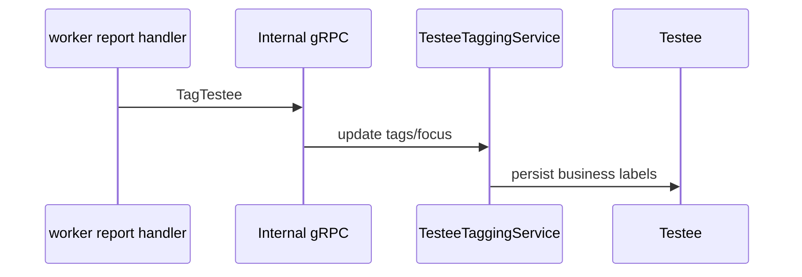
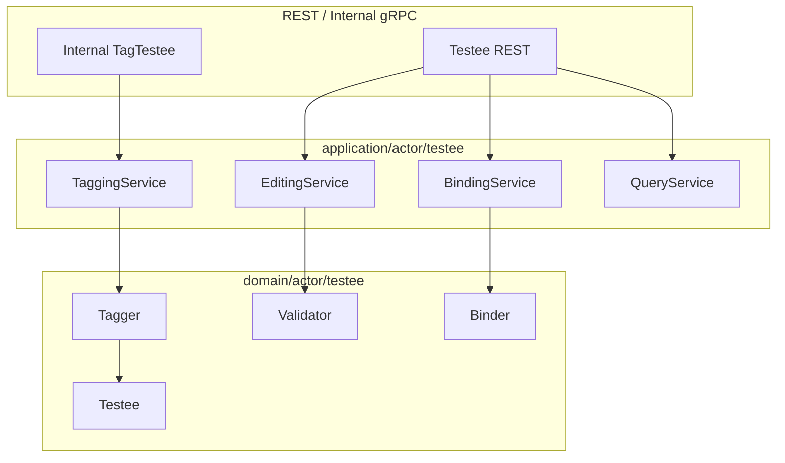

# Testee 与标签

**本文回答**：受试者、标签、重点关注和测评结果回写如何协作。

## 30 秒结论

`Testee` 是业务参与者，不是 IAM 用户；高风险标签和重点关注可由评估报告下游回写。

## 子模型要解决什么问题

Testee 模型解决的是“被测评的人如何在业务中被识别、维护和关注”的问题。它必须承接三类信息：

| 信息 | 来源 | 说明 |
| ---- | ---- | ---- |
| 基础档案 | 前台/后台录入 | 姓名、性别、出生信息等业务属性 |
| 业务标签 | 人工维护或报告回写 | 高风险、重点关注、分组等 |
| 关系上下文 | Clinician / Plan / Evaluation | 谁能看、为什么需要测评 |

这些信息不能放到 IAM user 中，因为受试者可能没有登录账号，也可能由其他人代填；同时这些信息也不应该放到 Assessment 中，因为它们跨多次测评长期存在。



## 架构设计



外部接口不直接改 `Testee` 字段，而是通过应用服务调用领域对象或领域服务。这样标签回写、人工编辑和绑定关系可以共享同一套不变量。

## 领域模型与设计模式

| 模型 / 模式 | 位置 | 作用 |
| ----------- | ---- | ---- |
| 聚合实体 | `Testee` | 维护受试者业务身份和基础属性 |
| 领域服务 | `Tagger`、`Binder`、`Editor`、`Validator` | 将标签、绑定、编辑校验拆出，避免实体过胖 |
| 应用服务 | `tagging_service.go` | 接收 worker/internal gRPC 回写并持久化 |
| 防腐边界 | internal gRPC DTO | worker 不直接依赖 Testee 领域模型 |
| 事件/回调协作 | report handler -> internal API | Evaluation 产出可反馈给 Actor，但不直接改 Actor repository |

## 为什么这样设计

报告生成后回写受试者标签是跨模块副作用。直接让 worker 操作 Testee repository 会把 worker 和 Actor 持久化模型耦合；当前设计让 worker 通过 internal gRPC 调用 apiserver，由 apiserver 应用服务执行权限和领域规则。这牺牲了一次 RPC 成本，但保持了写模型权威。

## 取舍与边界

| 边界 | 说明 |
| ---- | ---- |
| 标签不是 Assessment 状态 | 标签可由报告回写，但它是受试者长期属性 |
| Testee 不等于登录账号 | 没有 IAM user 也可以存在 Testee |
| worker 不直接写库 | 所有 Actor 写入回到 apiserver |
| 标签语义要稳定 | 新标签需要明确来源、含义和回写条件 |

## 代码锚点

- Testee domain：[domain/actor/testee](../../../internal/apiserver/domain/actor/testee/)
- Testee app：[application/actor/testee](../../../internal/apiserver/application/actor/testee/)
- Tagging service：[tagging_service.go](../../../internal/apiserver/application/actor/testee/tagging_service.go)
- Internal gRPC：[internal.go](../../../internal/apiserver/interface/grpc/service/internal.go)

## Verify

```bash
go test ./internal/apiserver/domain/actor/testee ./internal/apiserver/application/actor/testee
```
