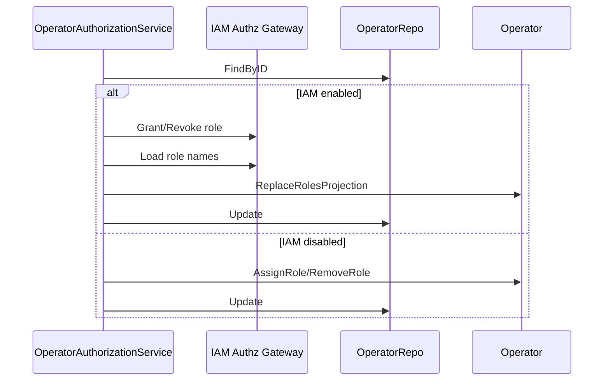

# Clinician 与 Operator

**本文回答**：`Clinician` 和 `Operator` 为什么不能混为一个对象；Clinician 如何表达医生/咨询师等业务从业者；Operator 如何作为 IAM.User 在本 BC 的业务投影；角色、权限、关系和 IAM 授权快照如何协作。

---

## 30 秒结论

| 维度 | 结论 |
| ---- | ---- |
| Clinician | 机构内业务从业者，例如医生、咨询师、训练师；承载业务身份，不承载后台 RBAC |
| Operator | 后台工作人员投影，是 IAM.User 在 QS BC 的业务视图，不是完整用户实体 |
| 关系 | Clinician 通过 Relation 与 Testee 形成业务服务关系 |
| IAM 边界 | Operator 通过 userID 关联 IAM.User；角色可从 IAM 授权快照同步 |
| 权限边界 | Operator 的角色用于后台能力判断；Clinician 的关系用于业务可见范围 |
| 不应混淆 | “能登录后台”不等于“是某个受试者的服务医生” |

一句话概括：

> **Operator 解决后台操作者和权限投影，Clinician 解决业务从业者身份和服务关系。**

---

## 1. 为什么要区分 Clinician 和 Operator

实际业务里，一个人可能同时是：

```text
IAM User
Operator
Clinician
```

但这三个身份的语义不同：

| 身份 | 说明 |
| ---- | ---- |
| IAM User | 认证主体，负责登录、token、组织和授权快照 |
| Operator | QS 后台操作者投影，负责本 BC 内的角色、active、审计语义 |
| Clinician | 从业者业务身份，负责服务受试者、创建入口、参与计划 |

如果直接用 IAM role 判断医生-受试者关系，会导致无法表达：

- 某医生只负责一部分受试者。
- 某运营有后台权限但不是医生。
- 某医生停用后不能创建入口。
- 某 operator 在不同机构有不同角色。

---

## 2. Clinician 模型

`Clinician` 源码注释说明：它是机构内业务从业者聚合根，承载医生/咨询师等业务身份，不承载后台 RBAC。

核心字段：

| 字段 | 说明 |
| ---- | ---- |
| `id` | 从业者 ID |
| `orgID` | 所属机构 |
| `operatorID` | 可选，关联后台操作者 |
| `name` | 姓名 |
| `department` | 科室 |
| `title` | 职称 |
| `clinicianType` | 从业者类型 |
| `employeeCode` | 工号 |
| `isActive` | 是否激活 |

核心行为：

| 方法 | 说明 |
| ---- | ---- |
| `UpdateProfile` | 更新业务档案 |
| `BindOperator` | 绑定后台操作者 |
| `UnbindOperator` | 解绑后台操作者 |
| `Activate` / `Deactivate` | 激活/停用 |

### 2.1 Clinician 不做什么

Clinician 不保存：

- IAM password。
- JWT token。
- 后台 RBAC 角色。
- 具体 Testee 列表。
- Assessment 结果。

这些分别属于 IAM、Operator、Relation、Evaluation。

---

## 3. Operator 模型

`Operator` 是后台工作人员聚合根。源码注释明确说明：Operator 是 IAM.User 在本 BC 的业务视图投影，不是完整用户实体。

核心字段：

| 字段 | 说明 |
| ---- | ---- |
| `id` | 本 BC 内部员工 ID |
| `orgID` | 所属机构，多租户隔离 |
| `userID` | IAM.User ID，必须绑定 |
| `roles` | 本 BC 业务角色列表 |
| `name/email/phone` | 缓存字段，减少 RPC |
| `isActive` | 本系统内激活状态 |

### 3.1 Operator 的角色能力

Operator 提供这些能力判断：

| 方法 | 语义 |
| ---- | ---- |
| `CanManageScales()` | 是否可管理量表 |
| `CanEvaluate()` | 是否可评估 |
| `CanAuditReport()` | 是否可审核报告 |
| `CanManageEvaluationPlans()` | 是否可管理测评计划 |

这些是 QS BC 内的业务能力判断，不等同于 IAM 的完整 RBAC 模型。

---

## 4. Operator 与 IAM 授权快照

`OperatorAuthorizationService` 在 IAM 启用时，会先调用 iambridge：

```text
GrantOperatorRole / RevokeOperatorRole
```

然后再从 IAM 授权快照读取角色并同步到本地投影：

```text
persistOperatorRolesFromAuthz
```

如果 IAM 未启用，则在本 BC 事务内直接更新 Operator.roles。



### 4.1 为什么这样设计

这样可以同时支持：

| 场景 | 处理 |
| ---- | ---- |
| IAM 启用 | IAM 是授权真值，Operator 只做本地投影 |
| IAM 未启用 | QS 本地维护 roles |
| 多租户 | 同一 user 在不同 org 可有不同 roles |
| 审计 | 操作记录可引用 Operator ID |

---

## 5. Relation 的业务意义

Clinician 和 Testee 之间的关系不应该只靠角色推断。关系模型表达：

```text
某个从业者在某个机构内，以某种业务关系服务某个受试者
```

常见关系类型：

- creator。
- attending。
- access-grant 类关系。

AssessmentEntry intake 会确保 creator relation 和 attending/access relation，以便入口接入后医生能看到对应 Testee。

---

## 6. 典型协作链路

### 6.1 创建入口

```text
Operator/IAM context
  -> Clinician
  -> Create AssessmentEntry
```

创建 AssessmentEntry 时会校验 Clinician：

- 属于同一 org。
- isActive。
- target 参数合法。

### 6.2 入口接入

```text
AssessmentEntry token
  -> Resolve
  -> Intake
  -> create/get Testee
  -> ensure relation
  -> stage behavior events
```

### 6.3 权限判断

```text
JWT/AuthzSnapshot
  -> actorctx
  -> access guard / operator roles
  -> relation query
  -> allow/deny
```

---

## 7. 设计模式

| 模式 | 当前落点 | 意图 |
| ---- | -------- | ---- |
| Projection | Operator | 保存 IAM.User 在 QS BC 的业务投影 |
| Anti-corruption | iambridge / actorctx | 隔离 IAM 模型 |
| Relationship Model | relation domain | 表达医生-受试者业务关系 |
| Role Strategy | Operator role methods | 业务能力判断集中 |
| Application Service | OperatorAuthorizationService / Clinician service | 编排 IAM、repository、领域行为 |
| Multi-tenant boundary | orgID | 机构隔离 |

---

## 8. 设计取舍

| 设计 | 收益 | 代价 |
| ---- | ---- | ---- |
| Clinician 与 Operator 分离 | 业务身份和后台权限清晰 | 对接时多一层映射 |
| Operator 作为 IAM 投影 | 本 BC 查询和审计方便 | 需要同步授权快照 |
| Relation 独立建模 | 细粒度可见范围明确 | 关系生命周期需要维护 |
| IAM 启用时以 IAM 为授权真值 | 授权统一 | 本地角色更新要走 IAM gateway |
| IAM 未启用时本地维护角色 | 本地开发/独立运行可用 | 生产需明确模式 |

---

## 9. 常见误区

### 9.1 “Clinician 有后台账号，所以就是 Operator”

不一定。Clinician 可以绑定 Operator，但 Clinician 的业务身份和 Operator 的后台投影不是一回事。

### 9.2 “有医生角色就能看到所有受试者”

不应这么理解。受试者可见范围应该结合 relation，而不是只看 IAM role。

### 9.3 “Operator.roles 就是 IAM 角色主数据”

IAM 启用时，Operator.roles 是本地投影，授权真值来自 IAM。

### 9.4 “停用 Clinician 等于停用 IAM User”

不是。Clinician 激活状态是业务从业者状态，IAM User 激活状态属于 IAM。

---

## 10. 代码锚点

- Clinician：[../../../internal/apiserver/domain/actor/clinician/clinician.go](../../../internal/apiserver/domain/actor/clinician/clinician.go)
- Operator：[../../../internal/apiserver/domain/actor/operator/operator.go](../../../internal/apiserver/domain/actor/operator/operator.go)
- Operator authorization：[../../../internal/apiserver/application/actor/operator/authorization_service.go](../../../internal/apiserver/application/actor/operator/authorization_service.go)
- Relation：[../../../internal/apiserver/domain/actor/relation/](../../../internal/apiserver/domain/actor/relation/)
- Clinician application：[../../../internal/apiserver/application/actor/clinician/](../../../internal/apiserver/application/actor/clinician/)
- Operator application：[../../../internal/apiserver/application/actor/operator/](../../../internal/apiserver/application/actor/operator/)

---

## 11. Verify

```bash
go test ./internal/apiserver/domain/actor/clinician
go test ./internal/apiserver/domain/actor/operator
go test ./internal/apiserver/domain/actor/relation
go test ./internal/apiserver/application/actor/clinician
go test ./internal/apiserver/application/actor/operator
```

---

## 12. 下一跳

- AssessmentEntry 与 IAM 边界：[03-AssessmentEntry与IAM边界.md](./03-AssessmentEntry与IAM边界.md)
- 新增 Actor 能力 SOP：[04-新增Actor能力SOP.md](./04-新增Actor能力SOP.md)
