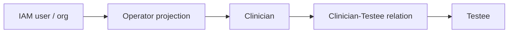
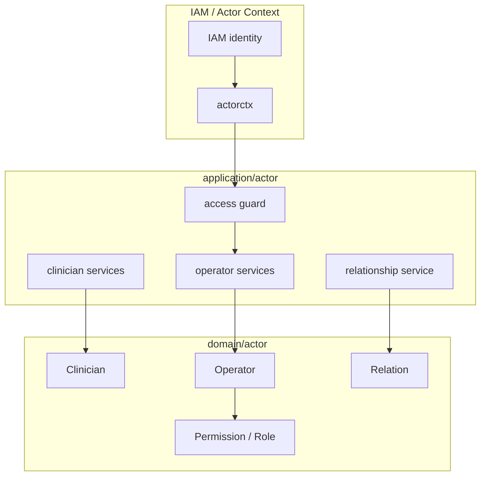

# Clinician 与 Operator

**本文回答**：医生、操作者、角色投影和关系服务如何分工。

## 30 秒结论

| 概念 | 当前边界 |
| ---- | -------- |
| Clinician | 医生业务对象和与受试者关系 |
| Operator | 后台操作者投影，不替代 IAM |
| Relation | 医生与受试者的业务关系 |

## 子模型要解决什么问题

Clinician 和 Operator 解决的是“业务执行者”和“后台操作者”如何与 IAM 身份分离的问题。医生可能是业务角色，Operator 可能是运营/管理员投影；二者都可能来自 IAM，但它们在业务域中的含义不同。

| 对象 | 核心问题 | 典型动作 |
| ---- | -------- | -------- |
| Clinician | 谁负责或服务某个受试者 | 建立/解除医生-受试者关系 |
| Operator | 谁在后台执行管理动作 | 权限判断、后台操作上下文 |
| Relation | Clinician 和 Testee 的业务绑定 | 查询可见受试者、分配任务 |



## 架构设计



IAM 身份进入系统后会被转换为业务上下文；业务服务再基于 Operator/Clinician/Relation 做判断。领域层不反查 IAM，也不保存 token。

## 设计模式应用

| 模式 | 位置 | 说明 |
| ---- | ---- | ---- |
| 防腐层 | `actorctx` + IAM access | 把外部身份模型压缩为业务上下文 |
| 角色/权限策略 | `operator/permission.go`、`role.go` | 将权限判断从 controller 中抽出 |
| 关系模型 | `relation` domain | 医生-受试者关系是一等业务对象 |
| 应用服务 | `relationship_service.go` | 编排关系创建、查询和权限校验 |

## 为什么这样设计

如果直接用 IAM role 做所有业务判断，系统会把“能登录后台”和“能管理某个受试者”混为一谈。当前设计把 IAM role 作为入口信号，把 Clinician/Relation 作为业务授权事实。这样可以表达更细的业务权限，例如某个医生只能看到与自己有关的受试者。

## 取舍与边界

| 取舍 | 当前选择 |
| ---- | -------- |
| IAM 不进领域聚合 | 领域模型稳定，但应用层要做上下文转换 |
| Relation 是业务对象 | 查询和权限更清晰，但需要维护关系一致性 |
| Operator 是投影 | 不重复 IAM 全量用户数据，但后台展示可能需要组合 IAM 信息 |

## 代码锚点

- Clinician domain：[domain/actor/clinician](../../../internal/apiserver/domain/actor/clinician/)
- Operator domain：[domain/actor/operator](../../../internal/apiserver/domain/actor/operator/)
- Relation domain：[domain/actor/relation](../../../internal/apiserver/domain/actor/relation/)
- Relationship service：[relationship_service.go](../../../internal/apiserver/application/actor/clinician/relationship_service.go)

## Verify

```bash
go test ./internal/apiserver/domain/actor/clinician ./internal/apiserver/domain/actor/operator ./internal/apiserver/domain/actor/relation ./internal/apiserver/application/actor/clinician
```
