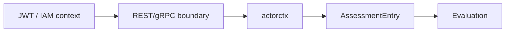
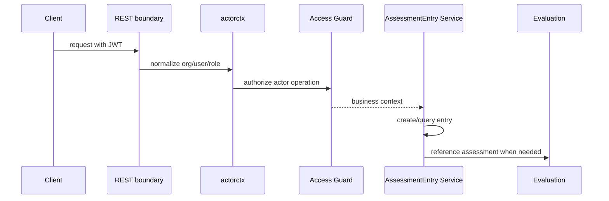

# AssessmentEntry 与 IAM 边界

**本文回答**：测评入口如何连接 Actor 与业务模块，IAM 信息如何在边界处理。

## 30 秒结论



| 主题 | 当前事实 |
| ---- | -------- |
| IAM | 提供身份、org、user，不进入 actor 聚合主数据 |
| actorctx | 应用层上下文归一化 |
| AssessmentEntry | 测评入口和业务查询对象 |

## 这个边界要解决什么问题

AssessmentEntry 是 Actor 与测评链路之间的入口模型。它要解决的是“某个业务参与者如何进入某次测评，而不把 IAM、Survey 和 Evaluation 的模型揉在一起”的问题。

| 输入 | 经过边界后变成 | 不应该做 |
| ---- | -------------- | -------- |
| JWT / IAM claims | `actorctx` | 不直接进入领域聚合 |
| Testee / Clinician 业务关系 | entry 可访问性 | 不复制完整 Actor 模型 |
| Survey / Scale 引用 | 测评入口 | 不保存答卷内容 |
| Evaluation 状态 | 查询关联 | 不推进 Assessment 状态 |

## 架构设计



这个时序的关键是：IAM 只在边界被解释成业务上下文，AssessmentEntry 只保存业务入口所需事实。

## 模型与设计模式

| 模型 / 模式 | 作用 |
| ----------- | ---- |
| 防腐层 | `actorctx` 防止 IAM claim 直接污染领域模型 |
| 访问守卫 | `application/actor/access` 集中校验业务权限 |
| 入口模型 | `AssessmentEntry` 连接 Actor 与 Evaluation，但不拥有 Evaluation |
| 应用服务编排 | entry service 负责查询、权限和跨模块引用 |

## 为什么这样设计

把 IAM claims 直接传进所有领域服务会让业务模型依赖认证实现；把 AssessmentEntry 做成 Evaluation 的内部表又会让 Actor 查询入口变得困难。当前设计选择在 Actor 模块内维护入口模型，同时通过 actorctx 和 access guard 控制身份边界。

## 取舍与边界

| 边界 | 当前选择 |
| ---- | -------- |
| IAM | 只提供身份事实，不成为业务聚合 |
| AssessmentEntry | 是入口和查询对象，不是 Assessment |
| 权限 | 应用层集中校验，领域实体不读取 JWT |
| 跨模块查询 | 通过服务组合，不复制 Evaluation 全部状态 |

## 代码锚点

- Actor context：[actorctx](../../../internal/apiserver/application/actor/actorctx/)
- AssessmentEntry domain：[domain/actor/assessmententry](../../../internal/apiserver/domain/actor/assessmententry/)
- AssessmentEntry app：[application/actor/assessmententry](../../../internal/apiserver/application/actor/assessmententry/)
- IAM 文档：[IAM认证与身份链路](../../01-运行时/05-IAM认证与身份链路.md)

## Verify

```bash
go test ./internal/apiserver/domain/actor/assessmententry ./internal/apiserver/application/actor/assessmententry ./internal/apiserver/application/actor/access
```
