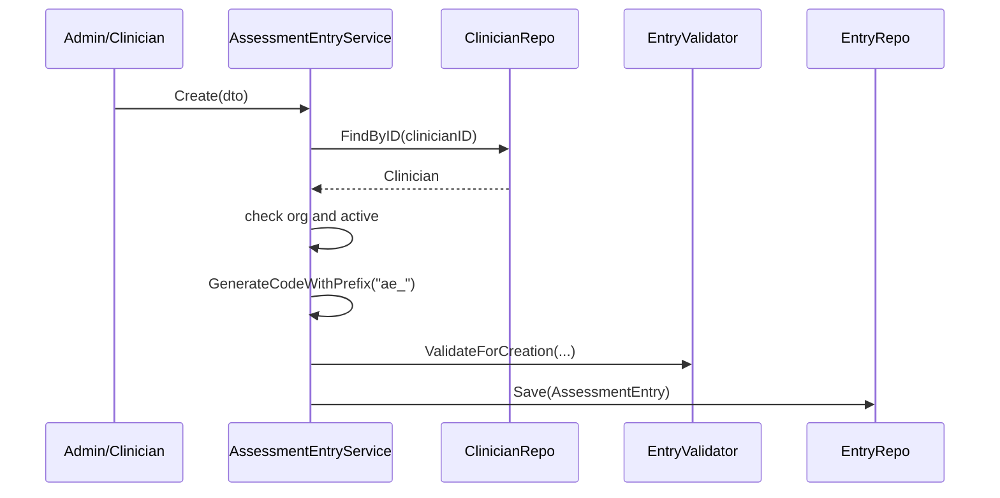
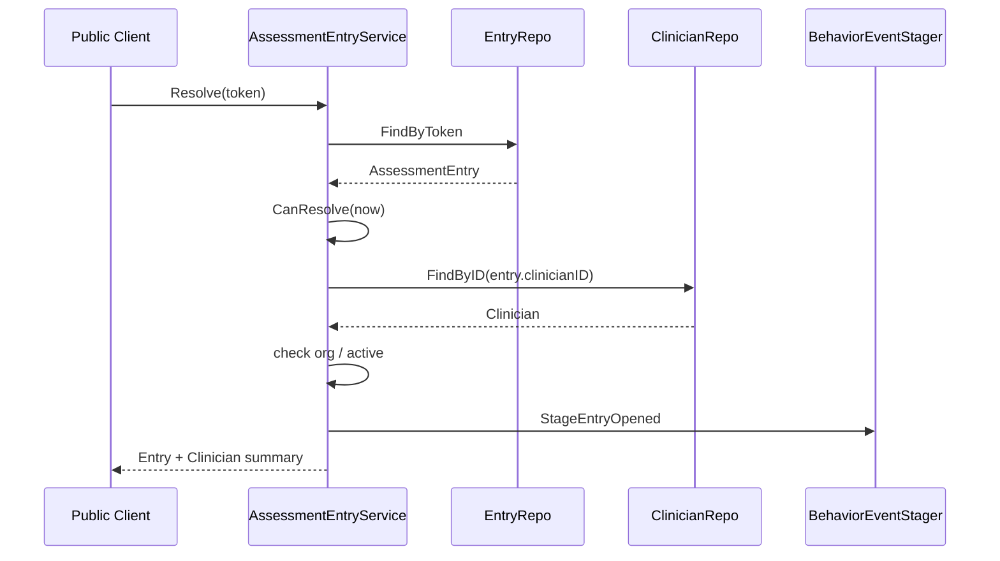
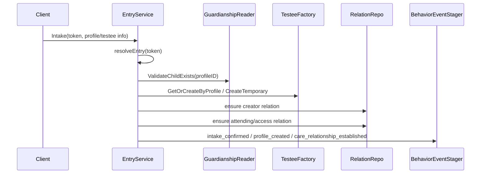

# AssessmentEntry 与 IAM 边界

**本文回答**：`AssessmentEntry` 如何作为测评入口连接 Clinician、Testee、Survey/Evaluation 与行为统计；IAM/JWT/AuthzSnapshot 如何在边界层被转换为 Actor 业务上下文；为什么 AssessmentEntry 不是 Assessment，也不是 IAM token。

---

## 30 秒结论

| 维度 | 结论 |
| ---- | ---- |
| AssessmentEntry 定位 | 测评入口聚合，连接 Clinician、目标问卷/量表、token、有效期和接入行为 |
| Target | 当前 target type 支持 `questionnaire` 和 `scale` |
| Token | entry token 是业务入口令牌，不是 IAM token，也不承载认证态 |
| Resolve | `Resolve(token)` 校验 entry active/expired、clinician active/org，并 stage entry_opened 行为事件 |
| Intake | `Intake` 可创建/获取 Testee，确保 clinician-testee relation，并 stage intake 行为事件 |
| IAM 边界 | IAM 提供 user/org/profile/guardianship，Actor 通过 actorctx/iambridge 做防腐 |
| 不负责 | Entry 不保存 AnswerSheet、不推进 Assessment 状态、不保存报告 |

一句话概括：

> **AssessmentEntry 是“谁创建了哪个测评入口、入口指向什么、谁通过入口进入了业务链路”的模型；它不是评估结果，也不是认证凭证。**

---

## 1. AssessmentEntry 是什么

`AssessmentEntry` 是 Actor 模块中的测评入口聚合根。

核心字段：

| 字段 | 说明 |
| ---- | ---- |
| `id` | 入口 ID |
| `orgID` | 所属机构 |
| `clinicianID` | 创建或负责该入口的从业者 |
| `token` | 入口令牌，业务入口标识 |
| `targetType` | 目标类型：questionnaire / scale |
| `targetCode` | 目标编码 |
| `targetVersion` | 目标版本 |
| `isActive` | 是否启用 |
| `expiresAt` | 可选过期时间 |

核心行为：

| 方法 | 说明 |
| ---- | ---- |
| `IsExpired(now)` | 判断是否过期 |
| `CanResolve(now)` | active 且未过期才能解析 |
| `Deactivate()` | 停用入口 |
| `Reactivate()` | 重新启用 |

---

## 2. Entry 创建链路



创建时会校验：

| 校验 | 说明 |
| ---- | ---- |
| clinician 存在 | 入口必须归属一个从业者 |
| clinician.orgID == dto.orgID | 防止跨机构创建 |
| clinician.isActive | 停用从业者不能创建入口 |
| token 非空且长度 <= 32 | 入口 token 约束 |
| targetType 合法 | questionnaire / scale |
| targetCode 非空且 <= 100 | 目标编码 |
| targetVersion 长度 <= 50 | 目标版本 |

---

## 3. Entry Resolve 链路



Resolve 的语义是：

```text
入口被打开，并返回入口目标和从业者摘要。
```

它不创建 AnswerSheet，不创建 Assessment，也不代表 intake 已确认。

---

## 4. Entry Intake 链路

Intake 是入口真正接入业务对象的步骤。



Intake 会做：

| 步骤 | 说明 |
| ---- | ---- |
| validateIntakeProfile | 如果有 profileID 且 IAM guardianship 启用，校验 child profile 存在 |
| resolveIntakeTestee | 有 profile 则 get-or-create，无 profile 则创建 temporary Testee |
| ensureCreatorRelation | 确保 creator 关系 |
| ensureAssignmentRelation | 确保 attending/access 类关系 |
| stageIntakeBehaviorEvents | stage intake、profile created、relationship established 行为事件 |

---

## 5. IAM 边界

AssessmentEntry 与 IAM 的关系很容易误解。

| IAM 提供 | AssessmentEntry 使用方式 |
| -------- | ----------------------- |
| 当前登录用户 | REST/Auth middleware 和 actorctx 归一化 |
| 组织信息 | orgID 校验 |
| IAM Child/Profile | Intake 时通过 guardianshipSvc.ValidateChildExists 校验 |
| 授权快照 | access guard / operator authz 使用 |
| token/JWT | 只在边界层解析，不写入 AssessmentEntry |

AssessmentEntry 的 token 是业务入口 token，不是 IAM token。它不能替代 JWT，也不能代表用户已认证。

---

## 6. 与 Survey/Evaluation 的边界

| 对象 | Entry 的关系 |
| ---- | ------------ |
| Questionnaire | targetType=questionnaire 时指向问卷入口 |
| Scale | targetType=scale 时指向量表入口 |
| AnswerSheet | Entry 不保存答卷，答卷由 Survey 提交 |
| Assessment | Entry 不等于 Assessment；Assessment 由 Evaluation 创建 |
| Report | Entry 不保存报告，只能作为接入来源或行为入口 |

Entry 只是“进入测评业务链路的入口”。它不应承载完整测评状态。

---

## 7. 与 Statistics 的边界

AssessmentEntry 会 stage 行为事件：

| 事件 | 触发 |
| ---- | ---- |
| entry opened | Resolve 成功 |
| intake confirmed | Intake 成功 |
| testee profile created | Intake 创建了新 Testee |
| care relationship established | Intake 创建了新关系 |

这些行为事件进入 Statistics/Behavior 投影，不反向改变 Entry 主事实。

---

## 8. 设计模式

| 模式 | 当前实现 | 意图 |
| ---- | -------- | ---- |
| Aggregate Root | `AssessmentEntry` | 入口状态和 token 生命周期聚合 |
| Validator | `assessmententry.Validator` | 创建参数集中校验 |
| Application Service | `assessmententry.Service` | 编排 clinician、testee、relation、IAM、事件 |
| Anti-corruption | `guardianshipSvc` / iambridge | 隔离 IAM Child/Profile |
| Unit of Work | `uow.WithinTransaction` | 创建/解析/接入时保持写入边界 |
| Event Staging | `BehaviorEventStager` | 入口行为进入统计投影 |

---

## 9. 设计取舍

| 设计 | 收益 | 代价 |
| ---- | ---- | ---- |
| Entry token 独立于 IAM token | 可匿名打开入口或轻量接入 | 需要额外校验 active/expired |
| Entry 独立于 Assessment | 入口和测评结果解耦 | 链路更长，需要跨模块引用 |
| Intake 创建 relation | 医生和受试者关系自动建立 | 需要关系幂等 |
| 行为事件 staged | 统计可追踪入口漏斗 | 需要 outbox/behavior 投影 |
| IAM child 校验通过 guardianshipSvc | 不复制 IAM profile | IAM 不可用时要有降级语义 |

---

## 10. 常见误区

### 10.1 “AssessmentEntry token 是登录 token”

错误。它只是业务入口 token，不代表用户认证态。

### 10.2 “Resolve 就代表完成接入”

错误。Resolve 只是打开入口；Intake 才确认接入并创建/绑定 Testee。

### 10.3 “Entry 可以保存答卷内容”

不应该。答卷属于 Survey 的 AnswerSheet。

### 10.4 “Entry 可以直接创建报告”

不应该。报告属于 Evaluation 的 InterpretReport。

### 10.5 “IAM claims 可以直接进入领域聚合”

不应该。应在边界层转成 actorctx 或应用服务参数。

---

## 11. 代码锚点

- AssessmentEntry 聚合：[../../../internal/apiserver/domain/actor/assessmententry/assessment_entry.go](../../../internal/apiserver/domain/actor/assessmententry/assessment_entry.go)
- AssessmentEntry types：[../../../internal/apiserver/domain/actor/assessmententry/types.go](../../../internal/apiserver/domain/actor/assessmententry/types.go)
- AssessmentEntry validator：[../../../internal/apiserver/domain/actor/assessmententry/validator.go](../../../internal/apiserver/domain/actor/assessmententry/validator.go)
- AssessmentEntry service：[../../../internal/apiserver/application/actor/assessmententry/service.go](../../../internal/apiserver/application/actor/assessmententry/service.go)
- actorctx：[../../../internal/apiserver/application/actor/actorctx/context.go](../../../internal/apiserver/application/actor/actorctx/context.go)
- REST handler：[../../../internal/apiserver/transport/rest/handler/assessment_entry_handler.go](../../../internal/apiserver/transport/rest/handler/assessment_entry_handler.go)

---

## 12. Verify

```bash
go test ./internal/apiserver/domain/actor/assessmententry
go test ./internal/apiserver/application/actor/assessmententry
go test ./internal/apiserver/application/actor/access
```

---

## 13. 下一跳

- 新增 Actor 能力 SOP：[04-新增Actor能力SOP.md](./04-新增Actor能力SOP.md)
- 运行时 IAM 边界：[../../01-运行时/05-IAM认证与身份链路.md](../../01-运行时/05-IAM认证与身份链路.md)
