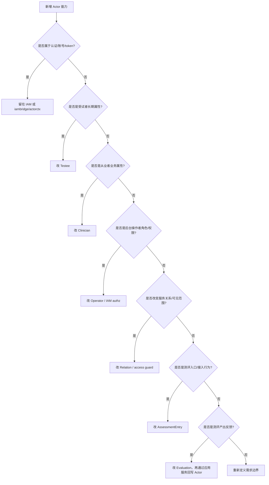

# 新增 Actor 能力 SOP

**本文回答**：当产品需求提出“给用户加字段”“医生可以管理更多人”“报告后自动标记重点关注”“新增测评入口”时，如何判断这个能力到底属于 IAM、Testee、Clinician、Operator、Relation、AssessmentEntry、Evaluation 还是 Statistics；应该按什么顺序修改领域模型、应用服务、权限、契约、事件、测试和文档。

---

## 30 秒结论

新增 Actor 能力前先判断它属于哪一类：

| 需求类型 | 示例 | 主要落点 |
| -------- | ---- | -------- |
| 认证账号能力 | 登录、密码、token、账号状态 | IAM，不属于 Actor |
| 受试者长期属性 | 姓名、生日、标签、重点关注 | Testee |
| 从业者业务属性 | 科室、职称、工号、是否激活 | Clinician |
| 后台操作者权限 | roles、是否可管理量表/计划 | Operator / IAM authz |
| 医生-受试者关系 | 可见范围、服务关系、分配关系 | Relation |
| 测评入口 | token、target、有效期、intake | AssessmentEntry |
| 测评结果反馈 | 高风险标签、报告后回写 | Evaluation -> Actor 应用服务 |
| 统计投影 | entry opened、intake confirmed | Statistics/Behavior |

一句话原则：

> **先判断身份边界，再判断聚合归属，最后补应用编排、契约、事件和文档。**

---

## 1. 决策树



---

## 2. 新增 Testee 能力

### 2.1 适用场景

- 新增长期档案字段。
- 新增标签。
- 新增重点关注规则。
- 新增 profile 绑定逻辑。
- 新增测评统计快照字段。

### 2.2 修改顺序

1. 修改 `domain/actor/testee`。
2. 增加或调整领域服务，例如 Tagger/Binder/Validator。
3. 修改 application service。
4. 修改 repository/mapper。
5. 修改 REST/gRPC DTO。
6. 如果来自 Evaluation 回写，修改 internal gRPC 和 worker handler。
7. 补测试与文档。

### 2.3 注意

不要把单次 Assessment 结果直接复制成 Testee 主字段。长期标签可以回写，但原始测评结果仍属于 Evaluation。

---

## 3. 新增 Clinician 能力

### 3.1 适用场景

- 新增科室、职称、从业者类型。
- 绑定/解绑 Operator。
- 启用/停用从业者。
- 扩展医生-受试者关系。
- 查询某医生负责的受试者。

### 3.2 修改顺序

1. 修改 `domain/actor/clinician`。
2. 修改 clinician application service。
3. 如涉及关系，修改 relation domain/application。
4. 修改 read model。
5. 修改 REST handler/contract。
6. 补权限测试。

### 3.3 注意

Clinician 不是权限角色。后台权限判断优先看 Operator/IAM，业务服务关系看 Relation。

---

## 4. 新增 Operator 能力

### 4.1 适用场景

- 新增 QS 业务角色。
- 新增后台能力判断。
- 新增 IAM 授权映射。
- 支持某角色管理某模块。
- 同步 AuthzSnapshot 到本地投影。

### 4.2 修改顺序

1. 修改 `domain/actor/operator` 中的 Role 和能力判断。
2. 修改 OperatorAuthorizationService。
3. 如果 IAM 启用，修改 iambridge gateway。
4. 修改 authz snapshot / middleware / access guard。
5. 修改 REST/gRPC 契约。
6. 补 IAM enabled/disabled 两种测试。

### 4.3 注意

IAM 启用时，授权真值应来自 IAM；Operator.roles 是本地投影。不要在本地直接绕过 IAM 修改生产授权。

---

## 5. 新增 Relation 能力

### 5.1 适用场景

- 新增关系类型。
- 调整可见范围。
- 支持转诊、协作、共同管理。
- 支持关系失效/转移。
- 支持按关系查询 Testee。

### 5.2 修改顺序

1. 修改 `domain/actor/relation` 类型和值对象。
2. 修改 relation repository 查询。
3. 修改 access guard。
4. 修改 clinician/testee query service。
5. 修改 AssessmentEntry intake 中的 relation 创建逻辑。
6. 补权限和可见范围测试。

### 5.3 注意

关系是业务事实，不是简单查询条件。涉及权限时必须有测试覆盖。

---

## 6. 新增 AssessmentEntry 能力

### 6.1 适用场景

- 新增入口 target type。
- 新增入口有效期规则。
- 新增入口渠道来源。
- 新增 intake 字段。
- 新增入口行为事件。
- 新增 token 生成策略。

### 6.2 修改顺序

1. 修改 `domain/actor/assessmententry`。
2. 修改 Validator。
3. 修改 application service。
4. 修改 relation/testee/intake 协作。
5. 修改 behavior event stager。
6. 修改 REST contract。
7. 补 resolve/intake/expire/active 测试。
8. 更新统计和事件文档。

### 6.3 注意

Entry token 不是 IAM token。新增入口能力不要把认证态塞进 Entry 聚合。

---

## 7. 新增测评反馈回写能力

### 7.1 适用场景

- 报告后自动打高风险标签。
- 报告后标记重点关注。
- 根据风险更新服务关系。
- 生成随访任务。

### 7.2 修改顺序

1. 判断反馈结果源是否属于 Evaluation。
2. 在 worker handler 中消费 `assessment.interpreted` 或 `report.generated`。
3. 通过 internal gRPC 调 apiserver。
4. apiserver application service 更新 Actor。
5. 保证幂等。
6. 补 worker + application 测试。

### 7.3 注意

不要在 worker 中直接写 Actor repository，也不要把报告全文复制进 Testee。

---

## 8. 权限和 IAM 检查清单

新增 Actor 能力必须检查：

| 检查项 | 是否需要 |
| ------ | -------- |
| 是否需要 JWT 登录 | ☐ |
| 是否需要 orgID | ☐ |
| 是否需要 operator role | ☐ |
| 是否需要 clinician-testee relation | ☐ |
| 是否需要 guardianship / child profile 校验 | ☐ |
| 是否需要 service auth / internal gRPC | ☐ |
| 是否需要 IAM GrantAssignment | ☐ |
| 是否影响 AuthzSnapshot | ☐ |

---

## 9. 契约和事件检查清单

| 检查项 | 说明 |
| ------ | ---- |
| REST DTO | 前台/后台接口是否变化 |
| gRPC proto | worker/internal 是否需要字段 |
| OpenAPI | 文档是否更新 |
| Behavior event | 是否新增 entry/intake/profile/relation 事件 |
| Worker handler | 是否需要新增回写 handler |
| Read model | 是否影响列表和统计 |
| Cache | 是否需要失效或重建 |

---

## 10. 合并前检查清单

| 检查项 | 是否完成 |
| ------ | -------- |
| 已判断 IAM vs Actor 边界 | ☐ |
| 已确定聚合归属 | ☐ |
| 已更新领域模型 | ☐ |
| 已更新应用服务 | ☐ |
| 已更新 repository/mapper | ☐ |
| 已更新 REST/gRPC 契约 | ☐ |
| 已更新权限/access guard | ☐ |
| 已更新事件或行为投影 | ☐ |
| 已补 domain 测试 | ☐ |
| 已补 application 测试 | ☐ |
| 已补 worker/internal gRPC 测试 | ☐ |
| 已更新 actor 文档 | ☐ |
| 已运行 docs hygiene | ☐ |

---

## 11. 反模式

| 反模式 | 风险 |
| ------ | ---- |
| 把 IAM 字段直接塞进 Testee | 认证模型污染业务模型 |
| 用 IAM role 替代 Relation | 无法表达细粒度服务关系 |
| worker 直写 Actor 表 | 绕过写模型和权限 |
| Entry token 当 JWT 用 | 安全语义错误 |
| 把 Assessment 状态复制到 Testee | 状态漂移 |
| 在 Actor 中保存 Report 内容 | 跨模块一致性失控 |

---

## 12. 推荐测试命令

```bash
go test ./internal/apiserver/domain/actor/...
go test ./internal/apiserver/application/actor/...
go test ./internal/apiserver/transport/rest/middleware
```

如果涉及 worker 回写：

```bash
go test ./internal/worker/handlers
go test ./internal/apiserver/transport/grpc/service
```

如果涉及事件/行为投影：

```bash
go test ./internal/pkg/eventcatalog
go test ./internal/worker/integration/eventing
```

---

## 13. 文档同步

| 变更类型 | 至少同步 |
| -------- | -------- |
| Testee 字段/标签 | [01-Testee与标签.md](./01-Testee与标签.md) |
| Clinician/Operator | [02-Clinician与Operator.md](./02-Clinician与Operator.md) |
| Entry/IAM | [03-AssessmentEntry与IAM边界.md](./03-AssessmentEntry与IAM边界.md) |
| Actor 总体边界 | [00-整体模型.md](./00-整体模型.md) |
| REST/gRPC | `docs/04-接口与运维/` |
| 运行时/IAM | `docs/01-运行时/05-IAM认证与身份链路.md` |
