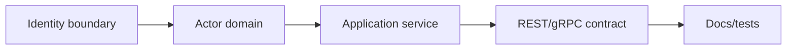
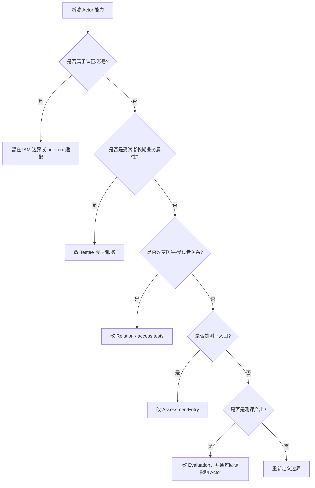

# 新增 Actor 能力 SOP

**本文回答**：新增参与者字段、关系、标签、入口或 IAM 映射时如何安全维护。

## 30 秒结论



新增 Actor 能力时先判断它属于 IAM 身份、业务参与者、关系、入口还是测评反馈。Actor 是身份边界模块，最常见风险是把认证系统的字段或 Evaluation 的状态误塞进 Actor 聚合。

## SOP 要解决什么问题

Actor 的变化经常来自产品表述：“给用户加字段”“医生能看到更多人”“报告后自动标记重点关注”。这些描述必须先翻译成领域问题：

| 产品语言 | 需要判断 |
| -------- | -------- |
| 用户字段 | 是 IAM 账号字段，还是 Testee/Clinician/Operator 业务属性 |
| 医生可见范围 | 是 relation 变化，还是 access guard 变化 |
| 自动标签 | 是 Testee 标签，还是 Assessment 结果 |
| 新测评入口 | 是 AssessmentEntry，还是 Survey/Evaluation 新路由 |

## 清单

| 变更 | 必做 |
| ---- | ---- |
| 新字段 | 确认是业务属性还是 IAM 属性 |
| 新关系 | 补 relation domain 和访问控制测试 |
| 新标签 | 补 TesteeTaggingService 和 internal gRPC 影响 |
| 新入口 | 补 REST/gRPC 契约、actorctx、模块文档 |

## 决策树



## 设计审查清单

| 审查项 | 必须回答 |
| ------ | -------- |
| 身份边界 | 这是 IAM 事实还是 Actor 业务事实 |
| 聚合归属 | 修改 Testee、Clinician、Operator、Relation 还是 AssessmentEntry |
| 权限模型 | 是否需要更新 access guard 或 relation 查询 |
| 回写路径 | 是否通过 internal gRPC / 应用服务回写，而不是 worker 直写 |
| 文档证据 | 是否同步本目录和 REST/gRPC 契约文档 |

## 为什么按这个顺序

Actor 是边界模块，错误的第一步会导致后续所有接口都漂移。先判断身份归属可以避免把 IAM 字段塞进业务表；再判断聚合归属可以防止 Testee、Clinician、Operator 互相污染；最后补接口和文档，确保调用方知道这个能力的边界。

## 常见反模式

| 反模式 | 风险 |
| ------ | ---- |
| 把 IAM role 直接当业务权限 | 无法表达医生-受试者关系等细粒度权限 |
| worker 直接更新 Actor repository | 绕过 apiserver 写模型和权限边界 |
| 把 Assessment 状态复制到 Testee | 状态漂移，历史测评难以解释 |
| 在 Actor 中保存完整 Survey/Evaluation 数据 | 跨模块一致性成本过高 |

## 代码与测试锚点

| 能力 | 锚点 |
| ---- | ---- |
| Actor 领域模型 | [internal/apiserver/domain/actor](../../../internal/apiserver/domain/actor/) |
| Testee 服务 | [internal/apiserver/application/actor/testee](../../../internal/apiserver/application/actor/testee/) |
| Clinician 服务 | [internal/apiserver/application/actor/clinician](../../../internal/apiserver/application/actor/clinician/) |
| AssessmentEntry | [internal/apiserver/domain/actor/assessmententry](../../../internal/apiserver/domain/actor/assessmententry/) |
| actorctx / access | [internal/apiserver/application/actor/actorctx](../../../internal/apiserver/application/actor/actorctx/)、[internal/apiserver/application/actor/access](../../../internal/apiserver/application/actor/access/) |

## Verify

```bash
go test ./internal/apiserver/domain/actor/... ./internal/apiserver/application/actor/...
python scripts/check_docs_hygiene.py
```
