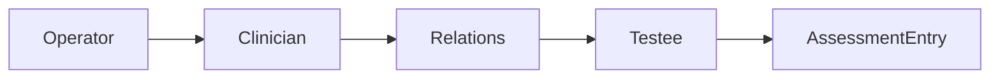

# Actor 深讲阅读地图

**本文回答**：`actor` 深讲目录如何阅读；Testee、Clinician、Operator、AssessmentEntry 与 IAM 边界分别在哪里讲。

## 30 秒结论

| 维度 | 当前事实 |
| ---- | -------- |
| 模块定位 | `actor` 维护参与者、操作者、医生关系、测评入口和标签 |
| 核心对象 | `Testee`、`Clinician`、`Operator`、`AssessmentEntry`、关系模型 |
| IAM 边界 | JWT / org / user 上下文在入站边界归一化，Actor 不复制 IAM 主数据 |
| 下游影响 | Evaluation 报告可回写 Testee 标签；Plan 引用 Testee 和 Clinician |



## 阅读顺序

1. [00-整体模型](./00-整体模型.md)
2. [01-Testee与标签](./01-Testee与标签.md)
3. [02-Clinician与Operator](./02-Clinician与Operator.md)
4. [03-AssessmentEntry与IAM边界](./03-AssessmentEntry与IAM边界.md)
5. [04-新增Actor能力SOP](./04-新增Actor能力SOP.md)

## Verify

```bash
go test ./internal/apiserver/domain/actor/... ./internal/apiserver/application/actor/...
```
