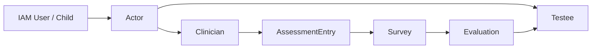

# Actor 深讲阅读地图

**本文回答**：`actor` 子目录这一组文档应该如何阅读；Actor 模块负责什么、不负责什么；`Testee / Clinician / Operator / AssessmentEntry / IAM 边界` 分别应该去哪里看。

---

## 30 秒结论

| 维度 | 结论 |
| ---- | ---- |
| 模块定位 | `actor` 是业务参与者域，维护受试者、从业者、后台操作者投影、业务关系、测评入口和标签 |
| 不是 IAM | Actor 不保存密码、token、登录态；IAM 只在边界层提供身份和授权事实 |
| 核心对象 | `Testee`、`Clinician`、`Operator`、`ClinicianTesteeRelation`、`AssessmentEntry` |
| 主链关系 | Actor 提供“谁参与测评”的业务上下文；Survey/Evaluation 负责答卷和结果 |
| 推荐读法 | 先读整体模型，再读 Testee、Clinician/Operator、Entry/IAM，最后读新增能力 SOP |

---

## 1. 本目录文档地图

```text
actor/
├── README.md
├── 00-整体模型.md
├── 01-Testee与标签.md
├── 02-Clinician与Operator.md
├── 03-AssessmentEntry与IAM边界.md
└── 04-新增Actor能力SOP.md
```

| 顺序 | 文档 | 先回答什么 |
| ---- | ---- | ---------- |
| 1 | [00-整体模型.md](./00-整体模型.md) | Actor 为什么独立成界，核心对象和模块边界是什么 |
| 2 | [01-Testee与标签.md](./01-Testee与标签.md) | 受试者、标签、重点关注、报告回写如何协作 |
| 3 | [02-Clinician与Operator.md](./02-Clinician与Operator.md) | 从业者和后台操作者如何分工，如何与 IAM 协作 |
| 4 | [03-AssessmentEntry与IAM边界.md](./03-AssessmentEntry与IAM边界.md) | 测评入口、token、intake、IAM/actorctx 边界 |
| 5 | [04-新增Actor能力SOP.md](./04-新增Actor能力SOP.md) | 新增参与者字段、关系、标签、入口或 IAM 映射时如何安全变更 |

---

## 2. Actor 负责什么

Actor 负责：

```text
谁是受试者？
谁是从业者？
谁是后台操作者？
谁和谁有业务关系？
谁能打开哪个测评入口？
报告后是否要自动同步重点关注？
IAM 身份如何转成业务上下文？
```

---

## 3. Actor 不负责什么

| 不属于 Actor 的内容 | 应归属 |
| -------------------- | ------ |
| 登录、密码、JWT、认证状态 | IAM |
| 问卷结构和答卷 | Survey |
| 量表规则 | Scale |
| 测评状态和报告 | Evaluation |
| 周期任务 | Plan |
| 统计看板 | Statistics |

---

## 4. 推荐阅读路径

### 4.1 第一次理解 Actor

```text
00-整体模型
  -> 01-Testee与标签
  -> 02-Clinician与Operator
```

### 4.2 要改受试者或标签

```text
01-Testee与标签
  -> 04-新增Actor能力SOP
```

### 4.3 要改医生/后台权限

```text
02-Clinician与Operator
  -> 03-AssessmentEntry与IAM边界
  -> ../../01-运行时/05-IAM认证与身份链路.md
```

### 4.4 要改测评入口

```text
03-AssessmentEntry与IAM边界
  -> 04-新增Actor能力SOP
```

---

## 5. Actor 的主业务轴线



含义：

1. IAM 提供身份事实。
2. Actor 建立业务身份。
3. Clinician 创建入口。
4. Testee 通过入口进入 Survey/Evaluation。
5. Evaluation 产出可回写 Testee 标签。

---

## 6. 事实源

| 事实 | 事实源 |
| ---- | ------ |
| 受试者长期属性 | `Testee` |
| 从业者业务属性 | `Clinician` |
| 后台操作者业务投影 | `Operator` |
| 医生-受试者关系 | `Relation` |
| 测评入口 | `AssessmentEntry` |
| 登录/认证 | IAM |
| 授权快照 | IAM/AuthzSnapshot |
| 测评结果 | Evaluation |
| 答卷事实 | Survey |

---

## 7. 维护原则

1. 不把 IAM 字段直接塞进 Actor 聚合。
2. 不把 Evaluation 状态复制到 Testee。
3. 不让 worker 直接写 Actor repository。
4. 不用 IAM role 替代 Clinician-Testee relation。
5. Entry token 不等于登录 token。
6. 新能力先判断身份边界和聚合归属。

---

## 8. 代码锚点

- Actor domain：[../../../internal/apiserver/domain/actor/](../../../internal/apiserver/domain/actor/)
- Actor application：[../../../internal/apiserver/application/actor/](../../../internal/apiserver/application/actor/)
- Actor REST routes：[../../../internal/apiserver/transport/rest/routes_actor.go](../../../internal/apiserver/transport/rest/routes_actor.go)
- Internal gRPC：[../../../internal/apiserver/transport/grpc/service/internal.go](../../../internal/apiserver/transport/grpc/service/internal.go)

---

## 9. Verify

```bash
go test ./internal/apiserver/domain/actor/...
go test ./internal/apiserver/application/actor/...
```

如果改 IAM/权限：

```bash
go test ./internal/apiserver/transport/rest/middleware
go test ./internal/apiserver/transport/grpc
```
