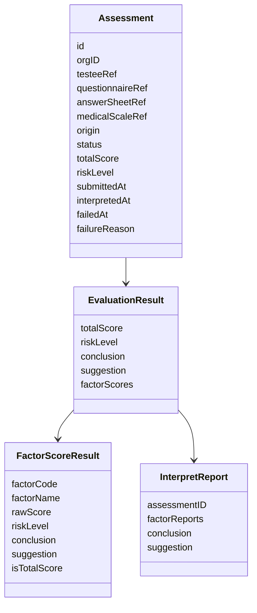
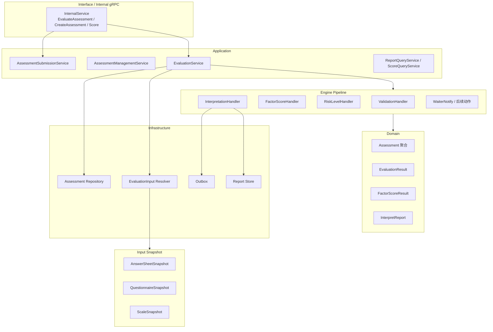
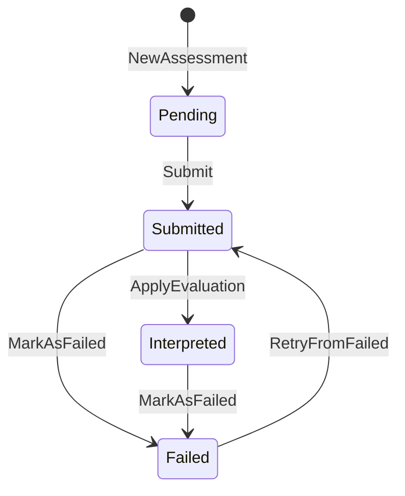
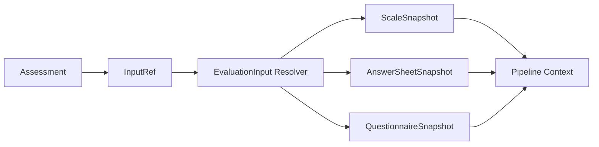
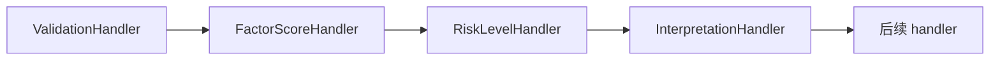

# Evaluation 整体模型

**本文回答**：`evaluation` 模块在 qs-server 中负责什么，为什么 `Assessment` 是核心聚合根，Evaluation 如何把 Survey 的答卷事实和 Scale 的量表规则推进为测评结果、报告和可靠出站事件，以及它和 `survey / scale / actor / plan / statistics` 的边界在哪里。

---

## 30 秒结论

| 维度 | 结论 |
| ---- | ---- |
| 模块定位 | Evaluation 是 qs-server 的**测评执行与结果产出域**，负责把已提交答卷和量表规则推进成 Assessment 状态、因子分、总分、风险、报告与后续事件 |
| 核心聚合 | `Assessment` 是核心聚合根，代表“一次具体测评行为” |
| 核心输入 | `AnswerSheetSnapshot` 来自 Survey，`QuestionnaireSnapshot` 来自 Survey，`ScaleSnapshot` 来自 Scale |
| 核心输出 | `EvaluationResult`、`FactorScoreResult`、`InterpretReport`、Assessment 状态变更 |
| 执行机制 | `EvaluationService.Evaluate` 加载 Assessment 与 input snapshot，然后执行 pipeline 职责链 |
| Pipeline | 当前按 `Validation -> FactorScore -> RiskLevel -> Interpretation -> 后续通知` 组织 |
| 事件边界 | `assessment.submitted` 触发评估；`assessment.interpreted / report.generated / assessment.failed` 用于下游推进 |
| 不负责 | 不定义问卷题型、不维护量表规则、不作为前台提交入口、不直接管理参与者主数据 |
| 可靠性 | 评估结果、报告保存和关键事件出站需要与 outbox 边界配合，避免“结果已保存但事件丢失” |

一句话概括：

> **Survey 产出答卷事实，Scale 提供解释规则，Evaluation 负责在一次测评上下文中执行规则、保存结果、生成报告、发布后续事件。**

---

## 1. Evaluation 要解决什么问题

Survey 只回答：

```text
用户基于哪个问卷版本提交了哪些答案？
```

Scale 只回答：

```text
某套量表规则如何定义因子、计分和解读？
```

Evaluation 要回答：

```text
这一次测评是否已经创建？
它是否已经提交？
是否完成评估？
总分是多少？
每个因子分是多少？
风险等级是什么？
报告是否生成？
失败后能否重试？
下游事件是否可靠出站？
```

也就是说，Evaluation 解决的是“测评行为生命周期与测评产出”的问题。

---

## 2. Evaluation 的核心模型



### 2.1 Assessment

`Assessment` 是 Evaluation 的核心聚合根，代表一次具体测评行为。

它保存：

| 字段 | 说明 |
| ---- | ---- |
| `id` | 测评 ID |
| `orgID` | 组织 ID |
| `testeeRef` | 受试者引用 |
| `questionnaireRef` | 问卷引用，含 code/version |
| `answerSheetRef` | 答卷引用 |
| `medicalScaleRef` | 量表引用，可选 |
| `origin` | 来源：adhoc / plan |
| `status` | pending / submitted / interpreted / failed |
| `totalScore` | 总分 |
| `riskLevel` | 总体风险等级 |
| `submittedAt` | 提交时间 |
| `interpretedAt` | 解读完成时间 |
| `failedAt` | 失败时间 |
| `failureReason` | 失败原因 |

`Assessment` 不是答卷，也不是报告。它是一次测评行为的状态聚合。

### 2.2 EvaluationResult

`EvaluationResult` 是评估结果值对象，包含：

| 字段 | 说明 |
| ---- | ---- |
| `TotalScore` | 总分 |
| `RiskLevel` | 总体风险等级 |
| `Conclusion` | 总结论 |
| `Suggestion` | 总建议 |
| `FactorScores` | 各因子得分结果 |

`Assessment.ApplyEvaluation(result)` 会把 EvaluationResult 中的总分和风险等级应用到 Assessment，并将状态迁移为 `interpreted`。

### 2.3 FactorScoreResult

`FactorScoreResult` 表示一次测评中的某个因子得分结果。它不是 Scale 的 Factor，而是 Evaluation 的本次计算产物。

| 字段 | 说明 |
| ---- | ---- |
| `FactorCode` | 因子编码 |
| `FactorName` | 因子名称 |
| `RawScore` | 原始因子分 |
| `RiskLevel` | 因子风险等级 |
| `Conclusion` | 因子结论 |
| `Suggestion` | 因子建议 |
| `IsTotalScore` | 是否总分因子 |

---

## 3. Evaluation 的整体分层



### 3.1 Interface 层

Evaluation 通常不是前台直接入口。它主要通过 internal gRPC 被 worker 驱动：

```text
answersheet.submitted
  -> worker
  -> internal gRPC
  -> create assessment / score answersheet
  -> assessment.submitted
  -> worker
  -> internal gRPC EvaluateAssessment
```

REST 主要服务查询、管理和后台操作，主异步链路由事件 + worker + internal gRPC 推进。

### 3.2 Application 层

Application 层负责编排：

- 创建 Assessment。
- 提交 Assessment。
- 执行 Evaluation pipeline。
- 查询报告和得分。
- 标记失败和重试。
- 持久化状态。
- staging outbox events。

### 3.3 Domain 层

Domain 层表达：

- Assessment 状态机。
- EvaluationResult 值对象。
- FactorScoreResult 值对象。
- Report 领域对象。
- 领域事件。

Domain 层不关心：

- worker 如何消费事件。
- gRPC 如何注册。
- Mongo/MySQL 如何存储。
- Redis cache 如何加速。
- Report 文件或页面怎么展示。

---

## 4. Assessment 状态机总览



当前状态包括：

| 状态 | 语义 |
| ---- | ---- |
| `pending` | 已创建，但答卷尚未提交或尚未进入评估 |
| `submitted` | 已提交，等待评估 |
| `interpreted` | 已完成解读，报告已生成 |
| `failed` | 评估失败，可按规则重试 |

核心迁移：

| 方法 | 前置状态 | 后置状态 | 事件 |
| ---- | -------- | -------- | ---- |
| `Submit` | pending | submitted | `AssessmentSubmittedEvent` |
| `ApplyEvaluation` | submitted | interpreted | 不直接添加 interpreted 事件 |
| `MarkAsFailed` | submitted / interpreted | failed | `AssessmentFailedEvent` |
| `RetryFromFailed` | failed | submitted | `AssessmentSubmittedEvent` |

特别注意：`ApplyEvaluation` 不直接添加 `assessment.interpreted` 领域事件，因为 interpreted 的可靠出站绑定在报告成功落库的边界。这个设计避免“Assessment 状态已完成但 Report 未保存或事件不一致”。

---

## 5. Evaluation 输入快照

Evaluation 执行依赖三个输入快照：



### 5.1 为什么使用 Snapshot

Evaluation 不直接把 Survey/Scale 的聚合对象传进每个 handler，而是转换为快照：

| Snapshot | 来源 | 用途 |
| -------- | ---- | ---- |
| `ScaleSnapshot` | Scale | 因子、计分策略、解读规则 |
| `AnswerSheetSnapshot` | Survey | 答案、答案级分数、问卷引用 |
| `QuestionnaireSnapshot` | Survey | 题目与选项信息，供 `cnt` 等策略使用 |

这样做的好处是：

1. pipeline 输入稳定。
2. handler 不直接修改 Survey/Scale 聚合。
3. 运行上下文更容易测试。
4. 跨模块边界更清晰。

### 5.2 InputRef

`InputRef` 包含：

```text
AssessmentID
MedicalScaleCode
AnswerSheetID
QuestionnaireCode
QuestionnaireVersion
```

它表达 Evaluation 需要加载哪些外部事实。

---

## 6. Engine Pipeline 总览

Evaluation engine 采用职责链模式：



### 6.1 ValidationHandler

负责校验 pipeline 执行所需输入是否齐全，例如：

- Assessment 是否存在。
- MedicalScale 是否存在。
- AnswerSheet 是否存在。
- Questionnaire 是否存在。
- 状态是否允许评估。

### 6.2 FactorScoreHandler

负责根据 Scale 的 Factor 规则计算因子分：

```text
ScaleSnapshot.Factors
AnswerSheetSnapshot.Answers
QuestionnaireSnapshot.Questions
  -> FactorScoreResult
```

它消费 Scale 规则，但不定义规则。

### 6.3 RiskLevelHandler

负责根据因子分和规则结果得到总体风险等级。具体算法将在专门 pipeline 文档中展开。

### 6.4 InterpretationHandler

负责：

1. 生成因子和总体解释。
2. 构建 EvaluationResult。
3. `ApplyAndSave` 到 Assessment。
4. `BuildAndSave` InterpretReport。
5. 推进后续 handler。

InterpretationHandler 是从“计算结果”进入“持久化产出”的关键阶段。

---

## 7. Report 与 Interpretation 边界

Evaluation 中有两个容易混淆的对象：

| 对象 | 归属 | 说明 |
| ---- | ---- | ---- |
| `InterpretationRule` | Scale | 分数区间到风险/结论/建议的规则 |
| `InterpretReport` | Evaluation/Report | 本次测评生成的报告产物 |

Scale 提供规则文案，Evaluation 生成本次报告。

```text
Scale.InterpretationRule
  -> EvaluationResult
  -> InterpretReport
```

不要把 Report 模板当成规则源，也不要让 Scale 负责报告保存。

---

## 8. Outbox 与可靠出站边界

Evaluation 会产生关键事件：

| 事件 | 语义 |
| ---- | ---- |
| `assessment.submitted` | 测评已提交，等待执行评估 |
| `assessment.interpreted` | 测评已解读 |
| `assessment.failed` | 测评失败 |
| `report.generated` | 报告已生成 |

这些事件不是“日志”，而是下游异步动作、统计、通知、标签和读取投影的重要输入。

关键边界：

```text
Assessment 状态变更
Report 保存
Outbox stage
```

必须协调好，避免：

- 状态已 interpreted，但报告没保存。
- 报告已保存，但 `report.generated` 丢失。
- failed 状态保存了，但失败事件没出站。

本篇只讲总体模型，outbox 细节见 [04-Outbox与可靠出站.md](./04-Outbox与可靠出站.md)。

---

## 9. 与其它模块的边界

### 9.1 与 Survey

| Survey | Evaluation |
| ------ | ---------- |
| 维护 Questionnaire 和 AnswerSheet | 消费 QuestionnaireSnapshot 和 AnswerSheetSnapshot |
| 提交答卷并发出 `answersheet.submitted` | 创建 Assessment 并评估 |
| 负责答案级分数 | 消费答案级分数计算因子分 |
| 不保存测评状态 | 保存 Assessment 状态 |

### 9.2 与 Scale

| Scale | Evaluation |
| ----- | ---------- |
| 定义 Factor、ScoringStrategy、InterpretationRule | 消费 ScaleSnapshot |
| 不保存本次因子分 | 保存 FactorScoreResult |
| 不生成报告 | 生成 InterpretReport |
| `scale.changed` 不触发自动重算 | 如需重算应单独设计 |

### 9.3 与 Actor

Actor 提供受试者、操作者、标签等能力。Evaluation 可在后处理阶段触发高风险标签或关注对象更新，但不维护 Actor 主数据。

### 9.4 与 Plan

Plan 产生任务和计划测评来源。Evaluation 可在测评完成后反向协助任务完成判断，但不直接维护计划规则。

### 9.5 与 Statistics

Statistics 消费 Evaluation 结果和行为事件，构建读侧统计。Evaluation 不直接维护统计看板。

---

## 10. Evaluation 的设计模式

| 模式 | 当前实现 | 意图 |
| ---- | -------- | ---- |
| 聚合根 | `Assessment` | 收口一次测评行为的状态和结果 |
| 值对象 | `EvaluationResult`、`FactorScoreResult`、refs | 使结果和引用稳定表达 |
| 状态机 | `pending / submitted / interpreted / failed` | 控制测评生命周期 |
| Snapshot | `ScaleSnapshot / AnswerSheetSnapshot / QuestionnaireSnapshot` | 隔离跨模块输入，避免修改外部聚合 |
| Chain of Responsibility | pipeline `Chain` + handlers | 评估流程分阶段执行，便于扩展和排障 |
| Finalizer | InterpretationFinalizer | 明确计算结果应用和报告保存边界 |
| Outbox | durable event staging | 保证关键评估事件可靠出站 |

---

## 11. 为什么 Evaluation 不直接持有 Survey/Scale 聚合

直接把 `Questionnaire`、`AnswerSheet`、`MedicalScale` 聚合传进 pipeline，短期写起来方便，但会造成几个问题：

1. handler 可能直接修改外部聚合，破坏边界。
2. 测试需要构造大量领域对象。
3. pipeline 依赖外部模块内部实现细节。
4. 版本快照语义不清。
5. 后续 outbox 与报告边界更难验证。

使用 snapshot 的代价是多了一层 mapper，但换来更清晰的模块边界和可测试性。

---

## 12. 设计取舍

| 设计 | 收益 | 代价 |
| ---- | ---- | ---- |
| Assessment 作为聚合根 | 状态和结果收口 | 需要严格控制状态迁移 |
| Pipeline 职责链 | 每个阶段边界清楚 | 排障需要理解 handler 顺序 |
| Snapshot 输入 | 跨模块隔离、便于测试 | 需要 mapper 和版本一致性校验 |
| Interpretation 阶段保存结果和报告 | 结果产出集中 | 失败补偿需要区分状态、报告和事件 |
| outbox 可靠出站 | 避免结果保存与事件丢失不一致 | 引入 relay、重试和治理复杂度 |
| 不自动响应 scale.changed 重算 | 历史结果可追溯 | 规则修复需要单独补偿机制 |

---

## 13. 常见误区

### 13.1 “Evaluation 就是报告生成”

错误。Report 只是 Evaluation 的一个产物。Evaluation 还负责 Assessment 状态、因子分、风险、失败和事件。

### 13.2 “Assessment 是 AnswerSheet 的扩展字段”

错误。AnswerSheet 是作答事实，Assessment 是测评行为状态聚合。

### 13.3 “Scale 修改后 Evaluation 应自动重算”

当前不应这么理解。Scale 变更是规则变更通知，不是历史测评重算命令。

### 13.4 “ApplyEvaluation 应该直接发布 interpreted 事件”

当前实现特意没有这么做，因为 interpreted 事件需要和报告保存边界协调。

### 13.5 “pipeline handler 可以随便访问 repository”

不建议。handler 应优先消费 Context 和已注入的端口，避免把 pipeline 变成隐式全局服务定位器。

---

## 14. 代码锚点

### Domain

- Assessment 聚合：[../../../internal/apiserver/domain/evaluation/assessment/assessment.go](../../../internal/apiserver/domain/evaluation/assessment/assessment.go)
- Assessment 类型和值对象：[../../../internal/apiserver/domain/evaluation/assessment/types.go](../../../internal/apiserver/domain/evaluation/assessment/types.go)
- Report domain：[../../../internal/apiserver/domain/evaluation/report/](../../../internal/apiserver/domain/evaluation/report/)

### Application / Engine

- Evaluation service：[../../../internal/apiserver/application/evaluation/engine/service.go](../../../internal/apiserver/application/evaluation/engine/service.go)
- Pipeline chain：[../../../internal/apiserver/application/evaluation/engine/pipeline/chain.go](../../../internal/apiserver/application/evaluation/engine/pipeline/chain.go)
- Pipeline context：[../../../internal/apiserver/application/evaluation/engine/pipeline/context.go](../../../internal/apiserver/application/evaluation/engine/pipeline/context.go)
- FactorScoreHandler：[../../../internal/apiserver/application/evaluation/engine/pipeline/factor_score.go](../../../internal/apiserver/application/evaluation/engine/pipeline/factor_score.go)
- InterpretationHandler：[../../../internal/apiserver/application/evaluation/engine/pipeline/interpretation.go](../../../internal/apiserver/application/evaluation/engine/pipeline/interpretation.go)

### Input / Snapshot

- evaluationinput port：[../../../internal/apiserver/port/evaluationinput/input.go](../../../internal/apiserver/port/evaluationinput/input.go)
- snapshot mappers：[../../../internal/apiserver/infra/evaluationinput/snapshot_mappers.go](../../../internal/apiserver/infra/evaluationinput/snapshot_mappers.go)

### Event / Outbox

- Event catalog：[../../../configs/events.yaml](../../../configs/events.yaml)
- Outbox core：[../../../internal/apiserver/outboxcore/](../../../internal/apiserver/outboxcore/)
- Eventing application：[../../../internal/apiserver/application/eventing/](../../../internal/apiserver/application/eventing/)

---

## 15. Verify

```bash
go test ./internal/apiserver/domain/evaluation/...
go test ./internal/apiserver/application/evaluation/...
go test ./internal/apiserver/infra/evaluationinput
go test ./internal/apiserver/application/eventing
```

如果修改 pipeline 或 reliable outbox：

```bash
go test ./internal/apiserver/outboxcore
go test ./internal/worker/handlers
```

如果修改接口契约：

```bash
make docs-rest
make docs-verify
```

---

## 16. 下一跳

| 目标 | 下一篇 |
| ---- | ------ |
| 理解 Assessment 状态迁移 | [01-Assessment状态机.md](./01-Assessment状态机.md) |
| 理解 pipeline 执行过程 | [02-EnginePipeline.md](./02-EnginePipeline.md) |
| 理解报告与解释 | [03-Report与Interpretation.md](./03-Report与Interpretation.md) |
| 理解可靠事件出站 | [04-Outbox与可靠出站.md](./04-Outbox与可靠出站.md) |
| 处理失败和重试 | [05-评估失败与重试SOP.md](./05-评估失败与重试SOP.md) |
| 回看 Scale 衔接 | [../scale/03-与Evaluation衔接.md](../scale/03-与Evaluation衔接.md) |
