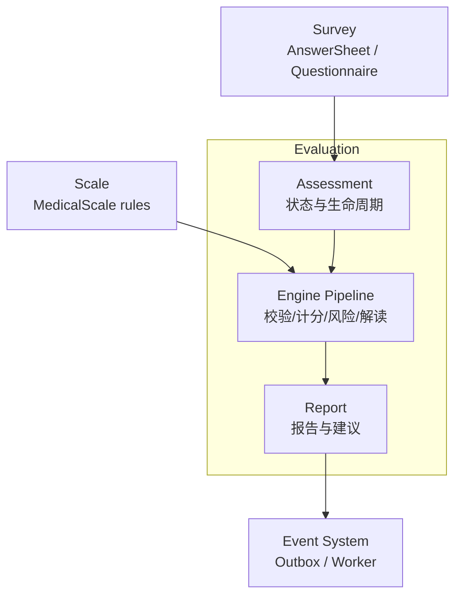
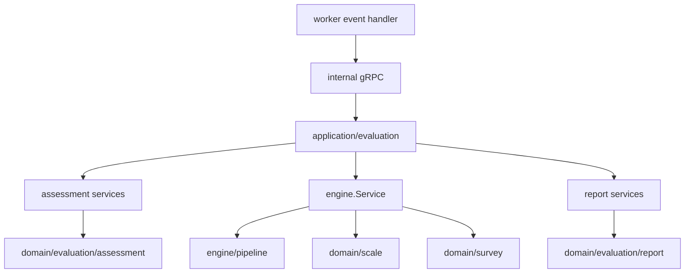

# Evaluation 整体架构

**本文回答**：`evaluation` 内部的 assessment、engine、report 三块如何协作。

## 30 秒结论

| 子域 | 职责 |
| ---- | ---- |
| `assessment` | 测评聚合、状态机、提交/重试/失败 |
| `engine` | 校验上下文、计算因子分、风险、解读、通知 waiter |
| `report` | 报告生成、查询、导出、建议策略 |

## 模块要解决什么问题

Evaluation 解决的是“把已提交答卷稳定推进为可查询、可解释、可追踪的测评产出”的问题。它不是 Survey 的后置函数，也不是 Scale 的计分工具，而是拥有自己状态机和产物边界的限界上下文。

| 问题 | Evaluation 的解法 |
| ---- | ----------------- |
| 答卷提交后何时开始评估 | `answersheet.submitted -> CreateAssessmentFromAnswerSheet -> assessment.submitted` |
| 如何避免重复评估 | `Assessment` 状态机要求 submitted 才能 Evaluate，终态不可重复成功 |
| 如何组合问卷、答卷、量表规则 | Engine Service 加载上下文，再交给 pipeline |
| 如何持久化结构化得分和报告 | `AssessmentScore` 走 MySQL，`InterpretReport` 走 Mongo |
| 如何通知下游 | 关键事件按 MySQL/Mongo 持久化边界进入 durable outbox |



## 架构设计



应用层是编排者：它加载 repository、调用领域方法、处理 outbox 和失败收口；领域层只表达 Assessment、Report 和 Interpretation 的不变量。

## 设计模式和取舍

| 模式 | 使用点 | 设计理由 |
| ---- | ------ | -------- |
| 状态机 | `Assessment.Status` 和 `Submit / ApplyEvaluation / MarkAsFailed / Retry` | 测评生命周期必须显式，不靠散落布尔值 |
| 职责链 | `engine/pipeline.Chain` | 评估步骤固定有序，失败中断，适合按 handler 拆分 |
| 策略模式 | interpretation strategy、report suggestion strategy | 解读和建议规则变化频率高，应独立扩展 |
| Builder | `ReportBuilder` | 报告由测评分数、量表、维度、建议组装而成 |
| Outbox | `assessment.*`、`report.generated` durable events | 结果持久化与事件出站保持一致性 |

取舍是：Evaluation 会成为主链路最复杂的模块，但这比把评估状态散落在 worker、Survey、Scale 里更可控。worker 只驱动，业务真值仍留在 apiserver。

## 当前边界

- `evaluation` 引用答卷和问卷版本，但不拥有问卷结构。
- `evaluation` 消费量表规则，但不维护量表因子定义。
- `report.generated` 是报告就绪信号，不代表报告导出完成。

## 代码锚点

- Assessment 应用服务：[application/evaluation/assessment](../../../internal/apiserver/application/evaluation/assessment/)
- Engine 服务：[service.go](../../../internal/apiserver/application/evaluation/engine/service.go)
- Report 服务：[application/evaluation/report](../../../internal/apiserver/application/evaluation/report/)

## Verify

```bash
go test ./internal/apiserver/application/evaluation/...
```
