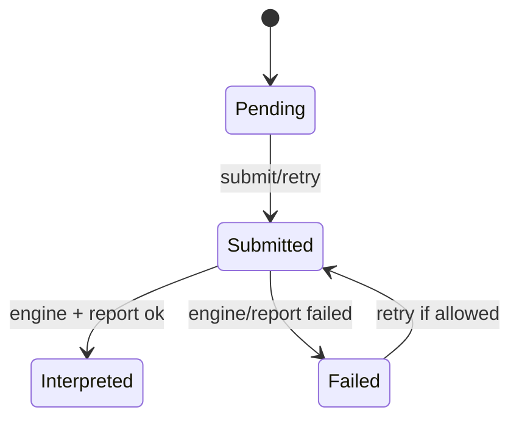
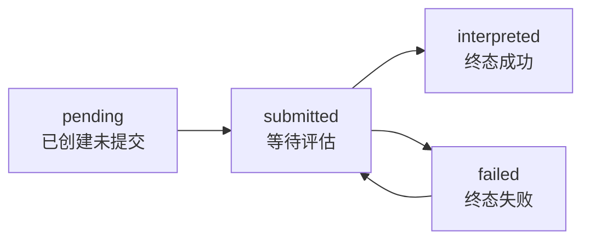

# Assessment 状态机

**本文回答**：`Assessment` 的状态如何推进，哪些事件与状态变化绑定。

## 30 秒结论

| 状态阶段 | 典型入口 | 说明 |
| -------- | -------- | ---- |
| pending / created | 答卷触发创建 | 测评已建立但未完成评估 |
| submitted | 用户或系统提交测评 | staged `assessment.submitted` |
| interpreted | engine 与 report 成功 | staged `assessment.interpreted` 与 `report.generated` |
| failed | pipeline 或业务错误 | staged `assessment.failed` |



## 不变量

- `assessment_id` 是第二跳及后续得分、报告、状态查询的主键。
- `Assessment` 保存生命周期和引用，不内嵌问卷或量表完整结构。
- 失败态必须可被查询和重试策略识别，不能只停留在日志。

## 状态机设计

`Assessment` 是 Evaluation 的聚合根，状态迁移由聚合方法控制，而不是由 repository 或 handler 直接改字段。状态机承担两个核心职责：防止重复成功执行，以及让失败补偿有明确入口。

| 方法 | 允许状态 | 目标状态 | 领域事件/副作用 |
| ---- | -------- | -------- | --------------- |
| `Submit` | `pending` | `submitted` | `assessment.submitted` |
| `ApplyEvaluation` | `submitted` | `interpreted` | `assessment.interpreted` |
| `MarkAsFailed` | 非终态场景 | `failed` | `assessment.failed` |
| `RetryFromFailed` | `failed` | `submitted` | 允许补偿重新进入评估链 |



## 为什么这样设计

| 替代方案 | 没有选择的原因 |
| -------- | -------------- |
| 用多个 bool 字段表示状态 | 容易出现 `isSubmitted && isFailed` 这类非法组合 |
| 由 worker 直接推进状态 | worker 是异步驱动器，不应拥有主业务写模型 |
| 评估失败只打日志不落状态 | 用户和运维无法查询失败状态，补偿也没有入口 |

取舍是：状态机会让每个入口都要显式处理非法状态，但这正是保护主链路幂等和可追踪性的成本。

## 设计模式应用

| 模式 | 应用位置 | 说明 |
| ---- | -------- | ---- |
| 状态机 | `Assessment` 生命周期方法 | 让合法流转显式化，拒绝任意 set status |
| 命令方法 | `Submit` / `ApplyEvaluation` / `MarkAsFailed` | 每个业务动作都有独立语义和测试入口 |
| 领域事件 | `assessment.*` | 状态变化和事件出站共享同一业务语义 |

## 代码锚点

- 聚合：[assessment.go](../../../internal/apiserver/domain/evaluation/assessment/assessment.go)
- 生命周期测试：[lifecycle_test.go](../../../internal/apiserver/domain/evaluation/assessment/lifecycle_test.go)
- 管理服务：[management_service.go](../../../internal/apiserver/application/evaluation/assessment/management_service.go)
- 提交服务：[submission_service.go](../../../internal/apiserver/application/evaluation/assessment/submission_service.go)

## Verify

```bash
go test ./internal/apiserver/domain/evaluation/assessment ./internal/apiserver/application/evaluation/assessment
```
