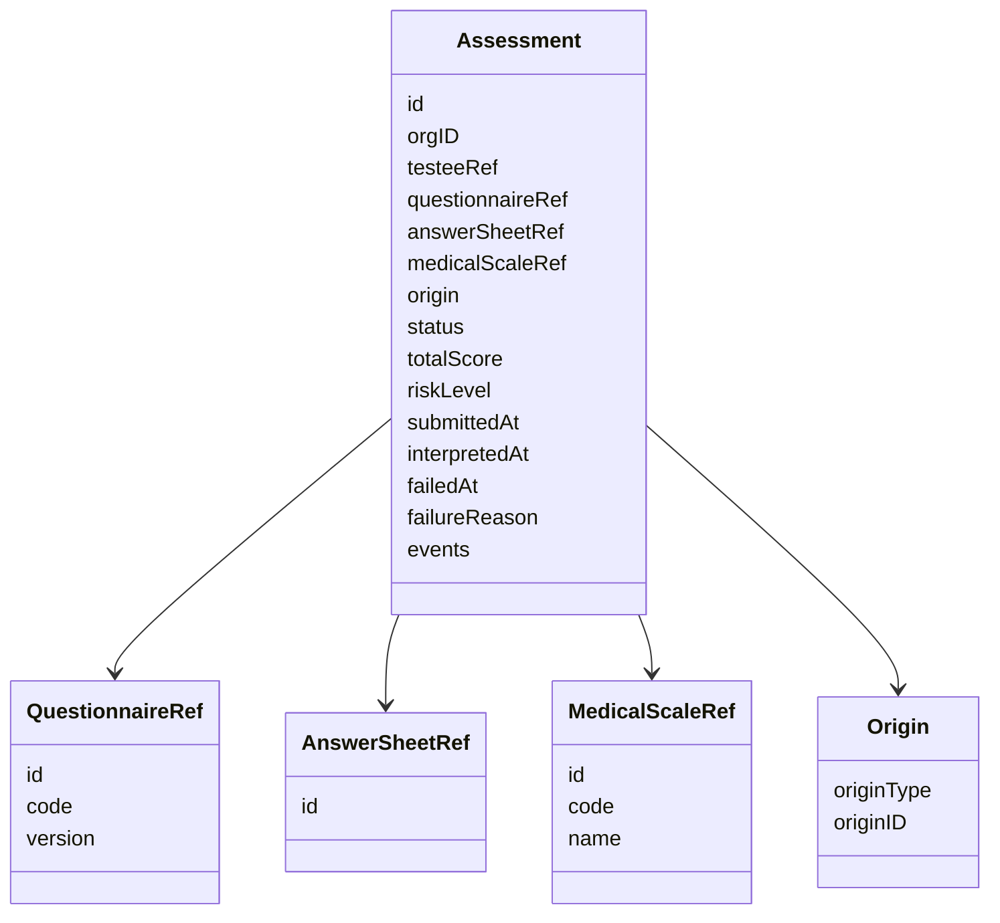
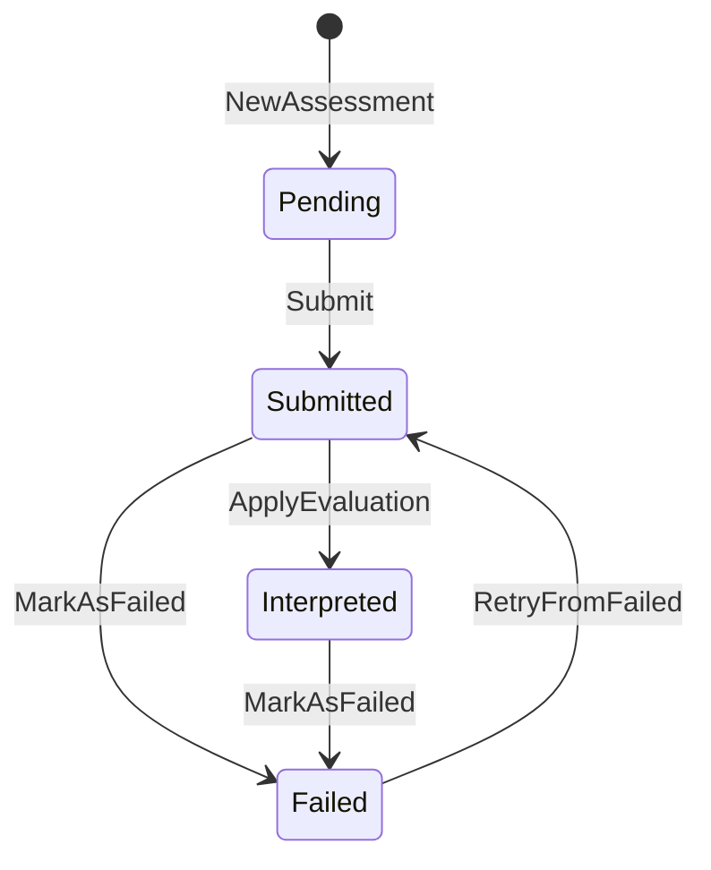
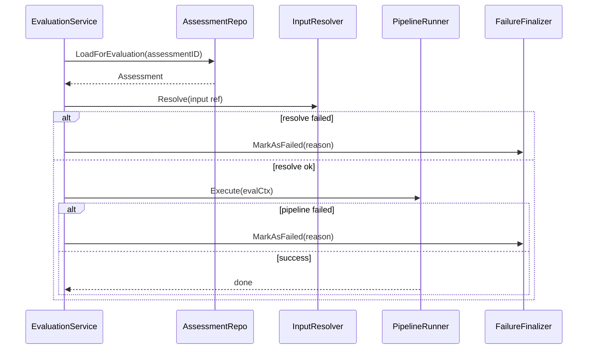

# Assessment 状态机

**本文回答**：`Assessment` 作为 Evaluation 模块核心聚合根，如何表达一次测评行为的生命周期；`pending / submitted / interpreted / failed` 四个状态分别代表什么；哪些方法可以触发状态迁移；哪些迁移会产生领域事件；为什么 `ApplyEvaluation` 不直接发布 `assessment.interpreted`；失败和重试应该如何理解。

---

## 30 秒结论

| 维度 | 结论 |
| ---- | ---- |
| 聚合定位 | `Assessment` 代表“一次具体测评行为”，不是答卷，也不是报告 |
| 状态集合 | 当前状态为 `pending / submitted / interpreted / failed` |
| 初始状态 | `NewAssessment` 创建后为 `pending` |
| 提交流转 | `Submit()` 将 `pending -> submitted`，并添加 `AssessmentSubmittedEvent` |
| 解读完成 | `ApplyEvaluation(result)` 将 `submitted -> interpreted`，记录总分和风险，但不直接添加 interpreted 事件 |
| 失败流转 | `MarkAsFailed(reason)` 将 `submitted / interpreted -> failed`，并添加 `AssessmentFailedEvent` |
| 重试流转 | `RetryFromFailed()` 将 `failed -> submitted`，清除失败信息，并重新添加 `AssessmentSubmittedEvent` |
| 可靠出站 | interpreted 相关事件应绑定在报告成功落库的 durable 边界，而不是在 `ApplyEvaluation` 中直接添加 |
| 终态语义 | `interpreted` 和 `failed` 都是 terminal status，但 `failed` 可通过显式 retry 回到 `submitted` |

一句话概括：

> **Assessment 状态机只管理一次测评行为的生命周期；报告保存、outbox 出站和 worker 消费是应用层/基础设施层要协调的可靠性问题。**

---

## 1. Assessment 是什么

`Assessment` 是 Evaluation 模块的核心聚合根，代表一次具体测评行为。

它不是：

- `AnswerSheet`：答卷只是用户提交的作答事实。
- `MedicalScale`：量表只是规则事实。
- `InterpretReport`：报告是测评完成后的产物。
- `AssessmentTask`：任务属于 Plan 模块。

它负责回答：

```text
这次测评属于哪个组织？
测的是哪个受试者？
基于哪份问卷和答卷？
是否绑定了量表？
来源是临时测评还是计划任务？
当前状态是什么？
是否已经提交、解读、失败？
总分和风险等级是什么？
失败原因是什么？
应该产生哪些测评事件？
```

---

## 2. Assessment 的核心字段



| 字段 | 说明 |
| ---- | ---- |
| `id` | 测评 ID |
| `orgID` | 组织 ID |
| `testeeRef` | 受试者引用 |
| `questionnaireRef` | 问卷引用，含 code/version |
| `answerSheetRef` | 答卷引用 |
| `medicalScaleRef` | 量表引用，可选 |
| `origin` | 来源，当前支持 `adhoc / plan` |
| `status` | 状态机当前状态 |
| `totalScore` | 总分，评估完成后写入 |
| `riskLevel` | 总体风险等级，评估完成后写入 |
| `submittedAt` | 提交时间 |
| `interpretedAt` | 解读完成时间 |
| `failedAt` | 失败时间 |
| `failureReason` | 失败原因 |
| `events` | 聚合内待发布领域事件，持久化后清空 |

---

## 3. 状态集合

当前 `Assessment.Status` 包含四个值：

| 状态 | 字符串 | 语义 |
| ---- | ------ | ---- |
| `StatusPending` | `pending` | 已创建，但尚未提交进入评估 |
| `StatusSubmitted` | `submitted` | 已提交，等待或正在执行评估 |
| `StatusInterpreted` | `interpreted` | 已完成解读，报告已生成 |
| `StatusFailed` | `failed` | 评估失败，记录失败原因 |



### 3.1 pending

`pending` 是创建后的初始状态。

典型场景：

```text
CreateAssessmentFromAnswerSheet
  -> NewAssessment(...)
  -> status = pending
```

此时 Assessment 已经具备必要引用，但还没有进入评估流程。

### 3.2 submitted

`submitted` 表示测评已提交，后续可以由 worker 触发评估。

进入方式：

```text
Assessment.Submit()
```

进入后会记录 `submittedAt`，并添加 `AssessmentSubmittedEvent`。

### 3.3 interpreted

`interpreted` 表示测评已解读完成，至少已经应用了 `EvaluationResult`，记录了总分、风险等级和解读完成时间。

进入方式：

```text
Assessment.ApplyEvaluation(result)
```

注意：这里不会直接添加 `AssessmentInterpretedEvent`。这是一个非常重要的可靠性边界。

### 3.4 failed

`failed` 表示测评失败，记录失败原因和失败时间。

进入方式：

```text
Assessment.MarkAsFailed(reason)
```

它会清理 interpreted 相关结果：

```text
interpretedAt = nil
totalScore = nil
riskLevel = nil
```

并添加 `AssessmentFailedEvent`。

---

## 4. 状态迁移方法

### 4.1 Submit

```text
pending -> submitted
```

前置条件：

| 条件 | 说明 |
| ---- | ---- |
| 当前状态必须是 `pending` | 非 pending 提交会返回 invalid status |
| Assessment 已有必填引用 | 构造函数已校验 orgID、testeeID、questionnaireRef、answerSheetRef、origin |

后置行为：

| 行为 | 说明 |
| ---- | ---- |
| 设置 `status = submitted` | 进入可评估状态 |
| 设置 `submittedAt = now` | 记录提交时间 |
| 添加 `AssessmentSubmittedEvent` | 供后续异步评估触发 |

### 4.2 ApplyEvaluation

```text
submitted -> interpreted
```

前置条件：

| 条件 | 说明 |
| ---- | ---- |
| 当前状态必须是 `submitted` | 只有已提交测评可以应用评估结果 |
| 必须绑定 MedicalScale | 纯问卷模式不能应用量表评估结果 |
| result 不能为空 | 需要 EvaluationResult |

后置行为：

| 行为 | 说明 |
| ---- | ---- |
| 设置 `totalScore` | 来自 EvaluationResult |
| 设置 `riskLevel` | 来自 EvaluationResult |
| 设置 `status = interpreted` | 表示解读完成 |
| 设置 `interpretedAt = now` | 记录完成时间 |
| 不添加 interpreted 事件 | 事件由报告成功落库边界负责 |

源码注释明确指出：`assessment.interpreted` 的可靠出站绑定在报告成功落库的 Mongo 边界，因此 `ApplyEvaluation` 不直接添加领域事件。

这能避免：

```text
Assessment 已经 interpreted
但 Report 保存失败
却已经发出 assessment.interpreted
```

### 4.3 MarkAsFailed

```text
submitted -> failed
interpreted -> failed
```

前置条件：

| 条件 | 说明 |
| ---- | ---- |
| 当前状态必须是 `submitted` 或 `interpreted` | 其它状态不能标记失败 |
| reason 不能为空 | 必须记录失败原因 |

后置行为：

| 行为 | 说明 |
| ---- | ---- |
| 设置 `status = failed` | 进入失败状态 |
| 设置 `failedAt = now` | 记录失败时间 |
| 设置 `failureReason` | 记录失败原因 |
| 清空 `interpretedAt` | 避免失败状态仍残留完成时间 |
| 清空 `totalScore / riskLevel` | 避免失败状态保留旧结果 |
| 添加 `AssessmentFailedEvent` | 供下游感知失败 |

为什么允许 `interpreted -> failed`？因为解释结果保存之后，后续报告持久化、可靠事件 staging 或其它收尾动作仍可能失败；应用层可以把已解释但最终失败的测评标记为 failed。

### 4.4 RetryFromFailed

```text
failed -> submitted
```

前置条件：

| 条件 | 说明 |
| ---- | ---- |
| 当前状态必须是 `failed` | 只有失败状态可以重试 |

后置行为：

| 行为 | 说明 |
| ---- | ---- |
| 设置 `status = submitted` | 重新进入可评估状态 |
| 设置 `submittedAt = now` | 记录本次重试提交时间 |
| 清空 `failedAt` | 清除旧失败时间 |
| 清空 `failureReason` | 清除旧失败原因 |
| 添加 `AssessmentSubmittedEvent` | 重新触发评估链路 |

---

## 5. 状态与事件关系

| 状态迁移 | 领域方法 | 添加事件 | 事件语义 |
| -------- | -------- | -------- | -------- |
| `pending -> submitted` | `Submit()` | `AssessmentSubmittedEvent` | 测评已提交，可进入评估 |
| `submitted -> interpreted` | `ApplyEvaluation()` | 无 | 只更新聚合结果；interpreted 事件由 report durable 边界负责 |
| `submitted/interpreted -> failed` | `MarkAsFailed()` | `AssessmentFailedEvent` | 测评失败 |
| `failed -> submitted` | `RetryFromFailed()` | `AssessmentSubmittedEvent` | 重试后再次进入评估 |

### 5.1 AssessmentSubmittedEvent

Payload 包含：

| 字段 | 说明 |
| ---- | ---- |
| `org_id` | 组织 |
| `assessment_id` | 测评 |
| `testee_id` | 受试者 |
| `questionnaire_code` | 问卷编码 |
| `questionnaire_version` | 问卷版本 |
| `answersheet_id` | 答卷 ID |
| `scale_code` | 量表编码，可选 |
| `scale_version` | 量表版本或名称字段 |
| `submitted_at` | 提交时间 |

其中 `NeedsEvaluation()` 会根据 `ScaleCode != ""` 判断是否需要量表评估。

### 5.2 AssessmentFailedEvent

Payload 包含：

| 字段 | 说明 |
| ---- | ---- |
| `org_id` | 组织 |
| `assessment_id` | 测评 |
| `testee_id` | 受试者 |
| `reason` | 失败原因 |
| `failed_at` | 失败时间 |

### 5.3 AssessmentInterpretedEvent

虽然事件构造函数存在，但 `Assessment.ApplyEvaluation` 不直接添加该事件。它应该由报告成功保存后的 durable 边界统一 stage。

这不是遗漏，而是刻意设计。

---

## 6. 状态机与 Evaluation service 的关系

`EvaluationService.Evaluate` 的主要流程是：



Evaluation service 不直接手写每一步状态变更，而是把不同职责交给：

| 组件 | 作用 |
| ---- | ---- |
| assessment loader | 加载并判断是否需要跳过 |
| input resolver | 加载 Scale/AnswerSheet/Questionnaire snapshot |
| pipeline runner | 执行评估职责链 |
| failure finalizer | 统一标记失败并 stage 失败事件 |
| interpretation finalizer | 应用评估结果、保存报告、stage interpreted/report 事件 |

状态机是 domain 层；service 是应用层编排。

---

## 7. 状态判断方法

Assessment 提供了一组状态判断方法：

| 方法 | 语义 |
| ---- | ---- |
| `IsPending()` | 是否 pending |
| `IsSubmitted()` | 是否 submitted |
| `IsInterpreted()` | 是否 interpreted |
| `IsFailed()` | 是否 failed |
| `IsCompleted()` | 是否 interpreted 或 failed |
| `NeedsEvaluation()` | 是否 submitted 且绑定了 MedicalScale |

其中 `NeedsEvaluation()` 非常关键：

```text
submitted + has medical scale = 需要执行量表评估
```

纯问卷模式或没有 scale 的 Assessment，不应强行进入量表评估 pipeline。

---

## 8. pending 的存在价值

很多系统会直接从答卷创建 `submitted` 状态，为什么这里有 `pending`？

`pending` 的价值是给 Assessment 创建和 Assessment 提交之间留出明确边界：

```text
已创建测评引用
但还没有进入评估队列
```

这有助于：

- 区分“测评对象创建”与“测评任务提交”。
- 支持未来从计划任务生成 Assessment，但等待答卷提交。
- 让 `Submit()` 成为唯一触发 `assessment.submitted` 的领域方法。
- 让状态迁移可测试。

---

## 9. interpreted 的可靠性边界

`interpreted` 不只是“算完分”。它意味着：

```text
EvaluationResult 已经应用到 Assessment
InterpretReport 应该已经成功生成/保存
可靠出站事件应该已经 staged
```

因此不能简单在 `ApplyEvaluation` 中发 interpreted 事件。

当前边界更合理：

```text
FactorScore / Risk / Interpretation
  -> ApplyEvaluation
  -> Save Assessment
  -> BuildAndSave Report
  -> Stage assessment.interpreted / report.generated
```

如果中间某一步失败，应由 failure path 标记失败，而不是提前发布 interpreted。

---

## 10. failed 与重试边界

### 10.1 失败来源

Assessment 可能因为这些原因失败：

| 失败来源 | 示例 |
| -------- | ---- |
| 输入加载失败 | 找不到 Scale、AnswerSheet、Questionnaire |
| 状态不合法 | Assessment 不是 submitted |
| 因子计分失败 | 未知 strategy 或缺失输入 |
| 解释失败 | interpretengine 未配置或规则不完整 |
| 报告保存失败 | Report writer 失败 |
| outbox staging 失败 | 事件无法可靠出站 |

### 10.2 RetryFromFailed

重试不是重新创建 Assessment，而是把原 Assessment 从 failed 拉回 submitted。这样可以保留：

- 原 assessment_id。
- 原 answerSheetRef。
- 原 questionnaireRef。
- 原 medicalScaleRef。
- 原 origin。

但会清除：

- failedAt。
- failureReason。

并重新发出 submitted 事件，触发评估链路。

### 10.3 重试不是万能修复

如果失败原因是规则配置错误，例如 Scale 绑定了错误的 questionCodes，需要先修规则，再重试。否则只是重复失败。

---

## 11. 与 outbox 的边界

Assessment 聚合只负责收集领域事件，不负责可靠投递。

| 层 | 负责 |
| -- | ---- |
| Domain | 添加 `AssessmentSubmittedEvent` / `AssessmentFailedEvent` |
| Application | 持久化状态、stage event |
| Outbox | 可靠出站、重试、标记 published/failed |
| Worker | 消费事件、推进后续动作 |

不要让 domain 直接依赖 MQ、outbox store 或 event publisher。

---

## 12. 状态迁移规则表

| 当前状态 | 操作 | 结果状态 | 是否允许 | 说明 |
| -------- | ---- | -------- | -------- | ---- |
| pending | Submit | submitted | 是 | 正常进入评估 |
| pending | ApplyEvaluation | - | 否 | 还没有提交，不能应用结果 |
| pending | MarkAsFailed | - | 否 | 当前实现只允许 submitted/interpreted 失败 |
| pending | RetryFromFailed | - | 否 | 不是 failed |
| submitted | Submit | - | 否 | 不能重复提交 |
| submitted | ApplyEvaluation | interpreted | 是 | 评估成功 |
| submitted | MarkAsFailed | failed | 是 | 评估失败 |
| submitted | RetryFromFailed | - | 否 | 不是 failed |
| interpreted | Submit | - | 否 | 已解读 |
| interpreted | ApplyEvaluation | - | 否 | 不能重复应用 |
| interpreted | MarkAsFailed | failed | 是 | 收尾失败可回落为 failed |
| interpreted | RetryFromFailed | - | 否 | 不是 failed |
| failed | Submit | - | 否 | 必须走 RetryFromFailed |
| failed | ApplyEvaluation | - | 否 | 不能直接应用 |
| failed | MarkAsFailed | - | 否 | 当前不重复失败 |
| failed | RetryFromFailed | submitted | 是 | 重新触发评估 |

---

## 13. 设计模式与实现意图

| 模式 | 当前实现 | 意图 |
| ---- | -------- | ---- |
| Aggregate Root | `Assessment` | 收口一次测评行为的状态和结果 |
| State Machine | `Status` + 迁移方法 | 避免应用层随意改状态 |
| Value Object | `QuestionnaireRef / AnswerSheetRef / MedicalScaleRef / Origin` | 用引用表达跨聚合关系，而不是直接持有对象 |
| Domain Event | `AssessmentSubmittedEvent / AssessmentFailedEvent` | 将状态变化通知应用层出站 |
| Factory Method | `NewAdhocAssessment / NewPlanAssessment` | 按来源创建测评 |
| Reconstruct | `Reconstruct(...)` | 仓储层从持久化数据重建聚合，不触发业务事件 |
| Finalizer | failure / interpretation finalizer | 应用层统一处理失败和结果落库边界 |

---

## 14. 设计取舍

| 设计 | 收益 | 代价 |
| ---- | ---- | ---- |
| Assessment 独立于 AnswerSheet | 测评状态和作答事实分离 | 需要通过引用关联 |
| pending/submitted 分离 | 创建和提交边界清楚 | 多一个状态需要维护 |
| ApplyEvaluation 不发 interpreted 事件 | 避免报告保存与事件出站不一致 | 事件逻辑需要在应用层 finalizer 中处理 |
| interpreted 可转 failed | 能表达收尾失败 | 需要谨慎处理已生成部分结果 |
| failed 可重试 | 支持补偿 | 重试前要确认根因已修复 |
| 使用 refs 而非直接聚合 | 降低跨模块耦合 | 需要 input resolver 加载快照 |

---

## 15. 常见误区

### 15.1 “Assessment 就是 AnswerSheet 的状态字段”

错误。AnswerSheet 是作答事实，Assessment 是测评行为。一个答卷可以驱动一次测评，但二者不应合成一个聚合。

### 15.2 “interpreted 只表示算分完成”

不准确。interpreted 应代表测评解读结果已经应用，并与报告保存、事件出站边界协同。

### 15.3 “ApplyEvaluation 应该发 interpreted 事件”

当前不应这样做。因为 interpreted 事件要等报告成功落库后再可靠出站。

### 15.4 “failed 是终态，不能重试”

当前支持 `RetryFromFailed()`。但重试只是重新触发评估，不代表自动修复错误根因。

### 15.5 “submitted 可以重复触发”

不应直接重复 Submit。重复评估应通过失败重试或显式补偿命令设计。

---

## 16. 代码锚点

### Domain

- Assessment 聚合：[../../../internal/apiserver/domain/evaluation/assessment/assessment.go](../../../internal/apiserver/domain/evaluation/assessment/assessment.go)
- Assessment 类型和值对象：[../../../internal/apiserver/domain/evaluation/assessment/types.go](../../../internal/apiserver/domain/evaluation/assessment/types.go)
- Assessment 事件：[../../../internal/apiserver/domain/evaluation/assessment/events.go](../../../internal/apiserver/domain/evaluation/assessment/events.go)

### Application

- Evaluation service：[../../../internal/apiserver/application/evaluation/engine/service.go](../../../internal/apiserver/application/evaluation/engine/service.go)
- Pipeline context：[../../../internal/apiserver/application/evaluation/engine/pipeline/context.go](../../../internal/apiserver/application/evaluation/engine/pipeline/context.go)
- Interpretation handler：[../../../internal/apiserver/application/evaluation/engine/pipeline/interpretation.go](../../../internal/apiserver/application/evaluation/engine/pipeline/interpretation.go)

### Event / Outbox

- Event catalog：[../../../configs/events.yaml](../../../configs/events.yaml)
- Eventing application：[../../../internal/apiserver/application/eventing/](../../../internal/apiserver/application/eventing/)
- Outbox core：[../../../internal/apiserver/outboxcore/](../../../internal/apiserver/outboxcore/)

---

## 17. Verify

```bash
go test ./internal/apiserver/domain/evaluation/assessment
go test ./internal/apiserver/application/evaluation/engine
go test ./internal/apiserver/application/evaluation/engine/pipeline
```

如果修改状态事件或 outbox 语义：

```bash
go test ./internal/apiserver/application/eventing
go test ./internal/apiserver/outboxcore
go test ./internal/worker/handlers
```

如果修改接口状态枚举：

```bash
make docs-rest
make docs-verify
```

---

## 18. 下一跳

| 目标 | 下一篇 |
| ---- | ------ |
| 理解评估执行流程 | [02-EnginePipeline.md](./02-EnginePipeline.md) |
| 理解报告与解释保存 | [03-Report与Interpretation.md](./03-Report与Interpretation.md) |
| 理解事件可靠出站 | [04-Outbox与可靠出站.md](./04-Outbox与可靠出站.md) |
| 理解失败与重试 | [05-评估失败与重试SOP.md](./05-评估失败与重试SOP.md) |
| 回看整体模型 | [00-整体模型.md](./00-整体模型.md) |
