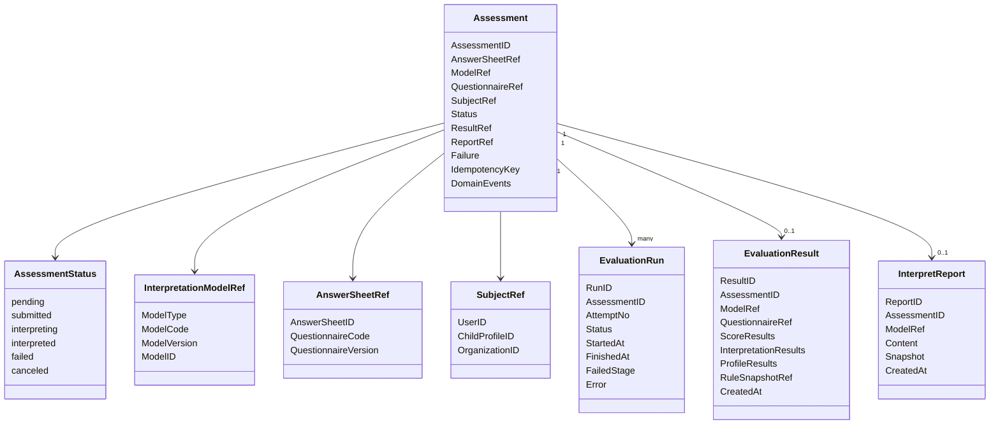
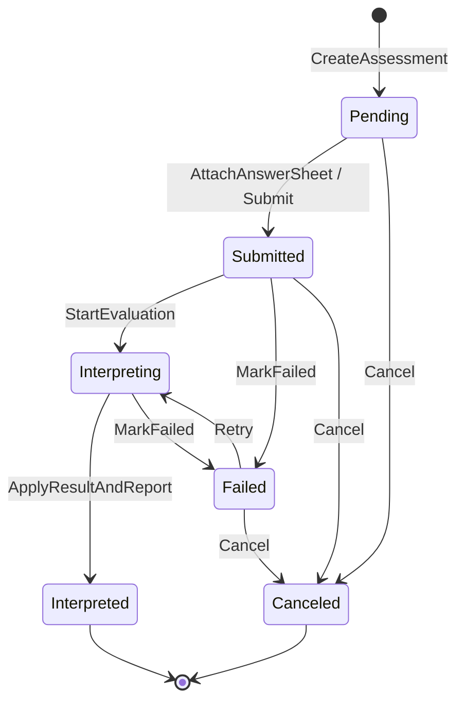

# 01-Evaluation模型：Assessment / EvaluationRun / Result / Report 模型设计

> 本文是 Evaluation 模块文档的第一篇，聚焦 **Evaluation 的领域模型设计**。
>
> Evaluation 的核心不是“量表规则”，也不是“问卷提交”，而是一次测评执行事实。它需要记录：这次测评由哪份答卷触发、使用哪个解释模型、执行到了什么状态、是否失败、产出了哪些结果、生成了哪份报告。
>
> 在新的架构语义下，Evaluation 应被理解为 **通用测评执行引擎**：它通过 `InterpretationModelRef` 指向 Scale、MBTI、BigFive 等具体解释模型，通过 `Assessment` 聚合管理一次测评的生命周期，通过 `EvaluationResult` 和 `InterpretReport` 保存执行产物。

---

## 1. 结论先行

Evaluation 模块的核心聚合是 `Assessment`。

`Assessment` 表示一次测评执行事实。

它不是问卷，不是答卷，也不是量表规则。

它连接三类外部事实：

```text
AnswerSheetRef            指向 Survey 中的答卷事实
InterpretationModelRef    指向 Interpretation Model 中的解释模型
SubjectRef                指向被测对象或用户上下文
```

它内部管理三类执行事实：

```text
AssessmentStatus          当前执行状态
EvaluationRun             执行尝试记录
EvaluationResult          执行结果
InterpretReport           最终报告
```

一句话概括：

> **Assessment 是一次测评执行聚合，负责把答卷事实、解释模型和执行结果收束到同一个生命周期边界内。**

Evaluation 模型的核心对象包括：

```text
Assessment                 一次测评执行聚合根
AssessmentStatus           测评状态
AssessmentRef              测评引用
AnswerSheetRef             答卷引用
SubjectRef                 被测对象引用
InterpretationModelRef     解释模型引用
QuestionnaireRef           问卷版本引用
EvaluationRun              一次执行尝试记录
EvaluationInput            执行输入
EvaluationResult           模型执行结果
ScoreResult                分数类结果
InterpretationResult       解释类结果
RiskLevelResult            风险等级命中结果
ProfileResult              画像类结果
InterpretReport            最终报告事实
FailureReason              失败原因
IdempotencyKey             幂等键
EvaluationEvent            测评领域事件
```

---

## 2. 本文边界

本文重点：

```text
Assessment 聚合根；
AssessmentStatus 状态机；
AssessmentRef / AnswerSheetRef / SubjectRef；
InterpretationModelRef；
QuestionnaireRef；
EvaluationRun；
EvaluationInput；
EvaluationResult；
ScoreResult / InterpretationResult / ProfileResult；
InterpretReport；
FailureReason；
IdempotencyKey；
Evaluation 领域事件；
Evaluation 与 Survey / Assessment Model / MBTI / Interpretation Model 的模型边界。
```

本文不展开：

```text
AnswerSheet 如何提交；
Questionnaire 如何建模；
MedicalScale / Factor / ScoringSpec 如何维护；
MBTI 四维度如何设计；
Provider 如何注册和执行；
Worker 如何消费事件；
失败重试的完整流程；
Outbox 与 MQ 的基础设施实现。
```

这些由其它文档承接：

```text
../survey/README.md
../scale/README.md
../interpretation-model/README.md
../assessment-model/README.md
02-Evaluation执行链路--从AnswerSheet提交到Assessment完成.md
03-Evaluation引擎链路--模型解析-规则加载-执行-报告生成.md
04-Evaluation失败重试链路--幂等-错误状态-补偿处理.md
05-Evaluation事件链路--答卷提交-测评完成-报告生成.md
06-Evaluation模块分层架构与事实源索引.md
```

---

## 3. Evaluation 模型总览

Evaluation 的模型关系可以抽象为：



这张图表达的是：

```text
Assessment 是主聚合；
AnswerSheetRef 指向答卷事实；
ModelRef 指向解释模型；
SubjectRef 指向被测对象；
EvaluationRun 记录执行尝试；
EvaluationResult 记录模型执行产物；
InterpretReport 记录最终报告事实。
```

---

## 4. 为什么 Assessment 是聚合根

Evaluation 不是简单的结果表。

一次测评执行会涉及：

```text
答卷引用；
模型引用；
被测对象；
状态流转；
执行尝试；
失败原因；
结果保存；
报告生成；
事件出站；
幂等控制。
```

这些信息共同描述一次测评执行事实。

因此需要一个聚合根统一保护生命周期不变量。

这个聚合根就是 `Assessment`。

典型不变量包括：

```text
同一个 AnswerSheet 通常只能生成一个有效 Assessment；
Assessment 必须绑定明确的 AnswerSheetRef；
Assessment 必须绑定明确的 InterpretationModelRef；
执行前必须校验 AnswerSheetRef 与 ModelContext 的 QuestionnaireRef 一致；
只有 submitted / failed 状态可以进入解释执行；
interpreted 状态下不能重复应用不同结果；
failed 状态必须记录失败阶段和失败原因；
报告保存成功前不能发布 interpreted 完成事件；
重试必须使用原始 ModelRef，而不能自动切换最新模型。
```

这些规则如果散落在 service、worker、repository 中，后续很容易漂移。

所以 Assessment 应作为执行聚合根，统一管理状态与结果引用。

---

## 5. Assessment 核心结构

`Assessment` 可以抽象为：

```text
Assessment
├── AssessmentID
├── AnswerSheetRef
├── InterpretationModelRef
├── QuestionnaireRef
├── SubjectRef
├── Status
├── ResultRef
├── ReportRef
├── Failure
├── IdempotencyKey
├── CreatedAt / UpdatedAt
└── DomainEvents
```

字段可以分为五类。

| 类型 | 字段 | 说明 |
| --- | --- | --- |
| 外部引用 | AnswerSheetRef / ModelRef / SubjectRef | 连接答卷、解释模型和被测对象 |
| 一致性引用 | QuestionnaireRef | 执行前校验答卷与模型上下文一致 |
| 生命周期 | Status / Failure / Runs | 管理执行状态、失败和重试 |
| 结果引用 | ResultRef / ReportRef | 指向执行结果和报告 |
| 治理字段 | IdempotencyKey / Audit / Events | 幂等、审计、事件出站 |

其中最关键的是：

```text
AnswerSheetRef + InterpretationModelRef + QuestionnaireRef
```

它们共同决定：

```text
本次测评基于哪份答卷；
本次测评使用哪套解释模型；
本次测评要求答卷和模型基于同一问卷版本；
本次测评结果未来如何追溯。
```

---

## 6. Assessment 与 AnswerSheet 的区别

`AnswerSheet` 属于 Survey。

它表达：

```text
用户提交了什么答案。
```

`Assessment` 属于 Evaluation。

它表达：

```text
这份答案被哪套模型解释，执行到了什么状态，产出了什么结果。
```

二者的区别如下：

| 对象 | 所属模块 | 核心语义 |
| --- | --- | --- |
| AnswerSheet | Survey | 答卷事实 |
| Assessment | Evaluation | 测评执行事实 |

AnswerSheet 中应该保存：

```text
AnswerSheetID；
QuestionnaireCode；
QuestionnaireVersion；
Answers；
SubmittedBy；
SubmittedAt。
```

Assessment 中应该保存：

```text
AssessmentID；
AnswerSheetRef；
ModelRef；
SubjectRef；
Status；
ResultRef；
ReportRef；
Failure。
```

不要把 Assessment 状态塞进 AnswerSheet。

也不要把 Answer 明细塞进 Assessment。

---

## 7. Assessment 与 MedicalScale 的区别

`MedicalScale` 属于 Scale。

它表达：

```text
医学量表规则。
```

`Assessment` 属于 Evaluation。

它表达：

```text
某一次测评执行。
```

二者的区别如下：

| 对象 | 所属模块 | 核心语义 |
| --- | --- | --- |
| MedicalScale | Scale | 规则聚合 |
| Assessment | Evaluation | 执行聚合 |

MedicalScale 中应该保存：

```text
Factor；
ScoringSpec；
InterpretationRules；
RiskLevel；
QuestionnaireRef；
发布状态。
```

Assessment 中应该保存：

```text
AnswerSheetRef；
ModelRef；
EvaluationRun；
EvaluationResult；
InterpretReport；
失败状态。
```

必须区分：

```text
Factor 是规则，FactorScore 是结果；
RiskLevel 是规则等级，RiskLevelResult 是命中结果；
InterpretationRule 是规则，InterpretationResult 是执行结果；
MedicalScale 是规则，Assessment 是执行。
```

---

## 8. AssessmentStatus 状态机

Assessment 需要显式状态机。

推荐基础状态：

```text
pending        已创建，等待答卷或任务触发
submitted      答卷已提交，等待解释执行
interpreting   正在执行解释
interpreted    解释完成，结果与报告已保存
failed         执行失败，可重试或人工处理
canceled       已取消，不再执行
```

状态图：



### 8.1 pending

`pending` 表示 Assessment 已创建，但尚未进入正式解释执行。

适用场景：

```text
先创建测评任务，后提交答卷；
预约测评；
批量导入待测评任务。
```

如果系统是答卷提交后才创建 Assessment，也可以少用 pending。

### 8.2 submitted

`submitted` 表示答卷已经提交，Assessment 已具备执行条件。

此时应已经拥有：

```text
AnswerSheetRef；
ModelRef；
QuestionnaireRef；
SubjectRef。
```

### 8.3 interpreting

`interpreting` 表示 Evaluation 正在执行。

这个状态用于防止重复执行和并发重入。

如果系统不希望持久化中间状态，也可以用 EvaluationRun 表达执行中状态。

### 8.4 interpreted

`interpreted` 表示执行成功。

进入该状态前应确保：

```text
EvaluationResult 已保存；
InterpretReport 已保存或明确不需要报告；
必要事件已进入可靠出站边界。
```

### 8.5 failed

`failed` 表示执行失败。

必须记录：

```text
FailedStage；
FailureReason；
RawError；
OccurredAt；
是否可重试。
```

### 8.6 canceled

`canceled` 表示测评已取消。

取消后不应再执行。

---

## 9. Assessment 行为方法

Assessment 不应该只是贫血数据结构。

它应暴露明确行为保护状态迁移。

推荐行为：

```text
Submit(answerSheetRef, questionnaireRef)
StartEvaluation(runID, now)
ApplyResult(resultRef, reportRef, now)
MarkFailed(failure, now)
Retry(runID, now)
Cancel(reason, now)
RecordRun(run)
PullEvents()
```

这些行为应保护：

```text
不能从 interpreted 回到 interpreting；
不能在 canceled 后继续执行；
不能在没有 AnswerSheetRef 的情况下 StartEvaluation；
不能 ApplyResult 两套不同结果；
MarkFailed 必须带失败原因；
Retry 必须保留原始 ModelRef；
ApplyResult 前应确保 ResultRef / ReportRef 合法。
```

错误方向：

```go
assessment.Status = StatusInterpreted
assessment.ResultID = resultID
assessment.ReportID = reportID
```

正确方向：

```go
assessment.ApplyResult(resultRef, reportRef, now)
```

---

## 10. AssessmentRef

`AssessmentRef` 是一次测评的引用。

它用于在 Evaluation 内部组件之间传递测评标识。

推荐结构：

```text
AssessmentRef
├── AssessmentID
└── AssessmentCode 可选
```

`AssessmentRef` 常用于：

```text
EvaluationInput；
EvaluationRun；
EvaluationResult；
InterpretReport；
事件 payload；
日志 trace；
幂等键。
```

它不应该包含完整 Assessment 聚合。

---

## 11. AnswerSheetRef

`AnswerSheetRef` 指向 Survey 中的答卷事实。

推荐结构：

```text
AnswerSheetRef
├── AnswerSheetID
├── QuestionnaireCode
└── QuestionnaireVersion
```

其中：

```text
AnswerSheetID 用于加载答卷；
QuestionnaireCode / QuestionnaireVersion 用于执行一致性校验。
```

Evaluation 加载模型上下文后，必须校验：

```text
AnswerSheetRef.QuestionnaireCode == ModelContext.QuestionnaireCode
AnswerSheetRef.QuestionnaireVersion == ModelContext.QuestionnaireVersion
```

这可以防止用错误版本的模型规则解释答卷。

---

## 12. InterpretationModelRef

`InterpretationModelRef` 指向解释模型。

它来自 interpretation-model 抽象层。

推荐结构：

```text
InterpretationModelRef
├── ModelType
├── ModelCode
├── ModelVersion
└── ModelID
```

Scale 示例：

```text
ModelType    = scale
ModelCode    = ADHD_PARENT
ModelVersion = 1.0.0
ModelID      = medical_scale_id
```

MBTI 示例：

```text
ModelType    = mbti
ModelCode    = MBTI_STANDARD
ModelVersion = 1.0.0
ModelID      = mbti_model_id
```

Assessment 必须持有 ModelRef。

原因是：

```text
执行需要知道使用哪个模型；
失败重试需要加载原始模型；
历史报告需要追溯规则版本；
Evaluation 主流程需要通过 ModelType 解析 Provider。
```

不建议只保存 `scale_id`。

否则后续 MBTI 接入会污染 Assessment 模型。

---

## 13. QuestionnaireRef

`QuestionnaireRef` 是答卷与模型规则之间的一致性引用。

推荐结构：

```text
QuestionnaireRef
├── QuestionnaireCode
└── QuestionnaireVersion
```

Assessment 中保存 QuestionnaireRef 的原因是：

```text
便于执行前校验；
便于日志和排障；
便于报告追溯；
避免每次都从 AnswerSheet 和 ModelContext 中反查；
便于幂等重试时确认原始执行上下文。
```

注意：QuestionnaireRef 不是 Questionnaire 聚合。

Evaluation 不拥有 Questionnaire。

---

## 14. SubjectRef

`SubjectRef` 表示被测对象。

不同业务场景下，被测对象可能不同：

```text
用户本人；
儿童档案；
患者；
学生；
组织成员；
匿名受试者。
```

推荐结构：

```text
SubjectRef
├── UserID
├── ChildProfileID
├── OrganizationID
├── SubjectType
└── ExternalID 可选
```

SubjectRef 的作用是：

```text
标识结果归属；
支持报告查询；
支持统计聚合；
支持权限控制；
支持后续用户画像系统接入。
```

Evaluation 不应该直接修改用户或档案信息。

它只保存引用。

---

## 15. EvaluationRun：执行尝试记录

`EvaluationRun` 表示一次执行尝试。

为什么需要 EvaluationRun？

因为一次 Assessment 可能执行多次：

```text
首次执行成功；
首次执行失败后重试；
Worker 重复消费但幂等拦截；
报告保存失败后补偿；
人工触发重跑。
```

如果只有 Assessment.Status，无法清楚记录每次执行过程。

`EvaluationRun` 可以抽象为：

```text
EvaluationRun
├── RunID
├── AssessmentID
├── AttemptNo
├── Status
├── StartedAt
├── FinishedAt
├── FailedStage
├── FailureReason
├── RawError
├── TraceID
└── Metadata
```

### 15.1 RunStatus

推荐状态：

```text
running
succeeded
failed
skipped
```

其中：

```text
running    执行中；
succeeded  执行成功；
failed     执行失败；
skipped    幂等跳过或无需执行。
```

### 15.2 AttemptNo

AttemptNo 用于记录第几次尝试。

例如：

```text
1 首次执行；
2 第一次重试；
3 第二次重试。
```

### 15.3 FailedStage

FailedStage 用于定位失败发生在哪个阶段。

典型值：

```text
LoadAnswerSheet
ResolveProvider
LoadModelContext
ValidateQuestionnaireRef
ProviderEvaluate
BuildReport
SaveResult
SaveReport
PublishEvent
```

EvaluationRun 是失败重试和运维排障的重要事实源。

---

## 16. EvaluationInput

`EvaluationInput` 是执行引擎或 Provider 的输入。

它不是持久化主实体，而是执行时组装的输入对象。

推荐结构：

```text
EvaluationInput
├── AssessmentRef
├── AnswerSheetRef
├── AnswerSheetSnapshot
├── SubjectRef
├── QuestionnaireRef
├── ModelRef
├── RuntimeOptions
└── TraceContext
```

字段说明：

```text
AssessmentRef       标识本次测评；
AnswerSheetRef      标识答卷；
AnswerSheetSnapshot 承载只读答案事实；
SubjectRef          标识被测对象；
QuestionnaireRef    用于一致性校验；
ModelRef            标识解释模型；
RuntimeOptions      控制执行行为；
TraceContext        用于日志追踪。
```

EvaluationInput 的边界：

```text
它可以被 Provider 读取；
它不应该被 Provider 修改；
它不应该包含可变 AnswerSheet 聚合；
它不应该包含 MedicalScale 或 MBTIModel 聚合；
它不负责保存结果。
```

---

## 17. EvaluationResult

`EvaluationResult` 是 Provider 执行后的统一结果对象。

它可以作为持久化结果的来源，也可以先作为中间结果由 Evaluation 应用服务拆分保存。

推荐结构：

```text
EvaluationResult
├── ResultID
├── AssessmentRef
├── ModelRef
├── QuestionnaireRef
├── ScoreResults
├── InterpretationResults
├── ProfileResults
├── ReportDraft
├── RuleSnapshotRef
├── CreatedAt
└── Metadata
```

EvaluationResult 的职责：

```text
承载模型执行产物；
统一不同模型的返回结果；
为报告生成提供输入；
为状态推进提供依据；
为审计和历史追溯提供模型引用与规则快照引用。
```

EvaluationResult 不应该：

```text
修改 Assessment 状态；
直接保存报告；
发布事件；
修改模型规则；
修改 AnswerSheet。
```

这些属于 Evaluation 应用服务的事务编排。

---

## 18. ScoreResult

`ScoreResult` 是分数类结果的抽象。

不同模型的分数形态不同。

Scale 场景下可能是：

```text
FactorScore
├── FactorCode
├── Score
├── MaxScore
├── IsTotalScore
└── RawItems
```

MBTI 场景下可能是：

```text
DimensionScore
├── DimensionCode
├── LeftScore
├── RightScore
├── Preference
└── Strength
```

因此不建议把 Evaluation 的通用分数结果强行命名为 FactorScore。

更合理的抽象是：

```text
ScoreResult
├── ScoreType
├── Code
├── Value
├── MaxValue
├── Detail
└── Metadata
```

具体模型可以扩展自己的 result detail。

---

## 19. InterpretationResult

`InterpretationResult` 是解释类结果。

它表示模型根据分数、规则或类型生成的解释。

Scale 场景下可能是：

```text
FactorInterpretation
├── FactorCode
├── Score
├── RiskLevelResult
├── Conclusion
└── Suggestion
```

MBTI 场景下可能是：

```text
TypeInterpretation
├── TypeCode
├── TypeName
├── Summary
├── Strengths
├── Weaknesses
└── Suggestions
```

通用抽象可以是：

```text
InterpretationResult
├── ResultType
├── Code
├── Title
├── Summary
├── Details
├── Suggestions
└── Metadata
```

注意：

```text
InterpretationRule 是模型规则；
InterpretationResult 是本次执行结果。
```

---

## 20. RiskLevelResult

`RiskLevelResult` 是风险等级命中结果。

它常见于医学量表。

Scale 中的 `RiskLevel` 是规则等级。

Evaluation 中的 `RiskLevelResult` 是某次测评实际命中的等级。

推荐结构：

```text
RiskLevelResult
├── SourceCode
├── RiskLevel
├── Rank
├── Label
├── Score
└── Metadata
```

其中 SourceCode 可以是：

```text
FactorCode；
TotalScore；
DimensionCode。
```

需要注意：

```text
RiskLevelResult 不一定适用于所有模型；
MBTI 不一定有 RiskLevel；
不要让通用 EvaluationResult 强依赖 RiskLevelResult。
```

---

## 21. ProfileResult

`ProfileResult` 用于人格画像、能力画像、发展画像、职业画像等结果。

它对 MBTI、BigFive、职业兴趣模型尤其重要。

推荐结构：

```text
ProfileResult
├── ProfileType
├── Code
├── Title
├── Summary
├── Traits
├── Strengths
├── Risks
├── Suggestions
└── Metadata
```

Scale 可以不用 ProfileResult。

MBTI 可能大量使用 ProfileResult。

这说明 Evaluation 的结果模型不能只围绕医学量表设计。

---

## 22. InterpretReport

`InterpretReport` 是最终报告事实。

它属于 Evaluation。

它不是 Scale 的 InterpretationRule，也不是 MBTI 的 TypeProfile。

它可以抽象为：

```text
InterpretReport
├── ReportID
├── AssessmentID
├── ModelRef
├── QuestionnaireRef
├── SubjectRef
├── Content
├── Snapshot
├── Version
├── CreatedAt
└── Metadata
```

### 22.1 Content

Content 是报告内容。

可以是：

```text
结构化 JSON；
Markdown；
HTML；
PDF 渲染源；
前端组件 schema。
```

推荐优先保存结构化内容，方便后续多端渲染。

### 22.2 Snapshot

Snapshot 保存生成报告时使用的上下文摘要。

例如：

```text
AnswerSheetRef；
ModelRef；
QuestionnaireRef；
ScoreResults；
InterpretationResults；
RuleSnapshotRef；
GeneratedAt。
```

Snapshot 的价值是：

```text
报告可追溯；
模型规则变化后历史报告不漂移；
前端展示不需要重新执行测评；
排障时知道报告来自哪次执行结果。
```

### 22.3 Report 与 EvaluationResult 的关系

`EvaluationResult` 是执行产物。

`InterpretReport` 是面向用户或业务展示的报告事实。

二者可能一一对应，也可能一个 EvaluationResult 生成多个报告视图。

例如：

```text
家长版报告；
医生版报告；
运营摘要报告；
前端动态卡片报告。
```

---

## 23. FailureReason

`FailureReason` 表示执行失败原因。

推荐结构：

```text
FailureReason
├── FailedStage
├── Code
├── Message
├── RawError
├── Retryable
├── OccurredAt
└── Metadata
```

典型 FailedStage：

```text
LoadAnswerSheet
ResolveProvider
LoadModelContext
ValidateQuestionnaireRef
ProviderEvaluate
BuildReport
SaveResult
SaveReport
PublishEvent
```

典型 Code：

```text
AnswerSheetNotFound
ProviderNotFound
ModelNotFound
ModelNotPublished
QuestionnaireRefMismatch
EvaluateFailed
ReportBuildFailed
ReportSaveFailed
EventPublishFailed
```

FailureReason 的作用是：

```text
让 failed 状态可诊断；
让重试策略可判断；
让运维排障有依据；
让人工修复有入口。
```

---

## 24. IdempotencyKey

`IdempotencyKey` 用于防止重复提交、重复消费和重复执行。

常见来源：

```text
AnswerSheetID；
AssessmentID；
AnswerSheetSubmittedEventID；
业务请求 ID；
ModelRef + AnswerSheetRef 组合。
```

推荐组合：

```text
assessment:{answerSheetID}:{modelType}:{modelCode}:{modelVersion}
```

这样可以保证：

```text
同一份 AnswerSheet 对同一个模型版本只生成一个有效 Assessment；
重复消费事件不会重复生成报告；
重试不会创建新的 Assessment；
不同模型可以对同一份 AnswerSheet 独立执行。
```

需要注意：

```text
幂等不是简单的唯一索引；
还需要配合状态机和 EvaluationRun；
并发执行时需要事务或锁保护。
```

---

## 25. Evaluation 领域事件

Evaluation 应产生描述执行事实变化的事件。

典型事件包括：

```text
AssessmentCreatedEvent
AssessmentSubmittedEvent
AssessmentStartedEvent
AssessmentInterpretedEvent
AssessmentFailedEvent
InterpretReportGeneratedEvent
```

事件语义：

```text
AssessmentCreatedEvent        测评创建；
AssessmentStartedEvent        测评开始执行；
AssessmentInterpretedEvent    测评解释完成；
AssessmentFailedEvent         测评执行失败；
InterpretReportGeneratedEvent 报告生成完成。
```

这些事件不同于：

```text
AnswerSheetSubmittedEvent     Survey 事件，表示答卷提交；
ScaleChangedEvent             Scale 事件，表示规则变化；
MBTIModelChangedEvent         MBTI 事件，表示模型规则变化。
```

不要混淆。

---

## 26. 结果保存边界

Evaluation 执行成功后，需要保存：

```text
EvaluationResult；
InterpretReport；
Assessment 状态；
EvaluationRun；
待出站事件。
```

建议的可靠边界是：

```text
保存 EvaluationResult
保存 InterpretReport
ApplyResult 推进 Assessment 状态
记录 EvaluationRun 成功
stage AssessmentInterpretedEvent / ReportGeneratedEvent
```

这些应尽量处于同一个可靠事务或一致性边界内。

否则容易出现：

```text
结果保存成功，但 Assessment 状态没变；
Assessment interpreted，但 Report 没保存；
Report 保存了，但完成事件没发布；
事件发布了，但数据库事务回滚。
```

---

## 27. 与 Interpretation Model 的关系

Evaluation 通过 Interpretation Model 抽象执行具体模型。

关系是：

```text
Assessment.ModelRef
    ↓
InterpretationRegistry.Resolve(ModelType)
    ↓
Provider.LoadContext(ModelRef)
    ↓
Provider.Evaluate(EvaluationInput, Context)
    ↓
EvaluationResult
    ↓
Assessment.ApplyResult
```

Evaluation 不应该直接硬编码：

```text
LoadMedicalScale；
LoadMBTIModel；
CalculateFactorScore；
ResolveMBTITypeCode。
```

这些应该在具体 Provider 内部处理。

Evaluation 只管统一生命周期。

---

## 28. 与 Scale 的关系

Scale 是当前具体解释模型。

Scale 提供：

```text
MedicalScale；
Factor；
ScoringSpec；
InterpretationRules；
RiskLevel；
EvaluationScaleContext。
```

Evaluation 保存：

```text
FactorScore；
RiskLevelResult；
InterpretationResult；
InterpretReport。
```

边界必须清晰：

```text
Scale 是规则；
Evaluation 是执行；
ScaleChangedEvent 是规则变化；
AssessmentInterpretedEvent 是执行完成。
```

---

## 29. 与 MBTI 的关系

MBTI 是未来具体解释模型。

MBTI 可能提供：

```text
MBTIModel；
Dimension；
PreferencePair；
TypeCode；
TypeProfile；
MBTIContext。
```

Evaluation 保存：

```text
DimensionScore；
TypeCodeResult；
ProfileResult；
InterpretReport。
```

Evaluation 不应为 MBTI 改主流程。

正确方向是：

```text
MBTIProvider 实现 InterpretationProvider；
Evaluation 根据 ModelType=mbti 解析 Provider；
Provider 返回 EvaluationResult；
Evaluation 保存结果和报告。
```

---

## 30. 常见错误设计

### 30.1 把 Assessment 当成 AnswerSheet

错误方向：

```text
AnswerSheet 中保存 interpreted / failed 状态。
```

正确方向：

```text
AnswerSheet 保存作答事实；
Assessment 保存测评执行状态。
```

### 30.2 把 Assessment 当成 MedicalScale

错误方向：

```text
Assessment 中保存 Factor / ScoringSpec / InterpretationRules。
```

正确方向：

```text
Assessment 只保存 ModelRef 和结果；
规则属于具体模型模块。
```

### 30.3 Evaluation 主流程硬编码 Scale

错误方向：

```go
scale := loadMedicalScale(...)
calculateFactorScore(scale, answerSheet)
```

正确方向：

```go
provider := registry.Resolve(modelRef.ModelType)
context := provider.LoadContext(ctx, modelRef)
result := provider.Evaluate(ctx, input, context)
```

### 30.4 重试时自动使用最新模型

错误方向：

```text
Retry -> Load latest Scale / latest MBTIModel
```

正确方向：

```text
Retry -> Load original ModelRef / RuleSnapshotRef
```

### 30.5 报告保存失败仍标记 interpreted

错误方向：

```text
EvaluationResult 保存成功 -> Assessment interpreted
Report 保存失败 -> 忽略
```

正确方向：

```text
结果与报告可靠保存后，再推进 interpreted 或发布完成事件。
```

---

## 31. 模型演进建议

建议按以下顺序演进 Evaluation 模型：

```text
1. 确认 Assessment 是执行聚合根；
2. Assessment 中引入 InterpretationModelRef；
3. 明确 AnswerSheetRef / QuestionnaireRef / SubjectRef；
4. 抽出 EvaluationRun 记录执行尝试；
5. 统一 EvaluationInput；
6. 统一 EvaluationResult；
7. 明确 InterpretReport 与 EvaluationResult 的关系；
8. 明确 FailureReason 和 FailedStage；
9. 明确 IdempotencyKey；
10. 补充领域事件和可靠保存边界。
```

不要一开始就把所有结果类型设计得过度复杂。

优先保证：

```text
Assessment 边界正确；
ModelRef 可追溯；
结果与报告归属正确；
失败可诊断；
重试不漂移。
```

---

## 32. 小结

Evaluation 模型设计可以用一句话总结：

> **Assessment 管理一次测评执行事实，AnswerSheetRef 指向答卷，ModelRef 指向解释模型，EvaluationRun 记录执行尝试，EvaluationResult 保存执行产物，InterpretReport 保存最终报告。**

本文需要建立六个核心认知：

```text
第一，Assessment 是 Evaluation 的核心聚合根；
第二，Assessment 不是 AnswerSheet，也不是 MedicalScale；
第三，ModelRef 必须进入 Assessment，支撑 Scale / MBTI 同级接入；
第四，EvaluationRun 用于记录执行尝试、失败和重试；
第五，FactorScore / RiskLevelResult / InterpretationResult / InterpretReport 都是 Evaluation 结果事实；
第六，重试必须基于原始 ModelRef / RuleSnapshotRef，不能自动切换最新规则。
```

守住这些边界，Evaluation 才能从医学量表专用执行器演进为真正的通用测评执行引擎。
