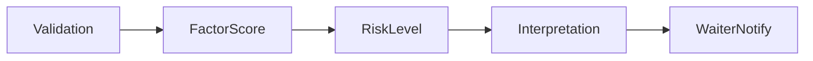
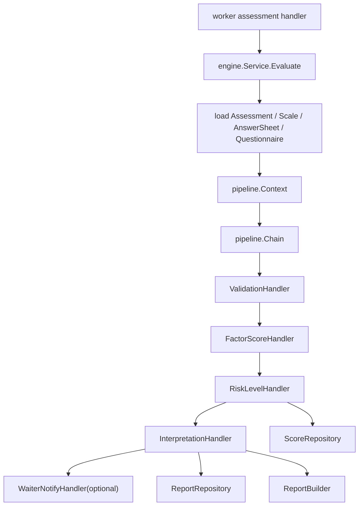

# Engine Pipeline

**本文回答**：评估引擎为什么采用职责链、每一步消费什么/产出什么、哪些状态和事件不应该放进 pipeline，以及这种设计付出了什么取舍。

## 30 秒结论

当前 pipeline 可按五段理解：`Validation -> FactorScore -> RiskLevel -> Interpretation -> WaiterNotify`。它使用职责链模式，把评估过程拆成可测试的处理器；可靠出站不在 pipeline 末尾 direct publish，而在各自持久化边界。

## 要解决什么问题

Evaluation 的难点不是“调用一个函数算分”，而是一次测评需要同时读取 `Assessment / AnswerSheet / Questionnaire / MedicalScale`，计算因子分、风险等级、解读和报告，并在任一步失败时把 Assessment 标记为失败。若所有逻辑堆进 `Evaluate` 一个函数，会产生三个问题：

| 问题 | Pipeline 的处理方式 |
| ---- | ------------------- |
| 步骤多且依赖多 | 每个 handler 只处理一个阶段，依赖通过 `Context` 传递 |
| 中间结果复杂 | `pipeline.Context` 承载 assessment、scale、sheet、scores、report input |
| 失败要中断 | handler 返回 error 即中断链路，engine service 负责失败状态收口 |
| 未来步骤可能扩展 | 新处理器实现 `Handler` 并加入 `Chain`，不改已有 handler |



## 架构设计



`engine.Service` 负责加载上下文和装配职责链；`pipeline` 包只表达处理阶段和中间结果，不直接决定 MQ、outbox 或 worker Ack/Nack。

## 步骤解释

| 步骤 | 责任 | 主要依赖 |
| ---- | ---- | -------- |
| Validation | 检查答卷、问卷、量表上下文是否可评估 | Survey / Scale repository |
| FactorScore | 根据量表因子和答案分计算因子得分 | Scale scoring rules |
| RiskLevel | 计算风险等级并持久化分数 | Assessment score repository |
| Interpretation | 生成结构化解读和报告输入 | Report / interpretation domain |
| WaiterNotify | 通知等待中的请求或内部 waiter | waiter infra |

## 领域模型和中间结果

| 数据 | 来源 | 在 pipeline 中的角色 |
| ---- | ---- | -------------------- |
| `Assessment` | `assessment.Repository` | 状态机主体，必须处于 submitted 才能评估 |
| `MedicalScale` | `scale.Repository` | 因子、计分策略和解读规则来源 |
| `AnswerSheet` | `answersheet.Repository` | 答案和题级分数来源 |
| `Questionnaire` | `questionnaire.Repository` | 问卷版本和题目上下文 |
| factor scores | `FactorScoreHandler` | 后续风险、解读和报告输入 |
| report | `InterpretationHandler` | 持久化到 Mongo，并通过 outbox 形成后续事件 |

## 设计模式应用

| 模式 | 代码位置 | 为什么用 |
| ---- | -------- | -------- |
| 职责链 | `pipeline.Handler`、`BaseHandler`、`Chain` | 评估阶段有固定顺序，任一步失败都要中断；职责链比一个长函数更易测试 |
| Template Method 的轻量形态 | `BaseHandler.Next` | 具体 handler 只关注本阶段，继续调用下一阶段由基类承接 |
| 策略模式 | `domain/evaluation/interpretation` 的 `InterpretStrategy` / registry | 解读策略可按阈值、区间、组合规则扩展，不污染 pipeline |
| Builder | `domain/evaluation/report.ReportBuilder` | 报告内容由多个结果片段组装，避免 pipeline 直接拼报告结构 |
| Repository | score/report/assessment repositories | pipeline 不知道 MySQL/Mongo 细节，只面向端口保存结果 |

## 为什么这样设计

| 替代方案 | 没有选择的原因 |
| -------- | -------------- |
| 一个 `Evaluate` 巨型函数顺序执行所有步骤 | 会混合加载、校验、计分、风险、报告、通知和错误处理，难以测试 |
| 每个步骤各自重新加载上下文 | 会造成重复 I/O 和不一致视图，且难以传递中间结果 |
| 用事件拆成多个异步步骤 | 会显著增加事件数量和补偿复杂度；当前单次评估内部仍适合进程内职责链 |
| 在 pipeline 末尾直接 publish | 会重新打开“业务结果已保存但 MQ publish 失败”的窗口；当前由持久化边界 outbox 负责 |

## 取舍与边界

| 收益 | 代价 |
| ---- | ---- |
| 每个 handler 可单测，新增步骤的修改面较小 | `pipeline.Context` 会成为共享上下文，需要控制字段膨胀 |
| 失败中断语义清晰 | 如果 handler 内部副作用过多，仍需依靠 service 做失败收口 |
| 职责链表达固定顺序直观 | 不适合表达复杂分支工作流；若未来分支过多，需要重新评估 workflow 模型 |
| WaiterNotify 可选挂载 | 本地 waiter 是进程内辅助能力，不应被讲成跨进程通知系统 |

## 易错边界

- 不要把 pipeline 讲成“最后一步发事件”；当前关键事件在 outbox 持久化边界 staged。
- 不要把 factor score 和 survey 粗分混成一个概念。
- 不要把 `Interpretation` 等同于最终报告导出。
- 不要把职责链讲成“每步都可独立重试”；当前重试边界仍在 worker/MQ 和 Assessment 状态机外层。

## 代码锚点

- Pipeline chain：[chain.go](../../../internal/apiserver/application/evaluation/engine/pipeline/chain.go)
- 各 handler：[pipeline](../../../internal/apiserver/application/evaluation/engine/pipeline/)
- Engine service：[service.go](../../../internal/apiserver/application/evaluation/engine/service.go)
- Pipeline tests：[interpretation_test.go](../../../internal/apiserver/application/evaluation/engine/pipeline/interpretation_test.go)

## Verify

```bash
go test ./internal/apiserver/application/evaluation/engine/...
```
