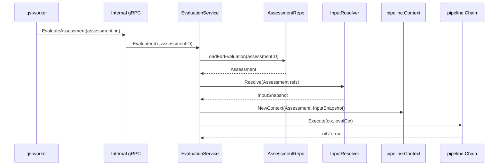
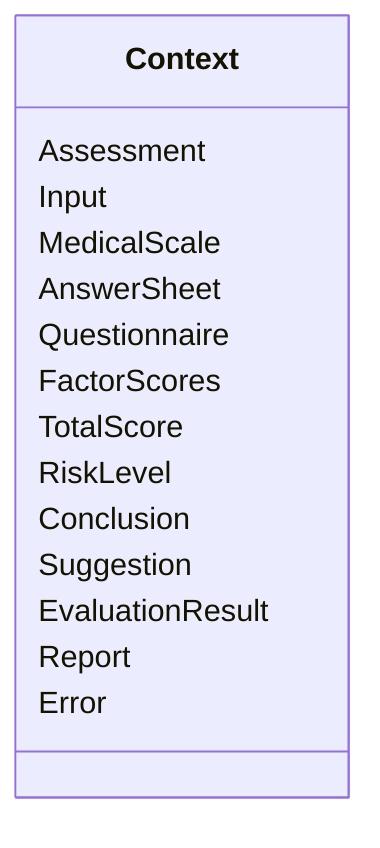
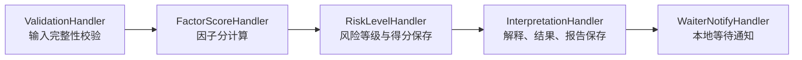
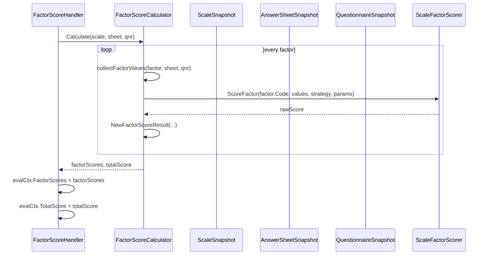

# Engine Pipeline

**本文回答**：Evaluation Engine 为什么采用职责链；`Evaluate` 如何从 `Assessment` 加载、输入快照解析、Context 构造进入 pipeline；`Validation / FactorScore / RiskLevel / Interpretation / WaiterNotify` 每个 handler 消费什么、产出什么、失败如何中断；pipeline 与 Assessment 状态机、Report、Outbox 的边界分别在哪里。

---

## 30 秒结论

| 维度 | 结论 |
| ---- | ---- |
| Pipeline 定位 | Engine Pipeline 是一次测评执行的进程内职责链，不是跨进程工作流，也不是 MQ 事件链 |
| 入口 | `EvaluationService.Evaluate(assessmentID)` 加载 Assessment，解析 input snapshot，然后构造 `pipeline.Context` 并执行 chain |
| 当前顺序 | `Validation -> FactorScore -> RiskLevel -> Interpretation -> WaiterNotify` |
| 共享上下文 | `pipeline.Context` 承载 Assessment、ScaleSnapshot、AnswerSheetSnapshot、QuestionnaireSnapshot 和所有中间结果 |
| 失败语义 | 任一 handler 返回 error 会中断链路，`EvaluationService` 负责 MarkAsFailed 收口 |
| 结果落库 | FactorScore 阶段后 RiskLevel 会保存 AssessmentScore；Interpretation 阶段会应用 EvaluationResult 并保存 Report |
| 事件边界 | pipeline 不负责 direct publish；关键事件由状态/报告保存/outbox 边界负责 |
| 扩展方式 | 新增步骤时实现 `Handler`，通过 `Chain.AddHandler` 接入，并明确它消费/产出哪些 Context 字段 |
| 易错边界 | `WaiterNotifyHandler` 只做本地 waiter 通知，不承担事件投递；`ApplyEvaluation` 不直接发 interpreted 事件 |

一句话概括：

> **Engine Pipeline 负责“本次测评如何一步步算出并保存结果”，而不是负责“事件如何跨进程投递”。**

---

## 1. Pipeline 要解决什么问题

一次测评不是简单调用一个 `Calculate()` 函数。它至少要完成：

```text
确认 Assessment 是否可评估
加载 Survey/Scale 输入快照
校验 Scale/AnswerSheet/Questionnaire 是否匹配
按因子计算分数
根据 Scale 解读规则计算风险
生成结论和建议
应用结果到 Assessment
生成并保存 InterpretReport
通知本地等待方
失败时标记 Assessment failed
```

如果这些逻辑全部放进 `EvaluationService.Evaluate` 一个大函数，会出现：

| 问题 | 后果 |
| ---- | ---- |
| 步骤过长 | 很难测试单个阶段 |
| 中间结果多 | 总分、因子分、风险、报告输入混在局部变量里 |
| 失败路径复杂 | 每个阶段都要手写失败收口 |
| 扩展困难 | 新增一个阶段要改大函数 |
| 边界不清 | Scale 规则、Survey 答卷、Report 保存和 outbox 容易混在一起 |

当前设计使用职责链：

```text
每个 handler 只做一件事；
所有中间结果都进入 Context；
失败返回 error；
外层 service 统一失败收口。
```

---

## 2. 从 Evaluate 到 Pipeline



`EvaluationService.Evaluate` 的职责是：

1. 参数校验。
2. 加载 Assessment。
3. 判断是否跳过评估。
4. 加载 input snapshot。
5. 构造 pipeline context。
6. 执行 pipeline runner。
7. 成功记录日志。
8. 失败时调用 failure finalizer 标记失败。

`Evaluate` 不应该直接写入每个中间结果；具体计算交给 pipeline handler。

---

## 3. pipeline.Context

`pipeline.Context` 是职责链中的共享上下文。



### 3.1 输入字段

| 字段 | 来源 | 用途 |
| ---- | ---- | ---- |
| `Assessment` | Assessment repository | 状态机主体 |
| `Input` | evaluationinput resolver | 原始输入快照集合 |
| `MedicalScale` | `Input.MedicalScale` | Scale 规则快照 |
| `AnswerSheet` | `Input.AnswerSheet` | 答卷事实快照 |
| `Questionnaire` | `Input.Questionnaire` | 问卷结构快照 |

### 3.2 中间结果字段

| 字段 | 由谁写入 | 用途 |
| ---- | -------- | ---- |
| `FactorScores` | FactorScoreHandler / RiskLevelHandler / InterpretationHandler | 因子分、风险和解释 |
| `TotalScore` | FactorScoreHandler | 总分 |
| `RiskLevel` | RiskLevelHandler | 总体风险等级 |
| `Conclusion` | InterpretationHandler | 总结论 |
| `Suggestion` | InterpretationHandler | 总建议 |
| `EvaluationResult` | InterpretationHandler | 应用到 Assessment 的完整结果 |
| `Report` | InterpretationHandler | 生成并保存的报告对象 |
| `Error` | 任一 handler | 失败原因 |

### 3.3 Context 使用原则

Context 是 pipeline 的中间态容器，不是全局依赖容器。

不要在 Context 里塞：

- Repository。
- MQ publisher。
- Redis client。
- HTTP request。
- 任意 service locator。
- 与本次评估无关的全局配置。

handler 需要外部能力时，应该通过构造函数注入端口。

---

## 4. Pipeline handler 顺序

当前源码注释中明确了 handler 链路：

```text
ValidationHandler
  -> FactorScoreHandler
  -> RiskLevelHandler
  -> InterpretationHandler
  -> WaiterNotifyHandler
```



每个 handler 遵守同一接口：

```go
Handle(ctx context.Context, evalCtx *Context) error
SetNext(handler Handler) Handler
Name() string
```

`BaseHandler.Next(...)` 负责调用下一个 handler。

---

## 5. ValidationHandler

### 5.1 责任

`ValidationHandler` 是链首，负责校验评估所需输入是否完整。

它检查：

| 校验项 | 失败 |
| ------ | ---- |
| `Assessment` 不为空 | `ErrAssessmentRequired` |
| Assessment 状态必须是 submitted | `ErrAssessmentNotSubmitted` |
| `MedicalScale` 不为空 | `ErrMedicalScaleRequired` |
| Scale 必须有 factors | `ErrMedicalScaleNoFactors` |
| Scale 必须是 published | `ErrMedicalScaleNotPublished` |
| Scale 绑定的 questionnaire code 与 Assessment 一致 | `ErrMedicalScaleQuestionnaireMismatch` |
| Assessment 有 AnswerSheetRef | `ErrAnswerSheetRefRequired` |
| `AnswerSheet` 快照存在 | `ErrAnswerSheetNotFound` |

### 5.2 输入与输出

| 输入 | 输出 |
| ---- | ---- |
| Assessment、MedicalScale、AnswerSheet | 成功则进入下一个 handler；失败则设置 evalCtx.Error 并返回 |

Validation 不做：

- 因子分计算。
- 风险判断。
- 报告生成。
- 事件发送。
- 尝试修复数据。

### 5.3 为什么校验在 pipeline 内

Assessment 和 input snapshot 加载在 `Evaluate` 中完成，但输入组合是否可评估，需要放在 pipeline 链首统一检查。这样后续 handler 可以假设基础输入满足要求，减少重复防御代码。

---

## 6. FactorScoreHandler

### 6.1 责任

`FactorScoreHandler` 负责从 AnswerSheet 读取预计算的单题分，并按 Scale 因子规则聚合成因子分。

它要求：

| 前置条件 | 说明 |
| -------- | ---- |
| Assessment 存在 | 否则无法评估 |
| MedicalScale 存在 | 没有规则无法计算 |
| AnswerSheet 存在 | 没有作答事实无法计算 |
| Questionnaire 在 cnt 策略中可能需要 | cnt 策略要从 option code 找 option content |

### 6.2 计算链路



### 6.3 输出

| 输出字段 | 说明 |
| -------- | ---- |
| `evalCtx.FactorScores` | 每个因子的原始分，初始风险通常为 none |
| `evalCtx.TotalScore` | 总分 |

### 6.4 Survey 粗分与 Scale 因子分

这里必须分清：

| 概念 | 所属 | 说明 |
| ---- | ---- | ---- |
| 单题 score | Survey | AnswerSheet scoring 生成 |
| 因子 raw score | Evaluation 执行 / Scale 规则 | 对多个题目分按 Factor 规则聚合 |
| risk level | Evaluation 执行 / Scale 解读规则 | 根据因子分匹配规则 |
| report | Evaluation | 本次测评产出 |

FactorScoreHandler 不负责单题计分，它假设 AnswerSheet 已经有题级分数。

---

## 7. RiskLevelHandler

### 7.1 责任

`RiskLevelHandler` 负责：

1. 根据因子分和 Scale 解读规则计算各因子风险等级。
2. 计算总体风险等级。
3. 保存 AssessmentScore。
4. 继续下一个 handler。

### 7.2 RiskClassifier

`RiskClassifier` 使用 `ScaleSnapshot` 中的 factor interpret rules 分类。

总体风险等级当前逻辑是：

1. 如果存在总分因子且该因子匹配解读规则，使用总分因子的 risk level。
2. 否则取所有因子中最高风险等级。
3. 如果因子找不到规则，则 fallback 到默认分数阈值。

### 7.3 输出

| 输出字段 | 说明 |
| -------- | ---- |
| `evalCtx.FactorScores` | 被补上 risk level |
| `evalCtx.RiskLevel` | 总体风险等级 |
| AssessmentScore | 通过 scoreWriter 保存 |

### 7.4 边界

RiskLevelHandler 不做：

- 结论文案生成。
- 报告保存。
- Assessment interpreted 状态迁移。
- MQ 事件投递。

---

## 8. InterpretationHandler

### 8.1 责任

`InterpretationHandler` 是 pipeline 中最关键的“产出落库”阶段。它负责：

1. 基于因子分和风险等级生成解读结论与建议。
2. 构建 `EvaluationResult`。
3. 将结果应用到 Assessment。
4. 生成并保存 `InterpretReport`。
5. 继续下一个 handler。

### 8.2 内部结构

`InterpretationHandler` 分为：

| 组件 | 责任 |
| ---- | ---- |
| `InterpretationGenerator` | 生成因子解释、总体解释、EvaluationResult |
| `InterpretationFinalizer` | 应用结果、保存 Assessment、保存 Report |

这是一种“生成”和“收尾持久化”的分离，避免 handler 内部既拼文案又直接乱写多个仓储。

### 8.3 Finalize

`InterpretationFinalizer.Finalize` 做：

1. 如果 `evalCtx.EvaluationResult` 为空，则用 Context 中已有字段构造。
2. 调用 `assessmentWriter.ApplyAndSave(ctx, evalCtx)`。
3. 调用 `reportWriter.BuildAndSave(ctx, evalCtx)`。

这里是 `Assessment.ApplyEvaluation` 和 Report 保存的应用层边界。由于 `ApplyEvaluation` 不直接发布 interpreted 事件，report writer/durable saver 需要承担 interpreted/report 事件的可靠出站责任。

### 8.4 输出

| 输出字段 | 说明 |
| -------- | ---- |
| `evalCtx.Conclusion` | 总结论 |
| `evalCtx.Suggestion` | 总建议 |
| `evalCtx.EvaluationResult` | 完整评估结果 |
| `evalCtx.Report` | 生成的报告 |

---

## 9. WaiterNotifyHandler

### 9.1 责任

`WaiterNotifyHandler` 只负责本地 waiter 通知。

它的源码注释非常明确：

```text
只负责长轮询 waiter 的本地通知，不承担事件投递。
```

### 9.2 边界

它不是：

- MQ publisher。
- outbox relay。
- WebSocket gateway。
- 跨进程通知系统。
- 业务事件投递器。

如果某个下游需要知道评估完成，应消费 `assessment.interpreted` 或 `report.generated` 等事件，而不是依赖本地 waiter。

---

## 10. Pipeline 错误传播

### 10.1 handler 内错误

每个 handler 发现错误时通常会：

```text
evalCtx.SetError(err)
return err
```

`Chain.Execute` 收到 error 后停止，不再执行后续 handler。

### 10.2 Evaluate 外层失败收口

`EvaluationService.Evaluate` 在 pipeline 执行失败后会：

```text
failureFinalizer.MarkAsFailed(ctx, assessment, "评估流程执行失败: "+err.Error())
return err
```

输入加载失败时也会调用 failure finalizer。

### 10.3 为什么失败收口不放在每个 handler 里

如果每个 handler 自己标记 Assessment failed，会导致：

- 重复失败处理。
- 状态迁移分散。
- outbox staging 分散。
- handler 难以单测。
- 失败语义不一致。

因此更合理的边界是：

```text
handler 返回 error
service/finalizer 统一失败收口
```

---

## 11. Pipeline 与 Assessment 状态机的关系

Pipeline 自身不应该随意改 Assessment 状态。真正状态迁移发生在明确阶段：

| 状态变更 | 触发位置 |
| -------- | -------- |
| `pending -> submitted` | Assessment.Submit，通常在创建/提交服务中 |
| `submitted -> interpreted` | InterpretationFinalizer 通过 Assessment.ApplyEvaluation |
| `submitted/interpreted -> failed` | EvaluationService failureFinalizer |
| `failed -> submitted` | RetryFromFailed，重试流程 |

Pipeline 中间阶段可以生成因子分、风险和报告输入，但不应在多个 handler 里随意改 status。

---

## 12. Pipeline 与 outbox 的关系

Pipeline 不负责 direct publish。可靠出站应绑定在持久化边界上。

| 事件 | 应绑定边界 |
| ---- | ---------- |
| `assessment.submitted` | Assessment 提交成功 |
| `assessment.failed` | MarkAsFailed 持久化成功 |
| `assessment.interpreted` | Assessment interpreted + Report 保存成功 |
| `report.generated` | Report 保存成功 |

因此，Interpretation 阶段不能简单理解为：

```text
生成报告 -> publish event
```

而应理解为：

```text
应用结果
保存 Assessment
保存 Report
stage outbox events
由 relay 可靠出站
```

---

## 13. 为什么不用多事件拆成多个异步步骤

可以想象把 pipeline 拆成事件：

```text
factor_score.calculated
risk_level.calculated
interpretation.generated
report.generated
```

但当前没有这样做，原因是：

| 方案 | 问题 |
| ---- | ---- |
| 每个步骤事件化 | 事件数量多，补偿复杂，状态追踪复杂 |
| 每个步骤独立 worker | 增加运维和幂等成本 |
| 当前进程内 pipeline | 同一评估上下文内顺序执行，容易测试和定位 |

当前设计的取舍是：**一次评估内部使用进程内职责链，跨评估主链使用 MQ/outbox。**

---

## 14. 扩展 Pipeline 的规则

新增 handler 前先回答：

| 问题 | 必须明确 |
| ---- | -------- |
| 它消费哪些 Context 字段 | 例如 FactorScores、RiskLevel、Report |
| 它产出哪些 Context 字段 | 是否影响 EvaluationResult |
| 它是否有外部副作用 | 写库、发通知、调外部服务 |
| 失败是否中断链路 | 大多数核心 handler 应中断 |
| 是否需要进入 outbox | 如果产生业务事件，应走可靠边界 |
| 它的位置在哪里 | 在 Risk 前、Interpretation 前还是 Report 后 |
| 是否可幂等 | 重试后重复执行是否安全 |

### 14.1 适合放进 Pipeline 的能力

| 能力 | 是否适合 |
| ---- | -------- |
| 评估输入校验 | 适合 |
| 因子分计算 | 适合 |
| 风险等级计算 | 适合 |
| 结果解释 | 适合 |
| 报告构建 | 适合 |
| 本地 waiter 通知 | 可选适合 |
| MQ 投递 | 不适合，应该 outbox |
| 历史批量重算调度 | 不适合，应该独立任务/command |
| 前台请求排队 | 不适合，属于 collection |

---

## 15. 设计模式与实现意图

| 模式 | 当前实现 | 作用 |
| ---- | -------- | ---- |
| Chain of Responsibility | `Handler`、`BaseHandler`、`Chain` | 将评估流程拆成有序阶段 |
| Shared Context | `pipeline.Context` | 在 handler 间传递输入和中间结果 |
| Strategy | `ScaleFactorScorer`、`RiskClassifier`、interpretengine | 把计分、风险和解释算法封装 |
| Finalizer | `InterpretationFinalizer`、failureFinalizer | 集中处理持久化收尾 |
| Snapshot | evaluationinput snapshot | 隔离 Survey/Scale 聚合 |
| Port / Adapter | scoreWriter、assessmentWriter、reportWriter | handler 不直接绑定具体存储实现 |
| Outbox | report durable saver / eventing | 可靠出站，不在 handler 中 direct publish |

---

## 16. 设计取舍

| 设计 | 收益 | 代价 |
| ---- | ---- | ---- |
| 职责链 | 步骤清楚、可测试、可扩展 | 顺序强依赖，分支复杂时不够灵活 |
| Context | 中间结果集中 | 字段可能膨胀，需要治理 |
| 外层失败收口 | 失败语义一致 | handler 不能自己悄悄吞错 |
| Report 保存在 Interpretation 阶段 | 结果产出集中 | Interpretation 变成较重 handler |
| WaiterNotify 本地化 | 不污染事件系统 | 不能用它做跨进程通知 |
| 不事件化每个步骤 | 运维简单、上下文稳定 | 单个评估内部无法按步骤独立重试 |

---

## 17. 常见误区

### 17.1 “pipeline 是 MQ 消费链”

错误。pipeline 是 apiserver 进程内职责链。MQ 消费发生在 worker，worker 通过 internal gRPC 触发 Evaluate。

### 17.2 “WaiterNotify 就是评估完成事件”

错误。WaiterNotify 只是本地等待队列通知。业务事件仍应通过 outbox/MQ。

### 17.3 “FactorScoreHandler 定义了 Scale 规则”

错误。它消费 ScaleSnapshot 中的规则，规则定义仍属于 Scale。

### 17.4 “RiskLevelHandler 生成报告文案”

错误。RiskLevelHandler 只计算风险并保存分数。文案生成在 Interpretation 阶段。

### 17.5 “handler 失败后自己改 Assessment failed”

不建议。handler 返回 error，由外层 failure finalizer 统一标记失败。

### 17.6 “Interpretation 成功就可以直接 publish report.generated”

不应 direct publish。应通过报告保存和 outbox durable 边界出站。

---

## 18. 代码锚点

### Engine

- Evaluation service：[../../../internal/apiserver/application/evaluation/engine/service.go](../../../internal/apiserver/application/evaluation/engine/service.go)
- Pipeline handler interface：[../../../internal/apiserver/application/evaluation/engine/pipeline/handler.go](../../../internal/apiserver/application/evaluation/engine/pipeline/handler.go)
- Chain：[../../../internal/apiserver/application/evaluation/engine/pipeline/chain.go](../../../internal/apiserver/application/evaluation/engine/pipeline/chain.go)
- Context：[../../../internal/apiserver/application/evaluation/engine/pipeline/context.go](../../../internal/apiserver/application/evaluation/engine/pipeline/context.go)

### Handlers

- ValidationHandler：[../../../internal/apiserver/application/evaluation/engine/pipeline/validation.go](../../../internal/apiserver/application/evaluation/engine/pipeline/validation.go)
- FactorScoreHandler：[../../../internal/apiserver/application/evaluation/engine/pipeline/factor_score.go](../../../internal/apiserver/application/evaluation/engine/pipeline/factor_score.go)
- FactorScoreCalculator：[../../../internal/apiserver/application/evaluation/engine/pipeline/factor_score_calculator.go](../../../internal/apiserver/application/evaluation/engine/pipeline/factor_score_calculator.go)
- RiskLevelHandler：[../../../internal/apiserver/application/evaluation/engine/pipeline/risk_level.go](../../../internal/apiserver/application/evaluation/engine/pipeline/risk_level.go)
- RiskClassifier：[../../../internal/apiserver/application/evaluation/engine/pipeline/risk_classifier.go](../../../internal/apiserver/application/evaluation/engine/pipeline/risk_classifier.go)
- InterpretationHandler：[../../../internal/apiserver/application/evaluation/engine/pipeline/interpretation.go](../../../internal/apiserver/application/evaluation/engine/pipeline/interpretation.go)
- WaiterNotifyHandler：[../../../internal/apiserver/application/evaluation/engine/pipeline/waiter_notify.go](../../../internal/apiserver/application/evaluation/engine/pipeline/waiter_notify.go)

### Input / Domain

- evaluationinput：[../../../internal/apiserver/port/evaluationinput/input.go](../../../internal/apiserver/port/evaluationinput/input.go)
- snapshot mappers：[../../../internal/apiserver/infra/evaluationinput/snapshot_mappers.go](../../../internal/apiserver/infra/evaluationinput/snapshot_mappers.go)
- Assessment domain：[../../../internal/apiserver/domain/evaluation/assessment/](../../../internal/apiserver/domain/evaluation/assessment/)

---

## 19. Verify

```bash
go test ./internal/apiserver/application/evaluation/engine
go test ./internal/apiserver/application/evaluation/engine/pipeline
go test ./internal/apiserver/infra/evaluationinput
```

如果修改报告保存或 outbox：

```bash
go test ./internal/apiserver/application/eventing
go test ./internal/apiserver/outboxcore
```

如果修改 worker 触发链路：

```bash
go test ./internal/worker/handlers
go test ./internal/apiserver/transport/grpc/service
```

---

## 20. 下一跳

| 目标 | 下一篇 |
| ---- | ------ |
| 理解状态机 | [01-Assessment状态机.md](./01-Assessment状态机.md) |
| 理解报告和解释 | [03-Report与Interpretation.md](./03-Report与Interpretation.md) |
| 理解可靠事件出站 | [04-Outbox与可靠出站.md](./04-Outbox与可靠出站.md) |
| 理解失败和重试 | [05-评估失败与重试SOP.md](./05-评估失败与重试SOP.md) |
| 回看整体模型 | [00-整体模型.md](./00-整体模型.md) |
