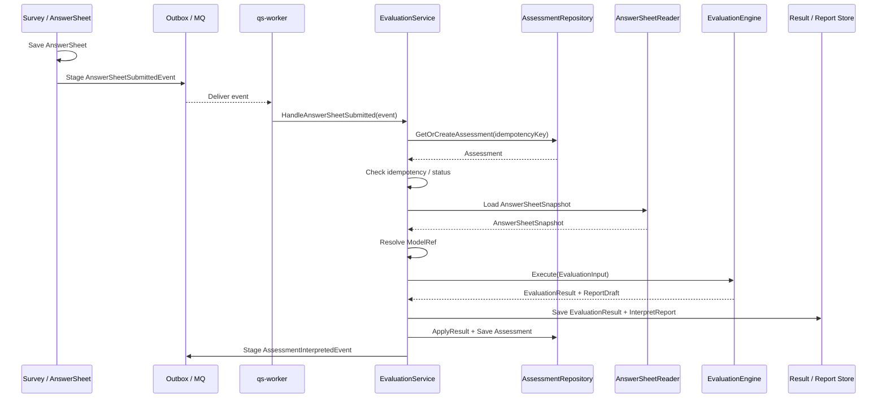
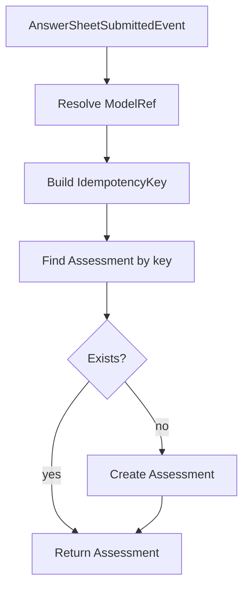

# 02-Evaluation执行链路：从 AnswerSheet 提交到 Assessment 完成

> 本文是 Evaluation 模块文档的第二篇，聚焦 **Evaluation 的主执行链路**。
>
> 第一篇已经说明：Evaluation 的核心聚合是 `Assessment`，它表示一次测评执行事实；`AnswerSheetRef` 指向 Survey 的答卷事实，`InterpretationModelRef` 指向解释模型，`EvaluationResult` 与 `InterpretReport` 记录执行产物。
>
> 本文继续回答：当用户提交 AnswerSheet 之后，系统如何创建或加载 Assessment，如何触发 Worker，如何加载答卷与解释模型，如何执行测评，如何保存结果和报告，最终如何将 Assessment 推进到 interpreted 或 failed。

---

## 1. 结论先行

Evaluation 执行链路的核心任务是：

> **把一份已提交的 AnswerSheet，交给一个明确的 Interpretation Model 执行解释，并将本次执行结果固化为 Assessment / EvaluationResult / InterpretReport。**

主链路可以概括为：

```text
AnswerSheetSubmittedEvent
    ↓
Worker / Handler
    ↓
EvaluationService.HandleAnswerSheetSubmitted
    ↓
Load or Create Assessment
    ↓
Load AnswerSheetSnapshot
    ↓
Resolve InterpretationModelRef
    ↓
Build EvaluationInput
    ↓
EvaluationEngine.Execute
    ↓
Provider.LoadContext + Provider.Evaluate
    ↓
Save EvaluationResult + InterpretReport
    ↓
Assessment.ApplyResult
    ↓
Publish AssessmentInterpretedEvent / ReportGeneratedEvent
```

这条链路的关键原则是：

```text
Survey 负责产生答卷提交事实；
Evaluation 负责消费答卷提交事实；
Interpretation Model 负责解析具体模型 Provider；
Scale / MBTI 等模型负责内部解释逻辑；
Assessment 负责本次测评生命周期；
EvaluationResult / InterpretReport 负责保存执行产物；
失败必须进入 failed 状态并记录 EvaluationRun。
```

---

## 2. 本文边界

本文重点：

```text
AnswerSheet 提交后如何触发 Evaluation；
Worker / Handler 如何驱动执行；
如何创建或加载 Assessment；
如何做幂等判断；
如何加载 AnswerSheetSnapshot；
如何确定 InterpretationModelRef；
如何构造 EvaluationInput；
如何调用 EvaluationEngine；
如何保存 EvaluationResult 和 InterpretReport；
如何推进 Assessment 状态；
如何处理成功与失败事件。
```

本文不展开：

```text
AnswerSheet 聚合和提交校验细节；
MedicalScale / MBTIModel 的内部规则设计；
Provider 接口的完整抽象设计；
EvaluationEngine 内部算法细节；
失败重试和补偿的完整策略；
事件 Outbox / MQ 的基础设施实现；
Evaluation 模块分层事实源索引。
```

这些由其它文档承接：

```text
../survey/README.md
../interpretation-model/README.md
../assessment-model/README.md
01-Evaluation模型--Assessment-EvaluationRun-Result-Report模型设计.md
03-Evaluation引擎链路--模型解析-规则加载-执行-报告生成.md
04-Evaluation失败重试链路--幂等-错误状态-补偿处理.md
05-Evaluation事件链路--答卷提交-测评完成-报告生成.md
06-Evaluation模块分层架构与事实源索引.md
```

---

## 3. 主链路总览

从 AnswerSheet 提交到 Assessment 完成，可以拆成十个阶段：

```text
1. Survey 保存 AnswerSheet；
2. Survey 发布 AnswerSheetSubmittedEvent；
3. Worker 消费答卷提交事件；
4. EvaluationService 创建或加载 Assessment；
5. 幂等判断，避免重复执行；
6. 加载 AnswerSheetSnapshot；
7. 解析或确认 InterpretationModelRef；
8. 构造 EvaluationInput；
9. EvaluationEngine 执行模型；
10. 保存结果、报告、状态和完成事件。
```

整体流程如下：



这条链路中，Evaluation 应该只依赖答卷快照和模型引用，而不是直接持有 Survey 或 Scale 的可变聚合对象。

---

## 4. 阶段一：Survey 保存 AnswerSheet

执行链路的起点是 Survey 模块成功保存答卷。

Survey 负责：

```text
校验提交参数；
校验 QuestionnaireVersion；
校验答案完整性；
校验 AnswerValue 类型；
保存 AnswerSheet；
生成 AnswerSheetSubmittedEvent。
```

Evaluation 不负责这些事情。

Evaluation 只关心答卷提交后的事实引用：

```text
AnswerSheetID；
QuestionnaireCode；
QuestionnaireVersion；
SubmittedBy；
SubmittedAt；
SubjectRef；
可选 ModelRef 或测评计划引用。
```

这意味着 AnswerSheetSubmittedEvent 应该携带足够的路由信息，但不一定携带完整答案明细。

推荐事件 payload：

```text
AnswerSheetSubmittedEvent
├── EventID
├── AnswerSheetID
├── QuestionnaireCode
├── QuestionnaireVersion
├── SubjectRef
├── SubmittedBy
├── SubmittedAt
├── ModelRef 可选
└── TraceID
```

如果事件中没有 `ModelRef`，Evaluation 需要通过测评计划、问卷绑定关系或业务配置解析模型。

---

## 5. 阶段二：发布 AnswerSheetSubmittedEvent

Survey 保存 AnswerSheet 后，应通过可靠事件机制发布 `AnswerSheetSubmittedEvent`。

语义是：

> **一份答卷已经提交成功，可以触发后续测评解释。**

该事件不表示：

```text
Assessment 已创建；
测评已解释；
报告已生成；
风险等级已确定；
Scale 规则已变化。
```

这些是不同事实。

事件可靠性要求：

```text
AnswerSheet 保存成功和 AnswerSheetSubmittedEvent 出站应处于可靠边界内；
事件消费者必须幂等；
事件可以重复投递；
事件乱序时 Evaluation 需要能识别状态；
事件失败后应支持重试或人工补偿。
```

推荐通过 Outbox 保证：

```text
Save AnswerSheet
+ Stage AnswerSheetSubmittedEvent
```

然后由 relay 或 worker 异步投递。

---

## 6. 阶段三：Worker 消费事件

`qs-worker` 或等价异步消费者负责消费 `AnswerSheetSubmittedEvent`。

Worker 的职责是驱动 Evaluation，而不是执行业务规则本身。

Worker 可以做：

```text
订阅事件；
解析事件 payload；
构造 handler command；
调用 EvaluationService；
记录消费日志；
根据结果 ack / retry / dead-letter。
```

Worker 不应该做：

```text
直接修改 Assessment.Status；
直接读取 MedicalScale 并计算得分；
直接保存 InterpretReport；
直接决定业务失败原因；
直接绕过 EvaluationService 操作 repository。
```

Worker 是驱动器，不是领域服务。

推荐 worker 调用形态：

```go
err := evaluationService.HandleAnswerSheetSubmitted(ctx, command)
```

其中 command 可以包含：

```text
AnswerSheetID；
QuestionnaireRef；
SubjectRef；
ModelRef 可选；
EventID；
TraceID。
```

---

## 7. 阶段四：创建或加载 Assessment

EvaluationService 接收到事件后，首先要创建或加载 Assessment。

核心目标是幂等：

```text
同一份 AnswerSheet 对同一份 ModelRef，不应该重复创建多个有效 Assessment。
```

推荐幂等键：

```text
assessment:{answerSheetID}:{modelType}:{modelCode}:{modelVersion}
```

如果事件中已经带有 AssessmentID，则可以直接加载。

如果没有 AssessmentID，则通过幂等键查找或创建。

流程：



创建 Assessment 时必须固化：

```text
AnswerSheetRef；
InterpretationModelRef；
QuestionnaireRef；
SubjectRef；
IdempotencyKey；
初始状态 submitted 或 pending。
```

---

## 8. 阶段五：幂等判断与状态检查

加载 Assessment 后，必须检查当前状态。

常见状态处理：

| Assessment 状态 | 处理方式 |
| --- | --- |
| pending | 如果已有 AnswerSheetRef，可 Submit 后继续 |
| submitted | 可以开始执行 |
| interpreting | 说明已有执行进行中，当前消费应跳过或延迟重试 |
| interpreted | 已完成，当前消费幂等成功 |
| failed | 可根据重试策略决定是否执行 |
| canceled | 不再执行，当前消费跳过 |

核心原则：

```text
重复消费不能重复生成报告；
重复事件不能重复推进 interpreted；
interpreting 状态要防止并发重入；
failed 状态是否重试由 RetryPolicy 决定；
interpreted 状态下应直接返回幂等成功。
```

伪代码：

```go
switch assessment.Status() {
case StatusInterpreted:
    return nil // idempotent success
case StatusInterpreting:
    return ErrAlreadyRunning
case StatusCanceled:
    return nil // ignored
case StatusSubmitted, StatusFailed:
    // continue if retry allowed
}
```

---

## 9. 阶段六：加载 AnswerSheetSnapshot

Assessment 只保存 AnswerSheetRef。

真正执行时，需要从 Survey 读取只读答卷快照。

推荐读取对象：

```text
AnswerSheetSnapshot
├── AnswerSheetID
├── QuestionnaireCode
├── QuestionnaireVersion
├── Answers
├── SubmittedBy
├── SubmittedAt
└── SubjectRef
```

Evaluation 不能直接修改 AnswerSheet。

因此必须读取快照，而不是可变聚合对象。

加载后需要校验：

```text
AnswerSheet 存在；
AnswerSheet 已提交；
AnswerSheet.QuestionnaireRef 与 Assessment.QuestionnaireRef 一致；
AnswerSheet.SubjectRef 与 Assessment.SubjectRef 一致，或符合业务允许的代理提交关系。
```

如果加载失败，应将 Assessment 标记为 failed，并记录 FailedStage：

```text
LoadAnswerSheet
```

---

## 10. 阶段七：解析 InterpretationModelRef

Evaluation 必须知道本次使用哪个解释模型。

ModelRef 的来源可能有几种：

```text
AnswerSheetSubmittedEvent 中显式携带；
Assessment 创建时已经固化；
测评计划 AssessmentPlan 中指定；
Questionnaire 绑定的默认模型；
业务配置根据入口或场景推导。
```

推荐优先级：

```text
Assessment.ModelRef > Event.ModelRef > AssessmentPlan.ModelRef > Binding.DefaultModelRef > Config.DefaultModelRef
```

但一旦 Assessment 创建成功，后续重试必须使用 Assessment 内的原始 ModelRef。

不要在每次重试时重新推导 latest model。

错误方向：

```text
每次执行都根据 QuestionnaireCode 查询最新 Scale。
```

正确方向：

```text
Assessment 创建时固化 ModelRef；
后续执行和重试使用同一个 ModelRef。
```

---

## 11. 阶段八：构造 EvaluationInput

当 Assessment、AnswerSheetSnapshot、ModelRef 都明确后，可以构造 EvaluationInput。

推荐结构：

```text
EvaluationInput
├── AssessmentRef
├── AnswerSheetRef
├── AnswerSheetSnapshot
├── SubjectRef
├── QuestionnaireRef
├── ModelRef
├── RuntimeOptions
└── TraceContext
```

构造原则：

```text
所有输入都应是只读引用或快照；
不要传入可变 Assessment 聚合给 Provider；
不要传入可变 AnswerSheet 聚合；
不要传入可变 MedicalScale / MBTIModel 聚合；
TraceContext 应贯穿 Worker、Evaluation、Provider、Repository。
```

EvaluationInput 是执行入参，不是持久化实体。

---

## 12. 阶段九：创建 EvaluationRun 并开始执行

真正执行前，应创建或记录一次 EvaluationRun。

EvaluationRun 用于记录：

```text
第几次执行；
什么时候开始；
什么时候结束；
是否成功；
失败在哪个阶段；
错误信息是什么；
TraceID 是什么。
```

推荐流程：

```text
1. assessment.StartEvaluation(runID, now)；
2. 保存 Assessment 状态为 interpreting；
3. 创建 EvaluationRun(status=running)；
4. 调用 EvaluationEngine.Execute；
5. 根据执行结果更新 run 为 succeeded / failed。
```

如果系统不希望持久化 `interpreting` 状态，也至少应记录 EvaluationRun。

否则排查时很难知道：

```text
这次事件有没有开始执行？
执行到哪一步失败？
失败前是否已经保存部分结果？
是否发生并发重入？
```

---

## 13. 阶段十：EvaluationEngine 执行测评

EvaluationEngine 是执行框架。

它应该通过 Interpretation Model 抽象调用具体 Provider。

引擎链路：

```text
EvaluationInput
    ↓
Registry.Resolve(ModelRef.ModelType)
    ↓
Provider.LoadContext(ModelRef)
    ↓
Validate QuestionnaireRef
    ↓
Provider.Evaluate(input, context)
    ↓
EvaluationResult
    ↓
ReportDraft / ExecutionResult
```

在 Scale 场景中：

```text
Provider = ScaleProvider
Context = EvaluationScaleContext
Evaluate = 根据 Factor / ScoringSpec / InterpretationRules 计算结果
```

在 MBTI 场景中：

```text
Provider = MBTIProvider
Context = MBTIContext
Evaluate = 根据维度规则计算 TypeCode 和画像结果
```

EvaluationEngine 不应该写死：

```text
LoadMedicalScale；
CalculateFactorScore；
MatchRiskLevel；
ResolveMBTITypeCode。
```

这些属于具体 Provider。

---

## 14. 阶段十一：QuestionnaireRef 一致性校验

执行模型前必须校验答卷与模型上下文基于同一问卷版本。

校验对象：

```text
input.QuestionnaireRef
context.QuestionnaireRef
```

要求：

```text
input.QuestionnaireCode == context.QuestionnaireCode
input.QuestionnaireVersion == context.QuestionnaireVersion
```

不一致时必须失败。

失败阶段：

```text
ValidateQuestionnaireRef
```

失败原因示例：

```text
expected questionnaire = ADHD_PARENT@1.0.0
actual questionnaire   = ADHD_PARENT@1.1.0
reason = questionnaire version mismatch
```

不允许为了“跑通流程”忽略版本不一致。

否则历史报告不可追溯。

---

## 15. 阶段十二：Provider 返回 EvaluationResult

Provider 执行成功后，应返回统一 EvaluationResult。

EvaluationResult 可能包含：

```text
ScoreResults；
InterpretationResults；
ProfileResults；
ReportDraft；
RuleSnapshotRef；
Metadata。
```

Scale 示例：

```text
ScoreResults = FactorScore[] + TotalScore
InterpretationResults = FactorInterpretation[]
RiskLevelResults = RiskLevelResult[]
ReportDraft = 医学量表报告草稿
```

MBTI 示例：

```text
ScoreResults = DimensionScores
ProfileResults = TypeProfileResult
InterpretationResults = TypeInterpretation
ReportDraft = 人格画像报告草稿
```

Evaluation 应该只关心：

```text
结果是否可保存；
报告是否可生成；
状态是否可推进；
事件是否可发布。
```

而不是关心每种模型内部如何计算。

---

## 16. 阶段十三：生成或确认 InterpretReport

Provider 可以返回 ReportDraft。

但最终报告事实由 Evaluation 保存。

Report 生成有两种模式：

```text
Provider 生成 ReportDraft，Evaluation 保存；
Provider 返回结构化结果，Evaluation 的 ReportBuilder 生成 ReportDraft。
```

无论哪种模式，最终都要形成 `InterpretReport`。

推荐结构：

```text
InterpretReport
├── ReportID
├── AssessmentID
├── ModelRef
├── QuestionnaireRef
├── SubjectRef
├── Content
├── Snapshot
├── CreatedAt
└── Metadata
```

报告 Snapshot 应记录：

```text
AnswerSheetRef；
ModelRef；
QuestionnaireRef；
EvaluationResultRef；
RuleSnapshotRef；
GeneratedAt。
```

这样历史报告不会因后续模型规则变化而漂移。

---

## 17. 阶段十四：保存结果、报告和状态

执行成功后的可靠保存顺序非常重要。

推荐逻辑边界：

```text
1. Save EvaluationResult；
2. Save InterpretReport；
3. assessment.ApplyResult(resultRef, reportRef, now)；
4. Record EvaluationRun succeeded；
5. Stage AssessmentInterpretedEvent；
6. Stage InterpretReportGeneratedEvent。
```

这些最好处于一个可靠事务或一致性边界中。

不推荐：

```text
先把 Assessment 标记为 interpreted；
再尝试保存 Report；
Report 保存失败后忽略。
```

这会造成状态漂移：

```text
Assessment 显示已完成；
但用户查不到报告；
事件可能已经通知下游；
后续重试不知道该补结果还是补报告。
```

---

## 18. 阶段十五：发布完成事件

当结果和报告都可靠保存后，可以发布完成事件。

常见事件：

```text
AssessmentInterpretedEvent
InterpretReportGeneratedEvent
```

事件语义：

```text
AssessmentInterpretedEvent 表示测评解释完成；
InterpretReportGeneratedEvent 表示报告生成完成。
```

它们不同于：

```text
AnswerSheetSubmittedEvent 表示答卷提交；
ScaleChangedEvent 表示规则变化。
```

推荐事件 payload：

```text
AssessmentInterpretedEvent
├── EventID
├── AssessmentID
├── AnswerSheetID
├── ModelRef
├── QuestionnaireRef
├── SubjectRef
├── ResultID
├── ReportID
├── InterpretedAt
└── TraceID
```

事件消费者可以用于：

```text
通知前端报告可查看；
刷新统计读模型；
写入用户画像系统；
触发消息通知；
同步运营报表。
```

---

## 19. 失败链路总览

任何阶段失败，都应该进入统一失败处理。

失败处理至少包括：

```text
记录 EvaluationRun failed；
assessment.MarkFailed(failure, now)；
保存失败原因；
判断是否可重试；
必要时发布 AssessmentFailedEvent；
返回错误给 Worker，由 Worker 决定 ack / retry / dead-letter。
```

典型失败阶段：

```text
LoadAnswerSheet
ResolveModelRef
ResolveProvider
LoadModelContext
ValidateQuestionnaireRef
ProviderEvaluate
BuildReport
SaveResult
SaveReport
PublishEvent
```

失败不应该被吞掉。

如果失败后仍然 ack 事件，必须保证系统已有补偿或人工处理入口。

---

## 20. 成功链路与失败链路对照

| 阶段 | 成功行为 | 失败行为 |
| --- | --- | --- |
| 加载答卷 | 得到 AnswerSheetSnapshot | MarkFailed: LoadAnswerSheet |
| 解析模型 | 得到 ModelRef / Provider | MarkFailed: ResolveProvider |
| 加载上下文 | 得到 Context | MarkFailed: LoadModelContext |
| 一致性校验 | 继续执行 | MarkFailed: ValidateQuestionnaireRef |
| Provider 执行 | 得到 EvaluationResult | MarkFailed: ProviderEvaluate |
| 报告生成 | 得到 ReportDraft | MarkFailed: BuildReport |
| 结果保存 | 保存成功 | MarkFailed: SaveResult |
| 报告保存 | 保存成功 | MarkFailed: SaveReport |
| 事件出站 | stage 成功 | MarkFailed 或补偿 |

失败后的重试策略由第四篇详细说明。

本文只强调：失败必须进入统一状态，而不是散落在各个 service 中用日志替代状态。

---

## 21. 幂等设计

Evaluation 主链路必须支持幂等。

原因是：

```text
MQ 可能重复投递；
Worker 可能执行超时后重试；
用户可能重复提交；
服务可能在保存结果后、ack 事件前崩溃；
人工运维可能重复触发重算。
```

幂等设计包括：

```text
Assessment 唯一键；
IdempotencyKey；
AssessmentStatus 判断；
EvaluationRun AttemptNo；
Result / Report 唯一约束；
事件幂等消费。
```

推荐唯一语义：

```text
同一 AnswerSheet + 同一 ModelRef -> 一个有效 Assessment
```

如果业务允许同一答卷被多个模型解释，则 ModelRef 必须参与幂等键。

---

## 22. 并发控制

需要防止同一 Assessment 被多个 Worker 同时执行。

可选方案：

```text
数据库状态 CAS；
分布式锁；
唯一约束 + 状态检查；
任务队列按 AssessmentID 分区；
EvaluationRun running 唯一约束。
```

推荐最小保护：

```text
从 submitted / failed -> interpreting 使用 CAS 更新；
只有抢到状态迁移的 worker 可以继续执行；
其它 worker 视为 AlreadyRunning 或幂等跳过。
```

伪代码：

```go
ok := repo.CompareAndSwapStatus(assessmentID, expectedStatuses, StatusInterpreting)
if !ok {
    return ErrAlreadyRunningOrCompleted
}
```

状态机是并发控制的一部分，不能只依赖 worker 单线程假设。

---

## 23. 事务边界

Evaluation 主链路至少有三个关键事务边界。

### 23.1 创建 Assessment

```text
Create or Get Assessment by IdempotencyKey
```

要保证并发下不会创建多个有效 Assessment。

### 23.2 开始执行

```text
Assessment submitted / failed -> interpreting
+ Create EvaluationRun(running)
```

要防止多个 worker 同时执行。

### 23.3 应用结果

```text
Save EvaluationResult
+ Save InterpretReport
+ Assessment.ApplyResult
+ EvaluationRun.succeeded
+ Stage completion events
```

要防止状态和结果不一致。

如果数据库无法跨存储强事务，需要通过 Outbox、补偿任务和幂等写入保证最终一致。

---

## 24. 日志与可观测性

主链路需要贯穿 trace 字段。

建议日志字段：

```text
trace_id
assessment_id
answer_sheet_id
model_type
model_code
model_version
questionnaire_code
questionnaire_version
subject_id
run_id
attempt_no
stage
status
duration_ms
error_code
```

关键指标：

```text
answer_sheet_submitted_events_total；
evaluation_started_total；
evaluation_succeeded_total；
evaluation_failed_total；
evaluation_duration_ms；
evaluation_failure_by_stage；
report_generated_total；
evaluation_retry_total。
```

排障时应能回答：

```text
某份 AnswerSheet 是否触发了 Assessment？
Assessment 使用了哪个 ModelRef？
执行失败在哪个阶段？
是否发生问卷版本不一致？
Provider 是否加载成功？
报告是否保存成功？
完成事件是否出站？
```

---

## 25. 主链路伪代码

以下伪代码用于描述职责边界，不代表最终代码实现。

```go
func (s *EvaluationService) HandleAnswerSheetSubmitted(ctx context.Context, cmd HandleAnswerSheetSubmittedCommand) error {
    modelRef, err := s.resolveModelRef(ctx, cmd)
    if err != nil {
        return err
    }

    key := BuildAssessmentIdempotencyKey(cmd.AnswerSheetID, modelRef)

    assessment, err := s.assessments.GetOrCreate(ctx, key, func() *Assessment {
        return NewAssessment(cmd.AnswerSheetRef, modelRef, cmd.SubjectRef)
    })
    if err != nil {
        return err
    }

    if assessment.IsInterpreted() || assessment.IsCanceled() {
        return nil
    }

    run := NewEvaluationRun(assessment.ID())

    if err := assessment.StartEvaluation(run.ID(), s.clock.Now()); err != nil {
        return err
    }

    answerSheet, err := s.answerSheets.GetSnapshot(ctx, assessment.AnswerSheetRef())
    if err != nil {
        return s.markFailed(ctx, assessment, run, FailedStageLoadAnswerSheet, err)
    }

    input := BuildEvaluationInput(assessment, answerSheet)

    result, reportDraft, err := s.engine.Execute(ctx, input)
    if err != nil {
        return s.markFailed(ctx, assessment, run, FailedStageProviderEvaluate, err)
    }

    resultRef, err := s.results.Save(ctx, result)
    if err != nil {
        return s.markFailed(ctx, assessment, run, FailedStageSaveResult, err)
    }

    reportRef, err := s.reports.Save(ctx, BuildInterpretReport(assessment, result, reportDraft))
    if err != nil {
        return s.markFailed(ctx, assessment, run, FailedStageSaveReport, err)
    }

    assessment.ApplyResult(resultRef, reportRef, s.clock.Now())
    run.MarkSucceeded(s.clock.Now())

    return s.unitOfWork.SaveAssessmentRunAndEvents(ctx, assessment, run)
}
```

注意几个点：

```text
ModelRef 在创建 Assessment 前解析并固化；
重复事件通过 GetOrCreate + 状态判断处理；
AnswerSheet 以 Snapshot 形式读取；
Provider 由 Engine 内部通过 Registry 调用；
失败通过 markFailed 统一处理；
结果和报告保存成功后才 ApplyResult。
```

---

## 26. 常见错误设计

### 26.1 Worker 直接执行模型

错误方向：

```text
Worker -> LoadMedicalScale -> CalculateScore -> SaveReport
```

正确方向：

```text
Worker -> EvaluationService.HandleAnswerSheetSubmitted
```

Worker 是驱动器，不是业务编排中心。

### 26.2 每次执行都查 latest model

错误方向：

```text
AnswerSheetSubmitted -> Find latest Scale by QuestionnaireCode
```

正确方向：

```text
Assessment 创建时固化 ModelRef；
后续执行和重试使用原始 ModelRef。
```

### 26.3 保存结果前先 interpreted

错误方向：

```text
assessment.Status = interpreted
save report
```

正确方向：

```text
save result + save report + assessment.ApplyResult
```

### 26.4 失败只打日志

错误方向：

```text
log error; return err
```

正确方向：

```text
EvaluationRun.failed + Assessment.failed + FailureReason
```

### 26.5 忽略 QuestionnaireRef mismatch

错误方向：

```text
答卷版本与模型版本不一致，但继续执行。
```

正确方向：

```text
MarkFailed: ValidateQuestionnaireRef
```

---

## 27. 小结

Evaluation 执行链路可以用一句话总结：

> **AnswerSheetSubmittedEvent 触发 Evaluation，Evaluation 创建或加载 Assessment，固化 ModelRef，读取 AnswerSheetSnapshot，调用 EvaluationEngine 执行模型，保存 EvaluationResult 和 InterpretReport，最后推进 Assessment 到 interpreted 或 failed。**

本文需要建立六个核心认知：

```text
第一，AnswerSheet 提交只是触发条件，不等于测评完成；
第二，Assessment 是本次测评执行的生命周期载体；
第三，ModelRef 必须在 Assessment 创建时固化，重试不能自动使用 latest model；
第四，Provider 执行前必须校验 AnswerSheet 与 Context 的 QuestionnaireRef 一致；
第五，结果和报告可靠保存后，才能推进 interpreted 和发布完成事件；
第六，失败必须进入 Assessment failed + EvaluationRun failed，而不是只打日志。
```

守住这些边界，Evaluation 才能成为稳定、可重试、可观测、可扩展的通用测评执行引擎。
