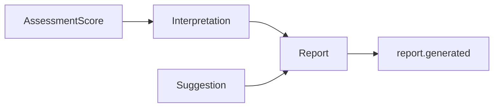
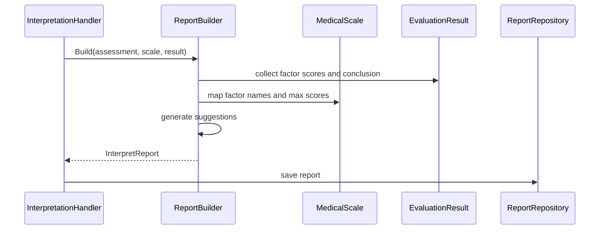

# Report 与 Suggestion

**本文回答**：报告、建议、导出和 `report.generated` 之间是什么关系。

## 30 秒结论

| 概念 | 当前事实 |
| ---- | -------- |
| `Report` | 测评报告聚合与持久化结果 |
| `Suggestion` | 报告内建议策略，不是独立事件流 |
| `report.generated` | 报告保存成功后的事件信号 |
| 导出 | 查询/导出能力，不是事件契约的一部分 |



## 当前边界

- 报告是评估产物，不是 survey 或 scale 的子对象。
- `report.generated` 表示报告持久化完成，可供下游标签和统计使用。
- 导出服务可以读取报告，但不改变评估状态机。

## 领域模型和 Builder 设计

Report 子域把“结构化得分”转换为“可展示的解读报告”。`DefaultReportBuilder` 不是简单 DTO mapper，它会从测评结果中抽取总体结论、维度解读和建议，并可接入 `SuggestionGenerator` 做增强。



## 设计模式与取舍

| 模式 | 使用点 | 为什么用 |
| ---- | ------ | -------- |
| Builder | `ReportBuilder.Build` | 报告由 assessment、scale、evaluation result 多源组合，适合集中构建 |
| Strategy | `SuggestionGenerator` / suggestion strategy | 建议来源可能变化，不能固定写死在 pipeline |
| Value Object | `DimensionInterpret`、`Suggestion`、`RiskLevel` | 报告内部结构需要可持久化、可展示、可测试 |
| Repository | `ReportRepository` | 报告存储在 Mongo，不让 engine 直接依赖文档存储细节 |

取舍是：报告生成与导出分离，能保持评估产物稳定；代价是如果未来报告模板非常复杂，需要继续拆出模板/渲染层，而不是让 Builder 无限膨胀。

## 代码锚点

- Report domain：[domain/evaluation/report](../../../internal/apiserver/domain/evaluation/report/)
- Suggestion guide：[SUGGESTION_STRATEGY_GUIDE.md](../../../internal/apiserver/domain/evaluation/report/SUGGESTION_STRATEGY_GUIDE.md)
- Report application：[application/evaluation/report](../../../internal/apiserver/application/evaluation/report/)
- Export tests：[export_service_test.go](../../../internal/apiserver/application/evaluation/report/export_service_test.go)

## Verify

```bash
go test ./internal/apiserver/domain/evaluation/report ./internal/apiserver/application/evaluation/report
```
