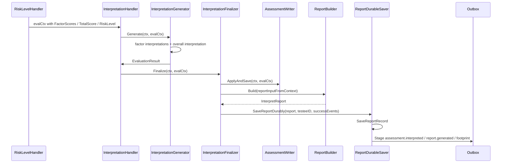
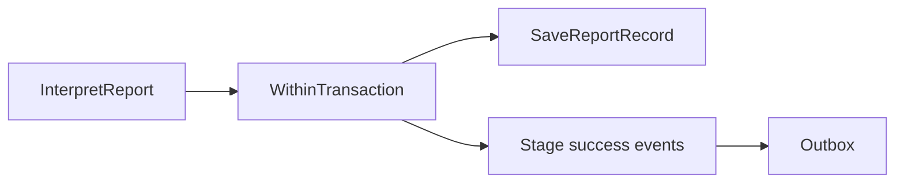

# Report 与 Interpretation

**本文回答**：Evaluation 中 `Interpretation` 和 `Report` 分别负责什么；Scale 的解读规则如何进入本次 `EvaluationResult`；`InterpretReport` 如何由 ReportBuilder 构建并持久化；为什么 `assessment.interpreted`、`report.generated` 和统计 footprint 事件必须绑定在报告保存的 durable 边界，而不能在 `Assessment.ApplyEvaluation` 或 pipeline 末尾 direct publish。

---

## 30 秒结论

| 维度 | 结论 |
| ---- | ---- |
| Interpretation 定位 | Interpretation 是 Evaluation pipeline 的产出阶段，负责生成结论、建议、EvaluationResult，并触发结果应用与报告保存 |
| Report 定位 | `InterpretReport` 是本次测评的报告聚合，和 Assessment 是 1:1 关系，ID 与 AssessmentID 一致 |
| 规则来源 | 风险区间、因子解释、建议文案的规则来源是 Scale 的 `InterpretationRule` |
| 结果归属 | 本次结论、建议、因子解释、报告属于 Evaluation 产出事实 |
| 构建方式 | `ReportBuilder.Build` 从 `GenerateReportInput` 构建 InterpretReport，包含总体结论、维度解读和建议列表 |
| 保存方式 | `InterpretReportWriter.BuildAndSave` 构建报告后调用 `ReportDurableSaver.SaveReportDurably` |
| 可靠出站 | 报告保存和事件 stage 在同一个 durable 边界内完成 |
| 成功事件 | 成功后 stage `assessment.interpreted`、`report.generated` 和 `footprint.report_generated` |
| 不负责 | Report 不重新定义风险规则，不推进 AnswerSheet，不修改 Scale，不承担 MQ 投递 |

一句话概括：

> **Scale 定义解释规则，Interpretation 生成本次评估结果，Report 固化本次报告产物，Outbox 负责把报告成功这件事可靠通知出去。**

---

## 1. 为什么要把 Interpretation 和 Report 分开

这两个概念经常混在一起：

| 概念 | 解决的问题 | 所属 |
| ---- | ---------- | ---- |
| `InterpretationRule` | 某个分数区间意味着什么风险、结论、建议 | Scale |
| `InterpretationHandler` | 本次评估如何生成结论和建议，并保存结果/报告 | Evaluation pipeline |
| `EvaluationResult` | 本次测评的总分、风险、结论、建议和因子得分 | Evaluation |
| `InterpretReport` | 本次测评的可展示报告聚合 | Evaluation / Report |
| `ReportBuilder` | 如何把 EvaluationResult 转成报告结构 | Evaluation / Report |
| `report.generated` | 报告已成功保存的事件信号 | Event / Outbox |

一句话：

```text
Interpretation 是解释过程；
Report 是解释产物；
InterpretationRule 是规则来源。
```

如果不分开，会导致：

- Report 模板里硬编码风险区间。
- Scale 规则文案和 Report 文案相互覆盖。
- Assessment 状态已经 interpreted，但报告保存失败。
- report.generated 事件提前发出。
- 后续标签、统计、通知消费到不存在的报告。

---

## 2. 端到端产出链路



关键点：

1. `InterpretationGenerator` 负责生成解释结果。
2. `InterpretationFinalizer` 负责应用结果和保存报告。
3. `ReportDurableSaver` 负责把报告保存和事件 stage 放进同一事务边界。
4. 事件不是 direct publish，而是 outbox staged。

---

## 3. InterpretationHandler 的职责

`InterpretationHandler` 是 pipeline 中从“分数/风险”进入“测评产出”的阶段。

它做：

| 步骤 | 说明 |
| ---- | ---- |
| 检查 generator | 没有 generator 返回 module not configured |
| `generator.Generate` | 生成因子解释、总体解释和 EvaluationResult |
| 检查 finalizer | 没有 finalizer 返回 module not configured |
| `finalizer.Finalize` | 应用结果、保存 Assessment、构建报告、保存报告和事件 |
| Next | 成功后继续下一个 handler，例如 WaiterNotify |

它不做：

- 加载 AnswerSheet。
- 重新计算因子分。
- 重新定义 Scale 规则。
- 直接 publish MQ。
- 直接操作 Report Mongo 细节。

---

## 4. InterpretationGenerator

`InterpretationGenerator` 内部有两个依赖：

| 依赖 | 作用 |
| ---- | ---- |
| `interpretengine.Interpreter` | 根据规则生成解释 |
| `interpretengine.DefaultProvider` | 缺少规则时生成默认解释 |

它的核心产出是：

```text
evalCtx.Conclusion
evalCtx.Suggestion
evalCtx.EvaluationResult
FactorScores 中的 conclusion/suggestion
```

### 4.1 规则来源

解释规则来自 Scale snapshot：

```text
ScaleSnapshot
  -> FactorSnapshot
  -> InterpretRuleSnapshot
```

这些 snapshot 来自 Scale 的 `MedicalScale / Factor / InterpretationRule`，不是 Report 自己维护的规则。

### 4.2 缺省解释

如果某个因子找不到匹配规则，系统可以通过 DefaultProvider 生成默认解释。这个机制可以提升健壮性，但不能成为规则缺失的长期替代方案。

规则缺失仍应回到 Scale 修复。

---

## 5. EvaluationResult

`EvaluationResult` 是本次测评结果值对象，包含：

| 字段 | 说明 |
| ---- | ---- |
| `TotalScore` | 总分 |
| `RiskLevel` | 总体风险等级 |
| `Conclusion` | 总结论 |
| `Suggestion` | 总建议 |
| `FactorScores` | 因子得分和解释 |

它被用于两件事：

1. 应用到 `Assessment`：

   ```text
   Assessment.ApplyEvaluation(EvaluationResult)
   ```

2. 构建 `InterpretReport`：

   ```text
   reportInputFromContext(evalCtx)
   ```

因此 EvaluationResult 是“状态更新”和“报告构建”的中间桥梁。

---

## 6. InterpretationFinalizer

`InterpretationFinalizer` 做最终收口：

```text
if EvaluationResult == nil:
    build EvaluationResult from Context

assessmentWriter.ApplyAndSave(ctx, evalCtx)
reportWriter.BuildAndSave(ctx, evalCtx)
```

### 6.1 AssessmentWriter

`assessmentWriter.ApplyAndSave` 应负责：

- 调用 `Assessment.ApplyEvaluation(result)`。
- 保存 Assessment。
- 保证 interpreted 状态与持久化一致。

但注意：`ApplyEvaluation` 本身不添加 interpreted 事件。

### 6.2 ReportWriter

`reportWriter.BuildAndSave` 应负责：

- 从 Context 构建报告输入。
- 调用 ReportBuilder。
- 调用 ReportDurableSaver。
- 成功后把 report 放入 `evalCtx.Report`。

这说明“解释成功”不只是算出文案，还包括 Assessment 保存和 Report 保存。

---

## 7. InterpretReport 聚合

`InterpretReport` 是报告聚合根，职责是记录本次测评的解读报告。

它的源码注释明确指出：

```text
存储：MongoDB
与 Assessment 关系：1:1，ID 与 AssessmentID 一致
```

### 7.1 核心字段

| 字段 | 说明 |
| ---- | ---- |
| `id` | 报告 ID，与 AssessmentID 一致 |
| `scaleName` | 量表名称 |
| `scaleCode` | 量表编码 |
| `totalScore` | 总分 |
| `riskLevel` | 总体风险等级 |
| `conclusion` | 总结论 |
| `dimensions` | 维度解读列表 |
| `suggestions` | 建议列表 |
| `createdAt / updatedAt` | 时间戳 |

### 7.2 业务方法

| 方法 | 说明 |
| ---- | ---- |
| `UpdateSuggestions` | 更新建议列表 |
| `AppendSuggestion` | 追加建议 |
| `FindDimension` | 查找指定因子维度解读 |
| `GetHighRiskDimensions` | 获取高风险维度 |
| `HasSuggestions` | 是否有建议 |

Report 是可查询、可展示、可导出的产物。它不是 transient DTO。

---

## 8. ReportBuilder

`ReportBuilder` 是领域服务接口：

```go
Build(input GenerateReportInput) (*InterpretReport, error)
```

`DefaultReportBuilder` 会：

1. 校验 AssessmentID。
2. 构建总体结论。
3. 构建维度解读。
4. 构建建议列表。
5. 创建 `InterpretReport`。

### 8.1 GenerateReportInput

报告输入包含：

| 字段 | 来源 |
| ---- | ---- |
| `AssessmentID` | Assessment |
| `ScaleName / ScaleCode` | ScaleSnapshot |
| `TotalScore` | EvaluationResult |
| `RiskLevel` | EvaluationResult |
| `Conclusion / Suggestion` | EvaluationResult |
| `FactorScores` | EvaluationResult.FactorScores |

### 8.2 buildConclusion

当前优先使用总分因子的解读作为总体结论：

```text
如果存在 isTotalScore 且 Description 非空的 factor score
  -> 使用它作为 report conclusion
否则使用 EvaluationResult.Conclusion
否则为空
```

### 8.3 buildDimensions

对每个 `FactorScoreInput` 构建 `DimensionInterpret`：

```text
FactorCode
FactorName
RawScore
MaxScore
RiskLevel
Description
Suggestion
```

### 8.4 buildSuggestions

建议构建分两部分：

1. 从因子解读配置中收集建议。
2. 如果配置了 `SuggestionGenerator`，则生成额外建议。
3. 最后去重。

这意味着 Suggestion 是报告内部结构，不是独立事件流。

---

## 9. Suggestion 的边界

Suggestion 容易被误解成一个独立业务模块。当前更准确的边界是：

| 内容 | 边界 |
| ---- | ---- |
| 因子规则中的 suggestion | Scale 规则输出 |
| Report 中的 suggestions 列表 | Evaluation 报告产物 |
| SuggestionGenerator | Report 构建增强策略 |
| 通知用户 | Notification / Plan / 外部服务 |
| 训练计划推荐 | 可能属于 Plan/Profile/AI 模块，不应直接塞进 Report |

Suggestion 当前不独立发布事件，也不单独推进状态机。它是 report 的组成部分。

---

## 10. ReportWriter 与 durable save

`InterpretReportWriter.BuildAndSave` 做：

1. 使用 `reportInputFromContext(evalCtx)` 构建 `GenerateReportInput`。
2. 调用 `reportBuilder.Build(...)` 创建 `InterpretReport`。
3. 调用 `reportSaver.SaveReportDurably(...)` 保存报告并 stage events。
4. 成功后把 `evalCtx.Report = rpt`。

### 10.1 reportInputFromContext

它会从 Context 中提取：

| 来源 | 字段 |
| ---- | ---- |
| `Assessment` | AssessmentID |
| `MedicalScale` | ScaleName / ScaleCode |
| `EvaluationResult` | TotalScore / RiskLevel / Conclusion / Suggestion / FactorScores |
| `ScaleSnapshot.Factors` | factor title、maxScore 等元数据 |

### 10.2 reportFactorScoreInputs

该函数会把 `assessment.FactorScoreResult` 转成 report 的 `FactorScoreInput`，并用 ScaleSnapshot 中的 factor 元数据补齐：

- factor name。
- max score。
- fallback factor name。

这体现了报告不是只复制 EvaluationResult，而是会结合 Scale 规则元数据形成展示友好的报告结构。

---

## 11. ReportDurableSaver

`ReportDurableSaver.SaveReportDurably` 负责把报告保存和事件 staging 放在同一个事务中。



当前 transactional saver 要求：

| 依赖 | 作用 |
| ---- | ---- |
| transaction runner | 提供事务边界 |
| report writer | 保存报告记录 |
| event stager | stage 成功事件 |

如果任一依赖缺失，会返回错误。

### 11.1 为什么要 durable save

如果报告保存和事件发送分开，会出现：

| 场景 | 后果 |
| ---- | ---- |
| Report 保存成功，但 report.generated 事件丢失 | 下游统计/标签/通知收不到 |
| assessment.interpreted 先发出，但 Report 保存失败 | 下游查不到报告 |
| footprint 事件丢失 | 行为统计不完整 |

因此成功事件必须绑定报告保存边界。

---

## 12. Success Events

报告成功保存后，`InterpretationEventAssembler.BuildSuccessEvents` 会构建：

| 事件 | 语义 |
| ---- | ---- |
| `assessment.interpreted` | 测评已解读 |
| `report.generated` | 报告已生成 |
| `footprint.report_generated` | 报告生成行为足迹，供统计投影 |

### 12.1 assessment.interpreted

包含：

- orgID。
- assessmentID。
- testeeID。
- scaleCode / scaleVersion。
- totalScore。
- riskLevel。
- interpretedAt。

这个事件表示测评结果已经完成解读。它应该出现在报告保存成功之后。

### 12.2 report.generated

包含：

- reportID。
- assessmentID。
- testeeID。
- scaleCode / scaleVersion。
- totalScore。
- riskLevel。
- generatedAt。

这个事件表示报告已经持久化，后续查询和下游动作可以围绕 reportID 展开。

### 12.3 footprint.report_generated

这是行为足迹事件，用于 Statistics/Behavior projection。它不改变 Assessment 或 Report 本身。

---

## 13. 与 Assessment 状态机的关系

`Assessment.ApplyEvaluation` 做的是：

```text
submitted -> interpreted
写入 totalScore
写入 riskLevel
写入 interpretedAt
```

但它不发布 `assessment.interpreted`。

为什么？

因为完整成功语义不是“Assessment 状态已改”，而是：

```text
Assessment 已保存为 interpreted
Report 已成功保存
assessment.interpreted 已 staged
report.generated 已 staged
footprint 已 staged
```

因此 interpreted 事件放在 report durable save 边界更安全。

---

## 14. 与 Scale 的关系

Scale 提供：

| Scale 内容 | Report 使用方式 |
| ---------- | --------------- |
| factor title | 维度标题 |
| maxScore | 展示满分或进度 |
| interpretation rule conclusion | 维度描述 |
| interpretation rule suggestion | 建议列表来源 |
| riskLevel | 维度/总体风险 |

Report 不应该重新定义：

- 分数区间。
- 风险等级。
- 医学解释文案。
- 量表规则。

Report 可以决定：

- 如何组织维度。
- 是否显示建议。
- 如何合并建议。
- 是否导出。
- 展示顺序和格式。

---

## 15. 与导出的关系

报告导出是查询/展示能力，不是 Evaluation 状态机的一部分。

| 能力 | 说明 |
| ---- | ---- |
| Report 生成 | Evaluation pipeline 内完成 |
| Report 保存 | durable save |
| report.generated | 保存成功后的事件 |
| Report 查询 | application/query 能力 |
| Report 导出 | 读取已保存报告并转换格式 |

导出失败不应该反向修改 Assessment 状态，也不应该重新触发 report.generated。

---

## 16. 设计模式与实现意图

| 模式 | 当前实现 | 意图 |
| ---- | -------- | ---- |
| Builder | `ReportBuilder` / `DefaultReportBuilder` | 多源输入构建报告聚合 |
| Aggregate Root | `InterpretReport` | 报告作为本次测评产出事实 |
| Value Object | `DimensionInterpret`、`Suggestion`、`RiskLevel` | 报告内部结构稳定可测试 |
| Strategy | `SuggestionGenerator` / factor suggestion strategy | 建议来源可扩展 |
| Finalizer | `InterpretationFinalizer` | 解释生成和保存收口分离 |
| Transactional Durable Save | `ReportDurableSaver` | 报告保存和事件 stage 一致 |
| Event Assembler | `InterpretationEventAssembler` | 将成功产出转换成 outbox events |

---

## 17. 设计取舍

| 设计 | 收益 | 代价 |
| ---- | ---- | ---- |
| InterpretReport 与 Assessment 1:1 | 查询简单，报告 ID 语义清晰 | 多版本报告需要额外设计 |
| ReportBuilder 集中组装报告 | 逻辑集中，易测试 | 模板复杂后可能膨胀 |
| Suggestion 作为报告组成 | 简洁，不引入独立事件流 | 复杂推荐系统需要独立模块 |
| 成功事件绑定 durable save | 避免报告/事件不一致 | 保存路径更复杂 |
| ApplyEvaluation 不发 interpreted 事件 | 可靠边界清楚 | 需要读者理解 finalizer/outbox 关系 |
| 导出与生成分离 | 导出失败不污染评估状态 | 导出需要单独查询和权限控制 |

---

## 18. 常见误区

### 18.1 “InterpretationRule 就是 Report 文案”

不准确。InterpretationRule 是 Scale 规则输出，Report 是本次测评产物。

### 18.2 “报告生成就是把 EvaluationResult 存一下”

不够。ReportBuilder 会结合 Scale 元数据、因子分、结论、建议，形成结构化 InterpretReport。

### 18.3 “assessment.interpreted 应该在 ApplyEvaluation 里发”

当前不应这样做。因为事件要和报告保存成功绑定，否则会出现 interpreted 事件发出但 Report 不存在。

### 18.4 “report.generated 是导出完成”

错误。`report.generated` 表示报告持久化生成，不代表 PDF/Excel/页面导出完成。

### 18.5 “Suggestion 是独立异步链路”

当前不是。Suggestion 是报告组成部分，建议生成策略只是 ReportBuilder 的增强点。

### 18.6 “footprint.report_generated 会影响报告内容”

不会。footprint 是统计/行为投影输入，不反向改变 Report。

---

## 19. 修改指南

### 19.1 修改报告结构

检查：

```text
domain/evaluation/report
application/evaluation/engine/pipeline/interpret_report_writer.go
infra/mongo/evaluation report mapper
REST / gRPC report DTO
report query / export service
docs/02-业务模块/evaluation/03-Report与Interpretation.md
```

### 19.2 修改建议生成

检查：

```text
SuggestionGenerator
FactorInterpretationSuggestionStrategy
DefaultReportBuilder.buildSuggestions
report tests
```

### 19.3 修改成功事件

检查：

```text
InterpretationEventAssembler
ReportDurableSaver
configs/events.yaml
worker handlers
statistics projection
docs/03-基础设施/event
```

### 19.4 修改 Scale 文案字段

先改 Scale：

```text
domain/scale/InterpretationRule
application/scale/factor_service
evaluationinput snapshot
interpretengine
ReportBuilder
```

不要只改 Report。

---

## 20. 代码锚点

### Report Domain

- InterpretReport：[../../../internal/apiserver/domain/evaluation/report/report.go](../../../internal/apiserver/domain/evaluation/report/report.go)
- Report types：[../../../internal/apiserver/domain/evaluation/report/types.go](../../../internal/apiserver/domain/evaluation/report/types.go)
- ReportBuilder：[../../../internal/apiserver/domain/evaluation/report/builder.go](../../../internal/apiserver/domain/evaluation/report/builder.go)
- Suggestion strategy guide：[../../../internal/apiserver/domain/evaluation/report/SUGGESTION_STRATEGY_GUIDE.md](../../../internal/apiserver/domain/evaluation/report/SUGGESTION_STRATEGY_GUIDE.md)

### Pipeline

- InterpretationHandler：[../../../internal/apiserver/application/evaluation/engine/pipeline/interpretation.go](../../../internal/apiserver/application/evaluation/engine/pipeline/interpretation.go)
- InterpretReportWriter：[../../../internal/apiserver/application/evaluation/engine/pipeline/interpret_report_writer.go](../../../internal/apiserver/application/evaluation/engine/pipeline/interpret_report_writer.go)
- ReportDurableSaver：[../../../internal/apiserver/application/evaluation/engine/pipeline/report_durable_saver.go](../../../internal/apiserver/application/evaluation/engine/pipeline/report_durable_saver.go)
- InterpretationEventAssembler：[../../../internal/apiserver/application/evaluation/engine/pipeline/interpretation_event_assembler.go](../../../internal/apiserver/application/evaluation/engine/pipeline/interpretation_event_assembler.go)

### Domain / Events

- Assessment：[../../../internal/apiserver/domain/evaluation/assessment/assessment.go](../../../internal/apiserver/domain/evaluation/assessment/assessment.go)
- Assessment events：[../../../internal/apiserver/domain/evaluation/assessment/events.go](../../../internal/apiserver/domain/evaluation/assessment/events.go)
- Event catalog：[../../../configs/events.yaml](../../../configs/events.yaml)

---

## 21. Verify

```bash
go test ./internal/apiserver/domain/evaluation/report
go test ./internal/apiserver/application/evaluation/engine/pipeline
```

如果修改报告持久化或成功事件：

```bash
go test ./internal/apiserver/application/eventing
go test ./internal/apiserver/outboxcore
go test ./internal/worker/handlers
```

如果修改报告查询或导出：

```bash
go test ./internal/apiserver/application/evaluation/report
```

如果修改接口契约：

```bash
make docs-rest
make docs-verify
```

---

## 22. 下一跳

| 目标 | 下一篇 |
| ---- | ------ |
| 理解 pipeline | [02-EnginePipeline.md](./02-EnginePipeline.md) |
| 理解 outbox 可靠出站 | [04-Outbox与可靠出站.md](./04-Outbox与可靠出站.md) |
| 理解失败和重试 | [05-评估失败与重试SOP.md](./05-评估失败与重试SOP.md) |
| 理解 Scale 风险文案 | [../scale/02-解读规则与风险文案.md](../scale/02-解读规则与风险文案.md) |
