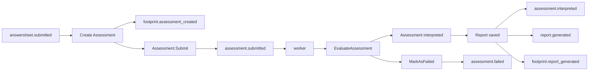
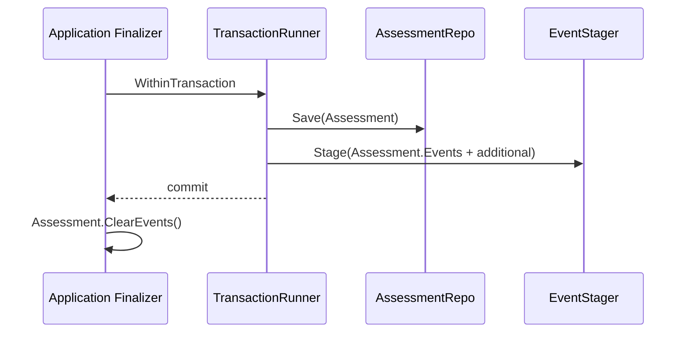
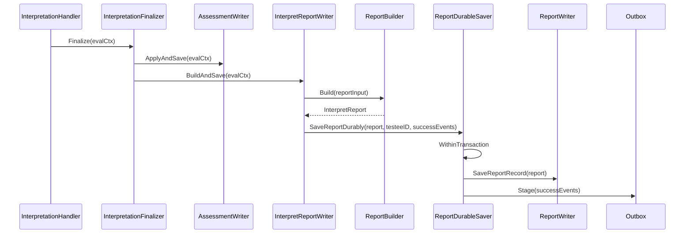
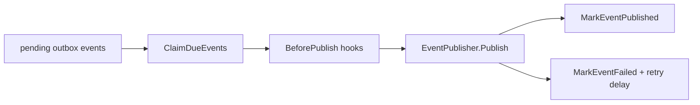

# Outbox 与可靠出站

**本文回答**：Evaluation 模块中的 `assessment.submitted`、`assessment.failed`、`assessment.interpreted`、`report.generated`、`footprint.*` 等事件为什么不能简单 direct publish；哪些事件在哪个持久化边界 stage；为什么 Assessment 状态、Report 保存和事件出站要绑定在各自的 durable 边界；outbox relay 与 worker 消费的职责边界是什么。

---

## 30 秒结论

| 事件 | delivery | 产生时机 | 可靠边界 |
| ---- | -------- | -------- | -------- |
| `assessment.submitted` | `durable_outbox` | Assessment 从 pending 提交为 submitted | Assessment 保存事务 |
| `assessment.failed` | `durable_outbox` | Assessment 被标记为 failed | Assessment 保存事务 |
| `assessment.interpreted` | `durable_outbox` | EvaluationResult 应用且 Report 保存成功 | Report durable save 边界 |
| `report.generated` | `durable_outbox` | InterpretReport 成功保存 | Report durable save 边界 |
| `footprint.assessment_created` | `durable_outbox` | Assessment 创建成功 | Assessment 创建事务 |
| `footprint.report_generated` | `durable_outbox` | Report 成功保存 | Report durable save 边界 |

一句话原则：

> **Evaluation 的关键事件都应先进入 outbox，再由 relay 发布到 MQ；业务服务不应在状态或报告保存后直接 publish durable 事件。**

---

## 1. 为什么 Evaluation 必须关注可靠出站

Evaluation 的产物会被多个下游消费：

```text
报告查询
风险标签
统计投影
行为足迹
通知
任务完成
运营看板
```

如果事件丢失，问题不是“少一条日志”，而是：

| 丢失事件 | 后果 |
| -------- | ---- |
| `assessment.submitted` 丢失 | worker 不会执行评估 |
| `assessment.interpreted` 丢失 | 下游不知道测评已完成 |
| `report.generated` 丢失 | 统计、标签或通知可能卡住 |
| `assessment.failed` 丢失 | 失败不可见，无法补偿 |
| `footprint.report_generated` 丢失 | 行为统计不完整 |

所以 Evaluation 事件需要可靠出站：**业务状态保存成功与事件起点持久化必须处于同一边界。**

---

## 2. Event catalog 是事件契约真值

事件 topic、delivery、handler 不是口头约定，而是 `configs/events.yaml` 中的机器契约。

当前 Evaluation 相关事件主要落在两个 topic：

| topic key | topic name | 说明 |
| --------- | ---------- | ---- |
| `assessment-lifecycle` | `qs.evaluation.lifecycle` | 测评生命周期事件 |
| `analytics-behavior` | `qs.analytics.behavior` | 行为足迹与服务过程投影事件 |

相关事件：

| event type | aggregate | domain | delivery | handler |
| ---------- | --------- | ------ | -------- | ------- |
| `assessment.submitted` | Assessment | evaluation/assessment | durable_outbox | assessment_submitted_handler |
| `assessment.interpreted` | Assessment | evaluation/assessment | durable_outbox | assessment_interpreted_handler |
| `assessment.failed` | Assessment | evaluation/assessment | durable_outbox | assessment_failed_handler |
| `report.generated` | Report | evaluation/report | durable_outbox | report_generated_handler |
| `footprint.assessment_created` | BehaviorFootprint | statistics/behavior | durable_outbox | behavior_projector_handler |
| `footprint.report_generated` | BehaviorFootprint | statistics/behavior | durable_outbox | behavior_projector_handler |

### 2.1 delivery class 的含义

| delivery | 含义 |
| -------- | ---- |
| `best_effort` | 通知类事件，可以容忍失败后不强制补偿 |
| `durable_outbox` | 主链路或关键投影事件，必须先入 outbox 再出站 |

Evaluation 主链路事件都属于 `durable_outbox`。

---

## 3. Evaluation 事件总图



这张图要分清两类动作：

1. **业务状态/报告写入**：在 apiserver 内完成。
2. **事件发布到 MQ**：由 outbox relay 异步完成。

---

## 4. 持久化边界一：Assessment 创建与提交

Assessment 创建/提交使用应用层 finalizer 收口。

### 4.1 CreateAssessment

创建 Assessment 时，应用层会：

1. 构造 Assessment。
2. 保存 Assessment。
3. stage 聚合事件和附加 footprint 事件。
4. 清空聚合内事件。
5. 失效用户测评列表缓存。

`assessmentCreateFinalizer.SaveAndStage` 会追加：

```text
footprint.assessment_created
```

并调用通用函数：

```text
saveAssessmentAndStageEvents(...)
```

### 4.2 SubmitAssessment

提交 Assessment 时，领域方法：

```text
Assessment.Submit()
```

会：

1. 校验当前必须是 pending。
2. 设置 status = submitted。
3. 设置 submittedAt。
4. 添加 `AssessmentSubmittedEvent`。

然后应用层 finalizer 在事务内保存 Assessment 并 stage 事件。

### 4.3 saveAssessmentAndStageEvents

该函数的边界非常关键：



它保证：

```text
Assessment 保存成功
和
assessment.submitted / assessment.failed / footprint 事件 stage
处在同一个事务边界
```

如果事务失败，事件不会被误认为已 stage；如果 stage 失败，业务保存也会失败。

---

## 5. 持久化边界二：Assessment 失败

评估失败通常发生在：

- input resolver 找不到 Scale / AnswerSheet / Questionnaire。
- pipeline handler 返回 error。
- report 保存失败。
- 其它模块未配置或数据库错误。

Evaluation service 会通过 failure finalizer 调用 Assessment 状态机：

```text
Assessment.MarkAsFailed(reason)
```

该方法会：

1. 要求当前状态是 submitted 或 interpreted。
2. 设置 status = failed。
3. 设置 failedAt。
4. 写入 failureReason。
5. 清空 interpretedAt / totalScore / riskLevel。
6. 添加 `AssessmentFailedEvent`。

然后应用层应通过事务保存并 stage `assessment.failed`。

### 5.1 为什么失败事件也要 durable_outbox

失败事件用于：

- 运维可见性。
- 重试/补偿入口。
- 用户状态展示。
- 统计失败率。
- 通知或告警。

如果失败状态写库成功但事件丢失，下游会以为评估仍在处理中。

---

## 6. 持久化边界三：Report 保存与成功事件

`Assessment.ApplyEvaluation(result)` 本身只修改 Assessment 状态和结果，不直接添加 interpreted 事件。

成功事件绑定在 Report durable save 边界：



`SaveReportDurably` 要求：

| 依赖 | 作用 |
| ---- | ---- |
| transaction runner | 提供事务边界 |
| report writer | 保存报告记录 |
| event stager | stage success events |

如果依赖缺失，会返回错误。

### 6.1 Success events

报告保存成功后会 stage：

```text
assessment.interpreted
report.generated
footprint.report_generated
```

这些事件必须跟报告保存绑定，不能提前发。

### 6.2 为什么 interpreted 事件不在 ApplyEvaluation 里发

因为完整的 interpreted 业务语义不是单纯“Assessment 状态变了”，而是：

```text
EvaluationResult 已应用
Assessment 已保存
Report 已保存
assessment.interpreted 已 staged
report.generated 已 staged
footprint.report_generated 已 staged
```

如果在 `ApplyEvaluation` 里直接发事件，会出现：

```text
下游收到 interpreted
但 report 查询不到
```

这是可靠性漏洞。

---

## 7. Outbox relay 的职责

Outbox relay 负责把 outbox 中 pending 的事件发布到 MQ。

核心流程：



Relay 处理的是“事件出站”，不负责重新执行业务状态变更。

| 职责 | 是否属于 relay |
| ---- | -------------- |
| claim due events | 是 |
| publish to MQ | 是 |
| mark published | 是 |
| mark failed and retry later | 是 |
| 修改 Assessment 状态 | 否 |
| 重新生成 Report | 否 |
| 判断业务事件是否该产生 | 否 |
| 决定 handler 业务逻辑 | 否 |

---

## 8. Worker 消费边界

事件进入 MQ 后，由 worker 消费。

| 事件 | 典型后续动作 |
| ---- | ------------ |
| `assessment.submitted` | 触发 `EvaluateAssessment` |
| `assessment.interpreted` | 高风险标签、统计、通知、任务完成等后续动作 |
| `assessment.failed` | 失败统计、告警、补偿提示 |
| `report.generated` | 报告相关投影、统计、通知 |
| `footprint.report_generated` | 行为足迹投影 |

但 worker 不是 outbox relay。二者边界不同：

| 组件 | 负责 |
| ---- | ---- |
| Outbox relay | 从 outbox 发布事件到 MQ |
| Worker subscriber | 从 MQ 消费事件并调用 handler |
| Worker handler | 通过 internal gRPC 推进业务或投影 |
| apiserver | 保存权威业务状态 |

---

## 9. 多持久化边界

Evaluation 里可能涉及 MySQL 与 Mongo：

| 数据 | 常见存储边界 |
| ---- | ------------ |
| Assessment / AssessmentScore | MySQL 或 evaluation repository |
| InterpretReport | Mongo |
| Outbox events | 对应持久化边界的 outbox store |

当前设计不强行做跨库分布式事务，而是在各自业务持久化边界内 stage 对应事件。

这是一种务实取舍：

| 收益 | 代价 |
| ---- | ---- |
| 避免跨 MySQL/Mongo 分布式事务 | relay 与排障更复杂 |
| 事件跟随真实写入边界 | 需要清楚区分 assessment outbox 和 report outbox |
| 失败补偿更明确 | 需要更多监控和 backlog 检查 |

---

## 10. 事件与状态的一致性原则

### 10.1 事件必须晚于或等于事实

不能在事实保存前发事件。

| 事实 | 事件 |
| ---- | ---- |
| Assessment submitted 已保存 | `assessment.submitted` |
| Assessment failed 已保存 | `assessment.failed` |
| Report 已保存 | `report.generated` |
| Report 已保存且 Assessment interpreted 已应用 | `assessment.interpreted` |

### 10.2 事件不是命令回放

`assessment.interpreted` 是“已经发生”的事实通知，不是“请解读”的命令。

真正触发评估执行的是：

```text
assessment.submitted
```

而不是：

```text
assessment.interpreted
```

### 10.3 footprint 不改变主事实

footprint 事件只服务 Statistics / Behavior projection。它们不反向改变 Assessment 或 Report。

---

## 11. 排障路径

### 11.1 Assessment 已 submitted，但没有执行评估

检查：

1. `assessment.submitted` 是否进入 outbox。
2. outbox relay 是否 claim 并 publish。
3. MQ topic `qs.evaluation.lifecycle` 是否有积压。
4. worker 是否订阅了 `assessment_submitted_handler`。
5. worker internal gRPC 调 apiserver 是否成功。

### 11.2 Assessment 已 interpreted，但没有报告

检查：

1. InterpretationHandler 是否执行到 finalizer。
2. AssessmentWriter 是否 ApplyAndSave 成功。
3. ReportBuilder 是否 Build 成功。
4. ReportDurableSaver 是否 SaveReportRecord 成功。
5. 是否出现保存报告失败后 MarkAsFailed。

### 11.3 Report 存在，但下游不知道报告已生成

检查：

1. `report.generated` 是否进入 outbox。
2. outbox relay 是否 publish 成功。
3. `report_generated_handler` 是否注册。
4. worker 是否消费。
5. 下游 handler 是否成功处理。

### 11.4 统计缺少报告生成记录

检查：

1. `footprint.report_generated` 是否 stage。
2. analytics behavior topic 是否有积压。
3. `behavior_projector_handler` 是否消费。
4. Statistics projection 是否失败。

---

## 12. 新增 Evaluation 事件的规则

新增事件前先回答：

| 问题 | 必须明确 |
| ---- | -------- |
| 事件代表事实还是命令 | 事实事件用过去式，命令另设 command |
| 事件属于哪个 aggregate | Assessment / Report / BehaviorFootprint |
| delivery 是什么 | durable_outbox 还是 best_effort |
| topic 是什么 | assessment-lifecycle / analytics-behavior / 其它 |
| handler 是什么 | worker registry 中必须存在 |
| stage 在哪个持久化边界 | Assessment 保存、Report 保存、其它 |
| 是否需要统计 footprint | 如果是用户行为或服务过程，需要 |
| 是否影响 docs | event 文档和业务文档都要更新 |

### 12.1 什么情况下必须 durable_outbox

满足任一条件，优先 durable outbox：

- 下游依赖该事件推进主业务。
- 事件丢失会导致状态卡住。
- 事件丢失会造成报告/统计/标签不可恢复。
- 事件代表已经持久化的业务事实。
- 需要重试和可观测。

### 12.2 什么情况下可以 best_effort

- 缓存刷新。
- 非关键通知。
- 可由定时任务修复的轻量副作用。
- 纯治理类或观测类提示。

---

## 13. 设计模式与实现意图

| 模式 | 当前实现 | 意图 |
| ---- | -------- | ---- |
| Transactional Outbox | `saveAssessmentAndStageEvents`、`SaveReportDurably` | 业务写入和事件 staging 同事务 |
| Relay | `OutboxRelay.DispatchDue` | 异步发布 pending events |
| Event Catalog | `configs/events.yaml` | 统一 event type、topic、delivery、handler |
| Finalizer | assessment/report finalizer | 将状态保存和事件 staging 收口 |
| Event Assembler | `InterpretationEventAssembler` | 从 Context/Report 构造成功事件 |
| Delivery Class | durable_outbox / best_effort | 明确可靠性契约 |
| Worker Handler Registry | worker handlers | 保证事件有明确消费者 |

---

## 14. 设计取舍

| 设计 | 收益 | 代价 |
| ---- | ---- | ---- |
| durable outbox | 避免业务保存成功但事件丢失 | 增加 outbox 表/集合、relay、监控 |
| 按持久化边界 stage | 不需要跨库事务 | 需要理解不同 outbox store |
| interpreted 事件绑定 report save | 下游收到事件时报告可查 | Interpretation 路径更复杂 |
| footprint 事件随业务边界 stage | 统计输入不易丢 | 行为投影需要处理更多事件 |
| relay 统一 publish | 出站链路可观测 | relay backlog 需要排障 |
| 不 direct publish durable event | 一致性更强 | 开发者需要遵守架构规则 |

---

## 15. 常见误区

### 15.1 “outbox 就是 MQ”

错误。outbox 是数据库中的待出站事件记录；MQ 是事件发布后的消息系统。

### 15.2 “stage 成功就表示下游已消费”

错误。stage 只表示事件已进入 outbox。还需要 relay publish、MQ 投递、worker 消费、handler 成功。

### 15.3 “report.generated 是报告导出完成”

错误。它表示报告已生成并保存，不表示 PDF/Excel 导出完成。

### 15.4 “assessment.interpreted 可以在 ApplyEvaluation 里产生”

当前不应这样做。interpreted 的可靠出站应绑定报告保存成功。

### 15.5 “footprint 事件失败会影响报告内容”

不会。footprint 是统计投影输入，不反向改变报告。

### 15.6 “scale.changed 可以触发历史测评重算”

不应默认如此。`scale.changed` 是规则变更通知，不是 Evaluation 重算命令。

---

## 16. 代码锚点

### Event contract

- Event catalog：[../../../configs/events.yaml](../../../configs/events.yaml)

### Assessment outbox boundary

- Assessment submission service：[../../../internal/apiserver/application/evaluation/assessment/submission_service.go](../../../internal/apiserver/application/evaluation/assessment/submission_service.go)
- Assessment finalizers：[../../../internal/apiserver/application/evaluation/assessment/submission_finalizers.go](../../../internal/apiserver/application/evaluation/assessment/submission_finalizers.go)
- Assessment transactional outbox：[../../../internal/apiserver/application/evaluation/assessment/transactional_outbox.go](../../../internal/apiserver/application/evaluation/assessment/transactional_outbox.go)
- Assessment events：[../../../internal/apiserver/domain/evaluation/assessment/events.go](../../../internal/apiserver/domain/evaluation/assessment/events.go)

### Report outbox boundary

- InterpretReportWriter：[../../../internal/apiserver/application/evaluation/engine/pipeline/interpret_report_writer.go](../../../internal/apiserver/application/evaluation/engine/pipeline/interpret_report_writer.go)
- ReportDurableSaver：[../../../internal/apiserver/application/evaluation/engine/pipeline/report_durable_saver.go](../../../internal/apiserver/application/evaluation/engine/pipeline/report_durable_saver.go)
- InterpretationEventAssembler：[../../../internal/apiserver/application/evaluation/engine/pipeline/interpretation_event_assembler.go](../../../internal/apiserver/application/evaluation/engine/pipeline/interpretation_event_assembler.go)
- Report generated event：[../../../internal/apiserver/domain/evaluation/report/](../../../internal/apiserver/domain/evaluation/report/)

### Generic outbox

- Outbox relay：[../../../internal/apiserver/application/eventing/outbox.go](../../../internal/apiserver/application/eventing/outbox.go)
- Outbox core：[../../../internal/apiserver/outboxcore/](../../../internal/apiserver/outboxcore/)
- MySQL outbox：[../../../internal/apiserver/infra/mysql/eventoutbox/](../../../internal/apiserver/infra/mysql/eventoutbox/)
- Mongo outbox：[../../../internal/apiserver/infra/mongo/eventoutbox/](../../../internal/apiserver/infra/mongo/eventoutbox/)

### Worker

- Worker dispatcher：[../../../internal/worker/integration/eventing/dispatcher.go](../../../internal/worker/integration/eventing/dispatcher.go)
- Worker handlers：[../../../internal/worker/handlers/](../../../internal/worker/handlers/)

---

## 17. Verify

```bash
go test ./internal/apiserver/application/evaluation/assessment
go test ./internal/apiserver/application/evaluation/engine/pipeline
go test ./internal/apiserver/application/eventing
go test ./internal/apiserver/outboxcore
go test ./internal/apiserver/infra/mysql/eventoutbox
go test ./internal/apiserver/infra/mongo/eventoutbox
go test ./internal/pkg/eventcatalog
```

如果修改 worker handler 或 event catalog：

```bash
go test ./internal/worker/integration/eventing
go test ./internal/worker/handlers
```

如果修改文档链接或事件契约说明：

```bash
make docs-hygiene
```

---

## 18. 下一跳

| 目标 | 下一篇 |
| ---- | ------ |
| 理解 Assessment 状态机 | [01-Assessment状态机.md](./01-Assessment状态机.md) |
| 理解 Engine pipeline | [02-EnginePipeline.md](./02-EnginePipeline.md) |
| 理解 Report 保存边界 | [03-Report与Interpretation.md](./03-Report与Interpretation.md) |
| 理解失败与重试 | [05-评估失败与重试SOP.md](./05-评估失败与重试SOP.md) |
| 深入事件系统 | [../../03-基础设施/event/README.md](../../03-基础设施/event/README.md) |
