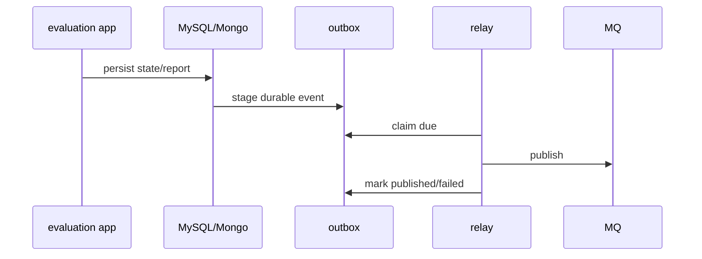
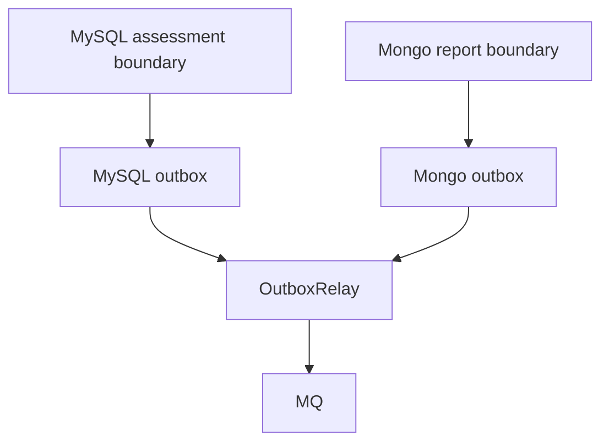

# Evaluation Outbox 与事件

**本文回答**：`assessment.*`、`report.generated` 哪些事件走 outbox，为什么不能统一讲成 direct publish。

## 30 秒结论

| 事件 | 当前 delivery | 边界 |
| ---- | ------------- | ---- |
| `assessment.submitted` | durable_outbox | MySQL assessment 边界 |
| `assessment.failed` | durable_outbox | MySQL assessment 边界 |
| `assessment.interpreted` | durable_outbox | 报告落 Mongo 成功边界 |
| `report.generated` | durable_outbox | 报告落 Mongo 成功边界 |



## 维护规则

- durable 事件必须先进入 outbox store，不能从业务服务普通 direct publish 出站。
- `RoutingPublisher` 仍允许 relay 发布 durable 事件；限制在生产发布点，而不是 publisher 本身。
- delivery class 以 `configs/events.yaml` 为准。

## 为什么按持久化边界拆 outbox

Evaluation 的事件不是同一个表产生的：`Assessment` 和 `AssessmentScore` 主要在 MySQL，`InterpretReport` 在 Mongo。当前设计不强行做跨库事务，而是在各自持久化边界内 staging 对应事件。



| 设计选择 | 原因 | 代价 |
| -------- | ---- | ---- |
| MySQL/Mongo 各自 outbox | 避免跨库事务，事件跟随真实写入边界 | relay 需要同时处理多个 store |
| delivery class 写入 `events.yaml` | 事件可靠性属于契约，不应散落在代码注释 | 新增事件必须声明 delivery |
| publisher 不禁止 durable 事件 | relay 最终也需要通过同一个 publisher 出站 | 需要 architecture test 锁住生产发布点 |

## 设计模式应用

| 模式 | 应用位置 | 作用 |
| ---- | -------- | ---- |
| Transactional Outbox | MySQL/Mongo outbox store | 让业务写入和事件 staging 在同一持久化边界内完成 |
| Relay | `OutboxRelay` | 将 pending outbox 记录异步发布到 MQ |
| Delivery Class | `events.yaml` | 将 durable/best-effort 变成事件契约，而不是代码注释 |
| Architecture Test | durable publish path 检查 | 防止新增 durable 事件绕过 outbox direct publish |

## 取舍与边界

Outbox 增加了 relay、状态机和 backlog 排障成本，但换来业务写入和事件出站的一致性边界。当前不做跨 MySQL/Mongo 的分布式事务，也不让 `RoutingPublisher` 自身禁止 durable 事件，因为 relay 最终也必须通过它发布。

## 代码锚点

- Event config：[events.yaml](../../../configs/events.yaml)
- Outbox core：[outboxcore](../../../internal/apiserver/outboxcore/)
- MySQL outbox：[infra/mysql/eventoutbox](../../../internal/apiserver/infra/mysql/eventoutbox/)
- Mongo outbox：[infra/mongo/eventoutbox](../../../internal/apiserver/infra/mongo/eventoutbox/)
- Relay：[outbox.go](../../../internal/apiserver/application/eventing/outbox.go)

## Verify

```bash
go test ./internal/pkg/eventcatalog ./internal/apiserver/outboxcore ./internal/apiserver/infra/mysql/eventoutbox ./internal/apiserver/infra/mongo/eventoutbox ./internal/apiserver/application/eventing
```
