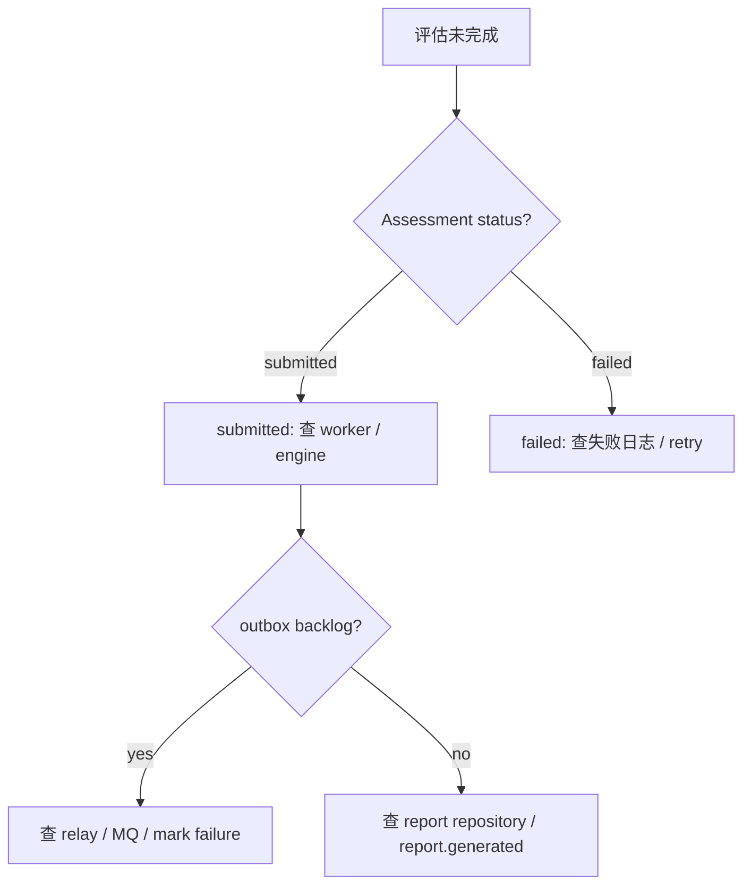
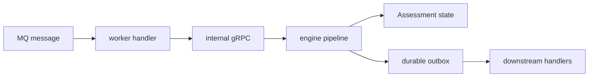

# Evaluation 失败补偿与排障

**本文回答**：评估链路失败时，应该从状态、outbox、worker 和报告边界哪里排查。

## 30 秒结论

| 现象 | 优先排查 |
| ---- | -------- |
| assessment 长期 submitted | worker 消费、engine pipeline、internal gRPC |
| assessment failed | failed event、失败原因日志、retry 入口 |
| outbox pending/failed 增长 | `events/status`、outbox relay、MQ publisher |
| report 缺失 | interpretation/report save 边界 |



## 排障入口

- 当前状态：`GET /internal/v1/events/status` 看 outbox backlog / lag。
- 事件趋势：Grafana event dashboards 看 publish/outbox/consume outcome。
- worker 消费：看 `event_type`、handler error、Ack/Nack outcome。
- Resilience：看 duplicate suppression 或 Redis lock degraded 情况。

## 失败模型

Evaluation 的失败不是单一异常，而是分布在四个层面：事件消费、internal gRPC、engine pipeline、outbox relay。排障时应先确认失败在哪一层，不要直接重跑整条链。

| 层面 | 典型现象 | 设计取舍 |
| ---- | -------- | -------- |
| worker consume | handler error 后 Nack | 保留 MQ 重试机会，但不承诺 exactly-once |
| engine load | assessment/scale/answer sheet 读取失败 | `MarkAsFailed` 让状态可查询 |
| pipeline step | 风险/解读/报告任一步失败 | 职责链中断，service 统一失败收口 |
| outbox relay | event pending/failed backlog | 业务写入已完成，事件出站最终一致 |



当前补偿策略的边界是“可查、可重试、可观测”，不是“自动修复所有语义失败”。例如缺量表属于显式跳过，pipeline 失败进入 failed，outbox 失败由 relay 重试。

## 设计模式应用

| 模式 / 技法 | 位置 | 排障意义 |
| ----------- | ---- | -------- |
| 状态机 | Assessment status | 先看状态判断失败阶段 |
| 职责链 | Engine pipeline | 定位失败发生在哪个 handler |
| Outbox | event delivery | 区分业务写入成功但事件未出站的情况 |
| Ack/Nack policy | worker messaging | 区分 poison、业务失败和 settlement 失败 |
| 观测 outcome | Event / Resilience metrics | 用 bounded outcome 判断趋势，而不是只看日志 |

## 取舍与边界

当前系统追求“失败可见、可定位、可重试”，不是“所有失败自动修复”。如果失败是规则缺失或业务数据不一致，盲目自动重跑只会制造重复失败；应先通过状态、outbox、worker outcome 和日志确定失败层次，再决定是否补数据或重新触发。

## 代码锚点

- Event status service：[status_service.go](../../../internal/apiserver/application/eventing/status_service.go)
- Worker dispatcher：[dispatcher.go](../../../internal/worker/integration/eventing/dispatcher.go)
- Worker messaging：[runtime.go](../../../internal/worker/integration/messaging/runtime.go)
- Evaluation handler：[assessment_handler.go](../../../internal/worker/handlers/assessment_handler.go)

## Verify

```bash
go test ./internal/apiserver/application/eventing ./internal/worker/integration/eventing ./internal/worker/integration/messaging ./internal/worker/handlers
```
