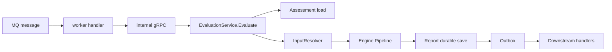
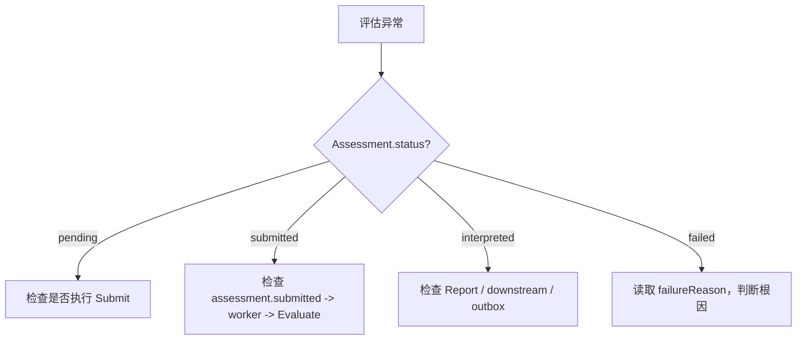

# 评估失败与重试 SOP

**本文回答**：Evaluation 链路失败时应该如何判断失败层级、如何读取 Assessment 状态与 failureReason、哪些失败可以直接重试、哪些失败必须先修数据或规则；`MarkAsFailed`、`RetryFromFailed`、outbox、worker Nack、Report 保存失败分别处在什么边界。

---

## 30 秒结论

| 现象 | 优先判断 |
| ---- | -------- |
| Assessment 长期 `submitted` | 看 `assessment.submitted` outbox、worker 消费、internal gRPC、pipeline 是否执行 |
| Assessment 变成 `failed` | 看 `failureReason`，判断是 input resolve 失败、pipeline 失败、report 保存失败还是 outbox staging 失败 |
| Report 不存在 | 看 InterpretationHandler、ReportBuilder、ReportDurableSaver |
| Report 存在但下游无感知 | 看 `report.generated` / `assessment.interpreted` outbox 与 worker handler |
| outbox pending/failed 堆积 | 看 outbox relay、MQ publisher、topic、handler registry |
| 重试失败测评 | 只能对 `failed` 状态执行 `RetryFromFailed`，且重试前要确认根因已修复 |

一句话原则：

> **失败处理先定位层级，再决定补数据、修规则、重放 outbox、重试 Assessment；不要看到 failed 就盲目 retry。**

---

## 1. Evaluation 失败分层

Evaluation 的失败不是单一异常。它分布在多层链路上：



| 层级 | 典型失败 | 结果 |
| ---- | -------- | ---- |
| MQ / worker | 消费失败、handler panic、Nack | 消息重试或进入失败观测 |
| internal gRPC | apiserver 不可达、认证失败、超时 | worker handler 失败 |
| Assessment load | Assessment 不存在、状态不是 submitted | Evaluate 返回错误 |
| Input resolve | Scale、AnswerSheet、Questionnaire 找不到或版本不匹配 | MarkAsFailed |
| Pipeline | Validation / FactorScore / RiskLevel / Interpretation 任一步失败 | MarkAsFailed |
| Report durable save | 报告构建失败、保存失败、success events stage 失败 | MarkAsFailed 或返回错误 |
| Outbox relay | pending/failed 堆积、publish 失败 | 业务事实已保存，但事件未出站 |
| Downstream handler | 事件已发出，但投影/标签/通知失败 | 下游补偿，不应改 Assessment 主事实 |

排障时先确认失败发生在哪一层。

---

## 2. 状态优先：先看 Assessment.status

Assessment 状态是第一排障入口。

| 状态 | 含义 | 下一步 |
| ---- | ---- | ------ |
| `pending` | 已创建但未提交 | 检查提交链路是否调用 `Submit()` |
| `submitted` | 已提交，等待或正在评估 | 检查 worker、internal gRPC、pipeline、outbox |
| `interpreted` | 已解读完成 | 检查 report.generated / downstream |
| `failed` | 评估失败 | 读取 failureReason，判断是否可 retry |



不要跳过状态直接重放 MQ 或手动改库。

---

## 3. failureReason 怎么用

当 `EvaluationService.Evaluate` 失败时，失败收口路径会调用：

```text
evaluationFailureFinalizer.MarkAsFailed(ctx, assessment, reason)
```

该方法会：

1. 调用 `Assessment.MarkAsFailed(reason)`。
2. 设置状态为 `failed`。
3. 保存失败时间和原因。
4. 清空 interpreted 相关字段。
5. 添加 `AssessmentFailedEvent`。
6. 在事务中保存 Assessment 并 stage 事件。

### 3.1 常见 failureReason 分类

| failureReason 关键词 | 可能原因 | 处理方式 |
| -------------------- | -------- | -------- |
| `量表不存在` / `scale_not_found` | Scale code 错误、量表未创建、绑定缺失 | 修 Scale 或 Assessment 引用后再 retry |
| `答卷不存在` / `answersheet_not_found` | AnswerSheet ID 错误、答卷未保存 | 修答卷链路，不要盲目 retry |
| `问卷不存在` / `version mismatch` | Questionnaire version 缺失或不匹配 | 修问卷 published snapshot / version |
| `MedicalScale not published` | Scale 未发布 | 发布 Scale 后 retry |
| `factor scores required` | 因子计分失败或无因子 | 检查 Factor 配置和 AnswerSheet score |
| `assessment score writer is not configured` | 运行时装配缺失 | 修 container/config |
| `生成报告失败` | ReportBuilder 输入不完整或规则异常 | 修 report/interpretation 配置 |
| `保存报告失败` | Mongo/事务/outbox staging 失败 | 查 report durable saver 和 Mongo |
| `evaluation pipeline runner is not configured` | Engine 装配异常 | 修 apiserver container |

failureReason 是定位入口，不是最终结论。还要结合日志、outbox、worker 结果判断。

---

## 4. Input resolve 失败 SOP

Input resolve 失败发生在 pipeline 执行之前。

`evaluationInputWorkflow.Resolve` 会根据 Assessment 引用构造：

```text
InputRef{
  AssessmentID,
  MedicalScaleCode,
  AnswerSheetID,
  QuestionnaireCode,
  QuestionnaireVersion,
}
```

然后调用 resolver 加载：

```text
ScaleSnapshot
AnswerSheetSnapshot
QuestionnaireSnapshot
```

### 4.1 常见原因

| 原因 | 检查 |
| ---- | ---- |
| Scale 不存在 | `MedicalScaleRef.Code` 是否正确 |
| Scale 未发布 | Scale status 是否 published |
| AnswerSheet 不存在 | `AnswerSheetRef.ID` 是否存在 |
| Questionnaire 不存在 | `QuestionnaireRef.Code/Version` 是否存在 |
| Questionnaire version mismatch | AnswerSheet、Assessment、Scale 绑定版本是否一致 |
| Mongo/MySQL 读取失败 | 数据库连接和查询日志 |

### 4.2 处理步骤

```text
1. 读取 Assessment
2. 查看 medicalScaleRef / answerSheetRef / questionnaireRef
3. 分别查询 Scale / AnswerSheet / Questionnaire
4. 确认版本一致
5. 修复缺失数据或规则
6. 执行 retry
```

### 4.3 不建议

- 不要直接把 failed 改回 submitted。
- 不要直接重发 `assessment.submitted`。
- 不要跳过 Scale published 校验。
- 不要用当前 Questionnaire head 强行解释旧答卷。

---

## 5. Pipeline 失败 SOP

Pipeline 失败发生在 Context 已构造之后。

当前 handler 顺序：

```text
Validation
  -> FactorScore
  -> RiskLevel
  -> Interpretation
  -> WaiterNotify
```

### 5.1 Validation 失败

检查：

| 校验项 | 失败含义 |
| ------ | -------- |
| Assessment 不存在 | 输入异常 |
| Assessment 不是 submitted | 状态机异常或重复执行 |
| MedicalScale 为空 | 没有量表规则 |
| Scale 没有 factors | 规则配置不完整 |
| Scale 未发布 | 规则不可用 |
| Scale questionnaire code 不匹配 | 规则与问卷不一致 |
| AnswerSheetRef 为空 | Assessment 创建异常 |
| AnswerSheet snapshot 为空 | 答卷丢失或 resolver 异常 |

处理：修数据/规则后 retry。

### 5.2 FactorScore 失败

检查：

| 检查项 | 说明 |
| ------ | ---- |
| Factor.questionCodes 是否存在于问卷 | 缺题会导致无法收集分数 |
| AnswerSheet 是否已有题级 score | Survey scoring 是否完成 |
| scoringStrategy 是否支持 | 当前支持 sum / avg / cnt |
| cnt 策略是否需要 QuestionnaireSnapshot | cnt 需要 option content |
| ScaleFactorScorer 是否配置 | ruleengine 装配 |

处理：修 Factor、AnswerSheet scoring、ruleengine 后 retry。

### 5.3 RiskLevel 失败

检查：

| 检查项 | 说明 |
| ------ | ---- |
| FactorScores 是否为空 | 前一步是否成功 |
| InterpretationRule 是否覆盖分数区间 | 未覆盖会 fallback 或导致解释不完整 |
| scoreWriter 是否配置 | AssessmentScore 保存器缺失 |
| AssessmentScore 保存是否失败 | DB 或事务问题 |

处理：修配置/规则/DB 后 retry。

### 5.4 Interpretation 失败

检查：

| 检查项 | 说明 |
| ------ | ---- |
| generator 是否配置 | InterpretationGenerator 缺失 |
| interpretengine 是否配置 | 解释引擎缺失 |
| defaultProvider 是否合理 | 缺规则时能否 fallback |
| EvaluationResult 是否构造成功 | Context 字段是否完整 |
| assessmentWriter 是否配置 | 结果无法应用 |
| reportWriter 是否配置 | 报告无法保存 |
| ReportBuilder 是否失败 | 报告输入不完整 |
| ReportDurableSaver 是否失败 | Mongo/事务/outbox staging 问题 |

处理：根据具体失败点修复后 retry。

---

## 6. Report / Outbox 失败 SOP

### 6.1 Report 保存失败

现象：

```text
Assessment 可能已进入 interpreted 过程
但 ReportDurableSaver 返回错误
最终 Assessment 被标记 failed
```

检查：

1. `InterpretReportWriter.BuildAndSave` 日志。
2. ReportBuilder 是否成功 Build。
3. `SaveReportRecord` 是否失败。
4. `Stage(successEvents)` 是否失败。
5. Mongo 连接/事务是否正常。
6. outbox store 是否可写。

### 6.2 Report 已保存但事件未出站

检查：

1. success events 是否 stage。
2. outbox pending 是否堆积。
3. outbox failed 是否增长。
4. relay 是否运行。
5. publisher 是否连接 MQ。
6. worker 是否消费 topic。
7. handler 是否注册。

### 6.3 事件已出站但下游未更新

检查：

1. worker handler 是否 Ack。
2. handler 是否调用 internal gRPC 成功。
3. 下游投影/标签/通知是否失败。
4. 是否出现 poison message。
5. 是否存在幂等冲突或重复抑制。

---

## 7. RetryFromFailed 的语义

重试入口调用：

```text
managementService.Retry(ctx, orgID, assessmentID)
```

它会：

1. 校验 Assessment 属于当前 org。
2. 加载 Assessment。
3. 检查状态必须是 failed。
4. 调用 `Assessment.RetryFromFailed()`。
5. 在事务中保存 Assessment 并 stage 聚合事件。
6. 返回新的 AssessmentResult。

`RetryFromFailed()` 会：

```text
failed -> submitted
clear failedAt
clear failureReason
add AssessmentSubmittedEvent
```

这会重新触发 worker 评估链路。

---

## 8. 什么时候可以 retry

可以 retry 的前提：

| 前提 | 说明 |
| ---- | ---- |
| Assessment 状态是 failed | 非 failed 状态不能 retry |
| failureReason 已确认 | 知道为什么失败 |
| 根因已修复 | 数据、规则、配置或存储问题已处理 |
| 重试不会破坏历史语义 | 同一 assessment 重新评估是可接受的 |
| 下游幂等可接受 | 事件重复触发不会造成不可控副作用 |

### 8.1 适合 retry 的场景

| 场景 | 原因 |
| ---- | ---- |
| Scale 未发布，已发布后 | 规则修复 |
| Questionnaire version 缺失，已补 snapshot 后 | 输入修复 |
| ruleengine 配置缺失，已恢复后 | 装配修复 |
| Mongo 临时故障，已恢复后 | 基础设施修复 |
| Report save 临时失败，已恢复后 | 存储修复 |
| outbox staging 失败，已恢复后 | 可靠出站修复 |

### 8.2 不适合直接 retry 的场景

| 场景 | 原因 |
| ---- | ---- |
| AnswerSheet 根本不存在 | 需要先恢复答卷事实 |
| Assessment 引用了错误 question version | 需要先修引用或重建 Assessment |
| Factor 引用了不存在题目 | 需要修 Scale 规则 |
| 新规则影响历史报告口径 | 需要重算方案，不是单条 retry |
| 下游重复消费不幂等 | 先修幂等 |

---

## 9. 不要这样做

### 9.1 不要直接改库把 failed 改成 submitted

这会绕过：

- 状态机校验。
- failedAt/failureReason 清理。
- `AssessmentSubmittedEvent`。
- outbox staging。
- cache invalidation。

正确方式是走 `RetryFromFailed()`。

### 9.2 不要直接 publish `assessment.submitted`

直接 publish 会绕过 Assessment 状态事实。如果状态仍是 failed，下游重新 Evaluate 也可能因为状态不对失败。

正确方式是：

```text
RetryFromFailed
  -> save Assessment
  -> stage AssessmentSubmittedEvent
  -> relay publish
```

### 9.3 不要把 outbox pending 当业务失败

outbox pending 表示事件尚未出站，不一定表示 Assessment 失败。先看业务状态，再看 outbox。

### 9.4 不要把 worker Nack 等同于 Assessment failed

worker Nack 是消息消费失败。Assessment 是否 failed 取决于 apiserver Evaluate 是否成功执行并标记状态。

---

## 10. 标准排障流程

### 10.1 单条 Assessment 排障

```text
1. 查 Assessment.status
2. 如果 failed，读取 failureReason
3. 如果 submitted，查 assessment.submitted outbox 和 worker
4. 如果 interpreted，查 Report 和 report.generated
5. 根据失败层级修复数据/规则/配置
6. 如果需要，执行 Retry
7. 观察新的 submitted -> interpreted / failed 结果
```

### 10.2 事件堆积排障

```text
1. 查 event status / outbox backlog
2. 看 pending、failed、oldest age
3. 查 relay 日志
4. 查 MQ 连接
5. 查 topic 是否存在
6. 查 worker subscriber 是否运行
7. 查 handler error
8. 区分 publish 失败还是 consume 失败
```

### 10.3 report 缺失排障

```text
1. 查 Assessment 是否 interpreted
2. 查 Report 是否存在
3. 查 InterpretationHandler 日志
4. 查 ReportBuilder 是否失败
5. 查 ReportDurableSaver 是否失败
6. 查 report.generated 是否 staged
7. 查 outbox relay 是否发布
```

---

## 11. 常见现象速查

| 现象 | 可能原因 | 处理 |
| ---- | -------- | ---- |
| Assessment 一直 submitted | assessment.submitted 未出站、worker 未消费、Evaluate 未执行 | 查 outbox/worker/internal gRPC |
| Assessment failed，reason=量表不存在 | Scale code 错或 Scale 缺失 | 修 Scale/引用后 retry |
| Assessment failed，reason=问卷版本不匹配 | Questionnaire published snapshot 缺失或引用错 | 修版本后 retry |
| Assessment failed，reason=评估流程执行失败 | pipeline handler 失败 | 查 handler 日志 |
| Report 不存在但 Assessment failed | ReportBuilder 或 durable saver 失败 | 修报告保存后 retry |
| Report 存在但统计无记录 | footprint.report_generated 未出站或 projector 失败 | 查 outbox/analytics worker |
| outbox failed 增长 | MQ publish 失败或 before-publish hook 失败 | 查 relay |
| worker 重复消费 | handler Nack 或 Ack 失败 | 查 handler 幂等与错误 |

---

## 12. 重试后的观测

执行 retry 后应该观察：

| 观测点 | 期望 |
| ------ | ---- |
| Assessment.status | 从 failed 变为 submitted |
| failureReason | 清空 |
| failedAt | 清空 |
| assessment.submitted | 新事件进入 outbox |
| worker | 消费新 submitted 事件 |
| pipeline | 重新执行 |
| 成功后 status | interpreted |
| Report | 生成或更新 |
| success events | staged 并出站 |

如果 retry 后再次 failed，不要继续盲目 retry；要比较新旧 failureReason 是否相同。

---

## 13. 批量评估与失败

`EvaluateBatch` 会逐个 assessment 调用 `Evaluate`，失败会记录 failed IDs，但不因为单条失败终止整个批次。

批量场景注意：

| 注意点 | 说明 |
| ------ | ---- |
| 先校验 org 范围 | 避免跨机构误操作 |
| 单条失败要记录 | FailedIDs 应返回 |
| 不要批量 retry 未修复根因 | 会制造大量重复失败 |
| 注意 outbox 压力 | 批量 retry 会产生大量 assessment.submitted |
| 分批执行 | 避免 worker/MQ 被瞬时打满 |

---

## 14. 设计模式与实现意图

| 模式 | 当前实现 | 意图 |
| ---- | -------- | ---- |
| State Machine | `Assessment.MarkAsFailed` / `RetryFromFailed` | 失败和重试必须通过聚合状态机 |
| Finalizer | `evaluationFailureFinalizer` | 统一失败状态保存与事件 staging |
| Transactional Outbox | `SaveAssessmentWithEvents` | failed/submitted 事件与状态保存同事务 |
| Chain of Responsibility | Engine pipeline | handler 失败中断，外层统一收口 |
| Snapshot | evaluationinput | 输入失败可归类为 resolver 错误 |
| Batch Result | `EvaluateBatch` | 批量评估中单条失败可见 |

---

## 15. 设计取舍

| 设计 | 收益 | 代价 |
| ---- | ---- | ---- |
| 失败进入 Assessment 状态机 | 用户和运营可查询失败 | 需要 retry 机制 |
| 失败事件 durable outbox | 下游可观测失败 | 增加 outbox 压力 |
| retry 重新发 submitted | 复用主链路 | 必须确保根因修复 |
| 不自动修复规则错误 | 避免盲目循环失败 | 需要人工或运维 SOP |
| batch 逐条执行 | 单条失败不影响其它评估 | 大批量性能有限 |
| outbox pending 与业务 failed 分离 | 排障层级清楚 | 需要理解两套状态 |

---

## 16. 常见误区

### 16.1 “failed 之后直接重发 MQ 就行”

错误。应该走 `RetryFromFailed()`，让状态机、事件和 outbox 一致。

### 16.2 “outbox pending 就说明评估失败”

错误。pending 是事件尚未出站；Assessment 可能已经 interpreted。

### 16.3 “report.generated 没消费就应该 retry Assessment”

不一定。如果 Report 已存在，只是下游投影失败，应修下游消费或重放事件，不应重新评估。

### 16.4 “Scale 规则修了以后历史 failed 自动恢复”

不会。要显式 retry failed Assessment 或设计批量重算。

### 16.5 “retry 可以无限点”

不建议。重复失败说明根因未修。应限制次数或引入人工审查。

---

## 17. 代码锚点

### Failure path

- Evaluation service：[../../../internal/apiserver/application/evaluation/engine/service.go](../../../internal/apiserver/application/evaluation/engine/service.go)
- Evaluation workflows / failure finalizer：[../../../internal/apiserver/application/evaluation/engine/evaluation_workflows.go](../../../internal/apiserver/application/evaluation/engine/evaluation_workflows.go)
- Assessment 状态机：[../../../internal/apiserver/domain/evaluation/assessment/assessment.go](../../../internal/apiserver/domain/evaluation/assessment/assessment.go)
- Assessment events：[../../../internal/apiserver/domain/evaluation/assessment/events.go](../../../internal/apiserver/domain/evaluation/assessment/events.go)

### Retry path

- ManagementService Retry：[../../../internal/apiserver/application/evaluation/assessment/management_service.go](../../../internal/apiserver/application/evaluation/assessment/management_service.go)
- Assessment transactional outbox：[../../../internal/apiserver/application/evaluation/assessment/transactional_outbox.go](../../../internal/apiserver/application/evaluation/assessment/transactional_outbox.go)

### Pipeline / Report

- Pipeline handlers：[../../../internal/apiserver/application/evaluation/engine/pipeline/](../../../internal/apiserver/application/evaluation/engine/pipeline/)
- Report durable saver：[../../../internal/apiserver/application/evaluation/engine/pipeline/report_durable_saver.go](../../../internal/apiserver/application/evaluation/engine/pipeline/report_durable_saver.go)

### Worker / Event

- Event catalog：[../../../configs/events.yaml](../../../configs/events.yaml)
- Worker dispatcher：[../../../internal/worker/integration/eventing/dispatcher.go](../../../internal/worker/integration/eventing/dispatcher.go)
- Worker handlers：[../../../internal/worker/handlers/](../../../internal/worker/handlers/)

---

## 18. Verify

```bash
go test ./internal/apiserver/domain/evaluation/assessment
go test ./internal/apiserver/application/evaluation/engine
go test ./internal/apiserver/application/evaluation/assessment
go test ./internal/apiserver/application/evaluation/engine/pipeline
```

如果修改 outbox 或事件：

```bash
go test ./internal/apiserver/application/eventing
go test ./internal/apiserver/outboxcore
go test ./internal/pkg/eventcatalog
go test ./internal/worker/handlers
```

如果修改接口或管理端 retry：

```bash
make docs-rest
make docs-verify
```

---

## 19. 下一跳

| 目标 | 文档 |
| ---- | ---- |
| 理解状态机 | [01-Assessment状态机.md](./01-Assessment状态机.md) |
| 理解 pipeline | [02-EnginePipeline.md](./02-EnginePipeline.md) |
| 理解 Report 保存 | [03-Report与Interpretation.md](./03-Report与Interpretation.md) |
| 理解 outbox | [04-Outbox与可靠出站.md](./04-Outbox与可靠出站.md) |
| 深入 worker 运行时 | [../../01-运行时/03-qs-worker运行时.md](../../01-运行时/03-qs-worker运行时.md) |
