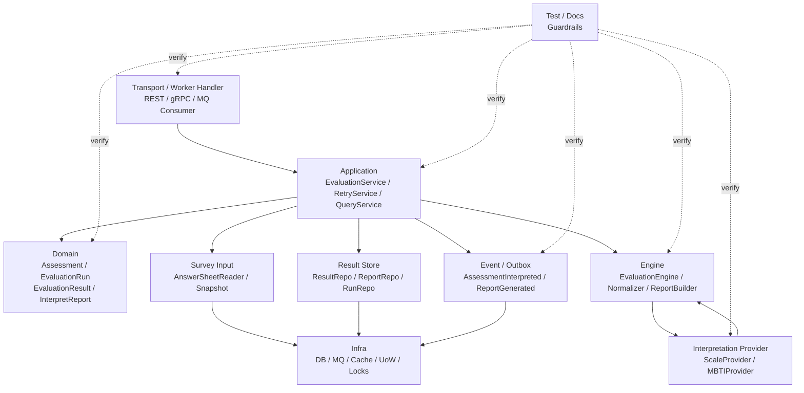

# 06-Evaluation 模块分层架构与事实源索引

> 本文是 Evaluation 模块文档的收束篇，聚焦 **Evaluation 模块的分层架构、事实源索引、修改检查清单与架构护栏**。
>
> 前五篇已经分别说明：Evaluation 的模型设计、主执行链路、引擎链路、失败重试链路和事件链路。本文不再重复链路细节，而是作为后续维护 Evaluation 模块时的“地图”：当你修改 Assessment、EvaluationRun、EvaluationResult、Report、Provider 集成、事件、重试逻辑或测试时，应该同步检查哪些代码与文档。
>
> 本文的目标不是介绍单个功能，而是防止 **代码、文档、事件契约、测试和运行时行为发生漂移**。

---

## 1. 结论先行

Evaluation 的核心事实源是 `Assessment`。

`Assessment` 表示一次测评执行事实。

它不是 `AnswerSheet`，不是 `MedicalScale`，也不是 `MBTIModel`。

它通过引用连接外部事实：

```text
AnswerSheetRef            指向 Survey 的答卷事实
InterpretationModelRef    指向解释模型
QuestionnaireRef          约束答卷与模型的问卷版本一致性
SubjectRef                指向被测对象
```

它通过内部状态和结果记录执行事实：

```text
AssessmentStatus          测评状态
EvaluationRun             执行尝试记录
EvaluationResult          执行结果
InterpretReport           报告事实
FailureReason             失败原因
EvaluationEvent           测评事件
```

一句话概括：

> **Evaluation 只管理“某次测评如何执行并产出结果”，不拥有问卷事实，也不拥有具体解释模型规则。**

后续修改 Evaluation 时，不能只改一个 service 或一张表。

必须同步检查：

```text
Domain 模型；
Application 用例；
Engine 执行框架；
Interpretation Provider 集成；
Survey 输入；
Result / Report 持久化；
失败重试；
事件契约；
Worker 消费；
缓存与读模型；
测试；
文档。
```

---

## 2. 本文边界

本文重点：

```text
Evaluation 分层架构；
Domain / Application / Engine / Provider / SurveyInput / ResultStore / Event / Worker / Infra / Test / Docs 的事实源索引；
常见修改场景的同步检查清单；
架构护栏；
与 Survey、Interpretation Model、Scale、MBTI 的边界。
```

本文不展开：

```text
Assessment / EvaluationRun / EvaluationResult / InterpretReport 的完整模型解释；
AnswerSheetSubmittedEvent 到 Assessment interpreted 的完整流程；
EvaluationEngine 内部 Provider 执行细节；
失败重试和补偿策略细节；
事件 payload 细节；
具体 repository、Outbox、MQ、缓存实现。
```

这些由以下文档承接：

```text
01-Evaluation模型--Assessment-EvaluationRun-Result-Report模型设计.md
02-Evaluation执行链路--从AnswerSheet提交到Assessment完成.md
03-Evaluation引擎链路--模型解析-规则加载-执行-报告生成.md
04-Evaluation失败重试链路--幂等-错误状态-补偿处理.md
05-Evaluation事件链路--答卷提交-测评完成-报告生成.md
../interpretation-model/README.md
../scale/README.md
../survey/README.md
```

---

## 3. 分层架构总览

Evaluation 模块可以按以下层次理解：



核心原则：

```text
Transport / Worker 负责入口，不拥有业务规则；
Application 负责编排用例、事务、状态推进和事件出站；
Domain 负责 Assessment 执行语义和状态不变量；
Engine 负责通用模型执行框架；
Provider 负责具体解释模型执行；
SurveyInput 只读取答卷快照；
ResultStore 保存执行结果和报告；
Event 表达 Evaluation 执行事实变化；
Infra 实现技术细节，不决定业务语义；
Test / Docs 负责防漂移。
```

---

## 4. Domain 层事实源

Domain 层是 Evaluation 的核心事实源。

它定义：

```text
Assessment；
AssessmentStatus；
AssessmentRef；
AnswerSheetRef；
InterpretationModelRef；
QuestionnaireRef；
SubjectRef；
EvaluationRun；
EvaluationResult；
ScoreResult；
InterpretationResult；
RiskLevelResult；
ProfileResult；
InterpretReport；
FailureReason；
IdempotencyKey；
EvaluationEvent。
```

Domain 层应回答：

```text
Assessment 当前处于什么状态？
是否允许开始执行？
是否允许应用结果？
是否允许标记失败？
是否允许重试？
是否允许取消？
失败原因是否完整？
结果和报告引用是否完整？
```

Domain 层不应回答：

```text
AnswerSheet 如何提交；
MedicalScale 如何维护；
MBTI TypeCode 如何解析；
数据库如何持久化；
MQ 如何投递；
Worker 如何 ack。
```

---

## 5. Domain 层代码事实源

建议重点关注：

```text
internal/apiserver/domain/evaluation/assessment.go
internal/apiserver/domain/evaluation/assessment_status.go
internal/apiserver/domain/evaluation/evaluation_run.go
internal/apiserver/domain/evaluation/evaluation_result.go
internal/apiserver/domain/evaluation/interpret_report.go
internal/apiserver/domain/evaluation/failure_reason.go
internal/apiserver/domain/evaluation/idempotency.go
internal/apiserver/domain/evaluation/events.go
internal/apiserver/domain/evaluation/errors.go
internal/apiserver/domain/evaluation/types.go
```

如果实际文件名不同，应以代码库为准。

事实源归类不变：

```text
Assessment 聚合根与行为；
状态机；
执行尝试记录；
执行结果模型；
报告事实模型；
失败原因；
幂等键；
领域事件；
领域错误。
```

---

## 6. Domain 层维护原则

### 6.1 Assessment 必须是行为对象

不建议直接改字段：

```go
assessment.Status = StatusInterpreted
assessment.ResultID = resultID
assessment.ReportID = reportID
```

应通过行为：

```go
assessment.StartEvaluation(runID, now)
assessment.ApplyResult(resultRef, reportRef, now)
assessment.MarkFailed(failure, now)
assessment.Retry(runID, now)
assessment.Cancel(reason, now)
```

### 6.2 Assessment 不保存答卷明细

答卷事实属于 Survey。

Assessment 只保存：

```text
AnswerSheetRef；
QuestionnaireRef；
SubjectRef。
```

### 6.3 Assessment 不保存具体模型规则

具体规则属于 Scale、MBTI 等模型模块。

Assessment 只保存：

```text
InterpretationModelRef；
RuleSnapshotRef 可选。
```

### 6.4 failed 是业务状态

失败必须落库。

不能只打日志。

必须记录：

```text
Assessment failed；
EvaluationRun failed；
FailureReason。
```

### 6.5 interpreted 是完成状态

进入 interpreted 前应确保：

```text
EvaluationResult 已保存；
InterpretReport 已保存或明确不需要报告；
完成事件已 stage 或存在可靠补偿机制。
```

---

## 7. Application 层事实源

Application 层是 Evaluation 的用例编排层。

它负责：

```text
处理 AnswerSheetSubmitted command；
解析或确认 ModelRef；
创建或加载 Assessment；
幂等判断；
加载 AnswerSheetSnapshot；
创建 EvaluationRun；
构造 EvaluationInput；
调用 EvaluationEngine；
保存 EvaluationResult；
保存 InterpretReport；
推进 Assessment 状态；
统一 markFailed；
处理重试和补偿；
stage Outbox 事件。
```

Application 层不应负责：

```text
Factor 如何计分；
MBTI TypeCode 如何解析；
AnswerValue 如何校验；
MQ 具体如何投递；
DB mapper 如何转换。
```

---

## 8. Application 层代码事实源

建议重点关注：

```text
internal/apiserver/application/evaluation/service.go
internal/apiserver/application/evaluation/handle_answer_sheet_submitted.go
internal/apiserver/application/evaluation/retry_service.go
internal/apiserver/application/evaluation/query_service.go
internal/apiserver/application/evaluation/input_builder.go
internal/apiserver/application/evaluation/result_applier.go
internal/apiserver/application/evaluation/failure_handler.go
internal/apiserver/application/evaluation/converter.go
```

职责拆分建议：

```text
EvaluationService       主执行用例编排
RetryService            失败重试和人工重试
QueryService            Assessment / Report 查询
InputBuilder            构造 EvaluationInput
ResultApplier           保存结果、报告并推进状态
FailureHandler          统一 markFailed
UnitOfWork              保存 Assessment / Run / Result / Report / Outbox
```

---

## 9. EvaluationService 维护原则

EvaluationService 应维持主链路：

```text
1. 接收 AnswerSheetSubmitted command；
2. 解析或确认 ModelRef；
3. 根据 IdempotencyKey 创建或加载 Assessment；
4. 判断状态幂等；
5. 加载 AnswerSheetSnapshot；
6. 创建 EvaluationRun；
7. 构造 EvaluationInput；
8. 调用 EvaluationEngine；
9. 保存 EvaluationResult / InterpretReport；
10. assessment.ApplyResult；
11. stage completion events。
```

EvaluationService 不应该：

```text
直接遍历 MedicalScale.Factors；
直接计算 MBTI TypeCode；
跳过 Assessment 行为修改状态；
让 Worker 代替自己保存结果；
让 Provider 代替自己保存报告。
```

---

## 10. RetryService 维护原则

RetryService 负责失败重试与补偿。

它必须遵守：

```text
使用原始 AnswerSheetRef；
使用原始 ModelRef；
使用原始 QuestionnaireRef；
优先使用 RuleSnapshotRef；
创建新的 EvaluationRun；
不自动切换 latest model；
不覆盖已存在结果和报告。
```

典型能力：

```text
RetryAssessment；
RetryFailedAssessments；
CompensateMissingReport；
CompensateMissingEvents；
CancelAssessment；
ManualRetry。
```

---

## 11. QueryService 维护原则

QueryService 负责读侧输出。

它服务于：

```text
后台 Assessment 列表；
Assessment 详情；
EvaluationRun 详情；
InterpretReport 查询；
失败任务列表；
人工处理入口；
用户报告列表。
```

QueryService 不应：

```text
修改 Assessment 状态；
重新执行 Provider；
生成报告；
补偿失败状态。
```

这些属于写侧服务。

---

## 12. Engine 层事实源

Engine 层是通用模型执行框架。

它负责：

```text
校验 EvaluationInput；
根据 ModelRef.ModelType 解析 Provider；
调用 Provider.LoadContext；
校验 QuestionnaireRef 一致性；
调用 Provider.Evaluate；
归一化 EvaluationResult；
构造或确认 ReportDraft；
返回 ExecutionResult。
```

Engine 不负责：

```text
创建 Assessment；
保存 EvaluationResult；
保存 InterpretReport；
推进 Assessment 状态；
发布事件；
决定 Worker ack / retry。
```

---

## 13. Engine 层代码事实源

建议重点关注：

```text
internal/apiserver/application/evaluation/engine.go
internal/apiserver/application/evaluation/execution_result.go
internal/apiserver/application/evaluation/result_normalizer.go
internal/apiserver/application/evaluation/report_builder.go
internal/apiserver/application/evaluation/engine_errors.go
```

事实源职责：

```text
EvaluationEngine；
ExecutionResult；
ResultNormalizer；
ReportBuilder；
EngineError；
FailedStage 映射；
QuestionnaireRef 一致性校验。
```

---

## 14. Interpretation Provider 集成事实源

Provider 集成是 Evaluation 通用化的关键。

相关事实源包括：

```text
InterpretationModelRef；
InterpretationProvider；
InterpretationRegistry；
InterpretationContext；
ScaleProvider；
MBTIProvider；
Provider 契约测试。
```

Evaluation 与 Provider 的边界：

```text
Evaluation 通过 Registry 解析 Provider；
Provider 加载具体模型 Context；
Provider 执行模型算法；
Provider 返回 EvaluationResult；
Evaluation 保存结果并推进状态。
```

Evaluation 不应直接依赖：

```text
MedicalScale；
Factor；
ScoringSpec；
InterpretationRules；
MBTIModel；
Dimension；
TypeProfile。
```

---

## 15. Provider 集成代码事实源

相关代码可逐步演进到：

```text
internal/apiserver/application/interpretation/model_ref.go
internal/apiserver/application/interpretation/provider.go
internal/apiserver/application/interpretation/context.go
internal/apiserver/application/interpretation/registry.go
internal/apiserver/application/scale/provider.go
internal/apiserver/application/mbti/provider.go
```

如果当前尚未落地 interpretation package，可以先以文档为目标结构，后续逐步重构。

重点事实源：

```text
ModelType 枚举；
ModelRef 结构；
Provider 接口；
Registry 注册与解析；
ScaleProvider 实现；
MBTIProvider 未来实现；
Provider 契约测试。
```

---

## 16. Survey Input 事实源

Survey Input 负责提供答卷事实输入。

Evaluation 需要：

```text
AnswerSheetRef；
AnswerSheetSnapshot；
QuestionnaireRef；
SubjectRef。
```

Survey Input 应回答：

```text
AnswerSheet 是否存在；
AnswerSheet 是否已提交；
AnswerSheet 基于哪个 QuestionnaireVersion；
AnswerSheet 属于哪个 Subject；
AnswerSheet 的 Answers 快照是什么。
```

Survey Input 不应回答：

```text
Scale 如何计分；
MBTI 如何解析 TypeCode；
Assessment 如何推进状态；
Report 如何保存。
```

---

## 17. Survey Input 代码事实源

相关代码可能包括：

```text
internal/apiserver/application/evaluation/answer_sheet_reader.go
internal/apiserver/application/survey/query_service.go
internal/apiserver/application/survey/answersheet_snapshot.go
internal/apiserver/domain/survey/answersheet/...
```

Evaluation 应读取快照，不应持有可变 AnswerSheet 聚合。

---

## 18. Result Store 事实源

Result Store 负责保存 Evaluation 执行产物。

包括：

```text
EvaluationResult；
ScoreResults；
InterpretationResults；
ProfileResults；
InterpretReport；
EvaluationRun；
Assessment 状态引用。
```

Result Store 应保证：

```text
同一 Assessment 不重复保存多个有效主结果；
同一 Assessment 不重复生成多个默认报告，除非业务允许多报告视图；
Result 与 Report 能通过 AssessmentID 关联；
Result / Report 有 ModelRef 和 QuestionnaireRef；
支持补偿任务查询部分成功状态。
```

---

## 19. Result Store 代码事实源

相关代码可能包括：

```text
internal/apiserver/infra/evaluation/assessment_repository.go
internal/apiserver/infra/evaluation/evaluation_result_repository.go
internal/apiserver/infra/evaluation/interpret_report_repository.go
internal/apiserver/infra/evaluation/evaluation_run_repository.go
internal/apiserver/infra/evaluation/mapper.go
```

重点检查：

```text
Assessment mapper；
EvaluationRun mapper；
EvaluationResult mapper；
InterpretReport mapper；
唯一约束；
事务边界；
补偿查询；
结果与报告引用关系。
```

---

## 20. Event / Outbox 事实源

Evaluation 事件事实源包括：

```text
AssessmentCreatedEvent；
AssessmentStartedEvent；
AssessmentInterpretedEvent；
AssessmentFailedEvent；
InterpretReportGeneratedEvent；
Outbox payload；
configs/events.yaml；
EventPublisher；
Worker consumers。
```

事件语义必须稳定：

```text
AnswerSheetSubmittedEvent 是 Survey 事件；
ScaleChangedEvent 是 Scale 规则变化事件；
AssessmentInterpretedEvent 是 Evaluation 完成事件；
InterpretReportGeneratedEvent 是 Evaluation 报告事件。
```

---

## 21. Worker 事实源

Worker 是事件消费和任务驱动入口。

Worker 负责：

```text
消费 AnswerSheetSubmittedEvent；
消费重试任务；
调用 EvaluationService；
处理 ack / retry / dead-letter；
记录消费日志；
暴露消费指标。
```

Worker 不负责：

```text
计算模型结果；
保存报告；
推进 Assessment 状态；
定义业务失败原因；
直接发布完成事件。
```

相关代码可能包括：

```text
internal/worker/...
internal/worker/evaluation/...
internal/worker/handlers/answer_sheet_submitted_handler.go
```

---

## 22. Infra 层事实源

Infra 层负责技术实现。

包括：

```text
数据库 repository；
事务 / UnitOfWork；
Outbox；
MQ producer / consumer；
缓存；
读模型；
分布式锁或 CAS；
日志和 metrics。
```

Infra 不应决定：

```text
Assessment 是否可以 interpreted；
失败是否可重试；
ModelRef 是否可变；
Provider 如何执行模型；
规则变化是否触发历史重算。
```

这些属于 Domain / Application / Engine / Provider。

---

## 23. Cache / ReadModel 事实源

Evaluation 查询侧可能引入缓存或读模型。

适用对象包括：

```text
Assessment 列表；
Assessment 详情；
Report 详情；
失败任务列表；
测评执行统计；
用户最近报告；
后台运营看板。
```

但缓存和读模型都不是事实源。

事实源仍然是：

```text
Assessment；
EvaluationRun；
EvaluationResult；
InterpretReport。
```

如果读模型与事实源不一致，应以事实源为准，并通过事件或后台任务重建。

---

## 24. Test 事实源

Evaluation 测试至少应覆盖八类。

| 测试类型 | 应覆盖内容 |
| --- | --- |
| Domain tests | Assessment 状态机、ApplyResult、MarkFailed、Retry、Cancel |
| Application tests | HandleAnswerSheetSubmitted、幂等、结果保存、失败处理 |
| Engine tests | Provider 解析、Context 加载、一致性校验、Result 归一化 |
| Provider integration tests | ScaleProvider / MBTIProvider 契约 |
| Survey input tests | AnswerSheetSnapshot 加载、QuestionnaireRef 校验 |
| Failure retry tests | RetryPolicy、部分成功补偿、并发控制 |
| Event tests | Outbox payload、EventVersion、BusinessKey、消费者幂等 |
| Worker tests | 重复事件、ack/retry/dead-letter 策略 |

---

## 25. Docs 事实源

Evaluation 文档分为六篇：

```text
README.md
01-Evaluation模型--Assessment-EvaluationRun-Result-Report模型设计.md
02-Evaluation执行链路--从AnswerSheet提交到Assessment完成.md
03-Evaluation引擎链路--模型解析-规则加载-执行-报告生成.md
04-Evaluation失败重试链路--幂等-错误状态-补偿处理.md
05-Evaluation事件链路--答卷提交-测评完成-报告生成.md
06-Evaluation模块分层架构与事实源索引.md
```

各文档职责：

| 文档 | 事实主题 |
| --- | --- |
| README.md | Evaluation 定位、边界、文档导航 |
| 01 | Assessment / EvaluationRun / Result / Report 模型设计 |
| 02 | 从答卷提交到测评完成的主执行链路 |
| 03 | EvaluationEngine 与 Provider 的内部执行链路 |
| 04 | 幂等、失败状态、重试、补偿 |
| 05 | 事件语义、Outbox、Worker 消费、消费者幂等 |
| 06 | 分层架构、事实源索引、修改检查清单、架构护栏 |

---

## 26. 修改 Assessment 字段检查清单

需要检查：

```text
Assessment 聚合；
Assessment 构造函数；
状态行为方法；
Repository mapper；
Query DTO；
事件 payload；
EvaluationInput builder；
ResultApplier；
RetryService；
README / 01 文档；
测试。
```

重点判断：

```text
字段是执行事实、引用事实还是展示字段？
是否影响幂等键？
是否影响状态流转？
是否需要进入事件 payload？
是否需要进入报告 Snapshot？
是否影响历史追溯？
```

---

## 27. 修改 AssessmentStatus 检查清单

需要检查：

```text
Assessment 状态枚举；
StartEvaluation / ApplyResult / MarkFailed / Retry / Cancel；
EvaluationService 状态判断；
RetryService；
Worker 重复事件处理；
查询 DTO；
监控指标；
01 / 02 / 04 文档；
状态机测试。
```

重点判断：

```text
新状态是否可重试？
新状态是否允许重复事件幂等成功？
新状态是否允许 cancel？
新状态是否影响 Worker ack / retry？
```

---

## 28. 修改 EvaluationRun 检查清单

需要检查：

```text
EvaluationRun 模型；
AttemptNo 生成；
StartEvaluation；
MarkSucceeded / MarkFailed；
RetryService；
FailureReason；
Repository mapper；
运维查询；
监控指标；
01 / 04 文档；
测试。
```

重点判断：

```text
是否影响失败排障？
是否影响重试次数判断？
是否影响人工处理入口？
是否需要进入事件 payload？
```

---

## 29. 修改 EvaluationResult 检查清单

需要检查：

```text
EvaluationResult 模型；
ScoreResult / InterpretationResult / ProfileResult；
ResultNormalizer；
Provider 返回结构；
ResultRepository；
ReportBuilder；
InterpretReport Snapshot；
事件 payload；
01 / 03 文档；
Provider 契约测试。
```

重点判断：

```text
是否只适用于 Scale？
是否支持 MBTI / BigFive？
是否影响报告生成？
是否影响历史报告追溯？
是否需要迁移旧结果数据？
```

---

## 30. 修改 InterpretReport 检查清单

需要检查：

```text
InterpretReport 模型；
ReportDraft；
ReportBuilder；
ReportRepository；
Report Snapshot；
ResultApplier；
ReportGeneratedEvent；
前端查询接口；
02 / 03 / 05 文档；
测试。
```

重点判断：

```text
Report 是结构化 JSON、Markdown 还是渲染 schema？
是否支持多报告视图？
是否影响 ReportGeneratedEvent？
是否能从 EvaluationResult 补偿生成？
```

---

## 31. 修改 ModelRef 检查清单

需要检查：

```text
InterpretationModelRef；
Assessment；
IdempotencyKey；
EvaluationInput；
Provider Registry；
Provider.LoadContext；
事件 payload；
Result / Report Snapshot；
RetryService；
interpretation-model 文档；
evaluation 01 / 03 / 04 / 05 文档；
测试。
```

重点判断：

```text
是否仍包含 ModelType / ModelCode / ModelVersion？
是否影响历史追溯？
是否影响重试？
是否影响同一 AnswerSheet 多模型执行？
```

---

## 32. 修改 EvaluationEngine 检查清单

需要检查：

```text
EvaluationEngine；
InterpretationRegistry；
Provider 接口；
Context 加载；
QuestionnaireRef 校验；
ResultNormalizer；
ReportBuilder；
EngineError；
EvaluationService；
03 文档；
Engine tests。
```

重点判断：

```text
是否引入了 if scale / if mbti？
是否保存了数据库？
是否推进了 Assessment 状态？
是否发布了事件？
是否仍保持通用执行框架？
```

---

## 33. 修改 Provider 接口或 Registry 检查清单

需要检查：

```text
InterpretationProvider；
InterpretationRegistry；
ScaleProvider；
MBTIProvider；
EvaluationEngine；
Provider 契约测试；
interpretation-model 文档；
evaluation 03 文档；
新增模型接入文档。
```

重点判断：

```text
ScaleProvider 是否仍兼容？
未来 MBTIProvider 是否能实现？
Provider 是否开始保存 Evaluation 结果？
Context 是否仍是只读快照？
```

---

## 34. 修改 Survey 输入检查清单

需要检查：

```text
AnswerSheetReader；
AnswerSheetSnapshot；
AnswerSheetRef；
QuestionnaireRef；
EvaluationInputBuilder；
QuestionnaireRef 一致性校验；
Survey 查询服务；
02 / 03 文档；
测试。
```

重点判断：

```text
是否仍读取只读快照？
是否引入了对 Survey 聚合的可变引用？
是否影响模型执行输入？
是否影响历史追溯？
```

---

## 35. 修改失败重试逻辑检查清单

需要检查：

```text
Assessment.Retry；
FailureReason；
RetryPolicy；
RetryService；
EvaluationRun；
Worker ack/retry；
补偿任务；
监控告警；
04 文档；
失败重试测试。
```

重点判断：

```text
重试是否使用原始 ModelRef？
是否会重复生成报告？
是否会覆盖旧结果？
是否能处理部分成功状态？
是否能防并发重入？
```

---

## 36. 修改 Evaluation 事件检查清单

需要检查：

```text
事件结构；
EventType；
EventVersion；
BusinessKey；
Outbox mapper；
configs/events.yaml；
producer；
consumer；
Worker；
事件契约测试；
05 文档。
```

重点判断：

```text
事件语义是否单一？
是否混淆 AnswerSheetSubmitted / AssessmentInterpreted / ScaleChanged？
是否包含必要引用？
是否泄露大对象或敏感内容？
是否需要升级版本？
```

---

## 37. 修改 Worker 消费逻辑检查清单

需要检查：

```text
Worker handler；
Event payload 解析；
EvaluationService command；
ack/retry/dead-letter 策略；
幂等处理；
日志 metrics；
04 / 05 文档；
Worker tests。
```

重点判断：

```text
Worker 是否开始承载业务规则？
是否直接读取模型规则？
是否直接修改 Assessment？
失败是否能落库？
重复事件是否幂等？
```

---

## 38. 修改缓存或读模型检查清单

需要检查：

```text
QueryService；
AssessmentReadModel；
ReportReadModel；
缓存 key；
缓存 TTL；
AssessmentInterpretedEvent consumer；
ReportGeneratedEvent consumer；
AssessmentFailedEvent consumer；
补偿任务；
05 / 06 文档；
测试。
```

重点判断：

```text
缓存是否可能展示旧状态？
读模型是否能从事实源重建？
事件重复投递是否幂等？
Report 缓存是否会泄露未授权内容？
```

---

## 39. 架构护栏

### 39.1 Evaluation 不定义问卷

不允许：

```text
evaluation/domain 中定义 Questionnaire / Question / Option。
```

问卷属于 Survey。

### 39.2 Evaluation 不定义具体模型规则

不允许：

```text
evaluation/domain 中定义 MedicalScale / Factor / ScoringSpec / MBTI Dimension。
```

具体规则属于 Scale / MBTI 等模型模块。

### 39.3 EvaluationEngine 不硬编码模型分支

不建议：

```go
if modelType == "scale" {
    runScale()
} else if modelType == "mbti" {
    runMBTI()
}
```

应通过：

```go
provider := registry.Resolve(modelRef.ModelType)
```

### 39.4 Provider 不保存结果

Provider 返回 EvaluationResult。

EvaluationService 保存结果和报告。

### 39.5 Worker 不拥有业务规则

Worker 只消费事件和调用应用服务。

不要让 Worker 直接计算分数或保存报告。

### 39.6 重试不使用 latest model

不允许：

```text
Retry -> Load latest Scale / MBTIModel。
```

必须使用 Assessment 原始 ModelRef / RuleSnapshotRef。

### 39.7 结果保存前不 interpreted

不要在 EvaluationResult / InterpretReport 未可靠保存前推进 Assessment 到 interpreted。

### 39.8 规则变化事件不自动重算历史

ScaleChangedEvent / MBTIModelChangedEvent 只表达规则变化。

历史重算应由显式 ReEvaluationJob 处理。

### 39.9 Cache / ReadModel 不是事实源

事实源仍然是持久化的 Assessment / EvaluationResult / InterpretReport。

缓存和读模型必须可重建。

---

## 40. 与其它模块的关系

### 40.1 与 Survey

```text
Survey 提供 AnswerSheetSubmittedEvent 和 AnswerSheetSnapshot；
Evaluation 消费它们；
Evaluation 不修改 Survey 聚合。
```

### 40.2 与 Interpretation Model

```text
Interpretation Model 提供 ModelRef / Provider / Context / Registry；
EvaluationEngine 依赖该抽象执行具体模型；
Evaluation 不直接依赖具体模型内部结构。
```

### 40.3 与 Scale

```text
Scale 是当前具体解释模型；
ScaleProvider 提供 EvaluationScaleContext 和 Scale 执行逻辑；
Evaluation 保存 FactorScore / RiskLevelResult / InterpretReport。
```

### 40.4 与 MBTI

```text
MBTI 是未来具体解释模型；
MBTIProvider 提供 MBTIContext 和人格类型执行逻辑；
Evaluation 保存 DimensionScore / TypeProfileResult / InterpretReport。
```

---

## 41. Verify 命令

Evaluation domain 验证：

```bash
go test ./internal/apiserver/domain/evaluation/...
```

Evaluation application / engine 验证：

```bash
go test ./internal/apiserver/application/evaluation/...
```

Interpretation provider 集成验证：

```bash
go test ./internal/apiserver/application/interpretation/...
go test ./internal/apiserver/application/scale/...
```

Survey 输入验证：

```bash
go test ./internal/apiserver/application/survey/...
```

Worker 验证：

```bash
go test ./internal/worker/...
```

全量验证：

```bash
go test ./...
make test
make lint
```

如果仓库目录与命令不完全一致，应以实际 Makefile、CI 配置和模块路径为准。

---

## 42. 小结

Evaluation 模块分层架构可以用一句话总结：

> **Domain 定义 Assessment 执行事实，Application 编排执行和持久化，Engine 负责通用模型执行框架，Provider 接入具体解释模型，SurveyInput 提供答卷快照，ResultStore 保存结果和报告，Event / Worker 负责异步驱动与通知，Test / Docs 负责防漂移。**

本文需要建立七个核心认知：

```text
第一，Evaluation 的核心事实源是 Assessment，而不是 AnswerSheet 或 MedicalScale；
第二，Evaluation 只保存执行结果，不保存具体模型规则；
第三，EvaluationEngine 依赖 Provider 抽象，不硬编码具体模型；
第四，失败必须落到 Assessment failed 和 EvaluationRun failed；
第五，重试必须使用原始 ModelRef / RuleSnapshotRef；
第六，完成事件必须在结果和报告可靠保存后出站；
第七，修改任何核心模型或链路，都要同步检查代码、事件、测试和文档。
```

守住这些事实源和护栏，Evaluation 才能真正从医学量表专用执行链路演进为通用、可靠、可观测、可扩展的测评执行引擎。
