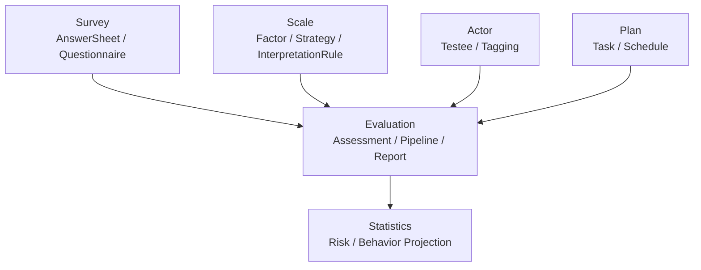

# Evaluation 深讲阅读地图

**本文回答**：`evaluation` 子目录这一组文档应该如何阅读；Evaluation 模块负责什么、不负责什么；`Assessment` 状态机、Engine Pipeline、Report、Outbox、失败重试分别应该去哪里看。

---

## 30 秒结论

| 维度 | 结论 |
| ---- | ---- |
| 模块定位 | `evaluation` 是 qs-server 的**测评执行与结果产出域**，负责把答卷事实和量表规则推进成测评状态、分数、风险、报告和可靠出站事件 |
| 核心聚合 | `Assessment` 是核心聚合根，代表一次具体测评行为 |
| 核心输入 | `AnswerSheetSnapshot` 来自 Survey，`QuestionnaireSnapshot` 来自 Survey，`ScaleSnapshot` 来自 Scale |
| 核心输出 | `EvaluationResult`、`FactorScoreResult`、`InterpretReport`、`assessment.*`、`report.generated` |
| 执行机制 | `EvaluationService.Evaluate` 加载 Assessment 与 input snapshot 后执行 Engine Pipeline |
| 状态机 | `pending -> submitted -> interpreted / failed`，failed 可显式 retry 回到 submitted |
| 可靠出站 | `assessment.submitted / interpreted / failed`、`report.generated` 等关键事件走 durable outbox |
| 不负责 | 不定义问卷题型、不维护量表规则、不作为前台提交入口、不管理受试者主数据 |
| 推荐读法 | 先读整体模型，再读状态机、pipeline、report/outbox，最后读失败重试 SOP |

一句话概括：

> **Evaluation 负责“把一次答卷变成一次可解释、可保存、可追踪、可补偿的测评结果”。**

---

## 1. Evaluation 模块负责什么

Evaluation 模块负责测评执行和结果产出。

它要回答：

```text
一次测评是否已经创建？
测评基于哪份答卷、问卷和量表？
当前测评处于什么状态？
是否已经提交？
是否已经完成评估？
如果失败，失败原因是什么？
因子分和总分是多少？
风险等级是什么？
结论和建议是什么？
报告是否已经生成？
相关事件是否已经可靠出站？
```

Evaluation 的核心职责不是“算一个分”，而是把测评从 `submitted` 推进到 `interpreted` 或 `failed`，并保证结果、报告和事件之间的一致性。

---

## 2. Evaluation 不负责什么

Evaluation 边界必须守住。

| 不属于 Evaluation 的内容 | 应归属 |
| ------------------------ | ------ |
| 问卷题型、题目结构、发布版本 | `survey/questionnaire` |
| 答卷提交、答案值、答案级粗分 | `survey/answersheet` |
| 量表因子、计分策略、风险区间、解读规则 | `scale` |
| 受试者、监护人、操作者、标签主数据 | `actor` |
| 测评任务、开放/过期/完成、周期计划 | `plan` |
| 统计看板、行为漏斗、服务过程投影 | `statistics` |
| MQ subscriber、outbox relay、Redis lock runtime | `01-运行时` / `03-基础设施` |
| 前台 BFF 提交入口 | `collection-server` |

一句话边界：

```text
Survey 提供作答事实；
Scale 提供规则事实；
Evaluation 生成测评产出事实。
```

---

## 3. 本目录文档地图

```text
evaluation/
├── README.md
├── 00-整体模型.md
├── 01-Assessment状态机.md
├── 02-EnginePipeline.md
├── 03-Report与Interpretation.md
├── 04-Outbox与可靠出站.md
└── 05-评估失败与重试SOP.md
```

| 顺序 | 文档 | 先回答什么 |
| ---- | ---- | ---------- |
| 1 | [00-整体模型.md](./00-整体模型.md) | Evaluation 的整体职责、核心对象、输入输出、与其它模块的边界 |
| 2 | [01-Assessment状态机.md](./01-Assessment状态机.md) | Assessment 如何从 pending / submitted 进入 interpreted / failed |
| 3 | [02-EnginePipeline.md](./02-EnginePipeline.md) | pipeline 如何执行 Validation、FactorScore、RiskLevel、Interpretation、WaiterNotify |
| 4 | [03-Report与Interpretation.md](./03-Report与Interpretation.md) | 解读结果如何变成 EvaluationResult 和 InterpretReport |
| 5 | [04-Outbox与可靠出站.md](./04-Outbox与可靠出站.md) | assessment/report/footprint 事件如何可靠出站 |
| 6 | [05-评估失败与重试SOP.md](./05-评估失败与重试SOP.md) | 失败后如何定位根因、何时 retry、如何避免错误补偿 |

---

## 4. 推荐阅读路径

### 4.1 第一次理解 Evaluation

按顺序读：

```text
00-整体模型
  -> 01-Assessment状态机
  -> 02-EnginePipeline
```

读完后应能回答：

1. `Assessment` 为什么不是 `AnswerSheet` 的扩展字段？
2. 为什么要有 `pending / submitted / interpreted / failed` 状态？
3. Engine Pipeline 为什么用职责链？
4. Evaluation 为什么消费 snapshot，而不是直接修改 Survey / Scale 聚合？

### 4.2 要排查“提交后没有报告”

按顺序读：

```text
02-EnginePipeline
  -> 03-Report与Interpretation
  -> 04-Outbox与可靠出站
  -> 05-评估失败与重试SOP
```

判断问题卡在哪：

| 现象 | 优先看 |
| ---- | ------ |
| Assessment 一直 submitted | `assessment.submitted` outbox、worker、internal gRPC、pipeline |
| Assessment failed | failureReason、InputResolver、pipeline handler |
| Report 不存在 | InterpretationHandler、ReportBuilder、ReportDurableSaver |
| Report 存在但下游没反应 | `report.generated` outbox、worker handler |
| 统计缺少报告行为 | `footprint.report_generated` 和 behavior projector |

### 4.3 要改评估流程

读：

```text
02-EnginePipeline
  -> 01-Assessment状态机
  -> 05-评估失败与重试SOP
```

重点看：

- 新 handler 放在 pipeline 哪个位置。
- 它消费哪些 `pipeline.Context` 字段。
- 它产出哪些中间结果。
- 失败是否中断链路。
- 是否需要持久化副作用。
- 是否需要 outbox 事件。
- retry 是否幂等。

### 4.4 要改报告或解释文案

读：

```text
03-Report与Interpretation
  -> ../scale/02-解读规则与风险文案.md
  -> 04-Outbox与可靠出站
```

重点看：

- Scale 的 `InterpretationRule` 是规则来源。
- Evaluation 的 `InterpretationHandler` 负责生成本次解释结果。
- `ReportBuilder` 负责报告结构。
- `ReportDurableSaver` 负责报告保存和成功事件 staging。
- 不要在 Report 层重新定义风险区间。

### 4.5 要处理失败和重试

读：

```text
05-评估失败与重试SOP
  -> 01-Assessment状态机
  -> 04-Outbox与可靠出站
```

重点看：

- retry 只能对 failed 状态执行。
- retry 前必须确认根因已修复。
- 不要直接改库把 failed 改为 submitted。
- 不要直接 publish `assessment.submitted`。
- outbox pending 不等于 Assessment failed。

---

## 5. Evaluation 的主业务轴线

```mermaid
flowchart LR
    answer["AnswerSheet<br/>作答事实"] --> create["Create Assessment"]
    create --> submit["Submit Assessment"]
    submit --> event["assessment.submitted"]
    event --> worker["qs-worker"]
    worker --> eval["EvaluationService.Evaluate"]
    eval --> pipeline["Engine Pipeline"]
    pipeline --> result["EvaluationResult"]
    result --> report["InterpretReport"]
    report --> events["assessment.interpreted / report.generated"]
```



这条主线说明：

1. Survey 先提交 AnswerSheet。
2. worker 根据 `answersheet.submitted` 创建并提交 Assessment。
3. `assessment.submitted` 触发 Evaluation。
4. Pipeline 计算因子分、风险、解释和报告。
5. Report 保存成功后出站成功事件。

完整端到端主链路见：

- [../../00-总览/03-核心业务链路.md](../../00-总览/03-核心业务链路.md)

---

## 6. 与其它模块的协作



| 协作方向 | 说明 | 边界 |
| -------- | ---- | ---- |
| Survey -> Evaluation | 提供 AnswerSheetSnapshot 与 QuestionnaireSnapshot | Evaluation 不修改 Survey 聚合 |
| Scale -> Evaluation | 提供 ScaleSnapshot、Factor、InterpretRule | Evaluation 不定义规则 |
| Actor -> Evaluation | 提供 testee 引用和后续标签动作 | Evaluation 不管理 actor 主数据 |
| Plan -> Evaluation | plan origin 可标识测评来源 | Evaluation 不维护任务开放/过期规则 |
| Evaluation -> Statistics | interpreted/report/footprint 事件进入统计投影 | Evaluation 不维护统计读模型 |

---

## 7. Evaluation 的五条关键链路

### 7.1 Assessment 状态链路

```text
NewAssessment
  -> pending
  -> Submit
  -> submitted
  -> ApplyEvaluation
  -> interpreted
```

失败时：

```text
submitted / interpreted
  -> MarkAsFailed
  -> failed
  -> RetryFromFailed
  -> submitted
```

对应文档：

- [01-Assessment状态机.md](./01-Assessment状态机.md)

### 7.2 Engine Pipeline 链路

```text
Evaluate
  -> Load Assessment
  -> Resolve InputSnapshot
  -> New pipeline.Context
  -> Validation
  -> FactorScore
  -> RiskLevel
  -> Interpretation
  -> WaiterNotify
```

对应文档：

- [02-EnginePipeline.md](./02-EnginePipeline.md)

### 7.3 Report 产出链路

```text
FactorScores + RiskLevel
  -> InterpretationGenerator
  -> EvaluationResult
  -> ReportBuilder
  -> InterpretReport
  -> ReportDurableSaver
```

对应文档：

- [03-Report与Interpretation.md](./03-Report与Interpretation.md)

### 7.4 Reliable Outbox 链路

```text
Assessment save / Report save
  -> Stage events
  -> OutboxRelay
  -> MQ
  -> Worker handler
```

对应文档：

- [04-Outbox与可靠出站.md](./04-Outbox与可靠出站.md)

### 7.5 Failure / Retry 链路

```text
Input resolve failed / pipeline failed / report save failed
  -> MarkAsFailed
  -> failed
  -> fix root cause
  -> RetryFromFailed
  -> submitted
```

对应文档：

- [05-评估失败与重试SOP.md](./05-评估失败与重试SOP.md)

---

## 8. Evaluation 的事实源

| 事实 | 事实源 |
| ---- | ------ |
| 测评状态 | `Assessment.status` |
| 测评引用 | `Assessment` 中的 questionnaireRef、answerSheetRef、medicalScaleRef |
| 本次总分和风险 | `Assessment.totalScore / riskLevel` 和 `EvaluationResult` |
| 因子分 | `FactorScoreResult` / AssessmentScore |
| 报告 | `InterpretReport` |
| 报告成功事件 | `report.generated` |
| 测评完成事件 | `assessment.interpreted` |
| 失败原因 | `Assessment.failureReason` |
| Evaluation 输入 | `ScaleSnapshot / AnswerSheetSnapshot / QuestionnaireSnapshot` |
| 事件配置 | `configs/events.yaml` |

原则：

```text
Assessment 是测评状态事实源；
InterpretReport 是报告事实源；
ScaleSnapshot/AnswerSheetSnapshot/QuestionnaireSnapshot 是执行输入；
outbox 是事件出站事实源。
```

---

## 9. 维护原则

### 9.1 不要把规则写进 Evaluation

如果要改：

- 因子。
- 计分策略。
- 风险区间。
- 解读文案。

先去 Scale。

Evaluation 只消费规则，不定义规则。

### 9.2 不要把作答事实写进 Evaluation

如果要改：

- 题型。
- 答案值。
- 答案校验。
- 单题计分。
- 答卷提交。

先去 Survey。

Evaluation 只消费答卷快照。

### 9.3 不要 direct publish durable events

Evaluation 中的关键事件：

```text
assessment.submitted
assessment.failed
assessment.interpreted
report.generated
footprint.report_generated
```

都应通过 outbox 可靠出站。

### 9.4 不要绕过状态机

不要直接改库修改 Assessment.status。状态迁移必须通过：

```text
Submit
ApplyEvaluation
MarkAsFailed
RetryFromFailed
```

---

## 10. 常见误区

### 10.1 “Evaluation 就是生成报告”

错误。报告只是 Evaluation 的一个产物。Evaluation 还负责状态、分数、风险、失败、事件。

### 10.2 “Assessment 就是 AnswerSheet 的状态字段”

错误。AnswerSheet 是作答事实，Assessment 是测评行为聚合。

### 10.3 “Pipeline 是 MQ 消费链”

错误。Pipeline 是 apiserver 进程内职责链。MQ 消费发生在 worker。

### 10.4 “Report 文案可以重定义风险规则”

不应该。风险规则来自 Scale，Report 只组织结果。

### 10.5 “failed 之后直接发 assessment.submitted 就能重试”

错误。必须走 `RetryFromFailed()`，否则状态和事件可能不一致。

### 10.6 “outbox pending 就代表评估失败”

错误。outbox pending 是事件尚未出站；Assessment 可能已经成功 interpreted。

---

## 11. 代码锚点

### Domain

- Assessment：[../../../internal/apiserver/domain/evaluation/assessment/assessment.go](../../../internal/apiserver/domain/evaluation/assessment/assessment.go)
- Assessment types：[../../../internal/apiserver/domain/evaluation/assessment/types.go](../../../internal/apiserver/domain/evaluation/assessment/types.go)
- Assessment events：[../../../internal/apiserver/domain/evaluation/assessment/events.go](../../../internal/apiserver/domain/evaluation/assessment/events.go)
- Report：[../../../internal/apiserver/domain/evaluation/report/](../../../internal/apiserver/domain/evaluation/report/)

### Application / Engine

- Evaluation service：[../../../internal/apiserver/application/evaluation/engine/service.go](../../../internal/apiserver/application/evaluation/engine/service.go)
- Pipeline：[../../../internal/apiserver/application/evaluation/engine/pipeline/](../../../internal/apiserver/application/evaluation/engine/pipeline/)
- Evaluation workflows：[../../../internal/apiserver/application/evaluation/engine/evaluation_workflows.go](../../../internal/apiserver/application/evaluation/engine/evaluation_workflows.go)
- Assessment application：[../../../internal/apiserver/application/evaluation/assessment/](../../../internal/apiserver/application/evaluation/assessment/)

### Input / Outbox

- evaluationinput：[../../../internal/apiserver/port/evaluationinput/input.go](../../../internal/apiserver/port/evaluationinput/input.go)
- snapshot mappers：[../../../internal/apiserver/infra/evaluationinput/snapshot_mappers.go](../../../internal/apiserver/infra/evaluationinput/snapshot_mappers.go)
- event catalog：[../../../configs/events.yaml](../../../configs/events.yaml)
- outbox core：[../../../internal/apiserver/outboxcore/](../../../internal/apiserver/outboxcore/)

---

## 12. Verify

```bash
go test ./internal/apiserver/domain/evaluation/...
go test ./internal/apiserver/application/evaluation/...
go test ./internal/apiserver/infra/evaluationinput
go test ./internal/apiserver/application/eventing
go test ./internal/apiserver/outboxcore
```

如果修改 worker 触发链路：

```bash
go test ./internal/worker/handlers
go test ./internal/worker/integration/eventing
```

如果修改接口契约：

```bash
make docs-rest
make docs-verify
```

如果修改文档：

```bash
make docs-hygiene
```

---

## 13. 下一跳

| 目标 | 文档 |
| ---- | ---- |
| 理解整体模型 | [00-整体模型.md](./00-整体模型.md) |
| 理解状态机 | [01-Assessment状态机.md](./01-Assessment状态机.md) |
| 理解 Pipeline | [02-EnginePipeline.md](./02-EnginePipeline.md) |
| 理解报告 | [03-Report与Interpretation.md](./03-Report与Interpretation.md) |
| 理解 outbox | [04-Outbox与可靠出站.md](./04-Outbox与可靠出站.md) |
| 处理失败 | [05-评估失败与重试SOP.md](./05-评估失败与重试SOP.md) |
| 回看业务模块入口 | [../README.md](../README.md) |
| 回看 Survey | [../survey/README.md](../survey/README.md) |
| 回看 Scale | [../scale/README.md](../scale/README.md) |
