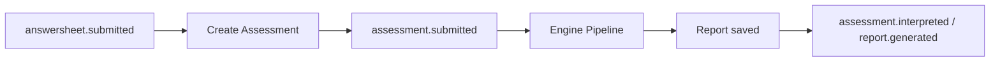

# Evaluation 深讲阅读地图

**本文回答**：`evaluation` 深讲目录如何阅读；如何从测评状态机、评估引擎、报告、事件和失败处理理解当前实现。

## 30 秒结论

| 维度 | 当前事实 |
| ---- | -------- |
| 模块定位 | 把已提交答卷和量表规则推进为测评状态、分数、风险、报告与下游事件 |
| 核心对象 | `Assessment`、`AssessmentScore`、`InterpretReport`、`Report` |
| 主链路 | `assessment.submitted` 触发 engine pipeline，报告保存成功后 staged `assessment.interpreted` / `report.generated` |
| 可靠出站 | 关键评估事件走 MySQL/Mongo outbox，不再依赖 direct publish |
| 边界 | 不保存问卷结构，不定义量表规则，不直接承担前台提交入口 |



## 阅读顺序

1. [00-整体架构](./00-整体架构.md)
2. [01-Assessment状态机](./01-Assessment状态机.md)
3. [02-EnginePipeline](./02-EnginePipeline.md)
4. [03-Report与Suggestion](./03-Report与Suggestion.md)
5. [04-Outbox与事件](./04-Outbox与事件.md)
6. [05-失败补偿与排障](./05-失败补偿与排障.md)

## 代码与测试锚点

- Assessment domain：[`domain/evaluation/assessment`](../../../internal/apiserver/domain/evaluation/assessment/)
- Engine pipeline：[`application/evaluation/engine/pipeline`](../../../internal/apiserver/application/evaluation/engine/pipeline/)
- Report domain：[`domain/evaluation/report`](../../../internal/apiserver/domain/evaluation/report/)
- Event / outbox：[`outboxcore`](../../../internal/apiserver/outboxcore/)、[`application/eventing`](../../../internal/apiserver/application/eventing/)

## Verify

```bash
go test ./internal/apiserver/domain/evaluation/... ./internal/apiserver/application/evaluation/...
go test ./internal/apiserver/outboxcore ./internal/apiserver/application/eventing
```
