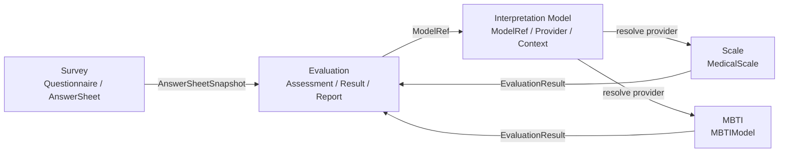
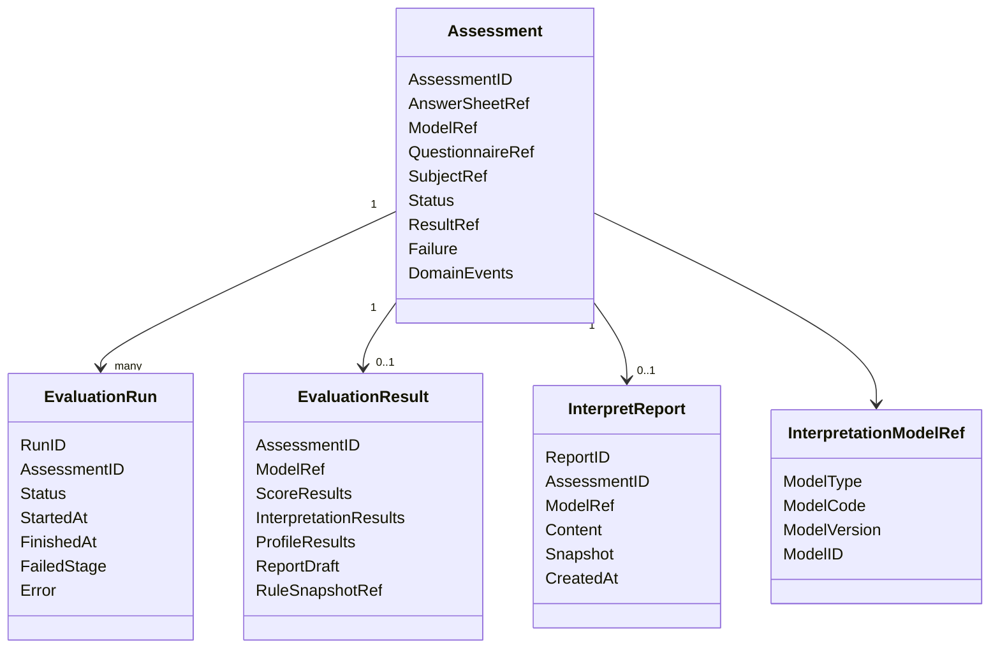

# Evaluation 模块文档

> Evaluation 是 qs-server 中的 **通用测评执行引擎模块**。
>
> 它不定义问卷，不定义医学量表，也不定义 MBTI 规则。它负责把一次答卷事实与某个解释模型规则组合起来，执行测评、保存结果、生成报告、处理失败和重试。
>
> 如果说 Survey 管“用户提交了什么”，Interpretation Model 管“用什么模型解释”，那么 Evaluation 管的是“这一次测评如何被执行并形成结果事实”。

---

## 1. 结论先行

Evaluation 的核心定位是：

> **Evaluation 是通用测评执行引擎，负责一次 Assessment 的生命周期管理、模型执行编排、结果保存、报告生成、失败重试和事件出站。**

Evaluation 回答这些问题：

```text
这次测评由哪份 AnswerSheet 触发？
这次测评使用哪个 Interpretation Model？
这次测评当前处于什么状态？
这次测评执行了几次？
本次执行是否成功？
本次执行算出了什么结果？
本次执行生成了什么报告？
失败后如何记录、重试和补偿？
测评完成后发布什么事件？
```

Evaluation 不回答这些问题：

```text
问卷有哪些题？
答卷如何提交？
MedicalScale 的 Factor 如何定义？
Scale 的 ScoringSpec 如何配置？
MBTI 的四组维度如何计分？
某个具体模型内部规则如何维护？
```

这些分别属于 Survey、Scale、MBTI 或其它具体解释模型。

---

## 2. Evaluation 在 qs-server 中的位置

从完整测评系统看，核心链路可以拆成四层：

```text
Survey                作答事实层
Interpretation Model  解释模型抽象层
Concrete Models       具体解释模型层，如 Scale / MBTI / BigFive
Evaluation            通用测评执行层
```

关系如下：



其中：

```text
Survey 提供 AnswerSheet 作答事实；
Interpretation Model 提供 ModelRef / Provider / Context 抽象；
Scale / MBTI 等具体模型提供规则和执行逻辑；
Evaluation 负责编排一次测评执行，并保存结果事实。
```

Evaluation 的目标不是“懂所有模型的细节”，而是“稳定执行所有模型”。

---

### 2.1 当前代码事实与目标态

截至当前代码，Evaluation 已经具备通用引擎的核心执行缝合点，但不是所有文档中的目标名词都已经落成独立模型。

当前已实现：

```text
Assessment / EvaluationModelRef；
evaluationinput.InputSnapshot；
evaluationinput.ModelInputProvider；
execute.Evaluator / EvaluatorRegistry；
result.Writer；
ScoreProjector / ReportBuilder / EventAssembler registry。
```

当前仍是兼容结构：

```text
medical_scale_* 字段仍保留；
assessment_score 仍是 Scale 专用投影；
Scale 报告 builder 仍生成现有 InterpretReport；
非 Scale 模型当前只通过契约测试证明引擎可扩展。
ResultWriter 当前只保证 Assessment 状态原子，不提供 MySQL + Mongo 跨库强一致。
```

目标态但尚未作为独立代码对象落地：

```text
EvaluationRun；
统一 InterpretationProvider；
通用结果持久化表；
完整 MBTI 模块与 MBTI 报告 builder。
```

因此阅读本文时，凡是提到 `Provider / EvaluationRun / 通用结果持久化` 的部分，应理解为下一阶段演进方向；当前代码事实以 `Evaluator + ModelInputProvider + ResultWriter` 为准。

---

## 3. Evaluation 管什么

Evaluation 管的是一次测评执行事实。

核心对象包括：

```text
Assessment              一次测评执行聚合根
AssessmentStatus        测评状态
EvaluationRun           一次执行尝试记录
EvaluationInput         执行输入
EvaluationResult        执行结果
ScoreResult             分数结果
InterpretationResult    解释结果
RiskLevelResult         风险等级命中结果
ProfileResult           画像类结果
InterpretReport         测评报告
FailureReason           失败原因
RetryPolicy             重试策略
EvaluationEvent         测评事件
```

一句话概括：

> **Assessment 是一次测评的执行事实；EvaluationRun 记录一次执行尝试；EvaluationResult 记录模型执行产物；InterpretReport 记录最终报告事实。**

---

## 4. Evaluation 不管什么

Evaluation 不保存问卷定义。

```text
Questionnaire 不属于 Evaluation；
Question 不属于 Evaluation；
Option 不属于 Evaluation；
SubmissionSpec 不属于 Evaluation；
AnswerValue 校验规则不属于 Evaluation。
```

这些属于 Survey。

Evaluation 不保存具体模型规则。

```text
MedicalScale 不属于 Evaluation；
Factor 不属于 Evaluation；
ScoringSpec 不属于 Evaluation；
InterpretationRules 不属于 Evaluation；
MBTIModel 不属于 Evaluation；
TypeProfile 不属于 Evaluation。
```

这些属于 Scale、MBTI 或其它具体解释模型。

Evaluation 保存的是执行结果。

必须区分：

```text
Factor 是 Scale 规则，FactorScore 是 Evaluation 结果；
RiskLevel 是 Scale 规则等级，RiskLevelResult 是 Evaluation 命中结果；
InterpretationRule 是模型规则，InterpretationResult 是本次执行命中结果；
MedicalScale 是规则聚合，Assessment 是执行聚合；
AnswerSheet 是作答事实，EvaluationInput 是执行输入快照。
```

---

## 5. 文档目录

Evaluation 模块建议维护六篇文档。

```text
README.md
01-Evaluation模型--Assessment-EvaluationRun-Result-Report模型设计.md
02-Evaluation执行链路--从AnswerSheet提交到Assessment完成.md
03-Evaluation引擎链路--模型解析-规则加载-执行-报告生成.md
04-Evaluation失败重试链路--幂等-错误状态-补偿处理.md
05-Evaluation事件链路--答卷提交-测评完成-报告生成.md
06-Evaluation模块分层架构与事实源索引.md
```

各篇职责如下：

| 文档 | 核心主题 |
| --- | --- |
| `README.md` | Evaluation 定位、边界、文档导航 |
| `01` | Assessment / EvaluationRun / Result / Report 模型设计 |
| `02` | 从 AnswerSheet 提交到 Assessment 完成的主执行链路 |
| `03` | 模型解析、Provider 加载、模型执行、报告生成的引擎链路 |
| `04` | 失败状态、幂等、重试、补偿处理 |
| `05` | AnswerSheetSubmitted / AssessmentInterpreted / ReportGenerated 等事件链路 |
| `06` | 分层架构、事实源索引、修改检查清单、架构护栏 |

推荐阅读顺序：

```text
README -> 01 -> 02 -> 03 -> 04 -> 05 -> 06
```

如果只想快速理解 Evaluation 的边界：

```text
README.md
01-Evaluation模型--Assessment-EvaluationRun-Result-Report模型设计.md
03-Evaluation引擎链路--模型解析-规则加载-执行-报告生成.md
```

如果要维护 Evaluation 代码：

```text
02-Evaluation执行链路--从AnswerSheet提交到Assessment完成.md
04-Evaluation失败重试链路--幂等-错误状态-补偿处理.md
05-Evaluation事件链路--答卷提交-测评完成-报告生成.md
06-Evaluation模块分层架构与事实源索引.md
```

---

## 6. 01 篇：Evaluation 模型设计

`01-Evaluation模型--Assessment-EvaluationRun-Result-Report模型设计.md` 负责讲清楚 Evaluation 的领域模型。

这一篇聚焦：

```text
Assessment 聚合根；
AssessmentStatus 状态机；
EvaluationRun 执行尝试；
EvaluationInput 执行输入；
EvaluationResult 执行结果；
ScoreResult / InterpretationResult / ProfileResult；
InterpretReport 报告事实；
FailureReason 失败原因；
IdempotencyKey 幂等键；
ModelRef / AnswerSheetRef / SubjectRef。
```

核心句子：

> **Assessment 是一次测评执行的主聚合，ModelRef 指向解释模型，AnswerSheetRef 指向答卷事实，EvaluationResult 与 InterpretReport 记录本次执行产物。**

这一篇解决的是：

```text
Evaluation 内部有哪些模型？
Assessment 和 AnswerSheet 有什么区别？
Assessment 和 MedicalScale 有什么区别？
EvaluationRun 为什么需要单独建模？
FactorScore / RiskLevelResult / InterpretReport 为什么属于 Evaluation？
```

---

## 7. 02 篇：Evaluation 执行链路

`02-Evaluation执行链路--从AnswerSheet提交到Assessment完成.md` 负责讲清楚 Evaluation 的主业务链路。

这一篇聚焦：

```text
AnswerSheetSubmittedEvent；
Worker 消费；
Assessment 创建或加载；
幂等判断；
AnswerSheet 加载；
ModelRef 解析；
Evaluation 执行；
结果保存；
报告生成；
Assessment 状态推进；
完成事件发布。
```

核心句子：

> **AnswerSheet 提交后，Evaluation 通过 Worker 或应用服务加载答卷事实和解释模型，执行测评并将 Assessment 推进到 interpreted 或 failed。**

主链路可以概括为：

```text
AnswerSheetSubmitted
    ↓
Worker
    ↓
EvaluationService.HandleSubmitted
    ↓
Load / Create Assessment
    ↓
Load AnswerSheet
    ↓
Resolve ModelRef
    ↓
Execute Evaluation
    ↓
Apply Result
    ↓
Save Score / Report
    ↓
Mark Interpreted
    ↓
Publish AssessmentInterpretedEvent
```

---

## 8. 03 篇：Evaluation 引擎链路

`03-Evaluation引擎链路--模型解析-规则加载-执行-报告生成.md` 负责讲清楚 Evaluation 内部引擎如何与 Interpretation Model 协作。

这一篇聚焦：

```text
EvaluationEngine；
InterpretationModelRegistry；
InterpretationProvider；
Provider.LoadContext；
QuestionnaireRef 一致性校验；
Provider.Evaluate；
EvaluationResult 归一化；
ReportBuilder；
Report 保存；
模型类型分派。
```

核心句子：

> **EvaluationEngine 是通用执行框架；ScaleProvider、MBTIProvider 等具体模型通过 InterpretationProvider 接入；EvaluationEngine 负责统一编排输入、上下文、执行、结果和报告。**

推荐引擎链路：

```text
EvaluationInput
    ↓
Resolve Provider by ModelRef
    ↓
Provider.LoadContext
    ↓
Validate AnswerSheetRef / QuestionnaireRef
    ↓
Provider.Evaluate
    ↓
Normalize EvaluationResult
    ↓
Build Report
    ↓
Return ExecutionResult
```

---

## 9. 04 篇：失败重试链路

`04-Evaluation失败重试链路--幂等-错误状态-补偿处理.md` 负责讲清楚 Evaluation 的可靠性设计。

这一篇聚焦：

```text
失败阶段分类；
Assessment failed 状态；
EvaluationRun 失败记录；
幂等键；
重复消费处理；
重复提交处理；
重试规则；
补偿处理；
规则版本变化下的重试策略；
人工处理入口。
```

典型失败阶段：

```text
LoadAnswerSheetFailed
ResolveModelFailed
LoadModelContextFailed
QuestionnaireRefMismatch
CalculateScoreFailed
InterpretationFailed
ReportBuildFailed
ReportSaveFailed
EventPublishFailed
```

核心句子：

> **Evaluation 的失败重试必须基于原始 AnswerSheetRef 和 ModelRef，不能在重试时自动切换到最新模型规则。**

---

## 10. 05 篇：事件链路

`05-Evaluation事件链路--答卷提交-测评完成-报告生成.md` 负责讲清楚 Evaluation 相关事件的语义和出站边界。

这一篇聚焦：

```text
AnswerSheetSubmittedEvent；
AssessmentCreatedEvent；
AssessmentInterpretedEvent；
AssessmentFailedEvent；
InterpretReportGeneratedEvent；
Outbox 边界；
Worker 消费；
事件幂等；
事件语义边界；
与 ScaleChangedEvent 的区别。
```

核心句子：

> **AnswerSheetSubmitted 表示答卷提交，AssessmentInterpreted 表示测评解释完成，ReportGenerated 表示报告生成完成，ScaleChangedEvent 只表示规则变化。**

典型事件链路：

```text
Survey: AnswerSheetSubmittedEvent
    ↓
Worker: consume
    ↓
Evaluation: AssessmentInterpretedEvent / AssessmentFailedEvent
    ↓
Report / Notification / Statistics
```

---

## 11. 06 篇：分层架构与事实源索引

`06-Evaluation模块分层架构与事实源索引.md` 是 Evaluation 模块的维护地图。

这一篇聚焦：

```text
Domain 事实源；
Application 事实源；
Engine 事实源；
Provider Integration 事实源；
Survey Input 事实源；
Result Store 事实源；
Event / Worker 事实源；
Infra 事实源；
Test / Docs 事实源；
修改检查清单；
架构护栏。
```

核心句子：

> **Evaluation 的核心事实源是 Assessment 执行聚合；Survey 提供答卷输入，Interpretation Model 提供解释模型接入协议，具体模型提供规则上下文，Evaluation 保存执行结果与报告。**

这一篇解决的是：

```text
修改 Assessment 字段要同步检查什么？
修改 EvaluationResult 要同步检查什么？
修改 Provider 集成要同步检查什么？
修改事件语义要同步检查什么？
修改重试逻辑要同步检查什么？
Evaluation 模块有哪些架构护栏？
```

---

## 12. 核心模型关系



模型语义：

```text
Assessment 表示一次测评执行事实；
EvaluationRun 表示一次执行尝试；
EvaluationResult 表示模型执行产物；
InterpretReport 表示最终报告事实；
InterpretationModelRef 指向本次使用的解释模型版本。
```

---

## 13. 与 Survey 的边界

Survey 提供作答事实。

Evaluation 通过引用和快照使用 Survey 数据：

```text
AnswerSheetRef
AnswerSheetSnapshot
QuestionnaireRef
```

Evaluation 不应该：

```text
修改 AnswerSheet；
定义 Question / Option；
执行 AnswerValue 校验；
决定 Questionnaire 如何发布；
直接保存 Survey 聚合对象。
```

Evaluation 应该：

```text
加载 AnswerSheetSnapshot；
校验 AnswerSheet 是否存在；
校验 AnswerSheet 与 ModelContext 的 QuestionnaireRef 一致；
将 AnswerSheet 作为执行输入。
```

---

## 14. 与 Interpretation Model 的边界

Interpretation Model 提供接入协议。

Evaluation 依赖：

```text
InterpretationModelRef；
InterpretationRegistry；
InterpretationProvider；
InterpretationContext；
EvaluationInput；
EvaluationResult。
```

Evaluation 不应该：

```text
硬编码 LoadMedicalScale；
硬编码 LoadMBTIModel；
在主流程里 if scale / if mbti；
直接访问具体模型聚合并修改规则。
```

Evaluation 应该：

```text
根据 ModelRef 解析 Provider；
让 Provider 加载 Context；
让 Provider 执行模型；
接收统一 EvaluationResult；
保存结果、报告并推进状态。
```

---

## 15. 与 Scale 的边界

Scale 是当前已落地的解释模型实现。

Evaluation 从 Scale 读取：

```text
EvaluationScaleContext；
MedicalScaleSnapshot；
FactorSnapshot；
ScoringSpecSnapshot；
InterpretationRulesSnapshot。
```

Evaluation 保存：

```text
FactorScore；
RiskLevelResult；
InterpretationResult；
InterpretReport。
```

必须区分：

```text
Factor 属于 Scale，FactorScore 属于 Evaluation；
RiskLevel 属于 Scale，RiskLevelResult 属于 Evaluation；
InterpretationRule 属于 Scale，InterpretationResult 属于 Evaluation；
MedicalScale 属于 Scale，Assessment 属于 Evaluation。
```

---

## 16. 与 MBTI 的边界

MBTI 是未来的具体解释模型。

Evaluation 不应该为了 MBTI 修改主流程。

正确方向是：

```text
新增 MBTI 模块；
实现 MBTIProvider；
注册到 InterpretationRegistry；
让 Evaluation 通过 ModelRef 调用；
MBTIProvider 返回 EvaluationResult；
Evaluation 保存结果和报告。
```

这意味着：

```text
MBTI 不放进 Scale；
MBTI 不修改 Assessment 主模型；
MBTI 不要求 Evaluation 主流程写 if mbti；
MBTI 通过 Provider 与 Evaluation 交互。
```

---

## 17. 核心架构护栏

### 17.1 Evaluation 不定义问卷

问卷定义和答卷提交属于 Survey。

### 17.2 Evaluation 不定义具体模型规则

Scale / MBTI / BigFive 的规则属于具体模型模块。

### 17.3 Evaluation 不硬编码具体模型分支

错误方向：

```go
if modelType == "scale" {
    runScale()
} else if modelType == "mbti" {
    runMBTI()
}
```

正确方向：

```go
provider := registry.Resolve(modelRef.ModelType)
context := provider.LoadContext(ctx, modelRef)
result := provider.Evaluate(ctx, input, context)
```

### 17.4 重试不能自动切换模型版本

错误方向：

```text
Assessment retry -> load latest model
```

正确方向：

```text
Assessment retry -> load original ModelRef / RuleSnapshotRef
```

### 17.5 报告保存成功前不要发布完成事件

如果 Assessment 已标记 interpreted，但 Report 保存失败，会出现状态漂移。

完成事件应以结果与报告可靠保存为前提。

### 17.6 Worker 只驱动执行，不拥有规则

Worker 可以消费事件和调用应用服务，但不应该直接持有模型规则或修改 Assessment 内部状态。

### 17.7 ScaleChangedEvent 不等于 AssessmentInterpretedEvent

规则变化和测评完成是两类不同事件。

不要混淆。

---

## 18. 后续演进方向

Evaluation 后续演进重点是从医学量表执行链路升级为通用测评执行引擎。

建议方向：

```text
Assessment 引入 InterpretationModelRef；
EvaluationInput 标准化；
EvaluationResult 标准化；
EvaluationRun 独立记录执行尝试；
Provider Registry 落地；
ScaleProvider 从现有链路中抽出；
MBTIProvider 接入；
RuleSnapshot / ContextSnapshot 支持；
ReportBuilder 按 ModelType 扩展；
失败重试链路标准化；
事件契约清晰化。
```

推荐演进顺序：

```text
第一步：稳定 Assessment / Result / Report 模型边界；
第二步：引入 ModelRef；
第三步：将当前 Scale 执行链路包裹为 ScaleProvider；
第四步：引入 Registry；
第五步：支持 MBTIProvider；
第六步：强化失败重试和事件出站。
```

---

## 19. Verify

Evaluation 模块基础验证：

```bash
go test ./internal/apiserver/domain/evaluation/...
go test ./internal/apiserver/application/evaluation/...
```

涉及 Survey 输入：

```bash
go test ./internal/apiserver/domain/survey/...
go test ./internal/apiserver/application/survey/...
go test ./internal/apiserver/application/evaluation/...
```

涉及 Scale / Interpretation Model：

```bash
go test ./internal/apiserver/application/scale/...
go test ./internal/apiserver/application/evaluation/...
```

涉及 Worker：

```bash
go test ./internal/worker/...
```

全量验证：

```bash
go test ./...
make test
make lint
```

具体命令以仓库 Makefile 和 CI 配置为准。

---

## 20. 宣讲口径

### 20.1 30 秒版本

```text
Evaluation 是 qs-server 的通用测评执行引擎。
它不定义问卷，也不定义 Scale 或 MBTI 规则。
它以 Assessment 为核心聚合，记录一次测评使用了哪个 AnswerSheet、哪个 InterpretationModel、当前状态是什么，以及最终生成了什么结果和报告。
Evaluation 通过 ModelRef 和 Provider 加载具体解释模型，执行完成后保存 EvaluationResult 和 InterpretReport，并发布测评完成或失败事件。
```

### 20.2 3 分钟版本

```text
Evaluation 模块解决的是“一次测评如何可靠执行”的问题。

在 qs-server 中，Survey 负责问卷和答卷事实；Scale、MBTI 等具体模型负责解释规则；Interpretation Model 负责抽象 ModelRef、Provider 和 Context；Evaluation 则负责把这些东西组合起来，执行一次 Assessment。

Assessment 是 Evaluation 的核心聚合。它记录本次测评引用的 AnswerSheetRef、ModelRef、QuestionnaireRef、SubjectRef 和当前状态。每次执行可以产生 EvaluationRun，用来记录尝试次数、失败阶段和错误原因。执行成功后，Provider 返回 EvaluationResult，Evaluation 再保存分数结果、解释结果和 InterpretReport，并发布完成事件。

未来支持 MBTI 时，Evaluation 主流程不应该改成 if scale / if mbti，而应该通过 InterpretationRegistry 找到对应 Provider。ScaleProvider 内部处理医学量表，MBTIProvider 内部处理人格类型，二者都返回统一 EvaluationResult。

这样 Evaluation 就可以从医学量表专用执行器升级为通用测评执行引擎。
```

### 20.3 高频追问

| 追问 | 回答要点 |
| --- | --- |
| Evaluation 的核心职责是什么？ | 管理一次测评执行：状态、输入、模型、结果、报告、失败、事件 |
| Assessment 是什么？ | 一次测评执行聚合根 |
| EvaluationRun 是什么？ | 一次执行尝试记录，用于失败、重试和审计 |
| Evaluation 定义 Scale 规则吗？ | 不定义，Scale 规则属于 Scale 模块 |
| FactorScore 属于谁？ | 属于 Evaluation，是某次执行结果 |
| Evaluation 如何支持 MBTI？ | 通过 ModelRef + MBTIProvider 接入，不改主流程 |
| 重试时能用最新模型吗？ | 不能默认使用，应使用原始 ModelRef / RuleSnapshotRef |
| ScaleChangedEvent 和 AssessmentInterpretedEvent 一样吗？ | 不一样，前者是规则变化，后者是测评解释完成 |

---

## 21. 最终判断

Evaluation 模块文档的目标不是把 Evaluation 写成“懂所有模型的业务中心”，而是把它写成一个边界清晰的执行引擎。

它的文档主线是：

```text
模型设计；
主执行链路；
引擎链路；
失败重试；
事件链路；
事实源索引。
```

这样可以稳定表达：

```text
Evaluation 自己是什么；
Evaluation 如何接收答卷提交；
Evaluation 如何加载解释模型；
Evaluation 如何保存结果和报告；
Evaluation 如何处理失败和重试；
Evaluation 如何与 Survey、Scale、MBTI 解耦。
```

一句话收束：

> **Evaluation 的边界守住了，Survey 才能专注答卷事实，Scale / MBTI 才能专注解释规则，Interpretation Model 才能作为统一接入协议稳定存在。**
