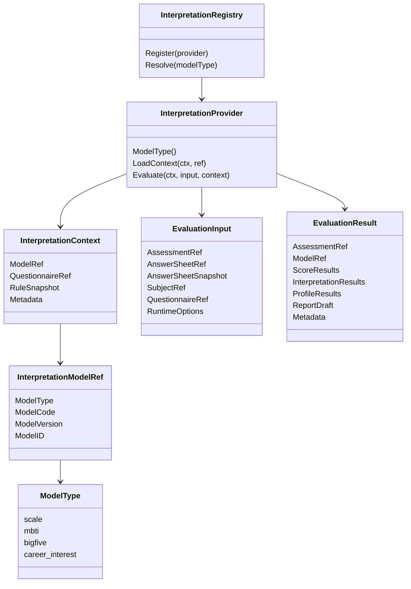

# 01-解释模型抽象：ModelRef / Provider / Context 模型设计

> 本文是 Interpretation Model 模块文档的第一篇，聚焦 **解释模型抽象层的模型设计**。
>
> 这里的“模型”不是指 MedicalScale 或 MBTIModel 这种具体业务模型，而是指一组让不同解释模型统一接入 Evaluation 的抽象对象：`ModelRef`、`Provider`、`Context`、`Registry`、`EvaluationInput`、`EvaluationResult`。
>
> MedicalScale / ScaleProvider 会作为本文的主要示例，但不是抽象本身。未来 MBTI、BigFive、职业兴趣测评等模型，也应通过同一套抽象接入 Evaluation。

---

## 1. 结论先行

Interpretation Model 抽象层的核心目标是：

> **让 Evaluation 不直接依赖某一种具体解释模型，而是通过统一的 ModelRef / Provider / Context 协议执行不同模型。**

它要解决的问题是：

```text
如何标识一个解释模型？
如何根据模型类型找到具体执行者？
如何加载模型规则上下文？
如何把 AnswerSheet 交给模型执行？
如何返回统一 EvaluationResult？
如何支持 Scale 与 MBTI 同级接入？
如何让新增模型不污染 Evaluation 主流程？
```

核心抽象包括：

```text
ModelType                 模型类型，如 scale / mbti / bigfive
InterpretationModelRef    模型引用，标识某个具体模型版本
InterpretationProvider    模型提供者，负责加载上下文和执行模型
InterpretationContext     模型执行上下文，承载只读规则快照
InterpretationRegistry    Provider 注册表，根据 ModelType 解析 Provider
EvaluationInput           Evaluation 传给 Provider 的执行输入
EvaluationResult          Provider 返回给 Evaluation 的执行结果
RuleSnapshot              用于追溯的规则快照或上下文快照
```

一句话概括：

> **ModelRef 负责“指向谁”，Registry 负责“找谁执行”，Provider 负责“怎么加载和执行”，Context 负责“带着什么规则执行”，EvaluationInput / EvaluationResult 负责“执行输入与输出”。**

---

## 2. 本文边界

本文重点：

```text
Interpretation Model 抽象层的设计目标；
ModelType；
InterpretationModelRef；
InterpretationProvider；
InterpretationContext；
InterpretationRegistry；
EvaluationInput；
EvaluationResult；
RuleSnapshot；
ScaleProvider 与 MBTIProvider 的同级关系；
抽象层与具体模型、Evaluation 的边界。
```

本文不展开：

```text
MedicalScale / Factor / ScoringSpec / InterpretationRules 的内部细节；
MBTI 的四维度、人格类型、画像规则细节；
Assessment 状态机；
EvaluationRun；
Report 持久化；
Worker 失败重试；
Provider 的具体注册与执行链路。
```

这些由其它文档承接：

```text
../scale/README.md
../scale/01-Scale模型--MedicalScale-Factor-Interpretion 模型设计.md
../evaluation/README.md
../evaluation/01-Evaluation模型--Assessment-EvaluationRun-Result-Report模型设计.md
02-解释模型接入链路--注册-加载-执行-结果返回.md
03-新增解释模型链路--以MBTI接入为例.md
04-解释模型分层架构与事实源索引.md
```

---

## 3. 为什么不能让 Evaluation 直接依赖 Scale

当前系统中，Scale 是最成熟的解释模型，因此很容易把 Evaluation 写成医学量表专用执行器。

典型写法可能是：

```text
EvaluationService
    -> LoadMedicalScale
    -> LoadFactors
    -> CalculateFactorScore
    -> MatchRiskLevel
    -> BuildScaleReport
```

这在只支持医学量表时可以工作。

但是当系统需要支持 MBTI 时，这种设计会出现问题。

因为 MBTI 的核心概念不是：

```text
Factor
ScoringSpec
RiskLevel
InterpretationRules
```

而更可能是：

```text
Dimension
PreferencePair
TypeCode
TypeProfile
PersonalityTraits
Suggestion
```

如果 Evaluation 被 Scale 绑定，后续只有两个坏方向：

```text
第一，把 MBTI 强行塞进 MedicalScale；
第二，在 Evaluation 中写大量 modelType 分支。
```

这会导致：

```text
Scale 领域模型被污染；
Evaluation 主流程膨胀；
新增模型成本越来越高；
测试复杂度快速上升；
模型之间的规则语义互相干扰。
```

所以必须抽象出 Interpretation Model 层。

---

## 4. Interpretation Model 的设计目标

Interpretation Model 抽象层要达成五个目标。

### 4.1 模型标识统一

Evaluation 不应该分别保存：

```text
MedicalScaleID
MBTIModelID
BigFiveModelID
CareerInterestModelID
```

而应该保存统一的：

```text
InterpretationModelRef
```

通过 `ModelType` 区分具体模型类型。

### 4.2 模型加载统一

Evaluation 不应该自己判断如何加载每一种模型。

错误方向：

```go
switch modelType {
case "scale":
    loadMedicalScale()
case "mbti":
    loadMBTIModel()
}
```

正确方向：

```go
provider := registry.Resolve(modelRef.ModelType)
context := provider.LoadContext(ctx, modelRef)
```

### 4.3 模型执行统一

Evaluation 不应该硬编码每种模型的执行细节。

正确方向：

```go
result := provider.Evaluate(ctx, input, context)
```

ScaleProvider 内部可以执行医学量表评分。

MBTIProvider 内部可以执行人格类型解析。

Evaluation 只关心统一结果。

### 4.4 结果承接统一

不同模型内部结果不同，但 Evaluation 需要统一处理：

```text
保存结果；
生成报告；
推进 Assessment 状态；
发布完成事件；
失败重试。
```

因此 Provider 应返回可被 Evaluation 承接的 `EvaluationResult`。

### 4.5 扩展路径统一

新增解释模型时，不应该修改 Evaluation 主流程。

理想路径是：

```text
新增模型领域模块；
实现 Provider；
注册 Provider；
编写契约测试；
补充文档；
Evaluation 主流程基本不变。
```

---

## 5. 抽象模型总览

Interpretation Model 抽象关系如下：



执行关系如下：

```text
Assessment.ModelRef
    ↓
InterpretationRegistry.Resolve(ModelType)
    ↓
InterpretationProvider.LoadContext(ModelRef)
    ↓
InterpretationProvider.Evaluate(EvaluationInput, Context)
    ↓
EvaluationResult
    ↓
Evaluation 保存结果、生成报告、推进状态
```

---

## 6. ModelType：模型类型

`ModelType` 是解释模型类型。

它用于告诉系统：当前 Assessment 应该使用哪一类解释模型。

典型值：

```text
scale             医学量表模型
mbti              MBTI 人格类型模型
bigfive           五大人格模型
career_interest   职业兴趣模型
```

设计原则：

```text
ModelType 应稳定；
ModelType 应具备业务语义；
ModelType 不应等同于数据库表名；
ModelType 不应等同于某个 Go struct 名称；
ModelType 是 Provider 注册和解析的 key。
```

Scale 示例：

```text
ModelType = scale
```

MBTI 示例：

```text
ModelType = mbti
```

---

## 7. InterpretationModelRef：统一模型引用

`InterpretationModelRef` 是 Evaluation 持有的模型引用。

它用于描述：本次 Assessment 使用哪一个解释模型的哪一个版本。

推荐结构：

```text
InterpretationModelRef
├── ModelType
├── ModelCode
├── ModelVersion
└── ModelID
```

### 7.1 ModelType

模型类型。

例如：

```text
scale
mbti
bigfive
```

它用于从 Registry 中解析对应 Provider。

### 7.2 ModelCode

模型业务编码。

例如：

```text
ADHD_PARENT
DEPRESSION_SELF_TEST
MBTI_STANDARD
BIGFIVE_SHORT
```

它用于从具体模型模块中查找业务模型。

### 7.3 ModelVersion

模型规则版本。

例如：

```text
1.0.0
1.1.0
2.0.0
```

它用于保证执行可追溯。

同一个 `ModelCode` 的不同版本可能有不同规则。

### 7.4 ModelID

模型持久化 ID。

这是可选字段。

如果系统使用 ID 定位模型，可以保留。

如果系统以 `ModelCode + ModelVersion` 为主，也可以只作为辅助字段。

### 7.5 示例

Scale 场景：

```text
InterpretationModelRef
├── ModelType    = scale
├── ModelCode    = ADHD_PARENT
├── ModelVersion = 1.0.0
└── ModelID      = 10001
```

MBTI 场景：

```text
InterpretationModelRef
├── ModelType    = mbti
├── ModelCode    = MBTI_STANDARD
├── ModelVersion = 1.0.0
└── ModelID      = 20001
```

### 7.6 ModelRef 的关键价值

ModelRef 的价值在于：

```text
Assessment 能明确记录本次使用了哪套解释规则；
失败重试时可以加载原始模型版本；
历史报告可以追溯到当时规则；
Evaluation 不需要知道具体模型内部结构；
新增模型时无需新增一组专用引用字段。
```

---

## 8. QuestionnaireRef：模型与答卷的一致性边界

几乎所有解释模型都需要基于某份问卷版本工作。

因此 `InterpretationContext` 与 `EvaluationInput` 都应该带有 `QuestionnaireRef`。

推荐结构：

```text
QuestionnaireRef
├── QuestionnaireCode
└── QuestionnaireVersion
```

执行前必须校验：

```text
input.QuestionnaireRef == context.QuestionnaireRef
```

也就是：

```text
AnswerSheet.QuestionnaireCode == ModelContext.QuestionnaireCode
AnswerSheet.QuestionnaireVersion == ModelContext.QuestionnaireVersion
```

原因是：

```text
模型规则是基于特定问卷版本设计的；
题目 code、选项、基础分可能随版本变化；
答卷与模型版本不一致，会导致执行不可追溯；
历史报告无法说明按哪套规则生成。
```

Scale 场景下，QuestionnaireRef 来自 MedicalScale。

MBTI 场景下，QuestionnaireRef 来自 MBTIModel。

这说明 QuestionnaireRef 是解释模型抽象层的重要公共边界。

---

## 9. InterpretationProvider：解释模型提供者

`InterpretationProvider` 是具体模型接入 Evaluation 的核心接口。

推荐接口：

```go
type InterpretationProvider interface {
    ModelType() ModelType
    LoadContext(ctx context.Context, ref InterpretationModelRef) (InterpretationContext, error)
    Evaluate(ctx context.Context, input EvaluationInput, context InterpretationContext) (EvaluationResult, error)
}
```

### 9.1 ModelType

`ModelType()` 用于声明 Provider 支持的模型类型。

例如：

```go
func (p *ScaleProvider) ModelType() ModelType {
    return ModelTypeScale
}

func (p *MBTIProvider) ModelType() ModelType {
    return ModelTypeMBTI
}
```

Registry 通过它建立映射。

### 9.2 LoadContext

`LoadContext` 根据 `ModelRef` 加载模型上下文。

ScaleProvider 的实现逻辑可能是：

```text
根据 ModelCode / ModelVersion 查询 MedicalScale；
确认 MedicalScale 是 published 或可执行状态；
转换为 EvaluationScaleContext；
返回只读规则快照。
```

MBTIProvider 的实现逻辑可能是：

```text
根据 ModelCode / ModelVersion 查询 MBTIModel；
确认 MBTIModel 可执行；
转换为 MBTIContext；
返回只读规则快照。
```

### 9.3 Evaluate

`Evaluate` 执行模型逻辑。

ScaleProvider 内部可能会：

```text
读取 AnswerSheetSnapshot；
根据 Factor.QuestionCodes 提取答案；
根据 ScoringSpec 计算 FactorScore；
根据 InterpretationRules 命中 RiskLevel；
返回 EvaluationResult。
```

MBTIProvider 内部可能会：

```text
读取 AnswerSheetSnapshot；
根据维度题目映射计算 E/I、S/N、T/F、J/P；
解析 TypeCode；
加载 TypeProfile；
返回 EvaluationResult。
```

Provider 不应推进 Assessment 状态，也不应直接保存报告。

---

## 10. InterpretationContext：执行上下文

`InterpretationContext` 是模型加载后的执行上下文。

它不是领域聚合。

它是一个只读快照。

推荐结构：

```text
InterpretationContext
├── ModelRef
├── QuestionnaireRef
├── RuleSnapshot
├── LoadedAt
└── Metadata
```

### 10.1 Context 的职责

Context 负责承载模型执行所需规则。

例如 ScaleContext：

```text
EvaluationScaleContext
├── ScaleRef
├── QuestionnaireRef
├── FactorSnapshots
│   ├── FactorCode
│   ├── QuestionCodes
│   ├── ScoringSpecSnapshot
│   └── InterpretationRulesSnapshot
└── RuleMetadata
```

例如 MBTIContext：

```text
MBTIContext
├── ModelRef
├── QuestionnaireRef
├── DimensionRules
├── TypeProfiles
├── ReportTemplates
└── RuleMetadata
```

### 10.2 Context 的约束

Context 必须满足：

```text
只读；
深拷贝；
可缓存；
可追溯；
可日志化；
不含本次执行结果；
不暴露可变领域聚合指针。
```

不建议：

```go
type EvaluationScaleContext struct {
    Scale *MedicalScale
}
```

更建议：

```go
type EvaluationScaleContext struct {
    Ref                 InterpretationModelRef
    QuestionnaireRef    QuestionnaireRef
    FactorSnapshots     []FactorSnapshot
    RuleVersion         string
}
```

---

## 11. InterpretationRegistry：Provider 注册表

Registry 用来避免 Evaluation 硬编码具体模型。

推荐接口：

```go
type InterpretationRegistry interface {
    Register(provider InterpretationProvider) error
    Resolve(modelType ModelType) (InterpretationProvider, error)
}
```

启动时注册：

```go
registry.Register(scaleProvider)
registry.Register(mbtiProvider)
```

运行时解析：

```go
provider, err := registry.Resolve(modelRef.ModelType)
```

Registry 应保护：

```text
同一个 ModelType 不能重复注册；
未注册 ModelType 应返回明确错误；
Provider 不能为空；
Provider.ModelType() 必须合法。
```

Registry 不应负责：

```text
加载具体模型规则；
执行模型；
保存 EvaluationResult；
发布事件。
```

---

## 12. EvaluationInput：执行输入

`EvaluationInput` 是 Evaluation 传入 Provider 的执行输入。

推荐结构：

```text
EvaluationInput
├── AssessmentRef
├── AnswerSheetRef
├── AnswerSheetSnapshot
├── SubjectRef
├── QuestionnaireRef
├── RuntimeOptions
└── TraceContext
```

### 12.1 AssessmentRef

标识本次测评执行。

Provider 可以用于日志和结果回填，但不应该直接修改 Assessment。

### 12.2 AnswerSheetRef / AnswerSheetSnapshot

`AnswerSheetRef` 是答卷引用。

`AnswerSheetSnapshot` 是答卷只读快照。

Provider 应通过 Snapshot 读取答案，而不是直接读取 Survey 聚合。

### 12.3 SubjectRef

表示被测对象或用户。

例如：

```text
UserID
ChildProfileID
OrganizationID
```

不同模型可能需要不同受试者上下文，但 Provider 不应直接访问用户中心修改数据。

### 12.4 QuestionnaireRef

用于执行前一致性校验。

应与 Context 中的 QuestionnaireRef 一致。

### 12.5 RuntimeOptions

用于控制执行行为。

例如：

```text
是否生成报告；
是否开启调试输出；
是否允许部分结果；
是否记录详细 trace；
是否走 dry-run。
```

RuntimeOptions 不应改变模型规则本身。

---

## 13. EvaluationResult：统一执行结果

`EvaluationResult` 是 Provider 返回给 Evaluation 的统一执行结果。

推荐结构：

```text
EvaluationResult
├── AssessmentRef
├── ModelRef
├── QuestionnaireRef
├── ScoreResults
├── InterpretationResults
├── ProfileResults
├── ReportDraft
├── RuleSnapshotRef
├── Metadata
└── DomainEvents
```

### 13.1 ScoreResults

用于表达分数类结果。

Scale 场景下可以是：

```text
FactorScore[]
TotalScore
```

MBTI 场景下可以是：

```text
DimensionScores
PreferenceScores
```

### 13.2 InterpretationResults

用于表达解释类结果。

Scale 场景下可以是：

```text
RiskLevelResult[]
FactorInterpretations[]
```

MBTI 场景下可以是：

```text
TypeCode
TypeSummary
DimensionInterpretations
```

### 13.3 ProfileResults

用于表达画像类结果。

MBTI、BigFive、职业兴趣测评可能更常用。

例如：

```text
PersonalityProfile
CareerProfile
DevelopmentProfile
```

### 13.4 ReportDraft

Provider 可以返回报告草稿。

最终报告是否保存、如何保存、何时发布报告事件，仍由 Evaluation 决定。

### 13.5 RuleSnapshotRef

用于追溯本次执行使用的规则上下文。

可以指向：

```text
ContextSnapshotID
ModelVersion
RuleHash
```

如果未来需要严格历史追溯，可以将 Provider 使用的 ContextSnapshot 固化保存。

---

## 14. RuleSnapshot：规则快照

RuleSnapshot 用于解决历史追溯问题。

当模型规则后续变化时，历史 Assessment 仍应能说明当时使用了哪套规则。

RuleSnapshot 可以有两种策略。

### 14.1 引用式快照

只保存：

```text
ModelType
ModelCode
ModelVersion
RuleHash
```

优点是存储轻。

缺点是必须保证旧版本规则仍可加载。

### 14.2 内容式快照

保存完整上下文：

```text
ContextSnapshot
├── ModelRef
├── QuestionnaireRef
├── RulePayload
├── RuleHash
└── CreatedAt
```

优点是历史可追溯性强。

缺点是存储成本更高。

### 14.3 推荐策略

短期可以使用引用式快照。

中长期建议支持内容式快照，至少在 Assessment 创建或执行时记录：

```text
ModelRef
QuestionnaireRef
RuleHash
ContextLoadedAt
```

这样可以排查：

```text
某次测评到底用了哪个模型版本；
是否加载了旧缓存；
规则变更是否影响历史结果；
重试时是否使用了原始规则。
```

---

## 15. ScaleProvider 示例

ScaleProvider 是当前最重要的具体实现。

它把 Scale 模块接入 Interpretation Model 抽象。

映射关系：

```text
ModelType              scale
ModelRef               MedicalScaleRef / InterpretationModelRef
Provider               ScaleProvider
Context                EvaluationScaleContext
Evaluator              MedicalScaleEvaluator
Input                  EvaluationInput
Result                 EvaluationResult
```

ScaleProvider 的 LoadContext：

```text
1. 接收 InterpretationModelRef(scale, code, version)；
2. 调用 ScaleQueryService；
3. 加载 published MedicalScale；
4. 转换为 EvaluationScaleContext；
5. 返回只读规则快照。
```

ScaleProvider 的 Evaluate：

```text
1. 校验 input.QuestionnaireRef 与 context.QuestionnaireRef 一致；
2. 遍历 FactorSnapshots；
3. 根据 QuestionCodes 从 AnswerSheetSnapshot 提取答案；
4. 根据 ScoringSpec 计算 FactorScore；
5. 根据 InterpretationRules 命中解释；
6. 返回 EvaluationResult。
```

边界：

```text
ScaleProvider 可以消费 Scale 规则；
ScaleProvider 不修改 MedicalScale；
ScaleProvider 不保存 FactorScore；
ScaleProvider 不推进 Assessment 状态；
ScaleProvider 不发布 AssessmentInterpretedEvent。
```

---

## 16. MBTIProvider 示例

MBTIProvider 是未来新增模型的典型示例。

映射关系：

```text
ModelType              mbti
ModelRef               MBTIModelRef / InterpretationModelRef
Provider               MBTIProvider
Context                MBTIContext
Evaluator              MBTIEvaluator
Input                  EvaluationInput
Result                 EvaluationResult
```

MBTIProvider 的 LoadContext：

```text
1. 接收 InterpretationModelRef(mbti, code, version)；
2. 调用 MBTIQueryService；
3. 加载 published MBTIModel；
4. 转换为 MBTIContext；
5. 返回只读规则快照。
```

MBTIProvider 的 Evaluate：

```text
1. 校验 input.QuestionnaireRef 与 context.QuestionnaireRef 一致；
2. 根据维度题目映射提取答案；
3. 计算 E/I、S/N、T/F、J/P 四组倾向；
4. 解析 TypeCode；
5. 加载 TypeProfile；
6. 返回 EvaluationResult。
```

这说明：

```text
MBTI 不需要复用 Factor / ScoringSpec / RiskLevel；
MBTI 不需要修改 Scale；
MBTI 只需要实现相同 Provider 协议。
```

---

## 17. Provider 与 Evaluation 的边界

Provider 负责模型执行。

Evaluation 负责执行生命周期。

Provider 可以做：

```text
加载模型 Context；
校验模型上下文是否可执行；
读取 AnswerSheetSnapshot；
执行模型内部算法；
返回 EvaluationResult；
返回模型内部失败原因。
```

Provider 不应该做：

```text
创建 Assessment；
修改 Assessment.Status；
保存 AssessmentScore；
保存 InterpretReport；
发布 AssessmentInterpretedEvent；
消费 MQ；
决定是否重试；
直接修改 AnswerSheet。
```

Evaluation 可以做：

```text
创建或加载 Assessment；
构造 EvaluationInput；
解析 Provider；
调用 Provider；
保存结果；
生成或保存报告；
推进状态；
发布事件；
处理失败和重试。
```

---

## 18. 抽象层与具体模型的边界

Interpretation Model 抽象层只定义接入协议。

它不定义具体模型内部规则。

### 18.1 不定义 Scale 内部模型

不应该在 interpretation-model 中定义：

```text
Factor；
ScoringSpec；
InterpretationRules；
RiskLevel。
```

这些属于 Scale。

### 18.2 不定义 MBTI 内部模型

不应该在 interpretation-model 中定义：

```text
Dimension；
PreferencePair；
TypeCode；
TypeProfile。
```

这些属于 MBTI。

### 18.3 不定义 Evaluation 状态机

不应该在 interpretation-model 中定义：

```text
AssessmentStatus；
EvaluationRun；
RetryPolicy；
ReportRepository；
AssessmentInterpretedEvent。
```

这些属于 Evaluation。

---

## 19. 错误处理模型

Interpretation Model 抽象层应定义通用错误分类，而不是所有错误细节。

常见错误分类：

```text
ProviderNotFound          找不到 ModelType 对应 Provider
ModelNotFound             找不到具体模型
ModelNotPublished         模型未发布或不可执行
ContextLoadFailed         上下文加载失败
QuestionnaireRefMismatch  答卷与模型绑定问卷版本不一致
InvalidInput              输入不合法
EvaluateFailed            模型执行失败
UnsupportedModelType      不支持的模型类型
```

具体模型可以扩展错误原因。

ScaleProvider 可能返回：

```text
ScoringSpecInvalid
AnswerValueNotScorable
InterpretationRuleNotMatched
```

MBTIProvider 可能返回：

```text
DimensionRuleMissing
TypeCodeResolveFailed
TypeProfileNotFound
```

Evaluation 负责把这些错误记录到 Assessment / EvaluationRun 中。

---

## 20. 幂等与版本追溯

解释模型抽象层必须支持幂等和追溯。

核心原则：

```text
同一个 Assessment 重试时，应使用原始 ModelRef；
Provider 不应自动加载 latest model；
Context 应能说明本次使用的规则版本；
EvaluationResult 应记录 ModelRef / RuleSnapshotRef；
模型规则变化不应自动改变历史结果。
```

错误方向：

```text
Assessment retry -> Provider.LoadLatest(modelCode)
```

正确方向：

```text
Assessment retry -> Provider.LoadContext(original ModelRef)
```

如果原始模型已归档，但历史 Assessment 需要重试，应允许按原 ModelRef 加载历史规则，或者进入人工处理。

---

## 21. 缓存设计原则

Context 很适合缓存，但缓存不是事实源。

典型缓存：

```text
interpretation-context:{modelType}:{modelCode}:{modelVersion}
```

缓存内容：

```text
Context snapshot；
QuestionnaireRef；
RuleHash；
LoadedAt；
Metadata。
```

缓存失效来源：

```text
ScaleChangedEvent；
MBTIModelChangedEvent；
ModelPublishedEvent；
ModelArchivedEvent。
```

原则：

```text
规则变化必须失效对应 Context cache；
published -> archived 必须失效可执行缓存；
重复事件删除缓存必须幂等；
Evaluation 不应因为缓存缺失而失败，应能回源加载。
```

---

## 22. 架构护栏

### 22.1 不以 MedicalScale 定义抽象

错误方向：

```text
InterpretationContext = EvaluationScaleContext
EvaluationResult = FactorScore + RiskLevelResult
```

正确方向：

```text
EvaluationScaleContext 是 Scale 的 Context 实现；
FactorScore 是 Scale 执行结果的一种结果类型；
抽象层应允许 MBTI 返回 TypeCode / TypeProfile。
```

### 22.2 不把 MBTI 塞进 Scale

错误方向：

```text
MedicalScale 增加 MBTIType 字段；
Factor 表达 MBTI 四维度；
RiskLevel 表达人格类型。
```

正确方向：

```text
MBTI 独立建模，并通过 MBTIProvider 实现 InterpretationProvider。
```

### 22.3 Evaluation 不硬编码模型分支

错误方向：

```go
if modelType == "scale" {
    runScale()
} else if modelType == "mbti" {
    runMBTI()
}
```

正确方向：

```go
provider := registry.Resolve(modelRef.ModelType)
context := provider.LoadContext(ctx, modelRef)
result := provider.Evaluate(ctx, input, context)
```

### 22.4 Provider 不保存结果

Provider 返回结果。

Evaluation 保存结果。

### 22.5 Context 不暴露可变聚合对象

Context 是快照，不是领域聚合指针。

### 22.6 ModelRef 不能缺少版本

没有版本的 ModelRef 无法支持历史追溯和幂等重试。

---

## 23. 后续演进建议

建议按以下步骤落地：

```text
1. 先在文档中确立 ModelRef / Provider / Context 抽象；
2. 在 Evaluation 的 Assessment 中引入 InterpretationModelRef；
3. 将当前 Scale 执行逻辑包裹为 ScaleProvider；
4. 引入 InterpretationRegistry；
5. 将 Evaluation 主流程改为 Resolve Provider -> Load Context -> Evaluate；
6. 设计 EvaluationResult 统一结构；
7. 为 ScaleProvider 编写 Provider 契约测试；
8. 新增 MBTIProvider；
9. 为 MBTIProvider 编写同样契约测试；
10. 补充事实源索引和新增模型 SOP。
```

不要第一步就大规模抽象所有细节。

优先目标是：

```text
先让 Evaluation 不再硬编码 Scale；
再让 MBTI 能同级接入；
最后再持续优化 Result / Report / Snapshot 的统一模型。
```

---

## 24. 小结

Interpretation Model 抽象设计可以用一句话总结：

> **ModelRef 统一标识模型，Registry 统一解析 Provider，Provider 统一加载 Context 并执行模型，Context 统一承载规则快照，EvaluationInput / EvaluationResult 统一承接执行输入输出。**

本文需要建立五个核心认知：

```text
第一，Interpretation Model 是抽象层，不是 MedicalScale；
第二，ScaleProvider 是当前示例，MBTIProvider 是未来同级实现；
第三，Evaluation 应依赖 Provider 协议，而不是依赖具体模型；
第四，Context 是只读规则快照，不是可变领域聚合；
第五，ModelRef 必须带版本，才能支撑历史追溯和幂等重试。
```

守住这些边界，Evaluation 才能从医学量表专用执行器升级为通用测评执行引擎，Scale、MBTI、BigFive 等模型也才能以清晰、可测试、可演进的方式接入系统。
