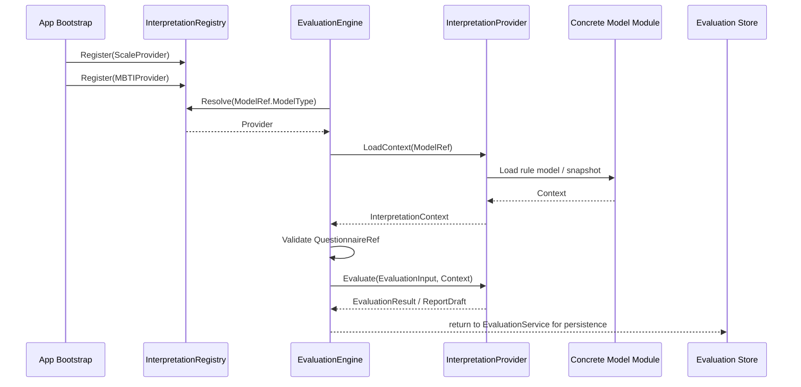

# 02-解释模型接入链路：注册、加载、执行与结果返回

> 本文是 Interpretation Model 模块文档的第二篇，聚焦 **解释模型如何接入 Evaluation 的运行链路**。
>
> 第一篇已经说明：Interpretation Model 的核心抽象不是 `MedicalScale`，而是 `ModelRef / Provider / Context / Registry / EvaluationInput / EvaluationResult` 这一套统一协议。
>
> 本文继续回答：一个具体解释模型如何被注册到系统中，Evaluation 如何根据 `ModelRef` 找到对应 Provider，Provider 如何加载模型上下文，如何执行模型，如何返回统一结果，以及 ScaleProvider 和未来 MBTIProvider 如何以同级方式接入。

---

## 1. 结论先行

解释模型接入链路的核心目标是：

> **让 Evaluation 用同一套流程执行不同解释模型，而不是为每一种模型编写一条专用主流程。**

通用链路如下：

```text
Provider 注册
    ↓
Assessment 固化 InterpretationModelRef
    ↓
EvaluationEngine 根据 ModelType 解析 Provider
    ↓
Provider.LoadContext 加载模型规则上下文
    ↓
EvaluationEngine 校验 AnswerSheet 与 Context 的 QuestionnaireRef
    ↓
Provider.Evaluate 执行模型
    ↓
Provider 返回 EvaluationResult / ReportDraft
    ↓
Evaluation 保存结果、报告并推进 Assessment 状态
```

MedicalScale / ScaleProvider 是当前最重要的现实案例。

但这篇文档的主语不是 MedicalScale。

这篇文档的主语是：

```text
Interpretation Model 接入协议
```

也就是说：

```text
ScaleProvider 是示例；
MBTIProvider 是未来对照；
Provider 协议才是抽象主线。
```

---

## 2. 本文边界

本文重点：

```text
解释模型接入链路总览；
Provider 注册；
ModelRef 固化；
Provider 解析；
Context 加载；
QuestionnaireRef 一致性校验；
Provider.Evaluate 执行模型；
EvaluationResult 返回；
ReportDraft 返回；
Evaluation 结果保存边界；
ScaleProvider / MedicalScale 贯穿示例；
MBTIProvider / MBTIModel 对照示例；
Provider 与 Evaluation 的边界；
常见错误设计。
```

本文不展开：

```text
ModelRef / Provider / Context 的完整模型设计；
MedicalScale / Factor / ScoringSpec / InterpretationRules 的内部模型；
MBTI 四维度、TypeCode、TypeProfile 的内部模型；
Assessment 状态机；
EvaluationRun；
失败重试和补偿策略；
事件 Outbox / MQ 可靠出站实现。
```

这些由其它文档承接：

```text
01-解释模型抽象--ModelRef-Provider-Context模型设计.md
03-新增解释模型链路--以MBTI接入为例.md
04-解释模型分层架构与事实源索引.md
../scale/README.md
../scale/04-Scale 测评链路--Scale与Evaluation联动详解.md
../evaluation/README.md
../evaluation/03-Evaluation引擎链路--模型解析-规则加载-执行-报告生成.md
```

---

## 3. 为什么接入链路必须抽象

如果系统只有 Scale，Evaluation 可以这样写：

```text
加载 MedicalScale；
读取 Factor；
根据 ScoringSpec 计算 FactorScore；
根据 InterpretationRules 匹配 RiskLevel；
生成医学量表报告。
```

这条链路可以工作，但它有一个隐含假设：

```text
所有解释模型都长得像 MedicalScale。
```

这个假设是错的。

因为 MBTI 不一定有：

```text
Factor；
ScoringSpec；
RiskLevel；
InterpretationRules。
```

MBTI 更可能有：

```text
Dimension；
PreferencePair；
TypeCode；
TypeProfile；
PersonalityTraits。
```

如果不抽象接入链路，就会出现两个坏结果：

```text
第一，把 MBTI 强行塞进 Scale；
第二，在 Evaluation 中写大量 if scale / if mbti。
```

因此，需要一条统一链路：

```text
Evaluation 只知道 ModelRef 和 Provider；
Provider 自己知道如何加载和执行具体模型；
不同模型对 Evaluation 返回统一 EvaluationResult。
```

---

## 4. 接入链路总览

解释模型接入 Evaluation 的完整链路如下：



这条链路分为七步：

```text
1. Provider 注册；
2. ModelRef 固化；
3. Provider 解析；
4. Context 加载；
5. 输入一致性校验；
6. Provider 执行；
7. EvaluationResult 返回并由 Evaluation 保存。
```

每一步都有明确边界。

---

## 5. Step 1：Provider 注册

解释模型接入的第一步是注册 Provider。

Provider 注册发生在应用启动或依赖组装阶段。

示意：

```go
registry.Register(scaleProvider)
registry.Register(mbtiProvider)
```

Provider 必须声明自己支持的 ModelType。

例如：

```go
func (p *ScaleProvider) ModelType() ModelType {
    return ModelTypeScale
}

func (p *MBTIProvider) ModelType() ModelType {
    return ModelTypeMBTI
}
```

Registry 内部维护：

```text
scale -> ScaleProvider
mbti  -> MBTIProvider
```

注册阶段必须保证：

```text
Provider 非空；
Provider.ModelType 非空；
同一个 ModelType 不能重复注册；
所有启用模型都有对应 Provider；
启动失败要尽早暴露，而不是运行时才发现 Provider 缺失。
```

---

## 6. Provider 注册不等于模型发布

Provider 注册和模型发布是两件事。

Provider 注册表示：

```text
系统具备执行某类模型的能力。
```

模型发布表示：

```text
某一个具体模型规则已经可被正式使用。
```

例如：

```text
ScaleProvider 已注册；
但 ADHD_PARENT@1.0.0 是否可执行，取决于 MedicalScale 是否 published。
```

再如：

```text
MBTIProvider 已注册；
但 MBTI_STANDARD@1.0.0 是否可执行，取决于 MBTIModel 是否 published。
```

因此：

```text
Registry.Resolve(scale) 成功，不代表某个 MedicalScale 存在；
Provider.LoadContext(modelRef) 成功，才代表具体模型规则可加载；
Provider.Evaluate 成功，才代表本次执行成功。
```

这三个阶段不能混淆。

---

## 7. Step 2：Assessment 固化 ModelRef

解释模型接入链路不是从 Provider 开始，而是从 `Assessment.ModelRef` 开始。

Assessment 创建时应固化：

```text
InterpretationModelRef
├── ModelType
├── ModelCode
├── ModelVersion
└── ModelID
```

Scale 示例：

```text
ModelType    = scale
ModelCode    = ADHD_PARENT
ModelVersion = 1.0.0
ModelID      = medical_scale_id
```

MBTI 示例：

```text
ModelType    = mbti
ModelCode    = MBTI_STANDARD
ModelVersion = 1.0.0
ModelID      = mbti_model_id
```

ModelRef 固化的意义：

```text
本次 Assessment 明确知道使用哪个解释模型；
失败重试可以使用原始模型版本；
历史报告可以追溯规则版本；
EvaluationEngine 可以根据 ModelType 解析 Provider；
同一份 AnswerSheet 可以被不同模型独立解释。
```

不要在每次执行时重新查询 latest model。

错误方向：

```text
AnswerSheetSubmitted -> FindLatestScaleByQuestionnaireCode
```

正确方向：

```text
Assessment 创建时确定 ModelRef；
后续执行和重试都使用 Assessment.ModelRef。
```

---

## 8. ModelRef 来源

ModelRef 可以来自多个地方。

常见来源：

```text
前台测评入口显式传入；
AnswerSheetSubmittedEvent 中携带；
AssessmentPlan 中指定；
Questionnaire 默认绑定的解释模型；
业务配置根据入口场景推导。
```

推荐优先级：

```text
Assessment.ModelRef
> Event.ModelRef
> AssessmentPlan.ModelRef
> QuestionnaireBinding.DefaultModelRef
> Config.DefaultModelRef
```

一旦 Assessment 创建完成，ModelRef 就应该成为执行事实的一部分。

后续重试不再重新推导。

---

## 9. Step 3：Provider 解析

EvaluationEngine 拿到 EvaluationInput 后，根据 `input.ModelRef.ModelType` 解析 Provider。

伪代码：

```go
provider, err := registry.Resolve(input.ModelRef.ModelType)
if err != nil {
    return nil, ProviderNotFound
}
```

解析结果：

```text
ModelType = scale -> ScaleProvider
ModelType = mbti  -> MBTIProvider
```

这一步解决的是：

```text
由谁负责加载和执行这个模型？
```

它不解决：

```text
具体模型是否存在；
具体模型是否 published；
模型规则是否完整；
本次答卷是否能被模型解释。
```

这些由后续 `LoadContext` 和 `Evaluate` 阶段处理。

---

## 10. Provider 解析错误

Provider 解析可能失败。

典型错误：

```text
ProviderNotFound；
UnsupportedModelType；
ProviderDisabled；
DuplicateProviderRegistration；
```

运行时最常见的是：

```text
ProviderNotFound
```

示例：

```text
ModelType = mbti
但系统未注册 MBTIProvider
```

处理方式：

```text
EvaluationEngine 返回 ProviderNotFound；
EvaluationService 将 Assessment 标记 failed；
EvaluationRun 记录 FailedStage = ResolveProvider；
必要时发布 AssessmentFailedEvent。
```

不要 fallback 到其它模型。

例如：

```text
MBTIProvider 找不到 -> 自动使用 ScaleProvider
```

这是错误的。

---

## 11. Step 4：Provider 加载 Context

Provider 解析成功后，EvaluationEngine 调用：

```go
context, err := provider.LoadContext(ctx, input.ModelRef)
```

Context 是模型执行所需的只读规则上下文。

它不是具体模型的可变聚合。

ScaleProvider 加载：

```text
MedicalScale -> EvaluationScaleContext
```

MBTIProvider 加载：

```text
MBTIModel -> MBTIContext
```

Context 应至少包含：

```text
ModelRef；
QuestionnaireRef；
RuleSnapshot / RuleHash；
ModelStatus；
执行所需规则快照；
Metadata。
```

Context 必须满足：

```text
只读；
深拷贝；
可缓存；
可追溯；
不包含本次执行结果；
不暴露可变领域聚合指针。
```

---

## 12. ScaleProvider.LoadContext 示例

ScaleProvider 加载 Context 的逻辑可以抽象为：

```text
1. 接收 InterpretationModelRef(scale, code, version)；
2. 调用 ScaleQueryService.GetEvaluationContext；
3. 查询指定 code + version 的 MedicalScale；
4. 校验 MedicalScale 是否 published / executable；
5. 将 MedicalScale 转换为 EvaluationScaleContext；
6. 返回只读规则快照。
```

EvaluationScaleContext 可能包含：

```text
EvaluationScaleContext
├── ModelRef / ScaleRef
├── QuestionnaireRef
├── FactorSnapshots
│   ├── FactorCode
│   ├── QuestionCodes
│   ├── ScoringSpecSnapshot
│   └── InterpretationRulesSnapshot
├── RuleVersion
├── RuleHash
└── Metadata
```

ScaleProvider 不应该返回：

```go
*MedicalScale
```

原因是：

```text
MedicalScale 是 Scale 的领域聚合；
Evaluation 只需要执行快照；
可变聚合指针会破坏边界；
快照更适合缓存和追溯。
```

---

## 13. MBTIProvider.LoadContext 对照

未来 MBTIProvider 加载 Context 的逻辑可以抽象为：

```text
1. 接收 InterpretationModelRef(mbti, code, version)；
2. 调用 MBTIQueryService.GetEvaluationContext；
3. 查询指定 code + version 的 MBTIModel；
4. 校验 MBTIModel 是否 published / executable；
5. 将 MBTIModel 转换为 MBTIContext；
6. 返回只读规则快照。
```

MBTIContext 可能包含：

```text
MBTIContext
├── ModelRef
├── QuestionnaireRef
├── DimensionRules
│   ├── E/I
│   ├── S/N
│   ├── T/F
│   └── J/P
├── TypeProfiles
├── ReportTemplates
├── RuleVersion
├── RuleHash
└── Metadata
```

这说明：

```text
MBTI 不需要伪装成 MedicalScale；
MBTI 不需要 Factor / ScoringSpec / RiskLevel；
MBTI 只需要返回符合 InterpretationContext 约束的 MBTIContext。
```

---

## 14. Step 5：QuestionnaireRef 一致性校验

Context 加载成功后，EvaluationEngine 必须校验答卷与模型规则基于同一问卷版本。

校验：

```text
input.QuestionnaireRef == context.QuestionnaireRef
```

也就是：

```text
AnswerSheet.QuestionnaireCode == ModelContext.QuestionnaireCode
AnswerSheet.QuestionnaireVersion == ModelContext.QuestionnaireVersion
```

这一步应该在 EvaluationEngine 中做，而不是只放在某个 Provider 中。

原因是：

```text
Scale 需要该校验；
MBTI 也需要该校验；
其它基于问卷的解释模型也需要该校验；
这是解释模型接入 Evaluation 的公共前置条件。
```

不一致时返回：

```text
QuestionnaireRefMismatch
```

并由 EvaluationService 记录：

```text
Assessment failed；
EvaluationRun failed；
FailedStage = ValidateQuestionnaireRef。
```

---

## 15. Step 6：Provider 执行模型

一致性校验通过后，EvaluationEngine 调用：

```go
result, err := provider.Evaluate(ctx, input, context)
```

Provider 执行的是模型内部算法。

ScaleProvider 的执行逻辑可能是：

```text
1. 遍历 FactorSnapshots；
2. 根据 Factor.QuestionCodes 从 AnswerSheetSnapshot 提取答案；
3. 根据 ScoringSpec 计算 FactorScore；
4. 根据 InterpretationRules 命中 RiskLevel；
5. 生成 InterpretationResult；
6. 生成或返回医学量表 ReportDraft；
7. 返回 EvaluationResult。
```

MBTIProvider 的执行逻辑可能是：

```text
1. 读取 DimensionRules；
2. 根据维度题目映射从 AnswerSheetSnapshot 提取答案；
3. 计算 E/I、S/N、T/F、J/P 四组偏好；
4. 解析 TypeCode；
5. 加载 TypeProfile；
6. 生成 ProfileResult 和 TypeInterpretation；
7. 生成或返回 MBTI ReportDraft；
8. 返回 EvaluationResult。
```

EvaluationEngine 不关心上述内部细节。

它只要求 Provider 返回统一结果。

---

## 16. Provider 执行失败

Provider.Evaluate 可能失败。

ScaleProvider 可能失败于：

```text
AnswerValueNotScorable；
ScoringSpecInvalid；
QuestionCodeMissing；
InterpretationRuleNotMatched；
MultipleInterpretationRulesMatched。
```

MBTIProvider 可能失败于：

```text
DimensionRuleMissing；
AnswerMappingInvalid；
TypeCodeResolveFailed；
TypeProfileNotFound。
```

这些具体错误应被包装为通用阶段错误：

```text
ProviderEvaluateFailed
```

同时保留模型内部错误码作为 detail。

例如：

```text
FailedStage = ProviderEvaluate
ErrorCode = ScoringSpecInvalid
ModelType = scale
```

这样 Evaluation 可以统一处理失败，同时运维仍能看到具体原因。

---

## 17. Step 7：返回 EvaluationResult

Provider 执行成功后，返回 `EvaluationResult`。

EvaluationResult 是统一结果外壳，不是某个模型的专用结果。

推荐结构：

```text
EvaluationResult
├── AssessmentRef
├── ModelRef
├── QuestionnaireRef
├── ScoreResults
├── InterpretationResults
├── ProfileResults
├── ReportDraft
├── RuleSnapshotRef
└── Metadata
```

Scale 可以使用：

```text
ScoreResults = FactorScore[] / TotalScore
InterpretationResults = FactorInterpretation[]
RiskLevelResults = RiskLevelResult[]
```

MBTI 可以使用：

```text
ScoreResults = DimensionScores
ProfileResults = TypeProfileResult
InterpretationResults = TypeInterpretation
```

注意：

```text
EvaluationResult 是 Evaluation 可承接的统一结构；
它不是强制所有模型拥有同样字段；
模型差异可以放入 typed detail 或 Metadata；
但核心引用和追溯字段必须统一。
```

---

## 18. EvaluationResult 归一化

Provider 返回结果后，EvaluationEngine 应做基础归一化。

归一化包括：

```text
补齐 AssessmentRef；
补齐 ModelRef；
补齐 QuestionnaireRef；
补齐 RuleSnapshotRef；
校验 ModelRef 与 input.ModelRef 一致；
校验 QuestionnaireRef 与 input.QuestionnaireRef 一致；
校验结果是否为空；
记录 Provider metadata；
规范 ReportDraft 引用。
```

归一化的目标是：

```text
让 EvaluationService 可以稳定保存结果；
让不同 Provider 的输出符合最低契约；
避免模型内部结构泄漏到主流程；
为 ReportBuilder 和事件 payload 提供统一字段。
```

归一化不是：

```text
把 MBTI 强行转换为 FactorScore；
把 Scale 强行转换为 TypeProfile；
把所有模型都压成同一种细节结构。
```

---

## 19. Step 8：返回 ReportDraft

报告草稿可以来自两种方式。

### 19.1 Provider 返回 ReportDraft

Provider 在执行模型时生成报告草稿。

适合：

```text
模型报告结构强依赖模型内部语义；
例如 MBTI 人格画像、职业兴趣测评、多维发展报告。
```

### 19.2 Evaluation ReportBuilder 生成 ReportDraft

Provider 只返回结构化结果，由通用或分派式 ReportBuilder 生成报告草稿。

适合：

```text
报告结构较统一；
模型只需要提供 ScoreResults / InterpretationResults；
例如部分医学量表报告。
```

推荐策略：

```text
允许 Provider 返回 ReportDraft；
如果 Provider 未返回，则由 ReportBuilder 根据 ModelType 选择模板生成；
最终 InterpretReport 仍由 EvaluationService 持久化。
```

---

## 20. Step 9：Evaluation 保存结果与报告

Provider 返回结果后，解释模型接入链路就完成了。

接下来是 EvaluationService 的职责。

EvaluationService 负责：

```text
保存 EvaluationResult；
保存 InterpretReport；
推进 Assessment 状态；
记录 EvaluationRun；
发布 AssessmentInterpretedEvent；
发布 InterpretReportGeneratedEvent。
```

Provider 不负责保存。

EvaluationEngine 也不负责保存。

为什么？

因为保存结果涉及 Assessment 生命周期和事务边界。

这些属于 Evaluation application service。

如果 Provider 直接保存报告，会导致：

```text
Provider 知道 Evaluation 持久化细节；
不同 Provider 各自保存结果，事务边界分散；
Assessment 状态和结果保存容易不一致；
测试和重试复杂度上升。
```

---

## 21. ScaleProvider 完整贯穿示例

以 ScaleProvider 为例，完整接入链路如下：

```text
启动阶段：
    registry.Register(ScaleProvider)

Assessment 创建阶段：
    ModelRef = scale / ADHD_PARENT / 1.0.0

EvaluationEngine 执行阶段：
    registry.Resolve(scale)
        -> ScaleProvider

    ScaleProvider.LoadContext(ModelRef)
        -> ScaleQueryService.GetEvaluationContext
        -> EvaluationScaleContext

    Engine.ValidateQuestionnaireRef(input, context)
        -> AnswerSheet.QuestionnaireRef == MedicalScale.QuestionnaireRef

    ScaleProvider.Evaluate(input, context)
        -> Calculate FactorScore
        -> Match InterpretationRules
        -> Build RiskLevelResult / InterpretationResult
        -> Return EvaluationResult

EvaluationService 保存阶段：
    Save EvaluationResult
    Save InterpretReport
    Assessment.ApplyResult
    Stage AssessmentInterpretedEvent
```

这个例子说明：

```text
Scale 是具体模型；
ScaleProvider 是接入实现；
EvaluationEngine 只走通用链路；
EvaluationService 负责持久化和状态。
```

---

## 22. MBTIProvider 对照示例

未来 MBTIProvider 的接入链路应与 ScaleProvider 同构。

```text
启动阶段：
    registry.Register(MBTIProvider)

Assessment 创建阶段：
    ModelRef = mbti / MBTI_STANDARD / 1.0.0

EvaluationEngine 执行阶段：
    registry.Resolve(mbti)
        -> MBTIProvider

    MBTIProvider.LoadContext(ModelRef)
        -> MBTIQueryService.GetEvaluationContext
        -> MBTIContext

    Engine.ValidateQuestionnaireRef(input, context)
        -> AnswerSheet.QuestionnaireRef == MBTIModel.QuestionnaireRef

    MBTIProvider.Evaluate(input, context)
        -> Calculate DimensionScores
        -> Resolve TypeCode
        -> Load TypeProfile
        -> Return EvaluationResult

EvaluationService 保存阶段：
    Save EvaluationResult
    Save InterpretReport
    Assessment.ApplyResult
    Stage AssessmentInterpretedEvent
```

这个例子说明：

```text
MBTI 不需要复用 MedicalScale；
MBTI 不需要修改 Evaluation 主流程；
MBTI 只需要实现 Provider 协议并注册。
```

---

## 23. Provider 与 Evaluation 的边界

Provider 可以做：

```text
声明 ModelType；
加载模型 Context；
校验模型本身是否可执行；
读取 EvaluationInput；
执行模型算法；
生成 EvaluationResult；
生成 ReportDraft；
返回模型内部错误。
```

Provider 不应该做：

```text
创建 Assessment；
修改 Assessment.Status；
保存 EvaluationResult；
保存 InterpretReport；
发布 AssessmentInterpretedEvent；
决定 Worker ack / retry；
直接修改 AnswerSheet；
直接修改模型规则。
```

Evaluation 可以做：

```text
创建或加载 Assessment；
固化 ModelRef；
构造 EvaluationInput；
调用 EvaluationEngine；
保存结果和报告；
推进状态；
记录 EvaluationRun；
发布事件；
处理失败和重试。
```

---

## 24. 接入链路中的缓存

Context 可以缓存。

典型缓存 key：

```text
interpretation-context:{modelType}:{modelCode}:{modelVersion}
```

Scale 示例：

```text
interpretation-context:scale:ADHD_PARENT:1.0.0
```

MBTI 示例：

```text
interpretation-context:mbti:MBTI_STANDARD:1.0.0
```

缓存内容：

```text
Context snapshot；
QuestionnaireRef；
RuleHash；
LoadedAt；
Metadata。
```

缓存失效来源：

```text
ScaleChangedEvent；
MBTIModelChangedEvent；
ModelPublishedEvent；
ModelArchivedEvent。
```

注意：缓存不是事实源。

Provider.LoadContext 缓存未命中时应能回源加载。

---

## 25. 接入链路中的错误传播

错误应按阶段传播。

推荐阶段：

```text
RegisterProvider
ResolveProvider
LoadContext
ValidateQuestionnaireRef
ProviderEvaluate
NormalizeResult
BuildReportDraft
SaveResult
SaveReport
PublishEvent
```

其中前七个阶段主要属于 Interpretation Model / EvaluationEngine 链路。

后面三个属于 EvaluationService 持久化链路。

错误传播示例：

```text
Provider.LoadContext -> ModelNotPublished
EvaluationEngine -> ContextLoadFailed(ModelNotPublished)
EvaluationService -> Assessment.MarkFailed(FailedStage=LoadModelContext)
EvaluationRun -> failed
```

这样既能统一处理，又能保留具体原因。

---

## 26. 新增模型接入检查清单

新增一个解释模型时，应检查：

```text
是否定义新的 ModelType；
是否定义模型自己的领域模型；
是否定义 ModelRef 定位方式；
是否实现 Provider.ModelType；
是否实现 Provider.LoadContext；
是否实现 Provider.Evaluate；
是否返回统一 EvaluationResult；
是否支持 QuestionnaireRef；
是否支持 published / archived 等可执行状态；
是否支持 RuleSnapshot / RuleHash；
是否注册到 InterpretationRegistry；
是否编写 Provider 契约测试；
是否补充文档。
```

新增模型不应该修改：

```text
Scale 的 MedicalScale 模型；
EvaluationEngine 主流程；
Assessment 主模型结构；
已有 Provider 的内部算法。
```

除非新增的是通用抽象能力。

---

## 27. 常见错误设计

### 27.1 以 MedicalScale 定义接入协议

错误方向：

```text
Provider.LoadContext 统一返回 EvaluationScaleContext。
```

正确方向：

```text
ScaleProvider 返回 EvaluationScaleContext；
MBTIProvider 返回 MBTIContext；
二者都满足 InterpretationContext 契约。
```

### 27.2 Evaluation 主流程写模型分支

错误方向：

```go
if modelType == "scale" {
    runScale()
} else if modelType == "mbti" {
    runMBTI()
}
```

正确方向：

```go
provider := registry.Resolve(modelRef.ModelType)
context := provider.LoadContext(ctx, modelRef)
result := provider.Evaluate(ctx, input, context)
```

### 27.3 Provider 直接保存结果

错误方向：

```text
ScaleProvider.Evaluate -> resultRepository.Save
```

正确方向：

```text
Provider 返回 EvaluationResult；
EvaluationService 保存结果。
```

### 27.4 Provider 自动加载 latest

错误方向：

```text
Provider.LoadContext(modelCode) -> latest published model
```

正确方向：

```text
Provider.LoadContext(ModelRef{code, version}) -> specified version
```

### 27.5 Context 暴露可变领域聚合

错误方向：

```text
ScaleProvider.LoadContext -> *MedicalScale
```

正确方向：

```text
ScaleProvider.LoadContext -> EvaluationScaleContext snapshot
```

### 27.6 忽略 QuestionnaireRef mismatch

错误方向：

```text
答卷和模型绑定的问卷版本不一致，但继续执行。
```

正确方向：

```text
EvaluationEngine 返回 QuestionnaireRefMismatch。
```

---

## 28. 小结

解释模型接入链路可以用一句话总结：

> **Provider 在启动时注册，Assessment 在创建时固化 ModelRef，EvaluationEngine 运行时根据 ModelType 解析 Provider，由 Provider 加载只读 Context 并执行模型，最后返回统一 EvaluationResult，由 Evaluation 保存结果、报告和事件。**

本文需要建立六个核心认知：

```text
第一，接入链路的主语是 Provider 协议，不是 MedicalScale；
第二，Provider 注册表示系统具备执行某类模型的能力，不等于具体模型已发布；
第三，ModelRef 必须在 Assessment 中固化，不能每次执行查 latest；
第四，Context 是只读规则快照，不是可变领域聚合；
第五，ScaleProvider 与 MBTIProvider 是同级实现；
第六，Provider 返回结果，Evaluation 保存结果并推进状态。
```

守住这些边界，Evaluation 才能在不污染 Scale、不硬编码 MBTI 的前提下，稳定支持多种解释模型。
