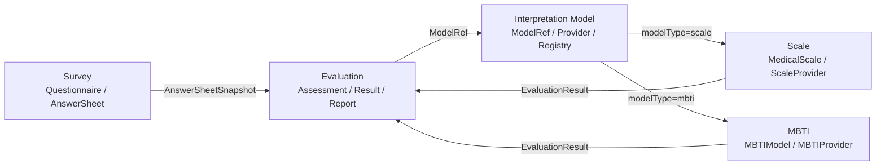
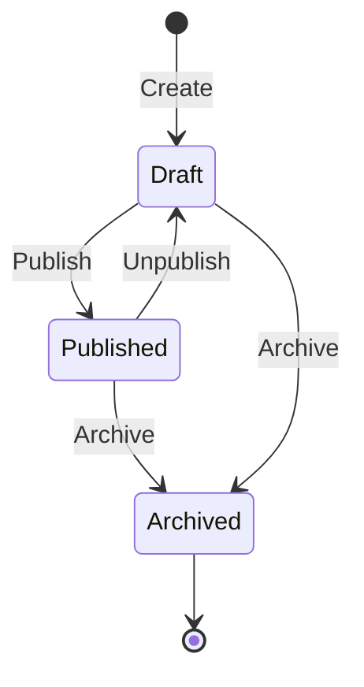
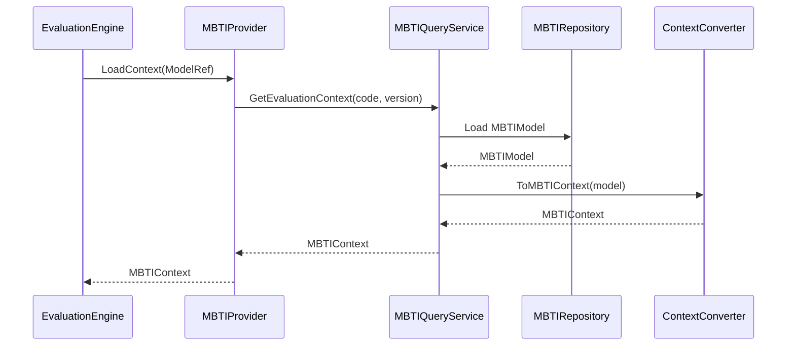
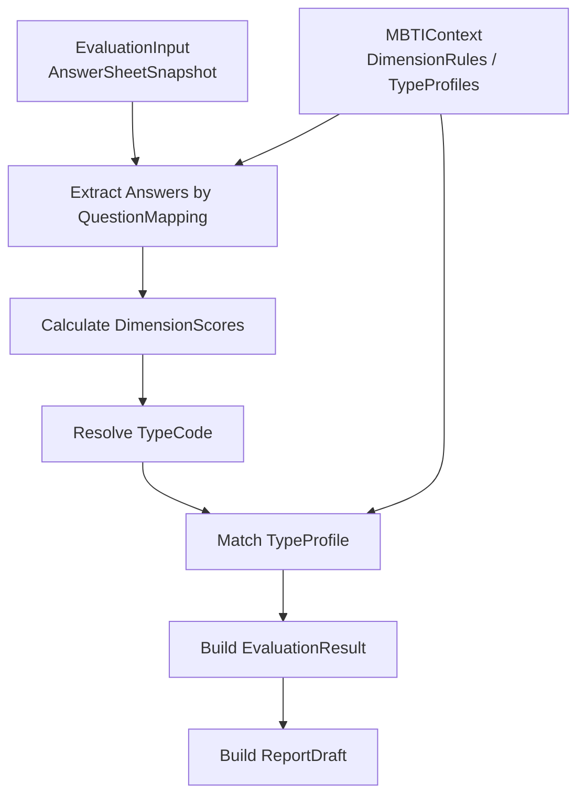

# 03-新增解释模型链路：以 MBTI 接入为例

> 本文是 Interpretation Model 模块文档的第三篇，聚焦 **新增解释模型的接入路径**。
>
> 前两篇已经说明：Interpretation Model 的核心抽象是 `ModelRef / Provider / Context / Registry / EvaluationInput / EvaluationResult`；具体模型通过 Provider 接入 Evaluation，而不是让 Evaluation 为每种模型写一套专用流程。
>
> 本文以 MBTI 为例，说明当系统需要新增一种解释模型时，应该如何设计模型、如何实现 Provider、如何绑定 QuestionnaireVersion、如何返回 EvaluationResult、如何接入 Evaluation，以及新增模型时应该同步修改哪些代码、测试和文档。

---

## 1. 结论先行

新增解释模型的正确路径不是改 Scale，也不是改 Evaluation 主流程。

正确路径是：

```text
新增具体模型模块
    ↓
设计该模型自己的领域模型
    ↓
定义该模型的 ModelRef
    ↓
实现 InterpretationProvider
    ↓
实现 LoadContext
    ↓
实现 Evaluate
    ↓
返回统一 EvaluationResult
    ↓
注册到 InterpretationRegistry
    ↓
补充测试与文档
```

以 MBTI 为例，它应该作为与 Scale 同级的解释模型存在：

```text
Interpretation Model
├── Scale / MedicalScale
└── MBTI / MBTIModel
```

不是：

```text
Scale / MedicalScale
└── MBTI
```

一句话概括：

> **MBTI 不应该伪装成 MedicalScale；MBTI 应该拥有自己的模型、自己的 Provider、自己的 Context，并通过统一 Interpretation Model 协议接入 Evaluation。**

---

## 2. 本文边界

本文重点：

```text
为什么 MBTI 不应该放进 Scale；
MBTI 与 Scale 的模型差异；
MBTI 模型的初步设计；
MBTIModel / Dimension / TypeProfile / ScoringRule 的职责；
MBTIModelRef 的设计；
MBTIProvider 的 LoadContext / Evaluate 链路；
MBTIContext 的设计；
MBTI 如何绑定 QuestionnaireVersion；
MBTI 如何返回 EvaluationResult；
MBTI 如何接入 EvaluationEngine；
新增解释模型的代码、测试、文档检查清单。
```

本文不展开：

```text
MBTI 心理学理论的专业正确性；
MBTI 题库如何设计；
MBTI 量表是否科学有效的学术讨论；
前端动态人格卡如何设计；
AI 解读如何生成；
Profile System 如何沉淀长期人格画像；
具体数据库表结构和 API 字段。
```

这些属于后续 MBTI 模块、产品设计或 Profile System 文档。

---

## 3. 为什么 MBTI 不应该放进 Scale

Scale 的核心模型是医学量表规则。

它通常围绕：

```text
MedicalScale；
Factor；
ScoringSpec；
InterpretationRules；
RiskLevel；
FactorScore；
RiskLevelResult。
```

MBTI 的核心模型更可能围绕：

```text
MBTIModel；
Dimension；
PreferencePair；
DimensionScore；
TypeCode；
TypeProfile；
PersonalityTrait；
Suggestion。
```

两者虽然都可以“解释答卷”，但规则语义完全不同。

如果把 MBTI 放进 Scale，会出现这些问题：

```text
MedicalScale 领域模型被污染；
Factor 被迫表达 E/I、S/N、T/F、J/P；
RiskLevel 被迫表达人格类型；
InterpretationRules 被迫生成 TypeProfile；
Scale 文档和代码变成所有测评模型的大杂烩；
Evaluation 仍然无法真正通用化。
```

因此必须坚持：

> **Scale 是医学量表解释模型，MBTI 是人格类型解释模型，二者同级接入 Evaluation。**

---

## 4. Scale 与 MBTI 的模型差异

Scale 与 MBTI 的差异可以从四个层面理解。

| 层面 | Scale | MBTI |
| --- | --- | --- |
| 核心规则 | MedicalScale | MBTIModel |
| 维度模型 | Factor | Dimension / PreferencePair |
| 结果形态 | FactorScore / RiskLevelResult | DimensionScore / TypeCode / TypeProfile |
| 解读方式 | 分数区间命中解释 | 类型画像与维度倾向解释 |

Scale 更像：

```text
根据多个因子的得分区间，判断风险等级和解释建议。
```

MBTI 更像：

```text
根据四组偏好维度，组合出一个人格类型，并返回类型画像和建议。
```

所以，MBTI 不能简单套用：

```text
Factor + ScoringSpec + RiskLevel
```

它应该有自己的领域模型。

---

## 5. MBTI 接入后的系统位置

接入 MBTI 后，系统结构应变成：



关键点：

```text
Survey 不知道这是 Scale 还是 MBTI；
Evaluation 不直接依赖 MBTI 领域模型；
InterpretationRegistry 根据 ModelType 找 Provider；
ScaleProvider 和 MBTIProvider 同级；
Evaluation 保存统一结果和报告。
```

---

## 6. MBTI 模块建议目录

未来可以新增：

```text
docs/02-业务模块/mbti/
├── README.md
├── 01-MBTI模型--MBTIModel-Dimension-TypeProfile模型设计.md
├── 02-MBTI维护链路--模型发布-维度维护-问卷绑定.md
├── 03-MBTI查询链路--查询服务与读模型.md
├── 04-MBTI测评链路--MBTIProvider与Evaluation联动详解.md
└── 05-MBTI模块分层架构与事实源索引.md
```

代码目录也可以按 qs-server 当前分层风格组织：

```text
internal/apiserver/domain/mbti/
internal/apiserver/application/mbti/
internal/apiserver/infra/mbti/
```

同时在 interpretation-model 和 evaluation 中新增 Provider 集成点。

---

## 7. MBTI 领域模型初稿

MBTI 领域模型可以先抽象为：

```text
MBTIModel
├── ModelCode
├── ModelVersion
├── Title
├── Description
├── QuestionnaireRef
├── Status
├── Dimensions
├── TypeProfiles
├── ReportTemplates
└── DomainEvents
```

内部对象：

```text
Dimension
├── DimensionCode
├── LeftPole
├── RightPole
├── QuestionMappings
└── ScoringRule

PreferencePair
├── LeftCode
├── RightCode
├── LeftLabel
└── RightLabel

QuestionMapping
├── QuestionCode
├── LeftWeight
├── RightWeight
└── Reverse

TypeProfile
├── TypeCode
├── TypeName
├── Summary
├── Traits
├── Strengths
├── Weaknesses
└── Suggestions
```

核心语义：

```text
MBTIModel 定义一套 MBTI 解释规则；
Dimension 定义一组人格偏好维度；
QuestionMapping 定义题目如何影响左右偏好；
ScoringRule 定义维度得分如何计算；
TypeProfile 定义最终人格类型的画像解释。
```

---

## 8. MBTIModel 聚合根

`MBTIModel` 应该是 MBTI 模块的聚合根。

它负责维护：

```text
模型标识；
模型版本；
问卷绑定；
维度规则；
类型画像；
发布状态；
领域事件。
```

它应保护的不变量包括：

```text
ModelCode 在业务范围内唯一；
ModelVersion 明确；
QuestionnaireRef 不能为空；
必须包含四组核心维度；
DimensionCode 不能重复；
TypeProfile 的 TypeCode 不能重复；
发布前必须覆盖 16 种 MBTI 类型；
published / archived 状态下规则冻结；
规则变化后产生 MBTIModelChangedEvent。
```

注意：是否必须覆盖 16 种类型取决于产品定义。

如果实现的是标准 MBTI，建议发布前强校验。

---

## 9. Dimension 维度模型

MBTI 通常包含四组偏好维度：

```text
E / I   外向 / 内向
S / N   感觉 / 直觉
T / F   思考 / 情感
J / P   判断 / 知觉
```

可以抽象为：

```text
Dimension
├── DimensionCode      EI / SN / TF / JP
├── LeftPole           E / S / T / J
├── RightPole          I / N / F / P
├── QuestionMappings
└── ScoringRule
```

Dimension 的职责：

```text
定义这一组偏好维度；
定义哪些题参与该维度计算；
定义每道题如何影响左右偏好；
定义该维度如何输出 DimensionScore。
```

Dimension 不应该保存某次执行结果。

某次执行结果应保存为：

```text
DimensionScore
```

并归属于 EvaluationResult。

---

## 10. QuestionMapping 与问卷绑定

MBTIModel 也必须绑定确定的 QuestionnaireVersion。

推荐引用：

```text
QuestionnaireRef
├── QuestionnaireCode
└── QuestionnaireVersion
```

QuestionMapping 通过 QuestionCode 引用问卷题目：

```text
QuestionMapping
├── QuestionCode
├── LeftWeight
├── RightWeight
└── Reverse
```

发布前必须校验：

```text
QuestionnaireCode 存在；
QuestionnaireVersion 存在；
所有 QuestionCode 存在于该 QuestionnaireVersion；
题型适合 MBTI 计分；
每个 Dimension 至少有一个 QuestionMapping；
published 后不自动同步最新 QuestionnaireVersion。
```

这与 Scale 的原则一致：

```text
具体模型不同；
问卷版本绑定原则相同。
```

---

## 11. TypeCode 与 TypeProfile

MBTI 的最终结果通常是一个四字母类型。

例如：

```text
INTJ
ENFP
ISTP
ESFJ
```

`TypeCode` 来自四组维度偏好的组合：

```text
EI -> E 或 I
SN -> S 或 N
TF -> T 或 F
JP -> J 或 P
```

`TypeProfile` 负责定义该类型的解释画像：

```text
TypeProfile
├── TypeCode
├── TypeName
├── Summary
├── Traits
├── Strengths
├── Weaknesses
├── Suggestions
├── RelationshipHints
├── CareerHints
└── Metadata
```

TypeProfile 是规则事实，不是某次执行结果。

某次执行命中的结果应保存为：

```text
ProfileResult
TypeCodeResult
```

并归属于 Evaluation。

---

## 12. MBTIModel 生命周期

MBTIModel 可以沿用与 Scale 类似的生命周期：

```text
draft      草稿态，可编辑规则
published  发布态，可执行，规则冻结
archived   归档态，不再用于新测评，仅用于历史追溯
```

状态图：



发布前应校验：

```text
QuestionnaireRef 已绑定；
四组 Dimension 完整；
每组 Dimension 的 QuestionMappings 合法；
TypeProfiles 完整；
ReportTemplate 可用；
规则版本明确。
```

published 后应冻结：

```text
QuestionnaireRef；
Dimensions；
QuestionMappings；
ScoringRules；
TypeProfiles；
ReportTemplates。
```

---

## 13. MBTIModelRef 设计

MBTI 接入 Evaluation 时，不需要新增 Assessment 专属字段。

它使用统一 `InterpretationModelRef`：

```text
InterpretationModelRef
├── ModelType    = mbti
├── ModelCode    = MBTI_STANDARD
├── ModelVersion = 1.0.0
└── ModelID      = mbti_model_id
```

这意味着 Assessment 不需要变成：

```text
Assessment
├── ScaleID
├── MBTIModelID
├── BigFiveModelID
```

而是统一保存：

```text
Assessment
└── ModelRef
```

这样同一个 Evaluation 主流程可以执行不同模型。

---

## 14. MBTIContext 设计

MBTIProvider 的 `LoadContext` 应返回只读 `MBTIContext`。

建议结构：

```text
MBTIContext
├── ModelRef
├── QuestionnaireRef
├── DimensionRuleSnapshots
├── TypeProfileSnapshots
├── ReportTemplateSnapshot
├── RuleHash
├── LoadedAt
└── Metadata
```

其中：

```text
DimensionRuleSnapshots  用于执行维度计分；
TypeProfileSnapshots    用于根据 TypeCode 命中画像；
ReportTemplateSnapshot  用于生成报告草稿；
RuleHash                用于追溯和缓存失效。
```

MBTIContext 不能直接暴露：

```go
*MBTIModel
```

原因同 Scale：

```text
Context 是执行快照；
MBTIModel 是领域聚合；
Evaluation 只需要规则快照；
可变聚合指针会破坏边界。
```

---

## 15. MBTIProvider 接口实现

MBTIProvider 实现统一接口：

```go
type InterpretationProvider interface {
    ModelType() ModelType
    LoadContext(ctx context.Context, ref InterpretationModelRef) (InterpretationContext, error)
    Evaluate(ctx context.Context, input EvaluationInput, context InterpretationContext) (EvaluationResult, error)
}
```

MBTIProvider 的映射关系：

```text
ModelType   mbti
ModelRef    InterpretationModelRef{ModelType: mbti, ...}
Context     MBTIContext
Evaluator   MBTIEvaluator
Result      EvaluationResult
```

Provider 职责：

```text
根据 ModelRef 加载 MBTIContext；
校验模型是否可执行；
执行 MBTI 维度计分；
解析 TypeCode；
命中 TypeProfile；
返回 EvaluationResult / ReportDraft。
```

Provider 不负责：

```text
创建 Assessment；
保存 EvaluationResult；
保存 InterpretReport；
推进 Assessment 状态；
发布 AssessmentInterpretedEvent。
```

---

## 16. MBTIProvider.LoadContext 链路

MBTIProvider.LoadContext 可以这样设计：

```text
EvaluationEngine
    -> MBTIProvider.LoadContext(ModelRef)
        -> MBTIQueryService.GetEvaluationContext(ModelCode, ModelVersion)
            -> Load published MBTIModel
            -> Convert to MBTIContext
        -> return MBTIContext
```

流程图：



LoadContext 需要校验：

```text
MBTIModel 存在；
ModelVersion 匹配；
Status 是 published 或可执行；
QuestionnaireRef 明确；
Dimensions 完整；
TypeProfiles 完整；
ReportTemplate 可用。
```

---

## 17. MBTIProvider.Evaluate 链路

MBTIProvider.Evaluate 负责执行 MBTI 模型。

输入：

```text
EvaluationInput
├── AssessmentRef
├── AnswerSheetSnapshot
├── SubjectRef
├── QuestionnaireRef
└── ModelRef

MBTIContext
├── DimensionRuleSnapshots
├── TypeProfileSnapshots
└── ReportTemplateSnapshot
```

输出：

```text
EvaluationResult
├── ScoreResults       DimensionScores
├── ProfileResults     TypeProfileResult
├── InterpretationResults
├── ReportDraft
└── RuleSnapshotRef
```

执行流程：

```text
1. 校验 context 类型为 MBTIContext；
2. 遍历四组 DimensionRule；
3. 根据 QuestionMapping 从 AnswerSheetSnapshot 提取答案；
4. 计算每组维度左右偏好得分；
5. 为每组维度选择偏好字母；
6. 组合出 TypeCode；
7. 根据 TypeCode 命中 TypeProfile；
8. 构造 DimensionScore / TypeCodeResult / ProfileResult；
9. 生成 ReportDraft；
10. 返回 EvaluationResult。
```

---

## 18. MBTI 执行链路示意



注意：

```text
QuestionnaireRef 一致性校验由 EvaluationEngine 执行；
MBTIProvider 内部可以再次防御式校验，但不是唯一防线；
最终保存结果和报告由 EvaluationService 完成。
```

---

## 19. MBTI 的 EvaluationResult 映射

MBTI 不应该强行返回 FactorScore。

它可以返回更适合人格类型模型的结果。

建议映射：

```text
ScoreResults
├── DimensionScore(EI)
├── DimensionScore(SN)
├── DimensionScore(TF)
└── DimensionScore(JP)

ProfileResults
└── PersonalityProfile(TypeCode)

InterpretationResults
├── TypeSummary
├── DimensionInterpretations
└── Suggestions
```

DimensionScore 示例：

```text
DimensionScore
├── DimensionCode = EI
├── LeftPole = E
├── RightPole = I
├── LeftScore = 8
├── RightScore = 12
├── Preference = I
└── Strength = medium
```

ProfileResult 示例：

```text
ProfileResult
├── ProfileType = mbti
├── Code = INTJ
├── Title = 建筑师型人格
├── Summary
├── Traits
├── Strengths
├── Weaknesses
└── Suggestions
```

---

## 20. MBTI ReportDraft 设计

MBTI 报告草稿可以由 MBTIProvider 生成，也可以由 ReportBuilder 根据 MBTI EvaluationResult 生成。

建议先让 MBTIProvider 返回结构化 ReportDraft。

原因是：

```text
MBTI 报告强依赖人格类型和维度解释；
通用 ReportBuilder 过早抽象容易膨胀；
Provider 对自己模型的报告语义最清楚。
```

ReportDraft 可包含：

```text
Title；
TypeCode；
TypeName；
Summary；
DimensionSections；
Traits；
Strengths；
Weaknesses；
RelationshipSuggestions；
CareerSuggestions；
GrowthSuggestions；
RenderSchema。
```

最终持久化仍由 EvaluationService 完成：

```text
ReportDraft -> InterpretReport
```

---

## 21. MBTI 事件边界

MBTI 模型自身规则变化可以产生：

```text
MBTIModelChangedEvent
MBTIModelPublishedEvent
MBTIModelArchivedEvent
```

这些事件表示：

```text
MBTI 规则事实发生变化。
```

它们不表示：

```text
某次测评完成；
某个用户是 INTJ；
某份报告已生成。
```

测评完成事件仍由 Evaluation 产生：

```text
AssessmentInterpretedEvent
InterpretReportGeneratedEvent
```

必须区分：

```text
MBTIModelChangedEvent      规则变化
AssessmentInterpretedEvent 执行完成
```

这与 ScaleChangedEvent 的边界一致。

---

## 22. MBTI 与 Profile System 的边界

未来如果要做动态人格卡、长期画像、AI 画像沉淀，建议不要直接塞进 Evaluation。

可以拆分：

```text
MBTIProvider 负责本次 MBTI 测评解释；
Evaluation 负责保存本次结果和报告；
Profile System 负责长期画像沉淀、用户标签、动态人格卡；
AI 解读服务负责生成增强解释或个性化文案。
```

边界：

```text
MBTI EvaluationResult 是一次测评结果；
Profile System Profile 是长期画像；
AI 解读是衍生内容，不应反向污染 MBTIModel 规则。
```

这样可以避免 MBTI 模块过度膨胀。

---

## 23. 新增 MBTI 接入步骤

建议按以下步骤落地：

```text
1. 定义 ModelType = mbti；
2. 新增 MBTI domain 模块；
3. 设计 MBTIModel / Dimension / TypeProfile；
4. 设计 MBTIModel 生命周期；
5. 设计 MBTI 与 QuestionnaireVersion 的绑定；
6. 实现 MBTIQueryService.GetEvaluationContext；
7. 实现 MBTIContext；
8. 实现 MBTIProvider.LoadContext；
9. 实现 MBTIProvider.Evaluate；
10. 注册 MBTIProvider 到 InterpretationRegistry；
11. 扩展 EvaluationResult 以支持 ProfileResult / DimensionScore；
12. 扩展 ReportDraft / ReportBuilder；
13. 编写 Provider 契约测试；
14. 编写 MBTI 模块文档；
15. 编写 Evaluation 集成测试。
```

建议先做最小可运行闭环：

```text
MBTIModel draft/published；
QuestionnaireRef 绑定；
四维度规则；
16 类型画像；
Provider 执行；
Evaluation 保存结果和报告。
```

不要第一版就加入 AI 解读、动态人格卡、长期画像沉淀。

---

## 24. Provider 契约测试

新增 MBTIProvider 后，应编写 Provider 契约测试。

至少覆盖：

```text
ModelType 返回 mbti；
LoadContext 成功加载 published MBTIModel；
LoadContext 拒绝 draft / archived；
LoadContext 返回只读 MBTIContext；
Evaluate 在合法 AnswerSheet 下返回 EvaluationResult；
Evaluate 在 QuestionMapping 缺失时失败；
Evaluate 在 TypeProfile 缺失时失败；
EvaluationResult 包含 ModelRef / QuestionnaireRef / RuleSnapshotRef；
ReportDraft 不为空；
重复执行同一输入结果稳定。
```

契约测试目标不是测 MBTI 理论，而是测：

```text
Provider 是否符合 Interpretation Model 协议。
```

---

## 25. Evaluation 集成测试

MBTI 接入 Evaluation 后，应补充集成测试。

至少覆盖：

```text
Assessment.ModelRef = mbti 时能解析 MBTIProvider；
AnswerSheetSnapshot 与 MBTIContext QuestionnaireRef 一致时执行成功；
QuestionnaireRef 不一致时失败；
MBTIProvider 返回 EvaluationResult 后，Evaluation 能保存结果和报告；
Assessment 能推进 interpreted；
失败时记录 EvaluationRun；
重复事件不会重复生成报告；
重试使用原始 ModelRef，而不是 latest MBTIModel。
```

重点是验证 Evaluation 主流程没有为 MBTI 写特殊分支。

---

## 26. 文档同步清单

新增 MBTI 后，需要同步：

```text
docs/02-业务模块/interpretation-model/README.md
docs/02-业务模块/interpretation-model/01-解释模型抽象--ModelRef-Provider-Context模型设计.md
docs/02-业务模块/interpretation-model/02-解释模型接入链路--注册-加载-执行-结果返回.md
docs/02-业务模块/interpretation-model/03-新增解释模型链路--以MBTI接入为例.md
docs/02-业务模块/interpretation-model/04-解释模型分层架构与事实源索引.md
docs/02-业务模块/evaluation/README.md
docs/02-业务模块/evaluation/03-Evaluation引擎链路--模型解析-规则加载-执行-报告生成.md
docs/02-业务模块/mbti/README.md
```

如果新增事件，还要同步：

```text
configs/events.yaml；
事件契约文档；
Worker 消费文档；
缓存失效文档。
```

---

## 27. 常见错误设计

### 27.1 把 MBTI 塞进 MedicalScale

错误方向：

```text
MedicalScale 增加 MBTIType 字段；
Factor 表达 E/I、S/N、T/F、J/P；
RiskLevel 表达人格类型。
```

正确方向：

```text
新增 MBTIModel；
新增 MBTIProvider；
通过 ModelType=mbti 接入 Evaluation。
```

### 27.2 Evaluation 主流程写 if mbti

错误方向：

```go
if modelType == "mbti" {
    runMBTI()
}
```

正确方向：

```go
provider := registry.Resolve(modelRef.ModelType)
context := provider.LoadContext(ctx, modelRef)
result := provider.Evaluate(ctx, input, context)
```

### 27.3 MBTIProvider 自动使用最新模型

错误方向：

```text
MBTIProvider.LoadContext(modelCode) -> latest published MBTIModel
```

正确方向：

```text
MBTIProvider.LoadContext(ModelRef{code, version}) -> 指定版本 MBTIModel
```

### 27.4 MBTIContext 暴露可变聚合

错误方向：

```text
MBTIContext 持有 *MBTIModel
```

正确方向：

```text
MBTIContext 持有只读快照。
```

### 27.5 MBTIProvider 直接保存报告

错误方向：

```text
MBTIProvider.Evaluate -> SaveReport
```

正确方向：

```text
MBTIProvider 返回 ReportDraft；
EvaluationService 保存 InterpretReport。
```

### 27.6 把一次 MBTI 结果当成长期用户画像

错误方向：

```text
MBTIResult 直接覆盖用户长期 Profile。
```

正确方向：

```text
MBTIResult 是一次测评结果；
长期画像由 Profile System 独立沉淀。
```

---

## 28. 小结

新增解释模型链路可以用一句话总结：

> **新增模型时，不改 Scale，不改 Evaluation 主流程，而是新增自己的领域模型和 Provider，通过 ModelRef / Registry / Context / EvaluationResult 这一套 Interpretation Model 协议接入 Evaluation。**

本文需要建立六个核心认知：

```text
第一，MBTI 与 Scale 同级，不是 Scale 的子能力；
第二，MBTI 应拥有自己的 MBTIModel / Dimension / TypeProfile；
第三，MBTI 通过 ModelType=mbti 和 MBTIProvider 接入；
第四，MBTIContext 是只读规则快照，不是 MBTIModel 可变指针；
第五，MBTIProvider 返回 EvaluationResult / ReportDraft，Evaluation 保存结果和报告；
第六，一次 MBTI 测评结果不等于长期用户画像。
```

守住这些边界，qs-server 就可以在不破坏 Scale、不污染 Evaluation 的前提下，逐步扩展更多解释模型。
