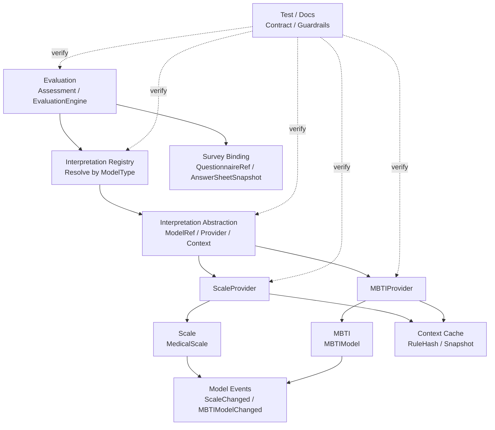

# 04-解释模型分层架构与事实源索引

> 本文是 Interpretation Model 模块文档的收束篇，聚焦 **解释模型抽象层的分层架构、事实源索引、修改检查清单与架构护栏**。
>
> 前三篇已经说明：Interpretation Model 不是 MedicalScale，而是一套让 Scale、MBTI、BigFive 等解释模型统一接入 Evaluation 的协议；核心抽象包括 `ModelRef / Provider / Context / Registry / EvaluationInput / EvaluationResult`；新增 MBTI 时也应通过 Provider 接入，而不是塞进 Scale 或改 Evaluation 主流程。
>
> 本文的目标是防止抽象层、具体模型、Evaluation 执行链路和文档之间发生漂移。

---

## 1. 结论先行

Interpretation Model 的事实源不是某一个具体模型，也不是某一个 Provider 实现。

它由多层共同构成：

```text
Abstraction      定义 ModelType / ModelRef / Provider / Context / Registry 等统一协议
Provider         让具体模型接入 Evaluation，例如 ScaleProvider / MBTIProvider
Concrete Model   保存具体模型规则，例如 MedicalScale / MBTIModel
Evaluation       通过 ModelRef + Registry + Provider 执行测评
Survey Binding   提供 QuestionnaireRef 与 AnswerSheetSnapshot 的一致性边界
Context Cache    缓存只读规则上下文，但不是规则事实源
Event            表达具体模型规则变化，用于缓存失效和读模型刷新
Test             验证 Provider 契约、Registry 行为和 Evaluation 集成
Docs             解释抽象边界、接入流程和新增模型 SOP
```

一句话概括：

> **Interpretation Model 的核心事实源是接入协议；Scale / MBTI 是协议实现，Evaluation 是协议消费者，Survey 提供答卷事实边界。**

后续修改 Interpretation Model 时，不能只改一个接口。

必须同步检查：

```text
ModelType；
ModelRef；
Provider 接口；
Context 约束；
Registry 注册与解析；
ScaleProvider；
MBTIProvider；
EvaluationEngine；
EvaluationResult；
事件与缓存失效；
契约测试；
文档。
```

---

## 2. 本文边界

本文重点：

```text
Interpretation Model 分层架构；
抽象协议事实源；
Provider 事实源；
Registry 事实源；
Context 事实源；
Concrete Model 事实源；
Evaluation 集成事实源；
Survey Binding 事实源；
事件、缓存、测试、文档事实源；
修改检查清单；
架构护栏。
```

本文不展开：

```text
MedicalScale 内部 Factor / ScoringSpec / InterpretationRules 的模型细节；
MBTI 四维度、TypeCode、TypeProfile 的完整模型细节；
Evaluation Assessment 状态机和失败重试细节；
Survey AnswerSheet 提交流程；
Outbox / MQ 的具体基础设施实现。
```

这些由以下文档承接：

```text
README.md
01-解释模型抽象--ModelRef-Provider-Context模型设计.md
02-解释模型接入链路--注册-加载-执行-结果返回.md
03-新增解释模型链路--以MBTI接入为例.md
../scale/README.md
../evaluation/README.md
../survey/README.md
```

---

## 3. Interpretation Model 分层总览

Interpretation Model 可以按以下层次理解：



核心原则：

```text
Evaluation 依赖抽象协议，不直接依赖具体模型内部结构；
Registry 只负责 ModelType 到 Provider 的解析；
Provider 负责加载具体模型 Context 并执行模型；
Context 是只读规则快照，不是领域聚合指针；
Concrete Model 保存具体规则事实；
Survey 提供答卷事实和 QuestionnaireRef；
Event 用于规则变化通知和缓存失效；
Test / Docs 负责防漂移。
```

---

## 4. 抽象协议事实源

抽象协议是 Interpretation Model 的核心事实源。

它定义：

```text
什么是 ModelType；
什么是 InterpretationModelRef；
什么是 InterpretationProvider；
什么是 InterpretationContext；
什么是 InterpretationRegistry；
什么是 EvaluationInput；
什么是 EvaluationResult；
什么是 RuleSnapshotRef。
```

抽象协议应回答：

```text
Evaluation 如何标识一个解释模型？
Evaluation 如何找到模型执行者？
Provider 如何加载模型上下文？
Provider 如何返回执行结果？
Context 与领域聚合的边界是什么？
新增模型需要实现哪些契约？
```

抽象协议不应回答：

```text
Factor 如何计分；
MBTI TypeCode 如何解析；
Assessment 如何重试；
AnswerSheet 如何提交；
Report 如何持久化。
```

---

## 5. 抽象协议代码事实源

如果代码已经落地，抽象协议可放在类似目录中：

```text
internal/apiserver/application/interpretation/model_type.go
internal/apiserver/application/interpretation/model_ref.go
internal/apiserver/application/interpretation/provider.go
internal/apiserver/application/interpretation/context.go
internal/apiserver/application/interpretation/registry.go
internal/apiserver/application/interpretation/errors.go
```

如果当前尚未创建 interpretation package，可以先以文档为目标结构，后续重构时逐步落地。

核心事实源包括：

```text
ModelType 枚举；
InterpretationModelRef 结构；
InterpretationProvider 接口；
InterpretationContext 约束；
InterpretationRegistry 接口与实现；
ProviderNotFound / ContextLoadFailed 等错误分类。
```

---

## 6. ModelType 维护原则

`ModelType` 是 Provider 注册和解析的 key。

典型值：

```text
scale
mbti
bigfive
career_interest
```

维护原则：

```text
ModelType 必须稳定；
ModelType 必须有业务语义；
ModelType 不等于数据库表名；
ModelType 不等于 Go struct 名；
新增 ModelType 必须同步新增 Provider；
删除或重命名 ModelType 是破坏性变更。
```

修改 ModelType 时要同步检查：

```text
Assessment.ModelRef；
IdempotencyKey；
Registry 注册；
Provider.ModelType；
EvaluationEngine；
事件 payload；
结果与报告 Snapshot；
测试；
文档。
```

---

## 7. ModelRef 维护原则

`InterpretationModelRef` 是 Assessment 引用解释模型的统一方式。

推荐结构：

```text
InterpretationModelRef
├── ModelType
├── ModelCode
├── ModelVersion
└── ModelID
```

维护原则：

```text
ModelRef 必须包含 ModelType；
ModelRef 必须包含 ModelCode；
ModelRef 必须包含 ModelVersion；
ModelID 可以作为辅助定位；
Assessment 创建后 ModelRef 不应被静默修改；
重试必须使用原始 ModelRef；
事件和报告 Snapshot 应记录 ModelRef。
```

不要退化成：

```text
ScaleID；
MBTIModelID；
BigFiveModelID。
```

那会让 Assessment 重新绑定具体模型类型。

---

## 8. Provider 事实源

Provider 是具体模型接入 Evaluation 的实现点。

Provider 应负责：

```text
声明 ModelType；
根据 ModelRef 加载 Context；
校验具体模型是否可执行；
执行模型内部算法；
返回 EvaluationResult / ReportDraft；
返回模型内部错误。
```

Provider 不应负责：

```text
创建 Assessment；
保存 EvaluationResult；
保存 InterpretReport；
推进 Assessment 状态；
发布 AssessmentInterpretedEvent；
决定 Worker ack / retry；
修改 AnswerSheet；
修改模型规则。
```

Provider 是桥梁，不是 Evaluation Application Service。

---

## 9. Provider 代码事实源

具体 Provider 可能位于：

```text
internal/apiserver/application/scale/provider.go
internal/apiserver/application/mbti/provider.go
internal/apiserver/application/bigfive/provider.go
```

也可以按模型模块组织：

```text
internal/apiserver/application/scale/interpretation_provider.go
internal/apiserver/application/mbti/interpretation_provider.go
```

重点事实源：

```text
ScaleProvider；
MBTIProvider；
Provider.LoadContext；
Provider.Evaluate；
Provider 错误包装；
Provider 契约测试。
```

---

## 10. Registry 事实源

Registry 负责根据 `ModelType` 找到 Provider。

推荐接口：

```go
type InterpretationRegistry interface {
    Register(provider InterpretationProvider) error
    Resolve(modelType ModelType) (InterpretationProvider, error)
}
```

Registry 应保证：

```text
同一个 ModelType 不能重复注册；
Provider 不能为空；
Provider.ModelType 不能为空；
未注册 ModelType 返回 ProviderNotFound；
启动时尽早发现注册错误。
```

Registry 不应负责：

```text
加载模型规则；
执行模型算法；
保存 EvaluationResult；
发布事件。
```

Registry 是路由表，不是业务服务。

---

## 11. Context 事实源

Context 是模型执行上下文。

它必须是只读规则快照。

通用约束：

```text
包含 ModelRef；
包含 QuestionnaireRef；
包含 RuleSnapshotRef 或 RuleHash；
包含模型执行所需规则快照；
不包含本次执行结果；
不暴露可变领域聚合指针；
可缓存；
可追溯。
```

Scale 示例：

```text
EvaluationScaleContext
├── ModelRef / ScaleRef
├── QuestionnaireRef
├── FactorSnapshots
├── ScoringSpecSnapshots
├── InterpretationRulesSnapshots
└── RuleHash
```

MBTI 示例：

```text
MBTIContext
├── ModelRef
├── QuestionnaireRef
├── DimensionRuleSnapshots
├── TypeProfileSnapshots
├── ReportTemplateSnapshot
└── RuleHash
```

错误方向：

```go
type EvaluationScaleContext struct {
    Scale *MedicalScale
}
```

正确方向：

```text
Context 持有 Snapshot，不持有可变聚合。
```

---

## 12. Concrete Model 事实源

具体模型保存自己的规则事实。

Scale 的事实源是：

```text
MedicalScale；
Factor；
ScoringSpec；
InterpretationRules；
RiskLevel；
ScaleChangedEvent。
```

MBTI 的事实源是：

```text
MBTIModel；
Dimension；
QuestionMapping；
TypeProfile；
ReportTemplate；
MBTIModelChangedEvent。
```

Interpretation Model 不应吞并这些具体模型。

它只定义它们如何接入 Evaluation。

---

## 13. Evaluation 集成事实源

Evaluation 是 Interpretation Model 的消费者。

它通过以下对象集成：

```text
Assessment.ModelRef；
EvaluationInput.ModelRef；
EvaluationEngine；
InterpretationRegistry；
Provider.LoadContext；
Provider.Evaluate；
EvaluationResult；
InterpretReport Snapshot。
```

Evaluation 应保证：

```text
Assessment 创建时固化 ModelRef；
重试时使用原始 ModelRef；
EvaluationEngine 不硬编码具体模型；
Provider 返回结果后由 Evaluation 保存；
结果和报告记录 ModelRef / RuleSnapshotRef。
```

---

## 14. Survey Binding 事实源

解释模型通常基于特定问卷版本工作。

因此 Survey Binding 是公共边界。

核心引用：

```text
QuestionnaireRef
├── QuestionnaireCode
└── QuestionnaireVersion
```

公共校验：

```text
EvaluationInput.QuestionnaireRef == InterpretationContext.QuestionnaireRef
```

这不是 Scale 专属规则。

MBTI、BigFive、职业兴趣测评也需要遵守。

Survey Binding 应保证：

```text
AnswerSheetSnapshot 带有 QuestionnaireRef；
具体模型 Context 带有 QuestionnaireRef；
EvaluationEngine 执行前做一致性校验；
不一致时拒绝执行。
```

---

## 15. Context Cache 事实源

Context 可以缓存，但缓存不是事实源。

典型 key：

```text
interpretation-context:{modelType}:{modelCode}:{modelVersion}
```

示例：

```text
interpretation-context:scale:ADHD_PARENT:1.0.0
interpretation-context:mbti:MBTI_STANDARD:1.0.0
```

缓存内容：

```text
Context Snapshot；
QuestionnaireRef；
RuleHash；
LoadedAt；
Metadata。
```

缓存失效来源：

```text
ScaleChangedEvent；
ScalePublishedEvent；
ScaleArchivedEvent；
MBTIModelChangedEvent；
MBTIModelPublishedEvent；
MBTIModelArchivedEvent。
```

原则：

```text
Provider.LoadContext 缓存未命中时必须能回源；
规则变化事件必须清理对应 Context cache；
缓存不能替代模型持久化事实；
缓存中不能放可变聚合指针。
```

---

## 16. Event 事实源

Interpretation Model 本身通常不拥有业务事件。

具体模型拥有自己的规则变化事件。

例如：

```text
ScaleChangedEvent；
ScalePublishedEvent；
ScaleArchivedEvent；
MBTIModelChangedEvent；
MBTIModelPublishedEvent；
MBTIModelArchivedEvent。
```

这些事件表达：

```text
具体解释模型规则发生变化。
```

它们不表达：

```text
某次 Assessment 已完成；
某份报告已生成；
某个用户结果变化；
历史测评已经重算。
```

规则变化事件常用于：

```text
刷新 Context cache；
重建具体模型读模型；
通知后台配置变化；
触发审计或人工确认。
```

---

## 17. Test 事实源

Interpretation Model 测试应重点覆盖契约，而不是具体模型算法本身。

测试类型：

| 测试类型 | 应覆盖内容 |
| --- | --- |
| Abstraction tests | ModelRef 校验、ModelType 枚举、错误分类 |
| Registry tests | 注册、重复注册、未注册解析失败 |
| Provider contract tests | ModelType、LoadContext、Evaluate、错误返回 |
| Context tests | 只读快照、QuestionnaireRef、RuleHash |
| Evaluation integration tests | Engine 根据 ModelRef 解析 Provider 并执行 |
| Cache tests | Context cache 命中、回源、失效 |
| Event tests | 规则变化事件触发缓存失效 |
| Docs guard tests | 文档事实源与代码命名防漂移，可选 |

Provider 契约测试尤其重要。

ScaleProvider 和 MBTIProvider 都应该通过同一类契约测试。

---

## 18. Docs 事实源

Interpretation Model 文档分为四篇：

```text
README.md
01-解释模型抽象--ModelRef-Provider-Context模型设计.md
02-解释模型接入链路--注册-加载-执行-结果返回.md
03-新增解释模型链路--以MBTI接入为例.md
04-解释模型分层架构与事实源索引.md
```

各文档职责：

| 文档 | 事实主题 |
| --- | --- |
| README.md | 定位、边界、文档导航 |
| 01 | ModelRef / Provider / Context / Registry 模型设计 |
| 02 | Provider 注册、加载、执行、结果返回链路 |
| 03 | 新增模型 SOP，以 MBTI 为例 |
| 04 | 分层架构、事实源索引、检查清单、架构护栏 |

相关外部文档：

```text
../evaluation/README.md
../evaluation/03-Evaluation引擎链路--模型解析-规则加载-执行-报告生成.md
../scale/README.md
../survey/README.md
```

---

## 19. 修改 ModelType 检查清单

需要检查：

```text
ModelType 枚举；
Provider.ModelType；
Registry 注册；
Assessment.ModelRef；
IdempotencyKey；
事件 payload；
Context cache key；
EvaluationResult；
Report Snapshot；
Provider 契约测试；
README / 01 / 02 文档。
```

重点判断：

```text
是否破坏历史 Assessment？
是否影响缓存 key？
是否影响事件消费者？
是否需要迁移历史数据？
是否需要升级事件版本？
```

---

## 20. 修改 ModelRef 检查清单

需要检查：

```text
InterpretationModelRef 结构；
Assessment；
EvaluationInput；
Provider.LoadContext；
Context；
RuleSnapshotRef；
IdempotencyKey；
EvaluationResult；
InterpretReport Snapshot；
事件 payload；
RetryService；
文档和测试。
```

重点判断：

```text
ModelVersion 是否仍然必填？
重试是否仍能加载原始模型？
历史报告是否仍可追溯？
同一 AnswerSheet 多模型执行是否仍支持？
```

---

## 21. 修改 Provider 接口检查清单

需要检查：

```text
InterpretationProvider 接口；
ScaleProvider；
MBTIProvider；
EvaluationEngine；
Provider 契约测试；
Mock / Fake Provider；
错误包装；
01 / 02 / 03 文档。
```

重点判断：

```text
新接口是否仍适合 Scale？
是否仍适合 MBTI？
Provider 是否被迫保存结果？
Provider 是否被迫知道 Assessment 状态机？
Provider 是否泄漏具体模型聚合？
```

---

## 22. 修改 Registry 检查清单

需要检查：

```text
Registry.Register；
Registry.Resolve；
启动依赖组装；
重复注册处理；
ProviderNotFound 错误；
EvaluationEngine；
测试；
文档。
```

重点判断：

```text
未注册 Provider 是否启动即失败，还是运行时失败？
是否允许禁用某个 Provider？
是否需要按租户或场景选择 Provider？
Provider 是否可观测？
```

---

## 23. 修改 Context 检查清单

需要检查：

```text
InterpretationContext 约束；
ScaleContext；
MBTIContext；
Provider.LoadContext；
EvaluationEngine QuestionnaireRef 校验；
Context cache；
RuleHash；
RuleSnapshotRef；
测试；
文档。
```

重点判断：

```text
Context 是否仍是只读快照？
是否暴露了可变聚合指针？
是否包含 QuestionnaireRef？
是否包含 RuleHash / RuleSnapshotRef？
是否可用于历史追溯？
```

---

## 24. 修改 EvaluationResult 检查清单

需要检查：

```text
EvaluationResult；
ScoreResults；
InterpretationResults；
ProfileResults；
ScaleProvider 返回值；
MBTIProvider 返回值；
ResultNormalizer；
ReportBuilder；
InterpretReport Snapshot；
事件 payload；
evaluation 文档；
测试。
```

重点判断：

```text
是否强制所有模型伪装成 Scale？
是否支持 MBTI ProfileResult？
是否影响报告生成？
是否影响结果持久化？
是否影响历史数据兼容？
```

---

## 25. 新增解释模型检查清单

新增模型时需要检查：

```text
新增 ModelType；
新增模型领域模块；
新增模型查询服务；
新增模型 Context；
实现 Provider.ModelType；
实现 Provider.LoadContext；
实现 Provider.Evaluate；
注册 Provider；
返回统一 EvaluationResult；
支持 QuestionnaireRef；
支持 published / archived 状态；
支持 RuleHash / RuleSnapshotRef；
编写 Provider 契约测试；
编写 Evaluation 集成测试；
补充文档。
```

新增模型不应该修改：

```text
Scale 的领域模型；
EvaluationEngine 主流程；
Assessment 主结构；
已有 Provider 的内部算法。
```

除非新增的是通用抽象能力。

---

## 26. 修改缓存或事件检查清单

需要检查：

```text
Context cache key；
Provider.LoadContext；
规则变化事件；
缓存失效 consumer；
ModelPublished / ModelArchived 事件；
RuleHash；
Evaluation 重试；
测试；
文档。
```

重点判断：

```text
规则变化后 Context cache 是否失效？
归档模型是否还能用于历史 Assessment？
重试是否会误读 latest context？
缓存是否可回源重建？
```

---

## 27. 架构护栏

### 27.1 不以 MedicalScale 定义抽象

错误方向：

```text
InterpretationContext = EvaluationScaleContext
EvaluationResult = FactorScore + RiskLevelResult
```

正确方向：

```text
EvaluationScaleContext 是 Scale 的 Context 实现；
MBTIContext 是 MBTI 的 Context 实现；
二者都满足 InterpretationContext 契约。
```

### 27.2 不把 MBTI 塞进 Scale

错误方向：

```text
MedicalScale 增加 MBTI 字段；
Factor 表达 E/I、S/N、T/F、J/P；
RiskLevel 表达人格类型。
```

正确方向：

```text
MBTI 独立建模，通过 MBTIProvider 接入。
```

### 27.3 Evaluation 不硬编码模型分支

错误方向：

```go
if modelType == "scale" {
    runScale()
} else if modelType == "mbti" {
    runMBTI()
}
```

正确方向：

```go
provider := registry.Resolve(modelRef.ModelType)
context := provider.LoadContext(ctx, modelRef)
result := provider.Evaluate(ctx, input, context)
```

### 27.4 Provider 不保存结果

Provider 返回 EvaluationResult。

EvaluationService 保存结果和报告。

### 27.5 Context 不暴露可变聚合

Context 是规则快照，不是领域聚合指针。

### 27.6 ModelRef 不能缺少版本

没有版本的 ModelRef 无法支持历史追溯、幂等重试和报告审计。

### 27.7 规则变化事件不等于测评完成事件

ScaleChangedEvent / MBTIModelChangedEvent 只表达规则变化。

AssessmentInterpretedEvent 才表达测评完成。

### 27.8 历史重算必须显式建模

不要让规则变化事件隐式重算历史 Assessment。

应设计 ReEvaluationJob。

---

## 28. 与其它模块的关系

### 28.1 与 Evaluation

```text
Evaluation 是消费者；
Interpretation Model 提供接入协议；
EvaluationEngine 通过 Registry + Provider 执行模型。
```

### 28.2 与 Scale

```text
Scale 是具体解释模型；
ScaleProvider 实现 Provider；
MedicalScale 是 Scale 的规则事实源。
```

### 28.3 与 MBTI

```text
MBTI 是未来具体解释模型；
MBTIProvider 实现 Provider；
MBTIModel 是 MBTI 的规则事实源。
```

### 28.4 与 Survey

```text
Survey 提供 AnswerSheetSnapshot 和 QuestionnaireRef；
解释模型 Context 也必须包含 QuestionnaireRef；
EvaluationEngine 负责一致性校验。
```

---

## 29. 常用 Verify 命令

如果 interpretation package 已落地：

```bash
go test ./internal/apiserver/application/interpretation/...
```

ScaleProvider 验证：

```bash
go test ./internal/apiserver/application/scale/...
```

Evaluation 集成验证：

```bash
go test ./internal/apiserver/application/evaluation/...
```

未来 MBTIProvider 验证：

```bash
go test ./internal/apiserver/application/mbti/...
```

全量验证：

```bash
go test ./...
make test
make lint
```

如果仓库目录与命令不完全一致，应以实际 Makefile、CI 配置和模块路径为准。

---

## 30. 小结

Interpretation Model 分层架构可以用一句话总结：

> **抽象协议定义 ModelRef / Provider / Context / Registry，具体模型通过 Provider 接入，Evaluation 通过 Registry 消费 Provider，Survey 通过 QuestionnaireRef 提供一致性边界，事件和缓存负责运行时刷新，测试和文档负责防漂移。**

本文需要建立六个核心认知：

```text
第一，Interpretation Model 的事实源是接入协议，不是 MedicalScale；
第二，ScaleProvider 与 MBTIProvider 是同级实现；
第三，Context 是只读规则快照，不是可变领域聚合；
第四，Evaluation 通过 Registry + Provider 执行模型，不硬编码具体模型；
第五，新增模型只需要新增模型模块和 Provider，不应污染 Scale 或 Evaluation 主流程；
第六，修改抽象协议时必须同步检查具体 Provider、Evaluation 集成、事件、缓存、测试和文档。
```

守住这些事实源和护栏，Interpretation Model 才能成为稳定的扩展层，支撑 qs-server 从医学量表系统演进为多解释模型的通用测评平台。
