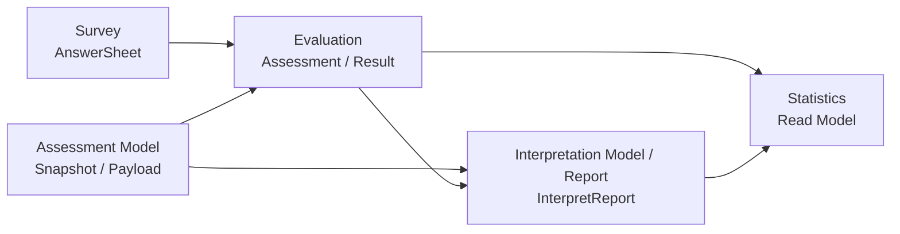

# Interpretation Model / Report 模块文档

> 文档中的 `interpretation-model`，对应当前代码中的 `report` module。
>
> 它是 qs-server 的 **解释模型与报告产出层**：负责把 Evaluation 已经得到的测评结果聚合成最终 `InterpretReport`，并维护报告 builder registry、score-based adapter、personality adapter、解释文案和报告持久化。

---

## 1. 30 秒结论

| 维度 | 结论 |
| ---- | ---- |
| 文档业务名 | `interpretation-model` |
| 当前代码包名 | `internal/apiserver/container/modules/report`、`internal/apiserver/domain/report` |
| 一句话职责 | 管解释模型与最终报告产出，不管答卷提交、测评状态机或模型资产发布 |
| 典型对象 | `InterpretReport`、`ReportBuilder`、`ModelExtra`、score adapter、personality adapter |
| 上游输入 | Evaluation Result / Assessment Outcome / 模型身份 |
| 下游输出 | 持久化的 `InterpretReport`、报告生成事件、供查询和统计使用的报告事实 |

当前代码还没有 `interpretationmodel` 包。阅读代码时请搜索 `report`，阅读业务文档时统一使用 `interpretation-model / report`。

---

## 2. Interpretation Model / Report 管什么

它负责：

```text
InterpretReport；
Report Builder Registry；
Score-based adapter；
Personality adapter；
解释文案；
报告聚合；
报告持久化；
报告生成事件所需 outcome。
```

它不负责：

```text
作答提交；
测评执行状态机；
模型资产发布；
读侧统计；
IAM 登录认证；
周期任务调度。
```

一句话：

> **Evaluation 管一次测评如何执行，Interpretation Model / Report 管执行结果如何变成最终可读报告。**

---

## 3. 当前代码锚点

| 类型 | 路径 |
| ---- | ---- |
| 容器模块 | `internal/apiserver/container/modules/report` |
| 容器描述 | `internal/apiserver/container/modules/report/module.go` |
| 领域聚合 | `internal/apiserver/domain/report/interpret_report.go` |
| 报告 builder | `internal/apiserver/domain/report/builder.go`、`internal/apiserver/domain/report/default_builder.go` |
| score adapter | `internal/apiserver/domain/report/score` |
| personality adapter | `internal/apiserver/domain/report/personality` |
| builder registry 装配 | `internal/apiserver/container/modules/report/assemble.go` |
| 模型 descriptor 到 builder 的物化 | `internal/apiserver/container/modules/assessmentmodel/report_builders.go` |

---

## 4. 与核心链路的关系



关键边界：

- Survey 不直接生成报告。
- Assessment Model 不保存某次报告事实。
- Evaluation 负责执行状态机和结果事实。
- Interpretation Model / Report 负责报告聚合、builder、adapter 和持久化。
- Statistics 可以消费报告事实形成读侧投影，但不反向成为报告事实源。

---

## 5. 文档目录现状

原目录中的 4 篇 `ModelRef / Provider / Context / Registry` 设计文档已归档到 `docs/_archive/2026-07-06-interpretation-provider-design/`。它们只作为历史设计输入，不再作为当前模块事实源。

后续迁移方向是把本目录收口为：

```text
InterpretReport 聚合；
报告 builder 与 adapter；
report module 装配；
新增解释报告模型 SOP。
```

---

## 6. Verify

修改 Interpretation Model / Report 代码或文档后，按范围选择：

```bash
go test ./internal/apiserver/container/modules/report/...
go test ./internal/apiserver/domain/report/...
go test ./internal/apiserver/application/evaluation/...
make docs-hygiene
git diff --check
```
