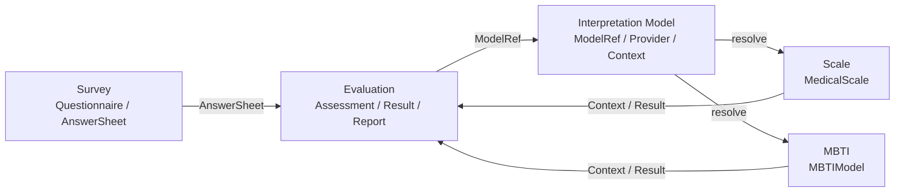
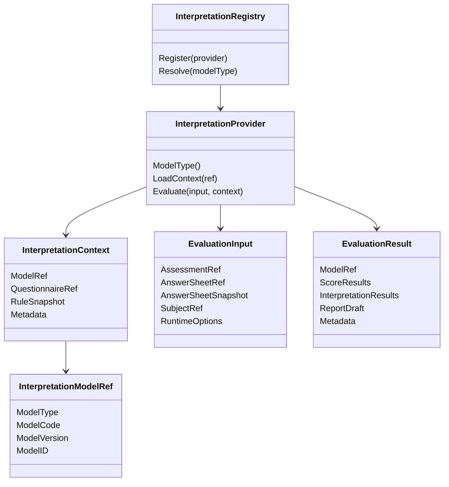

# Interpretation Model 模块文档

> Interpretation Model 是 qs-server 中的 **解释模型抽象层**。
>
> 它不代表某一种具体业务模型，而是定义一类统一抽象：系统如何把用户提交的 `AnswerSheet` 交给不同解释模型进行解释，并将结果返回给 Evaluation 执行引擎。
>
> 当前已落地的解释模型是 Scale；下一阶段计划接入 MBTI。未来 BigFive、职业兴趣测评、儿童发展评估等也可以作为新的解释模型接入。

---

## 1. 结论先行

Interpretation Model 的核心定位是：

> **Interpretation Model 定义“解释模型如何接入 Evaluation”的统一协议；Scale、MBTI、BigFive 等都是它的具体实现。**

它解决的问题不是“某一种模型内部如何设计”，而是：

```text
Evaluation 如何识别要使用哪种解释模型？
Evaluation 如何根据 ModelRef 找到对应 Provider？
Provider 如何加载模型规则上下文？
Provider 如何执行解释逻辑？
不同模型如何返回统一的 EvaluationResult？
新增模型时如何避免修改 Evaluation 主流程？
```

因此，Interpretation Model 这一层的主语不是 `MedicalScale`，也不是 `MBTIModel`。

它的主语是：

```text
ModelRef
Provider
Context
Registry
EvaluationInput
EvaluationResult
```

MedicalScale / ScaleProvider 是当前最重要的示例，但不是抽象本身。

---

## 2. 为什么需要 Interpretation Model 抽象层

早期系统只有医学量表时，可以简单认为：

```text
Survey 提交答卷；
Scale 提供规则；
Evaluation 执行测评。
```

这时 Evaluation 直接依赖 Scale 似乎也能工作。

但当系统准备支持 MBTI 后，问题就出现了。

医学量表通常使用：

```text
MedicalScale
Factor
ScoringSpec
InterpretationRules
RiskLevel
FactorScore
```

而 MBTI 更可能使用：

```text
MBTIModel
Dimension
PreferencePair
TypeCode
TypeProfile
PersonalityTraits
Suggestion
```

如果 Evaluation 继续硬编码 Scale 的概念，就会出现两种坏味道：

```text
第一，把 MBTI 强行塞进 MedicalScale；
第二，在 Evaluation 中写大量 if scale / if mbti 分支。
```

这两种方向都不好。

正确方向是抽象出 Interpretation Model：

```text
Survey 提供答卷事实；
Interpretation Model 提供解释模型协议；
Scale / MBTI / BigFive 实现各自模型；
Evaluation 通过统一协议执行测评。
```

---

## 3. Interpretation Model 在系统中的位置

从完整测评系统看，qs-server 可以拆成四层：

```text
Survey                作答事实层
Interpretation Model  解释模型抽象层
Concrete Models       具体解释模型层，如 Scale / MBTI / BigFive
Evaluation            通用测评执行层
```

关系如下：



这里的核心关系是：

```text
Survey 不知道具体解释模型；
Scale 不知道 Evaluation 状态机；
MBTI 不复用 MedicalScale；
Evaluation 不硬编码 Scale 或 MBTI；
Interpretation Model 负责定义中间协议。
```

---

## 4. Interpretation Model 管什么

Interpretation Model 这一层主要管抽象协议。

它应定义：

```text
ModelType             模型类型，如 scale / mbti / bigfive
InterpretationModelRef 模型引用，指向某个具体模型版本
InterpretationProvider 解释模型提供者接口
InterpretationContext  模型执行上下文
InterpretationRegistry 模型 Provider 注册表
EvaluationInput        Evaluation 传入 Provider 的执行输入
EvaluationResult       Provider 返回的统一执行结果
RuleSnapshot           规则快照或上下文快照
```

它回答的问题是：

```text
如何标识一个解释模型？
如何根据模型类型找到对应 Provider？
如何加载模型规则上下文？
如何执行模型？
如何返回结果？
如何让 Evaluation 主流程保持稳定？
如何新增一个模型而不污染其它模型？
```

---

## 5. Interpretation Model 不管什么

Interpretation Model 不应该吞掉具体模型的领域细节。

它不应该定义：

```text
MedicalScale 的 Factor 如何设计；
Scale 的 ScoringSpec 有哪些策略；
Scale 的 InterpretationRules 区间如何校验；
MBTI 的 E/I、S/N、T/F、J/P 如何计分；
MBTI 的 TypeProfile 如何生成；
BigFive 的五个维度如何解释。
```

这些属于具体模型模块。

Interpretation Model 也不应该负责 Evaluation 的执行状态机。

它不应该定义：

```text
Assessment 状态如何流转；
EvaluationRun 如何记录；
失败如何重试；
InterpretReport 如何持久化；
AssessmentInterpretedEvent 何时发布；
Worker 如何消费答卷提交事件。
```

这些属于 Evaluation 模块。

一句话：

> **Interpretation Model 定义接入协议，不吞并具体模型，也不替代 Evaluation 执行引擎。**

---

## 6. 核心抽象总览

Interpretation Model 的核心抽象可以表示为：



抽象关系：

```text
ModelRef 负责标识模型；
Registry 负责根据 ModelType 找 Provider；
Provider 负责加载 Context 并执行模型；
Context 负责承载规则快照；
EvaluationInput 负责承载本次执行输入；
EvaluationResult 负责承载本次模型执行输出。
```

---

## 7. ModelRef：统一模型引用

`InterpretationModelRef` 是 Evaluation 引用解释模型的统一方式。

它可以抽象为：

```text
InterpretationModelRef
├── ModelType
├── ModelCode
├── ModelVersion
└── ModelID
```

字段语义：

| 字段 | 说明 |
| --- | --- |
| ModelType | 模型类型，如 scale / mbti / bigfive |
| ModelCode | 模型业务编码，如 ADHD_PARENT / MBTI_STANDARD |
| ModelVersion | 模型规则版本，如 1.0.0 |
| ModelID | 模型持久化 ID，可选 |

Scale 场景下：

```text
ModelType    = scale
ModelCode    = ADHD_PARENT
ModelVersion = 1.0.0
ModelID      = medical_scale_id
```

MBTI 场景下：

```text
ModelType    = mbti
ModelCode    = MBTI_STANDARD
ModelVersion = 1.0.0
ModelID      = mbti_model_id
```

ModelRef 的设计目标是：

```text
让 Evaluation 不依赖具体模型类型；
让 Assessment 能追溯当时使用的模型规则；
让失败重试能够加载原始模型，而不是自动使用最新模型；
让不同解释模型可以同级接入。
```

---

## 8. Provider：解释模型提供者

`InterpretationProvider` 是具体解释模型接入 Evaluation 的入口。

可以抽象为：

```go
type InterpretationProvider interface {
    ModelType() ModelType
    LoadContext(ctx context.Context, ref InterpretationModelRef) (InterpretationContext, error)
    Evaluate(ctx context.Context, input EvaluationInput, context InterpretationContext) (EvaluationResult, error)
}
```

Provider 的职责是：

```text
声明自己支持哪种 ModelType；
根据 ModelRef 加载模型规则上下文；
校验模型是否可执行；
根据 EvaluationInput 执行模型；
返回统一 EvaluationResult。
```

Provider 不应该负责：

```text
创建 Assessment；
推进 Assessment 状态机；
保存 InterpretReport；
发布 AssessmentInterpretedEvent；
处理 Worker 重试。
```

这些属于 Evaluation。

---

## 9. Context：解释模型执行上下文

`InterpretationContext` 是 Provider 加载后的模型规则上下文。

它不是领域聚合对象，而是执行快照。

可以抽象为：

```text
InterpretationContext
├── ModelRef
├── QuestionnaireRef
├── RuleSnapshot
├── LoadedAt
└── Metadata
```

Scale 场景下，Context 可以是：

```text
EvaluationScaleContext
├── ScaleRef
├── QuestionnaireRef
├── FactorSnapshots
├── ScoringSpecSnapshots
└── InterpretationRulesSnapshots
```

MBTI 场景下，Context 可以是：

```text
MBTIContext
├── ModelRef
├── QuestionnaireRef
├── Dimensions
├── ScoringRules
├── TypeProfiles
└── ReportTemplates
```

Context 的关键要求：

```text
只读；
深拷贝；
可缓存；
可追溯；
不暴露具体模型聚合的可变指针；
不包含本次执行结果。
```

---

## 10. EvaluationInput：执行输入

`EvaluationInput` 是 Evaluation 交给 Provider 的本次执行输入。

它应该包含：

```text
EvaluationInput
├── AssessmentRef
├── AnswerSheetRef
├── AnswerSheetSnapshot
├── SubjectRef
├── QuestionnaireRef
├── RuntimeOptions
└── TraceContext
```

其中：

```text
AssessmentRef       标识本次测评执行；
AnswerSheetRef      标识本次答卷；
AnswerSheetSnapshot 承载只读答卷事实；
SubjectRef          标识受试者或用户；
QuestionnaireRef    标识答卷基于哪份问卷版本；
RuntimeOptions      控制是否生成报告、是否开启调试等；
TraceContext        用于日志和链路追踪。
```

Provider 可以读取这些输入，但不能修改 Assessment 状态，也不能直接保存报告。

---

## 11. EvaluationResult：统一结果返回

不同解释模型的内部结果不同，但对 Evaluation 应返回统一结果结构。

可以抽象为：

```text
EvaluationResult
├── AssessmentRef
├── ModelRef
├── ScoreResults
├── InterpretationResults
├── ProfileResults
├── ReportDraft
├── RuleSnapshotRef
├── Metadata
└── Events
```

Scale 可能返回：

```text
FactorScore[]
TotalScore
RiskLevelResult[]
InterpretationResult[]
ReportDraft
```

MBTI 可能返回：

```text
DimensionScores
TypeCode
TypeProfile
PersonalityTraits
Suggestions
ReportDraft
```

统一结果结构的目标不是强行让所有模型结果完全一样，而是让 Evaluation 可以稳定处理：

```text
保存结果；
生成报告；
推进 Assessment 状态；
发布测评完成事件；
记录失败或重试。
```

---

## 12. Registry：模型注册与解析

`InterpretationRegistry` 是 Provider 注册表。

它负责：

```text
注册 ScaleProvider；
注册 MBTIProvider；
根据 ModelType 解析 Provider；
避免 Evaluation 直接依赖具体模型；
在启动时检查模型类型是否重复注册。
```

可以抽象为：

```go
type InterpretationRegistry interface {
    Register(provider InterpretationProvider) error
    Resolve(modelType ModelType) (InterpretationProvider, error)
}
```

运行时关系：

```text
Evaluation receives Assessment.ModelRef
    ↓
Registry.Resolve(ModelRef.ModelType)
    ↓
Provider.LoadContext(ModelRef)
    ↓
Provider.Evaluate(input, context)
```

这个注册表是 Evaluation 通用化的关键。

---

## 13. 当前实现示例：ScaleProvider / MedicalScale

当前 qs-server 最重要的解释模型实现是 Scale。

它在 Interpretation Model 抽象下可以映射为：

```text
ModelType     scale
ModelRef      MedicalScaleRef
Provider      ScaleProvider
Context       EvaluationScaleContext
Evaluator     MedicalScaleEvaluator
Result        FactorScore / InterpretationResult / ReportDraft
```

ScaleProvider 的职责：

```text
根据 ModelRef 调用 ScaleQueryService；
加载 published MedicalScale 的规则快照；
返回 EvaluationScaleContext；
调用 MedicalScaleEvaluator 执行医学量表评分与解释；
返回标准 EvaluationResult。
```

ScaleProvider 不应该：

```text
修改 MedicalScale；
保存 FactorScore；
保存 InterpretReport；
推进 Assessment 状态机；
发布 AssessmentInterpretedEvent。
```

这些仍属于 Scale 或 Evaluation 各自边界。

---

## 14. 未来示例：MBTIProvider / MBTIModel

MBTI 不应该放进 Scale。

它应该作为新的解释模型实现：

```text
ModelType     mbti
ModelRef      MBTIModelRef
Provider      MBTIProvider
Context       MBTIContext
Evaluator     MBTIEvaluator
Result        TypeCode / DimensionScores / TypeProfile / ReportDraft
```

MBTIProvider 的职责可能是：

```text
根据 ModelRef 加载 MBTIModel；
加载四组维度和计分规则；
读取 AnswerSheet 中对应题目答案；
计算 E/I、S/N、T/F、J/P 四组倾向；
解析最终 TypeCode；
加载 TypeProfile；
返回统一 EvaluationResult。
```

与 Scale 的区别：

```text
Scale 使用 Factor / ScoringSpec / RiskLevel；
MBTI 使用 Dimension / PreferencePair / TypeCode / TypeProfile；
二者内部模型不同；
二者对 Evaluation 暴露统一 Provider 协议。
```

这正是 Interpretation Model 抽象层存在的意义。

---

## 15. 文档目录

Interpretation Model 模块建议维护四篇文档。

```text
README.md
01-解释模型抽象--ModelRef-Provider-Context模型设计.md
02-解释模型接入链路--注册-加载-执行-结果返回.md
03-新增解释模型链路--以MBTI接入为例.md
04-解释模型分层架构与事实源索引.md
```

各篇职责如下：

| 文档 | 核心主题 |
| --- | --- |
| README.md | Interpretation Model 定位、边界、文档导航 |
| 01 | ModelRef / Provider / Context / Registry / Result 模型设计 |
| 02 | 解释模型注册、加载、执行、结果返回链路 |
| 03 | 以 MBTI 为例说明新增模型接入流程 |
| 04 | 分层架构、事实源索引、修改检查清单、架构护栏 |

推荐阅读顺序：

```text
README -> 01 -> 02 -> 03 -> 04
```

---

## 16. 01 篇：解释模型抽象设计

`01-解释模型抽象--ModelRef-Provider-Context模型设计.md` 负责讲清楚抽象模型。

它重点回答：

```text
什么是 Interpretation Model？
什么是 ModelType？
什么是 InterpretationModelRef？
Provider 接口应该如何设计？
Context 与领域聚合有什么区别？
EvaluationInput 与 EvaluationResult 如何定义？
Registry 如何让 Evaluation 避免硬编码具体模型？
```

这篇文档的主语是抽象层。

MedicalScale 可以作为示例，但不能作为抽象本身。

---

## 17. 02 篇：解释模型接入链路

`02-解释模型接入链路--注册-加载-执行-结果返回.md` 负责讲清楚一个解释模型如何被 Evaluation 使用。

它重点回答：

```text
Provider 如何注册？
Evaluation 如何根据 ModelRef 解析 Provider？
Provider 如何加载 Context？
Evaluation 如何校验 AnswerSheet 与 Context 的 QuestionnaireRef？
Provider 如何执行模型？
不同模型如何返回统一 EvaluationResult？
Evaluation 如何保存结果和报告？
```

这篇建议采用：

```text
通用抽象先行；
MedicalScale / ScaleProvider 作为贯穿案例；
MBTIProvider 作为对照案例。
```

不要写成单纯的“MedicalScale 接入 Evaluation”。

---

## 18. 03 篇：新增解释模型链路

`03-新增解释模型链路--以MBTI接入为例.md` 负责讲清楚新增模型的落地路径。

它重点回答：

```text
为什么 MBTI 不放进 Scale？
MBTI 模型应该如何设计？
MBTIProvider 如何实现 Provider 协议？
MBTI 如何绑定 QuestionnaireVersion？
MBTI 如何返回 EvaluationResult？
新增模型需要修改哪些代码、测试和文档？
```

这篇是未来接入 MBTI 的设计入口。

---

## 19. 04 篇：分层架构与事实源索引

`04-解释模型分层架构与事实源索引.md` 是 Interpretation Model 的维护地图。

它重点回答：

```text
抽象接口事实源在哪里？
Provider 注册事实源在哪里？
ScaleProvider / MBTIProvider 各自事实源在哪里？
Evaluation 与 Provider 的集成点在哪里？
新增模型要同步哪些测试和文档？
哪些架构护栏不能破？
```

---

## 20. 与其它模块的边界

### 20.1 与 Survey 的边界

Survey 提供作答事实。

Interpretation Model 只要求统一输入中包含：

```text
AnswerSheetSnapshot
QuestionnaireRef
```

但它不定义：

```text
Questionnaire 聚合；
AnswerSheet 提交流程；
AnswerValue 校验规则；
SubmissionSpec。
```

这些属于 Survey。

### 20.2 与 Scale 的边界

Scale 是 Interpretation Model 的一种实现。

Interpretation Model 不深入定义：

```text
MedicalScale；
Factor；
ScoringSpec；
InterpretationRules；
RiskLevel。
```

这些属于 Scale。

### 20.3 与 MBTI 的边界

MBTI 是未来的具体解释模型。

Interpretation Model 不深入定义：

```text
E/I、S/N、T/F、J/P 维度；
TypeCode；
TypeProfile；
人格画像规则。
```

这些属于 MBTI。

### 20.4 与 Evaluation 的边界

Evaluation 是执行引擎。

Interpretation Model 不负责：

```text
Assessment 状态机；
EvaluationRun；
失败重试；
Report 持久化；
事件出站。
```

这些属于 Evaluation。

---

## 21. 核心架构护栏

### 21.1 不以 MedicalScale 定义抽象

错误方向：

```text
InterpretationModel = MedicalScale
Context = EvaluationScaleContext
Result = FactorScore + RiskLevelResult
```

正确方向：

```text
MedicalScale 是 ScaleProvider 的具体实现案例；
InterpretationModel 是更高一层抽象。
```

### 21.2 不把 MBTI 塞进 Scale

错误方向：

```text
MedicalScale 增加 MBTIType；
Factor 表达 E/I、S/N、T/F、J/P；
RiskLevel 表达人格类型。
```

正确方向：

```text
MBTI 独立建模，并通过 MBTIProvider 接入 Evaluation。
```

### 21.3 Evaluation 不硬编码具体模型

错误方向：

```text
EvaluationEngine 中 if modelType == scale { ... } else if modelType == mbti { ... }
```

正确方向：

```text
Registry.Resolve(modelType)
Provider.LoadContext(...)
Provider.Evaluate(...)
```

### 21.4 Provider 不推进 Assessment 状态

Provider 只负责模型执行。

Assessment 状态推进属于 Evaluation。

### 21.5 Context 不暴露可变聚合

Context 应是只读快照，不应该把 `*MedicalScale` 或 `*MBTIModel` 可变指针直接交给 Evaluation。

---

## 22. 后续演进方向

Interpretation Model 后续演进方向包括：

```text
ModelRef 标准化；
Provider Registry 落地；
ScaleProvider 从 Evaluation 中抽出；
MBTIProvider 接入；
EvaluationResult 统一结构设计；
RuleSnapshot / ContextSnapshot 持久化；
Provider 契约测试；
新增模型 SOP 文档化。
```

推荐演进顺序：

```text
第一步：文档确立抽象和边界；
第二步：在 Evaluation 中引入 ModelRef；
第三步：把当前 Scale 测评执行封装为 ScaleProvider；
第四步：引入 Registry；
第五步：新增 MBTIProvider；
第六步：统一 EvaluationResult 和 ReportBuilder。
```

---

## 23. 宣讲口径

### 23.1 30 秒版本

```text
Interpretation Model 是 qs-server 的解释模型抽象层，用来让 Scale、MBTI、BigFive 等不同模型以统一方式接入 Evaluation。
它定义 ModelRef、Provider、Context、Registry、EvaluationInput 和 EvaluationResult。
Evaluation 不直接硬编码 Scale 或 MBTI，而是根据 ModelRef 找到对应 Provider，由 Provider 加载规则上下文并执行模型。
```

### 23.2 3 分钟版本

```text
早期系统只有医学量表，所以 Evaluation 可以直接依赖 Scale。但下一阶段我们要支持 MBTI，MBTI 和 Scale 在领域模型上差异很大：Scale 有 Factor、ScoringSpec 和 RiskLevel，MBTI 有维度、人格类型和画像规则。如果继续让 Evaluation 硬编码 Scale，MBTI 就只能被迫塞进 MedicalScale，或者在 Evaluation 中写大量分支。

所以我们抽象出 Interpretation Model。它不代表具体模型，而是一套接入协议。Evaluation 通过 InterpretationModelRef 标识要使用的模型，比如 scale/ADHD_PARENT/1.0.0 或 mbti/MBTI_STANDARD/1.0.0。启动时各模型注册自己的 Provider，Evaluation 运行时根据 ModelType 找到 Provider，再让 Provider 加载 Context 并执行模型。

这样 ScaleProvider 可以内部加载 MedicalScale，计算 FactorScore 和解释结果；MBTIProvider 可以内部加载 MBTIModel，计算四组维度和人格类型。二者内部模型不同，但对 Evaluation 暴露统一入口，返回统一 EvaluationResult。

这样 Evaluation 就能从医学量表专用执行器升级为通用测评执行引擎。
```

---

## 24. 最终判断

Interpretation Model 的文档目标不是把抽象写复杂，而是守住一个核心边界：

> **具体解释模型可以不同，但 Evaluation 的接入方式必须统一。**

因此，本目录的文档主线是：

```text
抽象模型；
接入链路；
新增模型；
事实源索引。
```

一句话收束：

> **MedicalScale 是当前最重要的样例，但 Interpretation Model 的主语不是 MedicalScale，而是 ModelRef / Provider / Context / Registry 这一套统一接入协议。**
