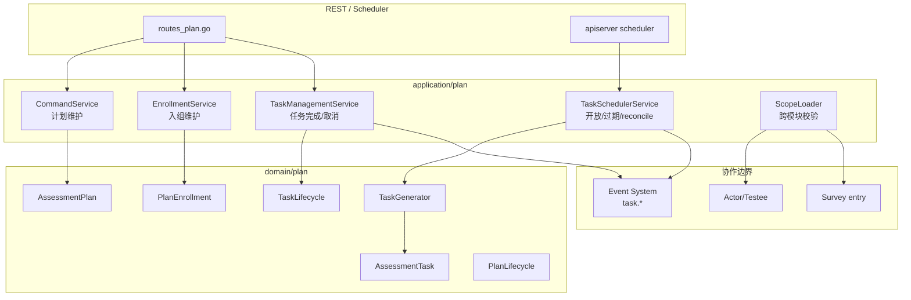
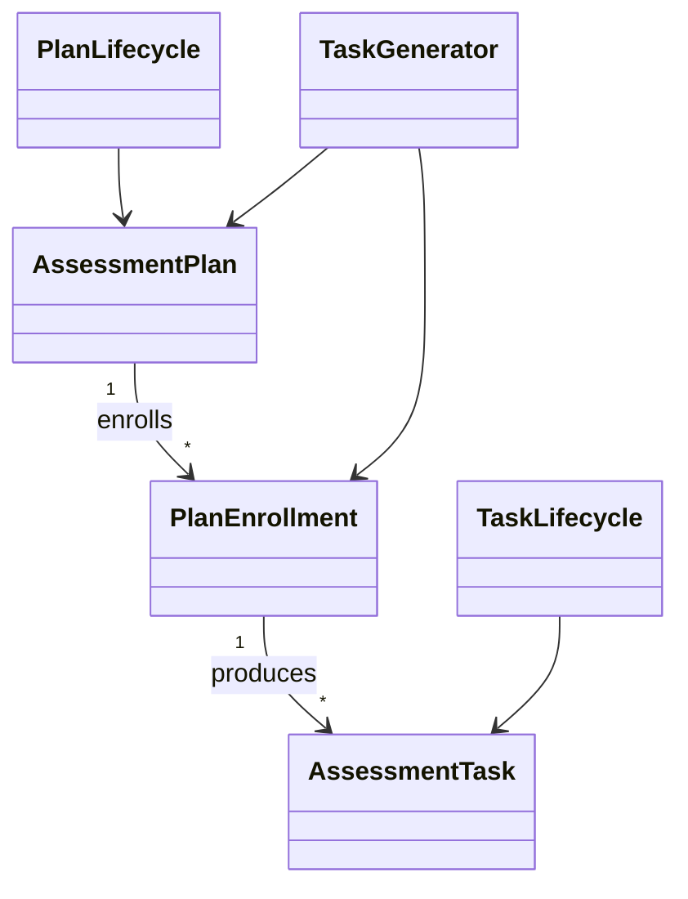

# Plan 整体模型

**本文回答**：Plan 模块要解决什么编排问题，它的聚合、状态机、应用服务和跨模块边界如何设计，以及为什么 Plan 不直接创建 Assessment。

## 30 秒结论

| 聚合 / 对象 | 职责 |
| ----------- | ---- |
| `AssessmentPlan` | 计划模板、适用机构、量表/问卷、周期 |
| `PlanEnrollment` | 受试者入组关系 |
| `AssessmentTask` | 一次应完成的计划任务 |

Plan 的核心职责是把“谁应该在什么时候完成什么测评”建模成可调度的业务事实。它不拥有答卷、评估结果或报告；它只维护计划、入组和任务。

## 模块要解决什么问题

没有 Plan 时，系统只能处理一次性答卷或一次性评估；但真实业务需要周期测评、定时开放、过期、取消、提醒和补偿。Plan 模块解决的是“长期编排”问题：

| 问题 | Plan 的回答 |
| ---- | ----------- |
| 谁需要被持续跟踪 | `PlanEnrollment` 记录受试者入组 |
| 什么时候产生任务 | `AssessmentPlan` 的周期和调度规则 |
| 当前要做哪一次 | `AssessmentTask` 是运行时任务单元 |
| 任务如何流转 | `TaskLifecycle` 控制开放、完成、过期、取消 |
| 如何通知外部 | `task.*` 事件进入 Event System |

Plan 不是 Evaluation 的子模块。Evaluation 关心“某一次测评如何产出结果”；Plan 关心“某个受试者在一段时间内应该出现哪些测评任务”。

## 架构设计



`TaskSchedulerService` 是应用服务，不是领域对象。它负责在 scheduler tick 中加载待处理任务、调用领域生命周期、发布事件。领域层只表达状态转移和不变量。

## 领域模型设计



| 模型 | 类型 | 职责 |
| ---- | ---- | ---- |
| `AssessmentPlan` | 聚合根 | 描述计划模板、周期、目标范围和生命周期 |
| `PlanEnrollment` | 实体 / 关系 | 表示某个受试者被纳入某个计划 |
| `AssessmentTask` | 运行时实体 | 表示一次具体待完成的任务 |
| `PlanLifecycle` | 领域服务 / 状态机 | 控制计划启用、停用等状态转移 |
| `TaskLifecycle` | 领域服务 / 状态机 | 控制任务开放、完成、过期、取消 |
| `TaskGenerator` | 领域服务 | 根据计划和入组关系生成任务 |

这个模型故意把 Plan 和 Task 拆开。Plan 是“模板和规则”，Task 是“某次执行”。如果只用 Plan 表示所有状态，周期任务会把“计划是否有效”和“某次任务是否完成”混在一起，后续补偿和查询都会变复杂。

## 设计模式应用

| 模式 | 源码落点 | 作用 |
| ---- | -------- | ---- |
| 状态机 | `PlanLifecycle`、`TaskLifecycle` | 防止任务从任意状态跳转到任意状态 |
| 领域服务 | `TaskGenerator` | 任务生成依赖计划、入组、时间窗口，跨实体不变量不适合放进单个实体 |
| 应用服务编排 | `TaskSchedulerService`、`TaskManagementService` | 把 repository、事件和领域生命周期连接起来 |
| 防腐边界 | `ScopeLoader` | Plan 只引用 Actor/Survey 的必要身份，不拥有对方模型 |
| Outbox / Event Runtime | `task.*` delivery | 任务状态变化对外通知，但不让通知成为状态权威 |

## 为什么这样设计

Plan 不直接创建 Assessment，是为了避免把“计划任务存在”与“测评已经开始”混为一谈。一个任务开放后，受试者可能还没有作答；作答后才进入 Survey 和 Evaluation。Plan 只负责给出入口和时间约束，Evaluation 负责评估产出。

替代方案是让 Plan 在任务开放时直接创建 Assessment。这个方案会让后续查询简单，但会制造大量“未真正开始”的 Assessment，并且让 Evaluation 状态机承担计划调度语义。当前设计选择晚绑定：任务开放后通过 Survey/提交链路自然进入 Evaluation。

## 取舍与边界

| 取舍 | 当前选择 | 代价 |
| ---- | -------- | ---- |
| Task 是独立运行时实体 | 任务状态可单独补偿和查询 | 需要 scheduler 和 lifecycle 协调 |
| Plan 不拥有 Assessment | 模块边界清晰 | 跨模块报表需要组合 Plan 与 Evaluation |
| `task.*` 是通知事件 | worker 可以异步通知 | 通知失败不应改变任务状态 |
| Scheduler 负责推进时间状态 | 业务状态和时间 tick 解耦 | 多实例需要 leader lock 避免重复推进 |

## 代码锚点

- Plan domain：[domain/plan](../../../internal/apiserver/domain/plan/)
- Plan application：[application/plan](../../../internal/apiserver/application/plan/)
- Plan routes：[routes_plan.go](../../../internal/apiserver/transport/rest/routes_plan.go)

## Verify

```bash
go test ./internal/apiserver/domain/plan ./internal/apiserver/application/plan
```
