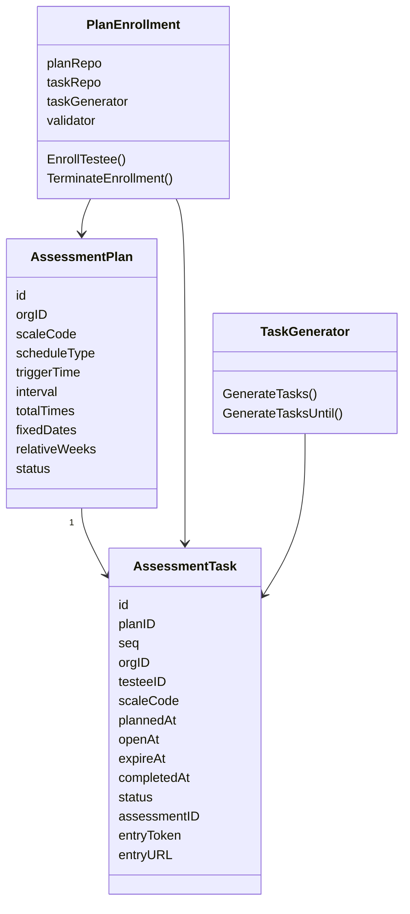
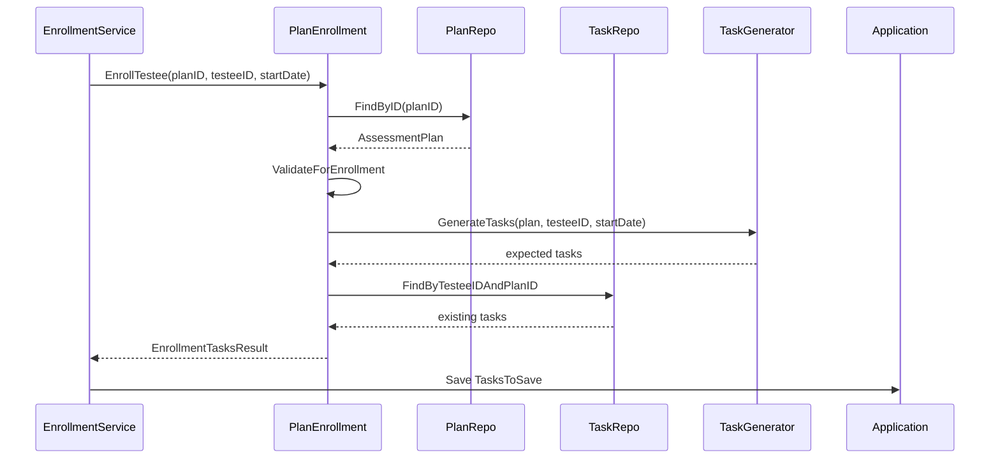
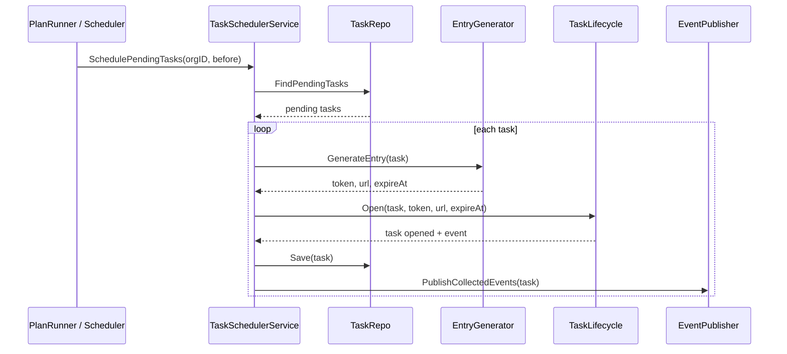

# Plan 整体模型

**本文回答**：Plan 模块要解决什么业务编排问题；`AssessmentPlan`、`PlanEnrollment`、`AssessmentTask`、`TaskGenerator`、`TaskLifecycle` 分别负责什么；Plan 为什么不直接创建 Assessment；它如何与 Actor、Survey、Evaluation、Scheduler 和 Event System 协作。

---

## 30 秒结论

| 维度 | 结论 |
| ---- | ---- |
| 模块定位 | Plan 是 qs-server 的**周期测评编排域**，负责“谁应该在什么时候完成什么测评” |
| 核心模板 | `AssessmentPlan` 是计划模板，定义测什么、怎么排期、周期策略和计划状态，不绑定具体受试者 |
| 入组服务 | `PlanEnrollment` 控制受试者加入计划，并根据计划和 startDate 生成或调和任务 |
| 运行实例 | `AssessmentTask` 是一次具体应测实例，即某个受试者的第 N 次任务 |
| 调度执行 | `TaskSchedulerService` 扫描待开放/过期任务，生成入口、推进任务状态并发布 `task.*` 事件 |
| 状态边界 | Plan 管计划状态，Task 管单次任务状态；二者不能混成一个对象 |
| 跨模块边界 | Plan 引用 Testee、Scale、Entry，但不保存答卷、不创建报告、不拥有 Assessment |
| 事件边界 | `task.opened / completed / expired / canceled` 当前是任务状态通知，不是 Assessment 主链路事件 |
| 关键取舍 | Plan 不在任务开放时直接创建 Assessment；Assessment 应在用户作答提交后由 Survey/Evaluation 链路自然产生 |

一句话概括：

> **Plan 定义周期任务和时间窗口，Survey 负责作答事实，Evaluation 负责测评结果。Plan 不应该把“任务应做”提前变成“测评已发生”。**

---

## 1. Plan 要解决什么问题

没有 Plan 时，系统只能处理一次性的答卷和评估：

```text
用户打开入口
  -> 提交答卷
  -> 生成测评
  -> 生成报告
```

但真实业务里经常需要：

- 某个受试者加入长期干预计划。
- 每 2 周做一次量表。
- 第 2、4、8、12、18 周做随访测评。
- 到时间后开放任务。
- 超过截止时间未完成则过期。
- 医生或系统取消某个任务。
- 用户提交答卷后标记任务完成。
- 任务状态变化需要通知或统计。

Plan 模块解决的就是这个“长期编排”问题。

---

## 2. Plan 的核心模型



### 2.1 AssessmentPlan

`AssessmentPlan` 是周期测评策略模板。

源码注释明确说明：

```text
AssessmentPlan 代表“周期性测评策略模板”，不关联具体的受试者。
```

它的职责是：

| 职责 | 说明 |
| ---- | ---- |
| 描述“测什么” | 当前通过 `scaleCode` 绑定量表 |
| 描述“什么时候测” | scheduleType、interval、totalTimes、fixedDates、relativeWeeks |
| 管理计划生命周期 | active、paused、finished、canceled |
| 不管理单次完成情况 | 每次是否完成由 AssessmentTask 管 |

### 2.2 PlanEnrollment

`PlanEnrollment` 是受试者加入计划的领域服务。

它负责：

1. 查询计划。
2. 校验受试者、startDate 和计划可加入性。
3. 调用 `TaskGenerator.GenerateTasks` 生成期望任务。
4. 查询已有任务，实现 enroll 幂等。
5. 如果已有任务与新 startDate 或计划定义冲突，则返回错误。
6. 返回 `EnrollmentTasksResult`，由应用层保存。

它是领域服务，不直接持久化。源码注释明确说明：领域层不负责持久化，持久化由应用层负责。

### 2.3 AssessmentTask

`AssessmentTask` 是计划分解后的“应测实例”，即第 N 次测评任务。

它保存：

| 字段 | 说明 |
| ---- | ---- |
| `planID` | 来源计划 |
| `seq` | 第几次测评 |
| `orgID` | 机构 ID，查询优化与权限控制 |
| `testeeID` | 受试者 |
| `scaleCode` | 量表编码，查询优化 |
| `plannedAt` | 计划时间 |
| `openAt` | 实际开放时间 |
| `expireAt` | 截止时间 |
| `completedAt` | 完成时间 |
| `status` | pending / opened / completed / expired / canceled |
| `assessmentID` | 完成后关联的 Assessment |
| `entryToken / entryURL` | 开放后生成的入口 |

Task 是运行时对象，不是计划模板。

---

## 3. Plan 与 Task 为什么必须拆开

如果只用 `AssessmentPlan` 表示所有信息，会混淆两个层级：

| 层级 | 问题 | 对象 |
| ---- | ---- | ---- |
| 计划层 | 这个计划是否有效、如何排期、总共几次 | AssessmentPlan |
| 任务层 | 某个受试者第 N 次是否开放、完成、过期 | AssessmentTask |

拆开后：

```text
AssessmentPlan = 规则/模板
AssessmentTask = 执行实例
```

这样做的收益：

- 一个 Plan 可以服务多个 Testee。
- 同一个 Testee 可以有多次 Task。
- 每次 Task 可以单独开放、完成、过期、取消。
- Plan 暂停/取消不会污染已完成 Task 的历史事实。
- 查询“某个受试者当前该做什么”更直接。

---

## 4. 计划状态与任务状态

### 4.1 PlanStatus

```text
active
paused
finished
canceled
```

| 状态 | 语义 |
| ---- | ---- |
| `active` | 计划正在执行 |
| `paused` | 计划暂停，可恢复 |
| `finished` | 管理员手动结束，不再允许新的加入和任务继续推进 |
| `canceled` | 已取消，不可恢复 |

### 4.2 TaskStatus

```text
pending
opened
completed
expired
canceled
```

| 状态 | 语义 |
| ---- | ---- |
| `pending` | 任务已创建，但未到开放时间 |
| `opened` | 已生成入口，用户可以填写 |
| `completed` | 用户已提交答卷并关联 Assessment |
| `expired` | 超过截止时间未完成 |
| `canceled` | 任务被取消 |

### 4.3 二者关系

Plan 的状态影响 Task 的调度，但不等于 Task 状态。

例如：

| 场景 | 处理 |
| ---- | ---- |
| Plan active | pending task 可被 scheduler 打开 |
| Plan paused | 不应继续打开新任务 |
| Plan finished/canceled | pending/opened task 可能被取消 |
| Task completed | 不应因为 Plan 状态变化被改写 |

---

## 5. 调度类型

`PlanScheduleType` 当前支持：

| 类型 | 字符串 | 说明 |
| ---- | ------ | ---- |
| 按周 | `by_week` | 每 N 周一次 |
| 按天 | `by_day` | 每 N 天一次 |
| 固定日期 | `fixed_date` | 指定日期列表 |
| 自定义周次 | `custom` | 相对于 startDate 的周次，如 2、4、8、12、18 |

此外还有：

| 字段 | 说明 |
| ---- | ---- |
| `triggerTime` | 任务触发时间，格式 HH:MM:SS |
| `interval` | by_week / by_day 的间隔 |
| `totalTimes` | by_week / by_day 的总次数 |
| `fixedDates` | fixed_date 使用 |
| `relativeWeeks` | custom 使用 |

### 5.1 相对时间与绝对时间

Plan 的设计注释里强调：大部分周期策略是相对时间窗口，不是绝对日期。

例如：

```text
startDate = 2026-05-01
relativeWeeks = [2,4,8]
```

生成任务：

```text
第 1 次：startDate + 2周
第 2 次：startDate + 4周
第 3 次：startDate + 8周
```

这使同一个 Plan 可以复用给不同入组时间的 Testee。

---

## 6. 任务生成链路



关键点：

- 生成任务时基于 `AssessmentPlan` 和 `startDate`。
- Enrollment 会检查已有任务，支持幂等。
- 如果已有任务和期望任务冲突，返回错误。
- 领域层不保存任务，应用层保存。

---

## 7. 任务开放链路



`TaskSchedulerService` 是应用服务，不是领域对象。它负责：

- 扫描 pending tasks。
- 检查父 plan 是否 active。
- 生成 entry。
- 调用 `TaskLifecycle.Open`。
- 保存 task。
- 发布 task.opened 事件。
- 处理 expired tasks。
- 取消非 active plan 下的任务。

---

## 8. Plan 为什么不直接创建 Assessment

这是 Plan 的核心边界。

一个 Task opened 只表示：

```text
到了应该测评的时间，系统开放了入口。
```

它不表示：

```text
用户已经作答
答卷已经提交
Assessment 已经创建
报告已经生成
```

如果 Plan 在任务开放时直接创建 Assessment，会产生大量“未真正开始”的 Assessment，并让 Evaluation 承担计划调度语义。

当前更合理的链路是：

```text
Task opened
  -> 用户通过 entry 填写
  -> Survey 提交 AnswerSheet
  -> Evaluation 创建 Assessment
  -> Task completed 关联 assessmentID
```

Plan 只负责“应做任务”，不负责“测评结果”。

---

## 9. 与其它模块的协作

| 模块 | 协作方式 | 边界 |
| ---- | -------- | ---- |
| Actor/Testee | Task 持有 testeeID；Enrollment 基于 testee 入组 | Plan 不维护 Testee 档案 |
| Scale | Plan 持有 scaleCode | Plan 不定义量表规则 |
| AssessmentEntry | Scheduler 生成 entryToken/entryURL | Plan 不拥有 Entry 聚合主数据 |
| Survey | 用户通过入口提交答卷 | Plan 不保存 AnswerSheet |
| Evaluation | 任务完成后关联 assessmentID | Plan 不保存报告或风险结果 |
| Event | task.* 事件通知外部 | task 事件不替代 Assessment 事件 |
| Scheduler | 定时扫描推进任务 | 领域层不依赖 cron/Redis lock |

---

## 10. Plan 的事件边界

`AssessmentTask` 在状态变化时会添加领域事件：

| 事件 | 触发 |
| ---- | ---- |
| `task.opened` | task 从 pending 打开为 opened |
| `task.completed` | task 从 opened 完成为 completed |
| `task.expired` | opened 超时为 expired |
| `task.canceled` | 非终态任务取消 |

根据事件契约，task 事件当前是 `best_effort`。这意味着：

- 它们适合通知、提醒、轻量投影。
- 它们不应作为主业务强一致推进命令。
- 任务状态事实以 Task repository 为准。

---

## 11. 设计模式

| 模式 | 当前实现 | 意图 |
| ---- | -------- | ---- |
| Template / Strategy | AssessmentPlan scheduleType | 不同排期策略统一由 TaskGenerator 处理 |
| State Machine | PlanStatus / TaskStatus + lifecycle | 控制计划和任务状态迁移 |
| Domain Service | PlanEnrollment / TaskGenerator | 跨实体规则不塞进单个实体 |
| Application Service | TaskSchedulerService | 编排 repository、entry、event、领域生命周期 |
| Anti-corruption | ScopeLoader / EntryGenerator ports | 与 Actor/Survey/Evaluation 保持边界 |
| Event Notification | task.* | 任务状态变更通知外部 |
| Scheduler Runner | apiserver runtime scheduler | 时间驱动不进入领域模型 |

---

## 12. 设计取舍

| 设计 | 收益 | 代价 |
| ---- | ---- | ---- |
| Plan 是模板 | 多受试者复用 | 需要 Enrollment 生成任务 |
| Task 独立实体 | 单次任务状态清楚 | 需要 scheduler 扫描 |
| 入组时一次性生成任务 | 查询简单、可预见 | 长周期大量任务可能增加存储 |
| GenerateTasksUntil 预留 | 可支持滚动生成 | 实现复杂度更高 |
| Plan 不创建 Assessment | 模块边界清晰 | 需要跨模块把 task 完成与 assessment 关联 |
| task 事件 best_effort | 通知轻量 | 不适合强一致依赖 |

---

## 13. 常见误区

### 13.1 “Plan 就是 Assessment 的定时创建器”

错误。Plan 只创建 Task，不应在开放任务时直接创建 Assessment。

### 13.2 “Task opened 就表示测评开始了”

不准确。opened 只是入口可填写。测评开始通常要等 AnswerSheet 提交并创建 Assessment。

### 13.3 “PlanEnrollment 是一张表”

当前实现是领域服务。它负责入组逻辑和任务生成调和，不是简单数据表。

### 13.4 “task.* 事件是强一致主链路事件”

当前 task 事件是 best_effort，应作为通知/投影事件，不作为强一致命令。

### 13.5 “Plan 修改后可以直接改历史任务”

需要谨慎。已完成任务是历史事实，不应随意被新计划规则覆盖。

---

## 14. 代码锚点

### Domain

- AssessmentPlan：[../../../internal/apiserver/domain/plan/assessment_plan.go](../../../internal/apiserver/domain/plan/assessment_plan.go)
- AssessmentTask：[../../../internal/apiserver/domain/plan/assessment_task.go](../../../internal/apiserver/domain/plan/assessment_task.go)
- PlanEnrollment：[../../../internal/apiserver/domain/plan/plan_enrollment.go](../../../internal/apiserver/domain/plan/plan_enrollment.go)
- TaskGenerator：[../../../internal/apiserver/domain/plan/task_generator.go](../../../internal/apiserver/domain/plan/task_generator.go)
- Plan types：[../../../internal/apiserver/domain/plan/types.go](../../../internal/apiserver/domain/plan/types.go)

### Application

- CommandService：[../../../internal/apiserver/application/plan/command_service.go](../../../internal/apiserver/application/plan/command_service.go)
- EnrollmentService：[../../../internal/apiserver/application/plan/enrollment_service.go](../../../internal/apiserver/application/plan/enrollment_service.go)
- TaskSchedulerService：[../../../internal/apiserver/application/plan/task_scheduler_service.go](../../../internal/apiserver/application/plan/task_scheduler_service.go)

### Runtime / Contract

- Scheduler runner：[../../../internal/apiserver/runtime/scheduler/plan_scheduler.go](../../../internal/apiserver/runtime/scheduler/plan_scheduler.go)
- Plan routes：[../../../internal/apiserver/transport/rest/routes_plan.go](../../../internal/apiserver/transport/rest/routes_plan.go)
- Event catalog：[../../../configs/events.yaml](../../../configs/events.yaml)

---

## 15. Verify

```bash
go test ./internal/apiserver/domain/plan
go test ./internal/apiserver/application/plan
```

如果修改 scheduler：

```bash
go test ./internal/apiserver/runtime/scheduler
```

如果修改 task 事件：

```bash
go test ./internal/pkg/eventcatalog
go test ./internal/worker/handlers
```

---

## 16. 下一跳

| 目标 | 文档 |
| ---- | ---- |
| 理解计划和任务状态 | [01-计划任务状态机.md](./01-计划任务状态机.md) |
| 理解调度与通知 | [02-调度与通知事件.md](./02-调度与通知事件.md) |
| 理解跨模块协作 | [03-跨模块协作.md](./03-跨模块协作.md) |
| 新增计划能力 | [04-新增计划能力SOP.md](./04-新增计划能力SOP.md) |
