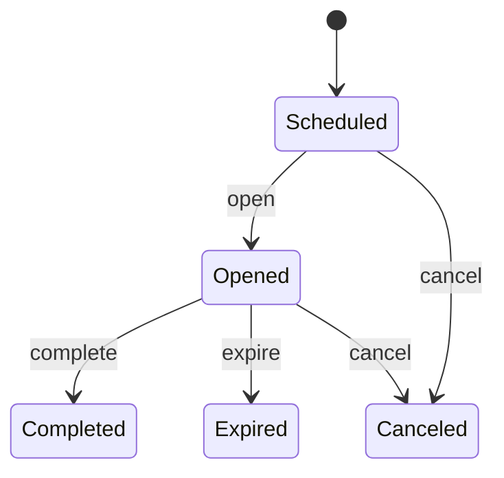
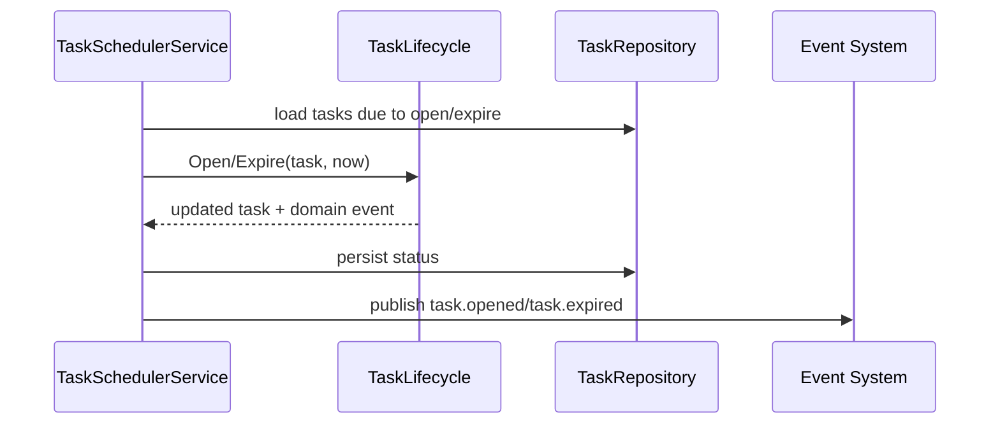

# Plan 任务状态机

**本文回答**：任务如何开放、完成、过期、取消，以及这些状态如何驱动事件。

## 30 秒结论

`AssessmentTask` 是计划执行的运行时单元；它的状态变化会触发 `task.opened / completed / expired / canceled`。状态机的职责是保护任务不被应用服务随意改状态。

## 状态机要解决什么问题

任务状态不是普通字段。它承载三个业务含义：受试者当前是否可作答、通知系统应该发什么消息、统计和运营应该如何理解任务结果。如果没有状态机保护，应用层很容易出现“已过期任务被完成”“已完成任务又取消”“未开放任务被通知”等错误。

| 状态 | 业务含义 | 典型触发 |
| ---- | -------- | -------- |
| `Scheduled` | 已生成但未到开放时间 | `TaskGenerator` |
| `Opened` | 可被受试者进入并作答 | scheduler open tick |
| `Completed` | 已完成对应提交/评估入口 | submit / complete command |
| `Expired` | 到期未完成 | scheduler expire tick |
| `Canceled` | 计划或任务被业务取消 | cancel command |



## 架构设计



领域状态机只判断某个状态转移是否合法；应用服务负责加载任务、持久化、发布事件和记录错误。这个拆分避免把 repository 和事件系统塞进领域层。

## 设计模式应用

| 模式 | 使用点 | 说明 |
| ---- | ------ | ---- |
| 状态机 | `task_lifecycle.go` | 显式表达允许的状态转移 |
| 命令方法 | `Open/Complete/Expire/Cancel` | 每个业务动作都有独立入口，避免直接 set status |
| 应用服务事务脚本 | `task_management_service.go` | 按“加载 -> 领域操作 -> 保存 -> 事件”顺序编排 |
| 事件通知 | `events.go` + Event System | 状态变化对外通知，但不让事件成为状态来源 |

## 为什么不直接用数据库状态更新

直接 SQL/Mongo update status 更短，但会绕过状态转移约束，也无法稳定地产生对应领域事件。当前设计把状态变化放进领域模型，牺牲了一点实现简洁性，换取状态合法性和事件一致性。

## 取舍与边界

| 边界 | 说明 |
| ---- | ---- |
| 不做复杂工作流引擎 | 当前状态数量有限，用代码状态机比引入 BPMN/Workflow 更直接 |
| 不把通知失败回滚任务 | 任务状态是业务事实，通知是异步副作用 |
| 不让 Evaluation 推动所有状态 | Evaluation 可以反馈完成，但计划任务状态仍由 Plan 模块维护 |

## 代码锚点

- Task lifecycle：[task_lifecycle.go](../../../internal/apiserver/domain/plan/task_lifecycle.go)
- Task management：[task_management_service.go](../../../internal/apiserver/application/plan/task_management_service.go)
- Task scheduler：[task_scheduler_service.go](../../../internal/apiserver/application/plan/task_scheduler_service.go)
- Events：[events.go](../../../internal/apiserver/domain/plan/events.go)

## Verify

```bash
go test ./internal/apiserver/domain/plan ./internal/apiserver/application/plan
```
