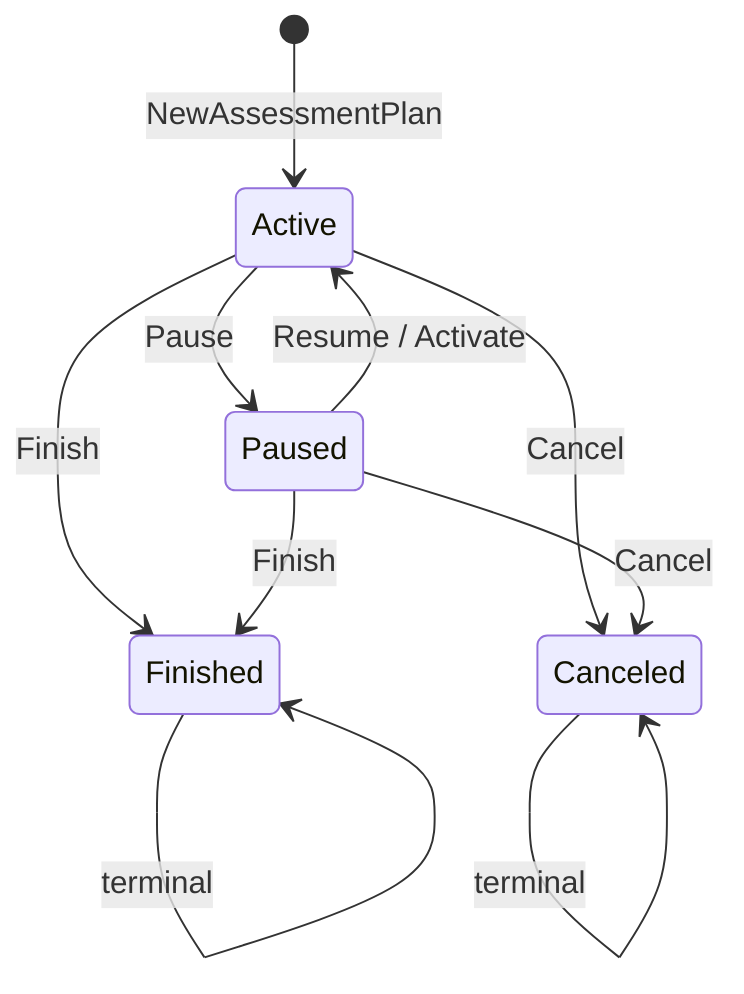
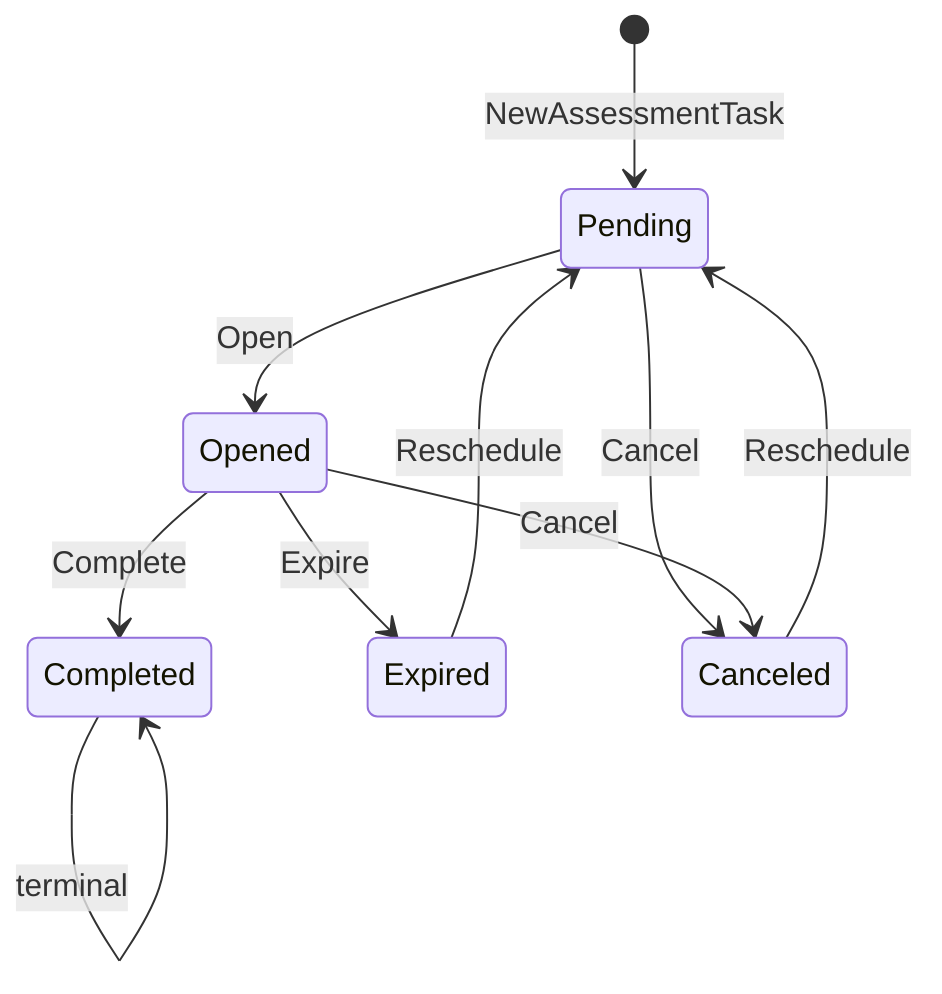
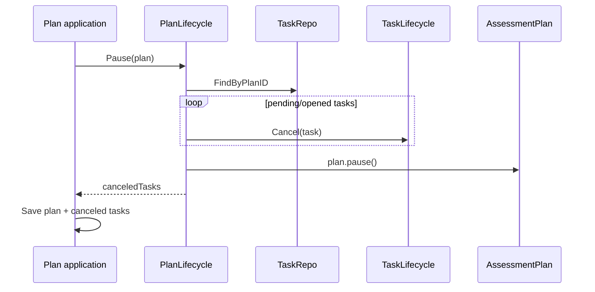

# 计划任务状态机

**本文回答**：Plan 模块中有哪两套状态机：`AssessmentPlan` 的计划生命周期和 `AssessmentTask` 的任务生命周期；每个状态代表什么，哪些状态迁移允许，哪些动作会联动取消任务，哪些迁移会产生 `task.*` 事件，以及为什么 Plan 状态不能和 Task 状态混为一谈。

---

## 30 秒结论

| 维度 | 结论 |
| ---- | ---- |
| 两套状态机 | Plan 管“计划模板是否继续有效”，Task 管“某一次应测任务是否开放/完成/过期/取消” |
| Plan 状态 | `active / paused / finished / canceled` |
| Task 状态 | `pending / opened / completed / expired / canceled` |
| Plan 暂停 | `active -> paused`，会联动取消 pending/opened 任务 |
| Plan 恢复 | `paused -> active`，会根据受试者 startDate 或既有任务推断重新生成/重置未完成任务 |
| Plan 结束 | `active/paused -> finished`，会联动取消 pending/opened 任务 |
| Plan 取消 | `active/paused -> canceled`，会联动取消 pending/opened 任务 |
| Task 开放 | `pending -> opened`，设置 entryToken、entryURL、openAt、expireAt，并产生 `task.opened` |
| Task 完成 | `opened -> completed`，关联 assessmentID，并产生 `task.completed` |
| Task 过期 | `opened -> expired`，产生 `task.expired` |
| Task 取消 | 非终态 task -> `canceled`，产生 `task.canceled` |
| 事件边界 | task 事件是状态通知，当前 delivery 是 best_effort，不是 Assessment 主链路强一致事件 |

一句话概括：

> **Plan 状态决定计划是否继续推进；Task 状态决定某一次测评任务当前能不能被做、是否已完成或已失效。**

---

## 1. 为什么 Plan 和 Task 需要两套状态机

Plan 是“周期策略模板”，Task 是“某个受试者第 N 次应测实例”。二者状态语义完全不同。

| 对象 | 状态回答的问题 |
| ---- | -------------- |
| `AssessmentPlan` | 这个计划是否还在执行？是否暂停？是否结束？是否取消？ |
| `AssessmentTask` | 这一次任务是否还没开放？是否已开放可填写？是否已完成？是否过期？是否取消？ |

如果只使用一套状态，会出现这些问题：

| 错误设计 | 后果 |
| -------- | ---- |
| 用 Plan 状态表示所有任务状态 | 一个任务完成会误导整个计划完成 |
| 用 Task 状态表示计划状态 | 某个任务过期会误导计划停止 |
| Plan 暂停时不处理 Task | 已开放任务可能继续被填写 |
| Plan 恢复时不重建任务 | 后续任务缺失 |
| Task 完成后允许取消 | 历史事实被破坏 |

因此 Plan 和 Task 必须分开建模。

---

## 2. Plan 状态机

`AssessmentPlan` 的状态集合是：

```text
active
paused
finished
canceled
```



### 2.1 Plan 状态语义

| 状态 | 字符串 | 语义 |
| ---- | ------ | ---- |
| Active | `active` | 计划正在执行，可以入组、调度、开放任务 |
| Paused | `paused` | 计划暂停，可恢复；不应继续推进未执行任务 |
| Finished | `finished` | 计划已完成，不再允许新的加入和任务推进 |
| Canceled | `canceled` | 计划已取消，不可恢复 |

### 2.2 终态

`finished` 和 `canceled` 是终态：

```text
PlanStatus.IsTerminal() = finished || canceled
```

终态计划不应再被恢复或开启。

---

## 3. Plan 状态迁移

### 3.1 Activate

`PlanLifecycle.Activate` 用于开启计划：

| 当前状态 | 结果 |
| -------- | ---- |
| active | 幂等返回 nil |
| paused | 调用 `plan.resume()`，恢复为 active |
| finished | 错误：已完成的计划不能开启 |
| canceled | 错误：已取消的计划不能开启 |

Activate 主要用于从 paused 恢复，或把计划设置为 active。

### 3.2 Pause

`PlanLifecycle.Pause` 只允许 active 计划暂停：

```text
active -> paused
```

暂停计划时会联动取消所有未执行任务：

```text
pending task -> canceled
opened task  -> canceled
```

已完成、已过期、已取消的任务不会被改写。

暂停逻辑的关键点：

1. 查询 plan 下所有 task。
2. 过滤 pending / opened。
3. 调用 `TaskLifecycle.Cancel`。
4. 返回 canceledTasks 供应用层保存。
5. 调用 `plan.pause()` 改状态。

领域层不负责持久化。

### 3.3 Resume

`PlanLifecycle.Resume` 只允许 paused 计划恢复：

```text
paused -> active
```

恢复计划会重新准备未完成任务。它会：

1. 查询 plan 下所有任务。
2. 按受试者分组。
3. 记录每个受试者已完成的最大 seq。
4. 根据提供的 startDate 或既有任务推断 startDate。
5. 调用 TaskGenerator 重新生成任务。
6. 跳过已完成 seq。
7. 对可复用任务调用 `TaskLifecycle.Reschedule`。
8. 对不存在的任务创建新任务。
9. 调用 `plan.resume()`。

恢复的重点是：**不改写已完成任务，只处理未完成部分。**

### 3.4 Finish

`PlanLifecycle.Finish` 用于手动结束计划：

| 当前状态 | 结果 |
| -------- | ---- |
| finished | 幂等返回 nil |
| canceled | 错误：已取消计划不能完成 |
| active/paused | 取消未执行任务，然后 `plan.finish()` |

结束计划也会取消 pending/opened 任务。

### 3.5 Cancel

`PlanLifecycle.Cancel` 用于取消计划：

| 当前状态 | 结果 |
| -------- | ---- |
| canceled | 幂等返回 nil |
| finished | 错误：已完成计划不能取消 |
| active/paused | 取消未执行任务，然后 `plan.cancel()` |

取消计划和结束计划的区别在业务语义：finished 是正常结束，canceled 是取消废止。

---

## 4. Task 状态机

`AssessmentTask` 的状态集合是：

```text
pending
opened
completed
expired
canceled
```



注意：`Reschedule` 允许复用非 completed task，把它重置为 pending；completed 任务不能重置。

### 4.1 Task 状态语义

| 状态 | 字符串 | 语义 |
| ---- | ------ | ---- |
| Pending | `pending` | 已创建任务，但还没到开放时间 |
| Opened | `opened` | 已生成入口，用户可填写 |
| Completed | `completed` | 用户已完成，并关联 Assessment |
| Expired | `expired` | 已开放但超过截止时间未完成 |
| Canceled | `canceled` | 任务被取消 |

### 4.2 Task 终态

`completed / expired / canceled` 是终态：

```text
TaskStatus.IsTerminal() = completed || expired || canceled
```

但领域服务 `Reschedule` 特意允许非 completed 的任务被复用重置，这主要服务 Plan 恢复场景。

---

## 5. Task 状态迁移

### 5.1 Open

```text
pending -> opened
```

前置条件：

| 条件 | 说明 |
| ---- | ---- |
| task 必须是 pending | 非 pending 不能开放 |
| entryToken 非空 | 必须生成入口令牌 |
| entryURL 非空 | 必须生成入口链接 |
| expireAt 晚于 openAt | 截止时间必须晚于开放时间 |

后置行为：

| 行为 | 说明 |
| ---- | ---- |
| status = opened | 任务变为可填写 |
| openAt = now | 记录开放时间 |
| expireAt = 参数 | 记录截止时间 |
| entryToken / entryURL 写入 | 用于二维码/链接 |
| 添加 `task.opened` | 对外通知任务开放 |

### 5.2 Complete

```text
opened -> completed
```

前置条件：

| 条件 | 说明 |
| ---- | ---- |
| task 必须是 opened | 未开放或已终态不能完成 |
| assessmentID 非空 | 必须关联已产生的 Assessment |

后置行为：

| 行为 | 说明 |
| ---- | ---- |
| status = completed | 标记任务完成 |
| completedAt = now | 记录完成时间 |
| assessmentID = 参数 | 关联测评 |
| 添加 `task.completed` | 对外通知任务完成 |

### 5.3 Expire

```text
opened -> expired
```

前置条件：

| 条件 | 说明 |
| ---- | ---- |
| task 必须是 opened | 只有开放任务才能过期 |

后置行为：

| 行为 | 说明 |
| ---- | ---- |
| status = expired | 标记过期 |
| 添加 `task.expired` | 对外通知任务过期 |

### 5.4 Cancel

```text
pending/opened -> canceled
```

前置条件：

| 条件 | 说明 |
| ---- | ---- |
| task 不是 terminal | 已终态任务 cancel 是幂等 no-op |

后置行为：

| 行为 | 说明 |
| ---- | ---- |
| status = canceled | 标记取消 |
| 添加 `task.canceled` | 对外通知任务取消 |

### 5.5 Reschedule

```text
expired/canceled/opened/pending -> pending
completed -> forbidden
```

前置条件：

| 条件 | 说明 |
| ---- | ---- |
| plannedAt 非零 | 新计划时间必须有效 |
| task 不能是 completed | 已完成任务不能重新调度 |

后置行为：

| 行为 | 说明 |
| ---- | ---- |
| plannedAt = 新值 | 更新计划时间 |
| status = pending | 回到待开放 |
| openAt/expireAt/completedAt 清空 | 清除旧运行态 |
| assessmentID 清空 | 清除旧测评关联 |
| entryToken/entryURL 清空 | 清除旧入口 |

Reschedule 不添加 task 事件。它通常在 plan resume 时由应用层保存。

---

## 6. Plan 状态与 Task 状态的联动

### 6.1 暂停计划



联动规则：

| Task 状态 | Pause 后 |
| --------- | -------- |
| pending | canceled |
| opened | canceled |
| completed | 不变 |
| expired | 不变 |
| canceled | 不变 |

### 6.2 恢复计划

恢复计划不是简单把 plan 改 active。它还要补齐未来任务：

```text
已完成 seq 不动
未完成任务可复用则 reschedule
缺失任务则新建
```

恢复逻辑是 PlanLifecycle 中最复杂的部分，原因是它要维护历史完成事实，又要让计划继续向前推进。

### 6.3 结束/取消计划

Finish/Cancel 都会联动取消未执行任务：

| 操作 | Plan 结果 | Task 联动 |
| ---- | --------- | -------- |
| Finish | finished | pending/opened -> canceled |
| Cancel | canceled | pending/opened -> canceled |

区别在业务语义，不在任务联动结果。

---

## 7. 状态与事件关系

Task 状态迁移会产生事件：

| 迁移 | 事件 | Payload 关键字段 |
| ---- | ---- | ---------------- |
| pending -> opened | `task.opened` | taskID、planID、testeeID、entryURL、openAt |
| opened -> completed | `task.completed` | taskID、planID、testeeID、assessmentID、completedAt |
| opened -> expired | `task.expired` | taskID、planID、testeeID、expiredAt |
| pending/opened -> canceled | `task.canceled` | taskID、planID、testeeID、canceledAt |

Plan 自身当前主要通过 task 事件对外体现运行变化。Plan 状态变化是否要单独事件化，应按后续产品需求明确设计。

### 7.1 task 事件是通知，不是状态来源

根据 `configs/events.yaml`，task 事件当前 delivery 是 best_effort。它们适合：

- 提醒。
- 运营通知。
- 轻量投影。
- 日志和行为感知。

它们不应该成为 Task 状态事实源。Task 状态事实以 Task repository 为准。

---

## 8. 应用层如何保存状态变更

领域层只负责状态迁移和添加领域事件。

应用层负责：

1. 加载 Plan / Task。
2. 调用 PlanLifecycle / TaskLifecycle。
3. 保存 Plan / Task。
4. 发布或 stage 事件。
5. 记录日志。
6. 处理失败。

例如 `TaskSchedulerService.SchedulePendingTasks` 会：

```text
FindPendingTasks
  -> GenerateEntry
  -> TaskLifecycle.Open
  -> taskRepo.Save
  -> PublishCollectedEvents
```

这说明状态机不是独立运行的后台任务，它需要应用服务编排。

---

## 9. 状态迁移规则表

### 9.1 Plan

| 当前状态 | 操作 | 结果 | 是否允许 |
| -------- | ---- | ---- | -------- |
| active | Activate | active | 是，幂等 |
| active | Pause | paused | 是 |
| active | Finish | finished | 是 |
| active | Cancel | canceled | 是 |
| paused | Activate | active | 是 |
| paused | Resume | active | 是 |
| paused | Pause | - | 否 |
| paused | Finish | finished | 是 |
| paused | Cancel | canceled | 是 |
| finished | Activate/Pause/Resume/Cancel | - | 否 |
| finished | Finish | finished | 是，幂等 |
| canceled | Activate/Pause/Resume/Finish | - | 否 |
| canceled | Cancel | canceled | 是，幂等 |

### 9.2 Task

| 当前状态 | 操作 | 结果 | 是否允许 |
| -------- | ---- | ---- | -------- |
| pending | Open | opened | 是 |
| pending | Cancel | canceled | 是 |
| pending | Reschedule | pending | 是 |
| pending | Complete/Expire | - | 否 |
| opened | Complete | completed | 是 |
| opened | Expire | expired | 是 |
| opened | Cancel | canceled | 是 |
| opened | Reschedule | pending | 是，但需谨慎 |
| completed | 任意重置/取消/过期 | - | 否或 no-op |
| expired | Reschedule | pending | 是 |
| expired | Cancel | expired | no-op，因为 terminal |
| canceled | Reschedule | pending | 是 |
| canceled | Cancel | canceled | no-op |

---

## 10. 为什么不能直接 update status

直接数据库 update 会绕过：

- 前置状态检查。
- entryToken / entryURL / expireAt 参数校验。
- completed assessmentID 校验。
- events 收集。
- 计划与任务联动。
- 日志和错误语义。

正确路径是：

```text
应用服务
  -> lifecycle domain service
  -> repository save
  -> event publish/stage
```

---

## 11. 设计模式与实现意图

| 模式 | 当前实现 | 意图 |
| ---- | -------- | ---- |
| State Machine | PlanStatus / TaskStatus | 明确允许的状态迁移 |
| Domain Service | PlanLifecycle / TaskLifecycle | 状态变化不散落在应用服务 |
| Aggregate Encapsulation | task.open/complete/expire/cancel 包内 | 外部不能随意 set status |
| Idempotent Command | Activate/Cancel/Finish 部分幂等 | 重复调用不会破坏状态 |
| Event Notification | task.* events | 状态变化可被外部感知 |
| Application Orchestration | TaskSchedulerService / CommandService | 持久化、事件和日志不进入领域层 |

---

## 12. 设计取舍

| 设计 | 收益 | 代价 |
| ---- | ---- | ---- |
| Plan/Task 双状态机 | 层级清晰 | 文档和测试要覆盖更多状态 |
| 暂停联动取消任务 | 避免暂停期间继续作答 | 恢复时需要重建/重置任务 |
| 恢复时保留 completed | 历史事实不丢 | 恢复逻辑复杂 |
| task 事件 best_effort | 通知轻量 | 不适合强一致依赖 |
| Reschedule 不发事件 | 避免恢复时事件风暴 | 外部感知依赖后续 open 事件 |
| 应用层负责持久化 | 领域纯粹 | 应用服务必须正确保存所有返回对象 |

---

## 13. 常见误区

### 13.1 “Plan paused 后，opened task 仍可以继续填写”

当前设计不是这样。Pause 会取消 pending/opened task。

### 13.2 “Finished 和 Canceled 一样”

不一样。二者都是终态，但业务语义不同：finished 是正常结束，canceled 是取消废止。

### 13.3 “Completed task 可以被 reschedule”

不允许。completed 是历史完成事实，不能重置。

### 13.4 “task.opened 事件失败要回滚 task 状态”

当前 task 事件是 best_effort，通知失败不应回滚任务状态。若未来有强一致通知需求，要重新设计 delivery。

### 13.5 “Task expired 可以直接创建新的 Assessment”

不应该。过期任务不代表测评发生。若要补做，应设计重新开放或新任务，而不是直接创建 Assessment。

---

## 14. 修改指南

### 14.1 新增 Plan 状态

必须同步检查：

```text
domain/plan/types.go
domain/plan/plan_lifecycle.go
application/plan
REST DTO / OpenAPI
docs/02-业务模块/plan
```

### 14.2 新增 Task 状态

必须同步检查：

```text
domain/plan/types.go
domain/plan/assessment_task.go
domain/plan/task_lifecycle.go
application/plan/task_scheduler_service.go
application/plan/task_management_service.go
events.yaml
worker handlers
```

### 14.3 修改状态迁移

必须补：

- 状态迁移表。
- domain test。
- application test。
- 事件测试。
- scheduler 测试。
- 文档说明。

---

## 15. 代码锚点

- Plan types：[../../../internal/apiserver/domain/plan/types.go](../../../internal/apiserver/domain/plan/types.go)
- AssessmentPlan：[../../../internal/apiserver/domain/plan/assessment_plan.go](../../../internal/apiserver/domain/plan/assessment_plan.go)
- AssessmentTask：[../../../internal/apiserver/domain/plan/assessment_task.go](../../../internal/apiserver/domain/plan/assessment_task.go)
- PlanLifecycle：[../../../internal/apiserver/domain/plan/plan_lifecycle.go](../../../internal/apiserver/domain/plan/plan_lifecycle.go)
- TaskLifecycle：[../../../internal/apiserver/domain/plan/task_lifecycle.go](../../../internal/apiserver/domain/plan/task_lifecycle.go)
- Task events：[../../../internal/apiserver/domain/plan/events.go](../../../internal/apiserver/domain/plan/events.go)
- TaskSchedulerService：[../../../internal/apiserver/application/plan/task_scheduler_service.go](../../../internal/apiserver/application/plan/task_scheduler_service.go)

---

## 16. Verify

```bash
go test ./internal/apiserver/domain/plan
go test ./internal/apiserver/application/plan
```

如果修改 scheduler：

```bash
go test ./internal/apiserver/runtime/scheduler
```

如果修改 task 事件：

```bash
go test ./internal/pkg/eventcatalog
go test ./internal/worker/handlers
```

---

## 17. 下一跳

| 目标 | 文档 |
| ---- | ---- |
| 理解调度与事件 | [02-调度与通知事件.md](./02-调度与通知事件.md) |
| 理解跨模块协作 | [03-跨模块协作.md](./03-跨模块协作.md) |
| 新增计划能力 | [04-新增计划能力SOP.md](./04-新增计划能力SOP.md) |
| 回看整体模型 | [00-整体模型.md](./00-整体模型.md) |
