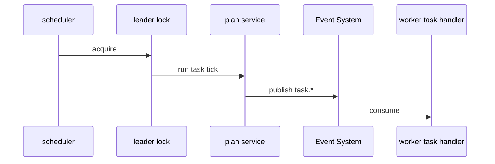
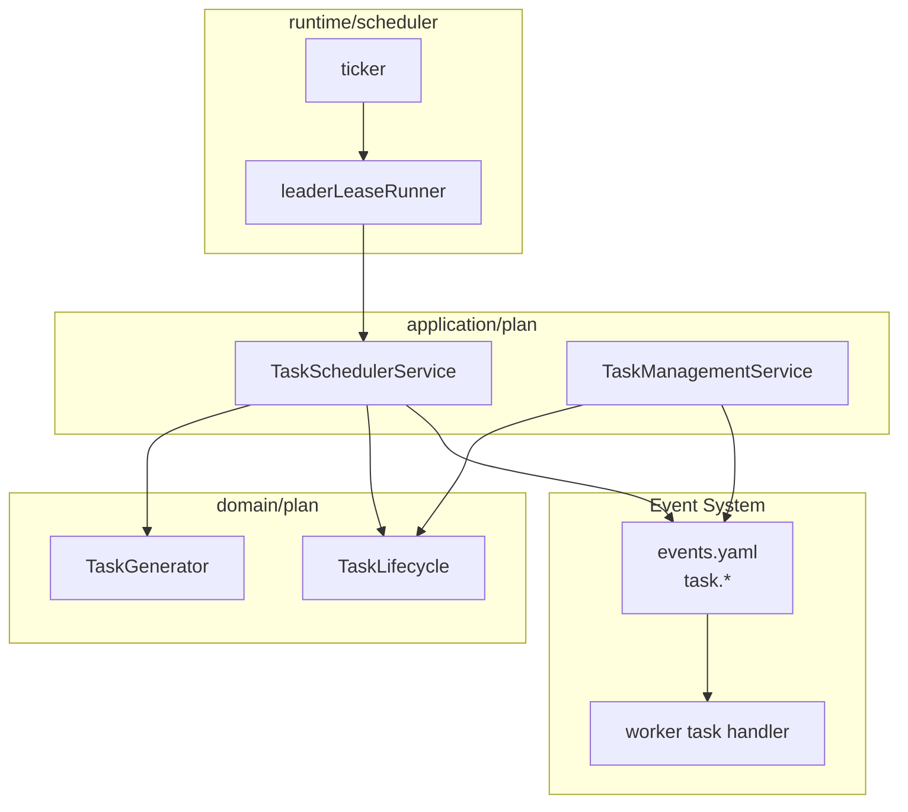

# Plan 调度与通知事件

**本文回答**：计划调度如何运行，任务事件如何进入事件系统。

## 30 秒结论

| 主题 | 当前事实 |
| ---- | -------- |
| 调度 | apiserver scheduler 定期开放、过期、reconcile pending task |
| 多实例 | leader lock 抢不到则跳过 |
| 通知 | worker 消费 `task.*` 后通过 notifier 发通知 |

## 这条链路要解决什么问题

Plan 的时间状态不能依赖用户请求触发。任务开放、过期和 pending reconcile 都需要后台周期性推进。调度链路要解决三个问题：

| 问题 | 设计 |
| ---- | ---- |
| 多实例重复执行 | scheduler 使用 Redis leader lock，抢不到则跳过 |
| 时间状态推进 | `TaskSchedulerService` 扫描 due tasks 并调用领域状态机 |
| 外部通知 | 状态变化发布 `task.*`，worker 异步消费 |

调度不是一个独立领域模型；它是应用运行时机制，负责把“当前时间”转成领域命令。



## 架构设计



这张图体现了三个边界：scheduler 只负责周期触发和选主；Plan application 负责业务推进；Event System 负责通知出站和 worker 消费。

## 设计模式应用

| 模式 / 技法 | 位置 | 作用 |
| ----------- | ---- | ---- |
| Leader lease | scheduler helper + `redislock` | 多实例部署下避免重复推进同一批任务 |
| 状态机 | `TaskLifecycle` | 每个 tick 只执行合法状态转移 |
| Outbound event | `task.*` | 将任务状态变化与通知发送解耦 |
| Adapter | worker task handler | 把事件转成通知能力，不反向依赖 Plan 领域模型 |

## 为什么这样设计

替代方案一是所有状态在用户打开页面时懒更新。这个方案会让后台压力小，但会导致通知、统计和运营视图滞后。替代方案二是引入独立任务调度系统。这个方案适合更复杂的工作流，但当前任务状态推进仍然紧贴 Plan 领域模型，放在 apiserver scheduler 中更容易保持事务和测试边界。

当前选择是“轻量 scheduler + leader lock + 应用服务状态机”。它能满足多实例安全和实现可读性，但不提供强实时 SLA；任务开放或过期的时间精度取决于 scheduler tick。

## 取舍与边界

| 边界 | 当前选择 |
| ---- | -------- |
| 选主失败 | 本轮 tick 直接跳过，不排队补偿；下一轮 tick 再处理 |
| 通知失败 | 不回滚任务状态，由 Event/Worker 侧重试或记录 |
| 时间精度 | 按 scheduler tick 粒度处理，不承诺毫秒级定时 |
| 事件 delivery | `task.*` 当前为 best-effort，不用于可靠业务状态变更 |

## 代码锚点

- Scheduler：[runtime/scheduler](../../../internal/apiserver/runtime/scheduler/)
- Task services：[application/plan](../../../internal/apiserver/application/plan/)
- Worker handlers：[task_handler.go](../../../internal/worker/handlers/task_handler.go)

## Verify

```bash
go test ./internal/apiserver/runtime/scheduler ./internal/worker/handlers
```
