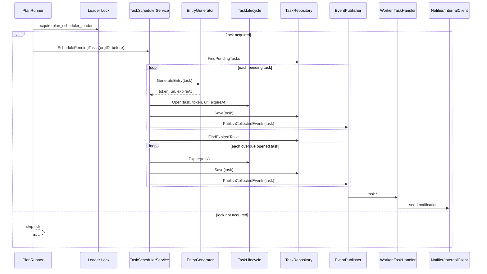
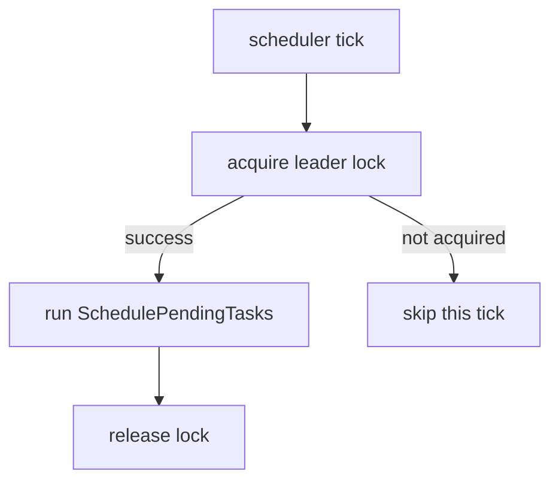
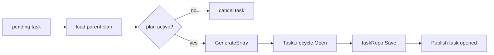
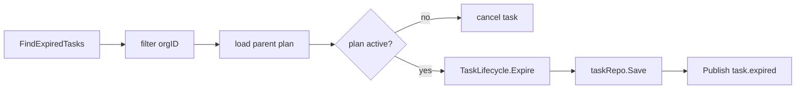

# 调度与通知事件

**本文回答**：Plan 模块的时间推进如何运行：apiserver scheduler 如何定期触发 `TaskSchedulerService`；pending task 如何变成 opened task；opened task 如何过期；`task.opened / task.completed / task.expired / task.canceled` 如何进入事件系统和 worker 通知链路；为什么通知失败不应回滚任务状态。

---

## 30 秒结论

| 维度 | 结论 |
| ---- | ---- |
| 调度入口 | `apiserver runtime/scheduler.PlanRunner` 定期执行 Plan 调度 |
| 多实例安全 | PlanRunner 使用 Redis locklease 的 leader lock，抢不到锁则跳过本轮 tick |
| 调度动作 | 每个 tick 对配置的 orgIDs 执行 `SchedulePendingTasks(orgID, before)` |
| 开放任务 | `TaskSchedulerService` 扫描 pending task，生成 entryToken/entryURL/expireAt，再调用 `TaskLifecycle.Open` |
| 过期任务 | 同一调度服务会扫描 expired task，并调用 `TaskLifecycle.Expire` |
| 非 active plan | parent plan 不 active 时，pending/opened task 会被 cancel |
| 事件 | Task 状态变化会产生 `task.opened / task.completed / task.expired / task.canceled` |
| delivery | 当前 `task.*` 在 `configs/events.yaml` 中是 `best_effort` |
| worker 通知 | worker task handler 消费 `task.*`，调用 internal client 或 TaskNotifier |
| 通知失败 | 通知失败只记录 warning，不回滚任务状态 |
| 时间精度 | 调度是 tick 粒度，不承诺毫秒级定时 |

一句话概括：

> **Plan 调度把“当前时间到了”转换成 Task 状态迁移；task 事件把状态变化通知外部，但任务状态事实仍以 Task repository 为准。**

---

## 1. 为什么 Plan 需要后台调度

Plan 的任务状态不能完全依赖用户请求触发。

如果用户不打开页面，系统仍然需要：

- 到计划时间后开放任务。
- 为任务生成入口。
- 发送提醒或通知。
- 超过截止时间后将任务标记为过期。
- 对暂停/结束/取消的计划停止继续推进任务。
- 统计任务开放、完成、过期和取消情况。

因此，Plan 需要一个后台 scheduler，把“时间到了”转换成“领域命令”。

---

## 2. 总体链路图



---

## 3. PlanRunner：运行时调度入口

`PlanRunner` 运行在 apiserver runtime scheduler 中。它负责：

1. 根据配置判断是否启用。
2. 初始化 leader lock。
3. 等待 initial delay。
4. 立即执行一次 tick。
5. 按 interval 对齐周期执行后续 tick。
6. 每次 tick 先抢 leader lock。
7. 对所有配置的 orgID 执行 task 调度。
8. 统计 opened、expired、failed org。

### 3.1 启动条件

`NewPlanRunner` 返回 nil 的常见情况：

| 条件 | 结果 |
| ---- | ---- |
| opts nil 或未启用 | 不启动 |
| command service 缺失 | 不启动，并记录 service_unavailable |
| lockManager 缺失 | 不启动，并记录 redis_unavailable |
| lock hooks 缺失 | 不启动 |

这说明 Plan scheduler 是可降级运行的。如果 Redis lock 不可用，当前不会启动计划调度，以避免多实例重复推进任务。

### 3.2 Tick 执行

每个 tick 中，PlanRunner 会：

```text
for orgID in opts.OrgIDs:
    before = now
    lowerBound = before - PendingLookback
    ctx = WithTaskSchedulerPlannedAtLowerBound(ctx, lowerBound)
    command.SchedulePendingTasks(ctx, orgID, before)
```

其中 `PendingLookback` 是保护机制：避免无限扫描过老 pending task，也给补偿窗口留余量。

---

## 4. Leader lock 边界

PlanRunner 使用 `locklease.Specs.PlanSchedulerLeader` 和配置的 lock key/ttl。



| 情况 | 处理 |
| ---- | ---- |
| 抢锁成功 | 执行本轮调度 |
| 抢锁失败 | 记录日志并跳过 |
| 释放锁失败 | 记录 warning |
| Redis/lockManager 缺失 | PlanRunner 不启动 |

### 4.1 为什么需要 leader lock

apiserver 可能多实例部署。如果每个实例都扫描并开放同一批任务，可能导致：

- 重复生成 entry。
- 重复发送通知。
- 重复发布 task.opened。
- 状态竞争。
- 统计异常。

Leader lock 是为了让同一时间只有一个实例推进任务状态。

---

## 5. TaskSchedulerService：应用层调度服务

`TaskSchedulerService` 是 Plan 调度的应用服务，不是领域对象。

它负责：

| 职责 | 说明 |
| ---- | ---- |
| 查询 due pending tasks | `FindPendingTasks` 或按 scope 查询 |
| 过滤可调度任务 | orgID、pending 状态、plannedAt lower bound、before |
| 加载 parent plan | 判断 plan 是否 active |
| 为任务生成入口 | 调用 `entryGenerator.GenerateEntry` |
| 推进任务状态 | 调用 `TaskLifecycle.Open / Expire / Cancel` |
| 保存任务 | `taskRepo.Save` |
| 发布 task 事件 | `PublishCollectedEvents` |
| 统计调度结果 | `CollectTaskScheduleStats` |
| 扫描过期任务 | `FindExpiredTasks` + Expire |

### 5.1 为什么它是应用服务

因为它需要同时操作：

- Task repository。
- Plan repository。
- Entry generator。
- TaskLifecycle。
- EventPublisher。
- Logging/metrics。

这些依赖都不应进入领域实体或领域服务。

---

## 6. Pending task 开放流程



### 6.1 可调度过滤

`filterSchedulablePendingTasks` 会过滤：

| 条件 | 说明 |
| ---- | ---- |
| task 不为 nil | 防御 |
| orgID 匹配 | 机构隔离 |
| task 是 pending | 只调度待开放任务 |
| plannedAt 不早于 lowerBound | 避免扫描过老任务 |
| plannedAt 不晚于 before | 到时间才开放 |

并按 plannedAt、taskID 排序，保证处理顺序稳定。

### 6.2 parent plan 检查

如果 parent plan 不 active：

```text
pending/opened task -> canceled
```

这样可以避免暂停、完成、取消计划后继续开放任务。

### 6.3 entry 生成

开放任务前必须生成：

- entryToken。
- entryURL。
- expireAt。

这些由 `planentryport.Generator` 提供，属于基础设施/跨模块适配能力，不属于 Task 领域对象本身。

---

## 7. 过期任务扫描流程

同一个 `TaskSchedulerService.SchedulePendingTasks` 也会处理 overdue tasks：



过期任务必须是 opened 状态才能 expire。未开放任务不会直接过期，它们仍应通过 pending/opened 流程处理或被计划状态联动取消。

---

## 8. task.* 事件

Task 状态变化产生四类事件：

| 事件 | 触发 | Payload |
| ---- | ---- | ------- |
| `task.opened` | task pending -> opened | taskID、planID、testeeID、entryURL、openAt |
| `task.completed` | task opened -> completed | taskID、planID、testeeID、assessmentID、completedAt |
| `task.expired` | task opened -> expired | taskID、planID、testeeID、expiredAt |
| `task.canceled` | task non-terminal -> canceled | taskID、planID、testeeID、canceledAt |

### 8.1 delivery class

在 `configs/events.yaml` 中，task 事件当前是：

```text
delivery: best_effort
topic: qs.plan.task
```

含义：

- 它们是通知/投影事件。
- 发布失败不应自动回滚 Task 状态。
- 不能把它们当作强一致业务命令。
- 如未来需要强一致提醒或任务链路推进，应重新评估 durable_outbox。

---

## 9. Worker 通知链路

worker 的 `task_handler.go` 会消费 task 事件。

### 9.1 task.opened

`task.opened` handler 会：

1. 解析 payload 为 `TaskOpenedData`。
2. 记录 event/task/plan/testee/entryURL/openAt 日志。
3. 如果 InternalClient 存在，解析 testeeID。
4. 调用 `SendTaskOpenedMiniProgramNotification` 发送小程序通知。
5. 通知失败只记录 warning。

这说明 task.opened 通知是异步副作用，不是任务开放状态的事实来源。

### 9.2 task.completed / expired / canceled

这些事件会通过 `TaskNotifier`：

| 事件 | Notifier 方法 |
| ---- | ------------- |
| `task.completed` | `NotifyTaskCompleted` |
| `task.expired` | `NotifyTaskExpired` |
| `task.canceled` | `NotifyTaskCanceled` |

如果 Notifier nil，handler 返回 nil。通知失败时记录 warning，不让该失败反向改变 Task 状态。

---

## 10. 调度失败语义

### 10.1 单任务失败

在 `SchedulePendingTasks` 中，单个任务失败通常会：

- 记录错误日志。
- failedCount++。
- 继续处理其它任务。

不会因为一个任务生成 entry 失败就中断整个 org 的所有任务。

### 10.2 单 org 失败

在 PlanRunner 中，某个 org 调度失败会：

- failedOrgs++。
- 记录 warning。
- 继续下一个 org。

### 10.3 抢锁失败

抢不到 lock 的实例会跳过本轮 tick，不做排队补偿。下一轮 tick 再处理 due tasks。

### 10.4 通知失败

worker 通知失败只记录 warning，不回滚任务状态。

---

## 11. 调度和状态机边界

| 能力 | 所属 |
| ---- | ---- |
| 周期 tick | runtime scheduler |
| leader lock | runtime/infra |
| 扫描 due tasks | application/plan |
| 状态合法性 | domain/plan TaskLifecycle |
| 保存状态 | repository |
| 事件发布 | event system |
| 通知发送 | worker/notifier |
| 测评结果生成 | evaluation |

不要把 scheduler 写成“业务状态机”。Scheduler 只是时间驱动器。

---

## 12. 与 Assessment 的边界

Plan 调度不会直接创建 Assessment。

```text
Task opened
  -> 用户通过 entry 作答
  -> Survey 保存 AnswerSheet
  -> Evaluation 创建 Assessment
  -> Task completed 关联 assessmentID
```

因此：

| Plan 事件 | 是否代表 Assessment 发生 |
| --------- | ------------------------ |
| task.opened | 否，只是入口开放 |
| task.completed | 是，通常已经有关联 assessmentID |
| task.expired | 否，用户未完成 |
| task.canceled | 否，任务取消 |

---

## 13. 设计模式与实现意图

| 模式/技法 | 当前实现 | 意图 |
| --------- | -------- | ---- |
| Scheduler Runner | `PlanRunner` | 周期触发调度 |
| Leader Election / Lease | `locklease` | 多实例下避免重复调度 |
| Application Service | `TaskSchedulerService` | 编排 repository、entry、event |
| State Machine | `TaskLifecycle` | 保护任务状态迁移 |
| Event Notification | task.* | 将任务状态变化通知外部 |
| Adapter | `EntryGenerator` / `TaskNotifier` | 解耦 Plan 领域和外部入口/通知 |
| Metrics/Stats | `CollectTaskScheduleStats` | 可观测调度结果 |

---

## 14. 设计取舍

| 设计 | 收益 | 代价 |
| ---- | ---- | ---- |
| apiserver 内置 scheduler | 部署简单，与领域模型近 | 不适合超复杂调度工作流 |
| leader lock | 多实例安全 | 依赖 Redis/locklease |
| tick 粒度调度 | 实现简单 | 不承诺精确到秒级 |
| 单任务失败不中断批次 | 鲁棒性高 | 需要日志和统计定位失败任务 |
| task 事件 best_effort | 通知轻量 | 不能作为强一致下游推进 |
| 通知失败不回滚 | 状态事实稳定 | 通知需要独立补偿/重试策略 |

---

## 15. 常见误区

### 15.1 “Scheduler 是领域模型”

错误。Scheduler 是运行时机制，领域模型是 Plan/Task/Lifecycle。

### 15.2 “task.opened 发送失败，任务应该回到 pending”

不应这样。task.opened 是通知事件，任务状态已经是 opened。通知补偿应在通知侧处理。

### 15.3 “抢锁失败说明调度失败”

不一定。抢锁失败的实例只是跳过本轮，说明有其它实例可能在执行。

### 15.4 “task.opened 就说明用户已开始测评”

错误。opened 只说明入口开放；用户是否提交答卷要看 Survey/Evaluation。

### 15.5 “task.* 事件可以作为强一致业务命令”

当前不建议。task.* 是 best_effort 通知事件。

---

## 16. 排障路径

### 16.1 到点任务没开放

检查：

1. PlanRunner 是否启用。
2. Redis lock 是否可用。
3. 当前实例是否抢到 leader lock。
4. orgID 是否在 PlanSchedulerOptions.OrgIDs 中。
5. task plannedAt 是否在 before 范围内。
6. task 是否 pending。
7. parent plan 是否 active。
8. EntryGenerator 是否成功。
9. taskRepo.Save 是否成功。

### 16.2 任务开放了但没通知

检查：

1. task.opened 是否 publish。
2. qs.plan.task topic 是否存在。
3. worker 是否订阅 task_opened_handler。
4. InternalClient 是否配置。
5. SendTaskOpenedMiniProgramNotification 是否失败。
6. 用户是否有可通知目标。

### 16.3 opened 任务没有过期

检查：

1. expireAt 是否已到。
2. FindExpiredTasks 查询条件。
3. task 是否 opened。
4. parent plan 是否 active。
5. TaskLifecycle.Expire 是否失败。
6. taskRepo.Save 是否失败。

### 16.4 任务事件消费失败

检查：

1. payload 是否能解析。
2. handler 是否注册。
3. Notifier 是否 nil。
4. Notifier 调用是否报错。
5. worker Ack/Nack outcome。

---

## 17. 修改指南

### 17.1 修改调度周期

检查：

```text
apiserver PlanSchedulerOptions
runtime/scheduler/plan_scheduler.go
scheduler metrics/logs
docs/01-运行时/06-后台任务与调度.md
```

### 17.2 修改任务开放逻辑

检查：

```text
TaskSchedulerService
TaskLifecycle.Open
EntryGenerator
AssessmentEntry
task.opened event payload
worker task opened handler
```

### 17.3 修改通知逻辑

检查：

```text
worker/handlers/task_handler.go
worker port.TaskNotifier
internal gRPC notification service
configs/events.yaml
```

### 17.4 修改 task 事件 delivery

如果要把 task.* 改为 durable_outbox，必须同步设计：

- 事件 stage 边界。
- outbox store。
- relay。
- 重试。
- 幂等。
- 监控。
- 文档。

不要只改 `events.yaml`。

---

## 18. 代码锚点

- PlanRunner：[../../../internal/apiserver/runtime/scheduler/plan_scheduler.go](../../../internal/apiserver/runtime/scheduler/plan_scheduler.go)
- TaskSchedulerService：[../../../internal/apiserver/application/plan/task_scheduler_service.go](../../../internal/apiserver/application/plan/task_scheduler_service.go)
- TaskLifecycle：[../../../internal/apiserver/domain/plan/task_lifecycle.go](../../../internal/apiserver/domain/plan/task_lifecycle.go)
- Task events：[../../../internal/apiserver/domain/plan/events.go](../../../internal/apiserver/domain/plan/events.go)
- Event catalog：[../../../configs/events.yaml](../../../configs/events.yaml)
- Worker task handler：[../../../internal/worker/handlers/task_handler.go](../../../internal/worker/handlers/task_handler.go)

---

## 19. Verify

```bash
go test ./internal/apiserver/runtime/scheduler
go test ./internal/apiserver/application/plan
go test ./internal/apiserver/domain/plan
go test ./internal/worker/handlers
```

如果修改事件配置：

```bash
go test ./internal/pkg/eventcatalog
go test ./internal/worker/integration/eventing
```

---

## 20. 下一跳

| 目标 | 文档 |
| ---- | ---- |
| 理解状态机 | [01-计划任务状态机.md](./01-计划任务状态机.md) |
| 理解跨模块协作 | [03-跨模块协作.md](./03-跨模块协作.md) |
| 新增计划能力 | [04-新增计划能力SOP.md](./04-新增计划能力SOP.md) |
| 运行时调度总览 | [../../01-运行时/06-后台任务与调度.md](../../01-运行时/06-后台任务与调度.md) |
