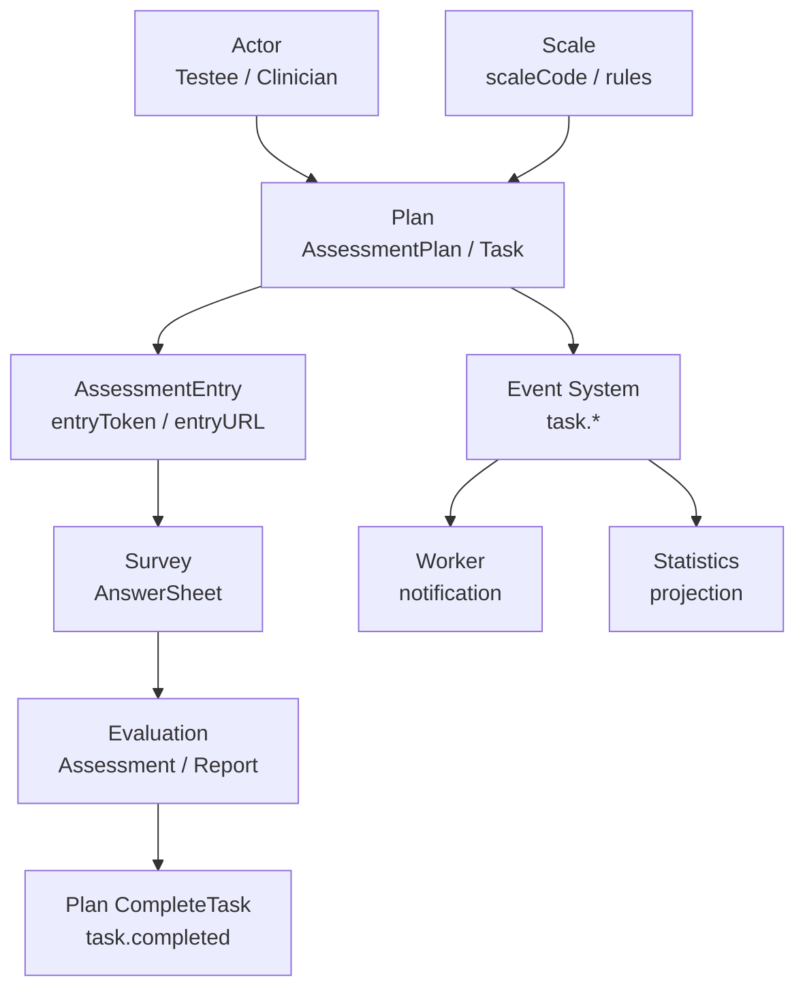
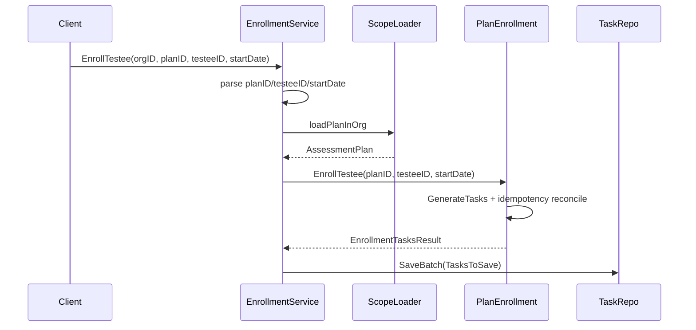

# 跨模块协作

**本文回答**：Plan 如何与 Actor、AssessmentEntry、Survey、Evaluation、Statistics、Event System 协作，同时不拥有它们的主状态；Plan 为什么只保存必要引用，而不是复制受试者、问卷、量表、答卷、报告等跨模块事实；任务完成如何通过已有 Assessment 回填闭环。

---

## 30 秒结论

| 协作对象 | Plan 需要什么 | Plan 不应该做什么 |
| -------- | ------------- | ----------------- |
| Actor / Testee | testeeID、orgID、入组对象、业务范围 | 不维护 Testee 档案、标签、监护关系 |
| Scale | scaleCode | 不定义量表因子、计分策略、风险文案 |
| AssessmentEntry | entryToken、entryURL、expireAt | 不拥有 Entry 聚合和 intake 行为 |
| Survey | 用户通过 entry 提交答卷 | 不保存 AnswerSheet，不校验题目答案 |
| Evaluation | task 完成时关联 assessmentID | 不创建报告，不执行 pipeline |
| Statistics | task/entry 行为事件进入投影 | 不维护统计读模型 |
| Event System | task.* 事件通知外部 | 不把事件当作任务状态事实源 |

一句话概括：

> **Plan 是编排域，只保存必要引用和任务状态；其它模块的业务事实仍由各自模块维护。**

---

## 1. 为什么 Plan 一定会跨模块

Plan 的业务语义是：

```text
某个受试者应该在某个时间完成某个量表/问卷测评任务。
```

这句话天然涉及多个模块：

| 词 | 所属模块 |
| -- | -------- |
| 某个受试者 | Actor/Testee |
| 某个时间 | Plan |
| 某个量表/问卷 | Scale / Survey |
| 完成任务 | Plan Task |
| 提交答卷 | Survey |
| 生成测评结果 | Evaluation |
| 发送通知 | Worker / Notification |
| 统计完成率 | Statistics |

所以 Plan 不可能完全“单模块闭环”。关键是：跨模块引用可以，但不能拥有其它模块的主状态。

---

## 2. 总体协作图



Plan 在这张图里负责：

- 生成任务。
- 开放任务。
- 取消/过期任务。
- 完成任务并关联 assessmentID。
- 产生 task.* 事件。

它不负责：

- 维护受试者档案。
- 保存答卷。
- 计算结果。
- 保存报告。
- 维护统计看板。

---

## 3. 与 Actor/Testee 的协作

### 3.1 Plan 需要什么

Plan 需要 Testee 作为任务归属对象：

| 字段 | 位置 |
| ---- | ---- |
| `testeeID` | AssessmentTask |
| `orgID` | AssessmentPlan / AssessmentTask |
| startDate | EnrollTestee 参数 |
| 业务可见范围 | 应用层 scope/access 校验 |

`AssessmentTask` 保存 `testeeID`，但不复制 Testee 的姓名、生日、标签等档案字段。

### 3.2 入组链路



源码中 `EnrollmentService.EnrollTestee` 当前校验了 plan org scope，并调用 `PlanEnrollment.EnrollTestee` 生成/调和任务。Testee 是否存在、是否可见的更严格校验应由调用路径或 access/scope 能力补齐，不能在 Task 中复制 Testee 数据。

### 3.3 边界

| 能力 | Plan 是否负责 |
| ---- | ------------- |
| 判断任务属于哪个 testee | 是，保存 testeeID |
| 创建/更新 Testee 档案 | 否 |
| 给 Testee 打标签 | 否 |
| 判断医生能否看到 Testee | 应用层 access/relation |
| 保存 Testee 统计快照 | 否 |

---

## 4. 与 Clinician / AssessmentEntry 的协作

Plan 中的任务最终需要被受试者打开。这个入口能力和 Actor/AssessmentEntry 协作。

### 4.1 Entry 生成

`TaskSchedulerService` 开放 pending task 时会调用：

```text
entryGenerator.GenerateEntry(ctx, task)
```

得到：

```text
entryToken
entryURL
expireAt
```

然后调用：

```text
TaskLifecycle.Open(ctx, task, token, url, expireAt)
```

这说明 Task 只保存入口结果，不负责 Entry 聚合内部创建逻辑。

### 4.2 边界

| 能力 | 所属 |
| ---- | ---- |
| 入口 token 生成 | planentry adapter / AssessmentEntry |
| 入口 active/expired 校验 | AssessmentEntry |
| task 持有 entryToken/entryURL | Plan Task |
| 用户打开入口 | AssessmentEntry Resolve |
| 用户接入/建档 | AssessmentEntry Intake + Actor |
| 答卷提交 | Survey |

Plan 不应该自己解析 IAM、处理 guardianship、创建 Testee relation。这些属于 AssessmentEntry/Actor 边界。

---

## 5. 与 Scale 的协作

`AssessmentPlan` 持有 `scaleCode`。

这表示：

```text
这个计划要做哪套量表
```

但 Plan 不维护：

- Factor。
- ScoringStrategy。
- InterpretationRule。
- RiskLevel。
- Report 文案。
- Scale lifecycle。

### 5.1 为什么只保存 scaleCode

Plan 是长期计划模板，如果复制 Scale 全量规则，会带来：

- 规则变更时 Plan 快照漂移。
- Scale 发布/下线语义不清。
- Evaluation 使用规则时出现多份来源。
- 文档和接口难以说明谁是规则权威。

因此 Plan 保存 scaleCode 作为引用，规则事实仍由 Scale 维护。

### 5.2 需要注意的点

如果 Scale 的可用性影响 Plan 创建或任务开放，应在应用层做校验，例如：

- scale 是否存在。
- scale 是否 published。
- scale 是否属于 org scope。
- scale 是否适合该 Plan。

不要在 `AssessmentPlan` 聚合中直接加载 Scale。

---

## 6. 与 Survey 的协作

Plan 任务开放后，用户通过 entry 进入问卷/量表并提交答卷。

Plan 不保存：

- Questionnaire 题目。
- AnswerSheet。
- AnswerValue。
- 答案校验结果。
- 答案级分数。

Plan 只知道：

```text
任务开放了；
用户后续可能完成；
完成时可以关联 assessmentID。
```

### 6.1 为什么 Plan 不校验答卷

答卷校验属于 Survey：

```text
Questionnaire version
AnswerValue
ValidationRules
AnswerSheet durable submit
answersheet.submitted
```

Plan 如果复制这些规则，会造成提交规则 drift。

---

## 7. 与 Evaluation 的协作

Plan 与 Evaluation 的核心交点是：

```text
AssessmentTask.assessmentID
```

`TaskManagementService.CompleteTask` 接收已有 `assessmentID`，然后：

1. 加载并校验 task org scope。
2. 调用 `TaskLifecycle.Complete(ctx, task, assessmentID)`。
3. 保存 task。
4. 发布 `task.completed`。

这说明：

| 操作 | 所属 |
| ---- | ---- |
| 创建 Assessment | Evaluation |
| 执行 Evaluation pipeline | Evaluation |
| 保存 Report | Evaluation |
| 任务完成关联 assessmentID | Plan |
| 发布 task.completed | Plan |

### 7.1 任务完成不是报告完成

`task.completed` 只表示该计划任务关联的测评已完成或至少已经产生可关联的 assessmentID，具体语义要看调用路径如何定义。

它不等于：

- report.generated。
- assessment.interpreted。
- riskLevel 已写入。
- 通知已发送。

如果产品要求“只有报告生成后任务才 completed”，应明确调用 `CompleteTask` 的时机，而不是让 Plan 自己查询 Report。

---

## 8. 与 Statistics 的协作

Plan 自身的 task 事件可被 Statistics/Behavior 作为服务过程投影的一部分。

同时 AssessmentEntry intake 也会产生行为事件，例如：

- entry opened。
- intake confirmed。
- testee profile created。
- care relationship established。

Plan 不维护统计读模型。它只负责发出任务状态变化，Statistics 消费后构建读模型。

---

## 9. 与 Event System 的协作

Plan 中 `task.*` 事件当前配置为 best_effort：

```text
task.opened
task.completed
task.expired
task.canceled
```

它们进入 `qs.plan.task` topic，由 worker task handler 处理通知。

### 9.1 事件不是状态事实源

状态事实源：

```text
AssessmentTask.status
```

事件只是状态变化通知。

| 情况 | 说明 |
| ---- | ---- |
| task 状态保存成功，事件发布失败 | task 状态仍以 DB 为准，通知可能缺失 |
| worker 通知失败 | 不回滚 task 状态 |
| 事件重复消费 | handler 应尽量幂等或容忍重复 |
| 事件未消费 | 可通过任务查询补偿运营视图 |

---

## 10. ScopeLoader 的职责

`scope_loader.go` 提供通用 scoped resource loader，用于按 orgID 加载 Plan/Task 并做机构隔离：

```text
parse rawID
find resource
compare resource.OrgID with request orgID
```

它解决的是：

- ID 解析。
- not found 转换。
- org scope mismatch。
- 错误分类。

### 10.1 为什么这是应用层能力

ScopeLoader 涉及：

- repository 查询。
- request orgID。
- 错误码转换。
- 日志。

这些不属于领域模型。领域模型只关心对象自身不变量，不应该知道当前请求来自哪个 REST context。

---

## 11. 跨模块引用原则

| 原则 | 说明 |
| ---- | ---- |
| 保存 ID，不复制对象 | Plan 保存 testeeID、scaleCode、assessmentID |
| 应用层校验引用 | 不在领域对象里调用其它模块 repository |
| 读侧可以组合 | 列表详情可以通过 read model / query service 聚合展示 |
| 写侧保持单一权威 | Testee、AnswerSheet、Assessment、Report 各自模块写 |
| 事件用于通知，不做强一致读写 | best_effort 事件不替代主表状态 |

---

## 12. 设计模式

| 模式 | 当前实现 | 意图 |
| ---- | -------- | ---- |
| Reference by ID | testeeID / scaleCode / assessmentID | 降低跨模块耦合 |
| Anti-corruption / Scope Loader | `scope_loader.go` | 隔离外部模块和请求上下文 |
| Application Orchestration | Enrollment/TaskManagement/Scheduler services | 跨模块操作不进领域实体 |
| Event Notification | task.* | 状态变化通知外部 |
| Read Model Composition | query/read model | 详情展示可组合多个模块数据 |
| Late Binding | Task 完成时关联 assessmentID | 不提前创建 Assessment |

---

## 13. 设计取舍

| 设计 | 收益 | 代价 |
| ---- | ---- | ---- |
| Plan 不拥有 Testee | 避免档案漂移 | 查询详情要组合 Actor |
| Plan 不拥有 Scale | 规则权威清楚 | 计划创建/开放要校验 Scale |
| Plan 不创建 Assessment | 避免无效测评污染 Evaluation | 完成闭环要依赖提交链路 |
| task 事件 best_effort | 通知轻量 | 不能强依赖事件推进业务 |
| ScopeLoader 应用层校验 | 领域纯粹 | 应用服务测试更重要 |
| assessmentID 晚绑定 | 测评真正发生后才关联 | 需要明确 CompleteTask 调用时机 |

---

## 14. 常见误区

### 14.1 “Plan 入组时应该复制 Testee 信息”

不建议。Testee 档案会变化，Plan 只需要 testeeID。展示时通过读模型组合。

### 14.2 “Task opened 后应该立即创建 Assessment”

不应该。opened 只是入口开放，用户还未提交答卷。

### 14.3 “task.completed 等于 report.generated”

错误。task.completed 是计划任务完成事件，report.generated 是 Evaluation 报告事件。

### 14.4 “Plan 可以直接判断风险等级”

不应该。风险等级属于 Evaluation 产出，规则属于 Scale。

### 14.5 “task.* 事件失败说明 task 状态失败”

错误。task 状态保存和事件通知是两个层次。

---

## 15. 修改指南

### 15.1 修改与 Actor 协作

检查：

```text
actor/testee
actor/relation
plan/enrollment_service
scope_loader
Plan query/read model
```

### 15.2 修改与 Entry 协作

检查：

```text
planentry port
assessmententry service
TaskSchedulerService
TaskLifecycle.Open
task.opened payload
worker notification
```

### 15.3 修改与 Evaluation 协作

检查：

```text
TaskManagementService.CompleteTask
Assessment ID parse
Evaluation events
task.completed payload
```

### 15.4 修改与 Statistics 协作

检查：

```text
task events
behavior projector
statistics read model
event catalog
```

---

## 16. 代码锚点

- Scope loader：[../../../internal/apiserver/application/plan/scope_loader.go](../../../internal/apiserver/application/plan/scope_loader.go)
- Enrollment service：[../../../internal/apiserver/application/plan/enrollment_service.go](../../../internal/apiserver/application/plan/enrollment_service.go)
- Task management service：[../../../internal/apiserver/application/plan/task_management_service.go](../../../internal/apiserver/application/plan/task_management_service.go)
- Task scheduler service：[../../../internal/apiserver/application/plan/task_scheduler_service.go](../../../internal/apiserver/application/plan/task_scheduler_service.go)
- AssessmentTask：[../../../internal/apiserver/domain/plan/assessment_task.go](../../../internal/apiserver/domain/plan/assessment_task.go)
- Event catalog：[../../../configs/events.yaml](../../../configs/events.yaml)

---

## 17. Verify

```bash
go test ./internal/apiserver/application/plan
go test ./internal/apiserver/domain/plan
```

如果修改跨模块入口或通知：

```bash
go test ./internal/apiserver/application/actor/assessmententry
go test ./internal/worker/handlers
```

---

## 18. 下一跳

| 目标 | 文档 |
| ---- | ---- |
| 理解整体模型 | [00-整体模型.md](./00-整体模型.md) |
| 理解任务状态 | [01-计划任务状态机.md](./01-计划任务状态机.md) |
| 理解调度事件 | [02-调度与通知事件.md](./02-调度与通知事件.md) |
| 新增计划能力 | [04-新增计划能力SOP.md](./04-新增计划能力SOP.md) |
